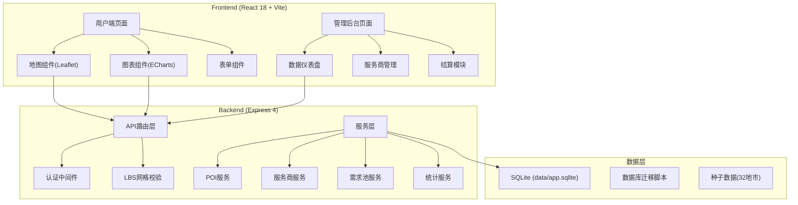
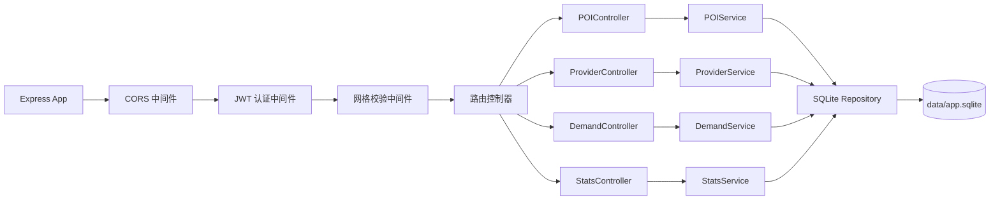
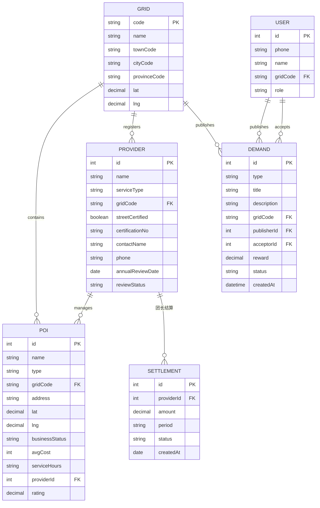

## 1. 架构设计



## 2. 技术描述

- **前端技术栈**：React 18 + TypeScript + Vite 5 + TailwindCSS 3 + React Router 6
- **地图组件**：Leaflet + OpenStreetMap 瓦片服务（无需API Key）
- **图表组件**：ECharts 5
- **UI组件库**：Ant Design 5（管理后台）+ 自定义组件（用户端）
- **后端技术栈**：Express 4 + TypeScript + better-sqlite3
- **数据库**：SQLite 3 (data/app.sqlite)，无需额外服务
- **认证方式**：JWT Token，存储于 localStorage
- **端口配置**：
  - 前端端口：48831 (40000 + 8831)
  - 后端端口：58831 (50000 + 8831)
  - 备用槽位：41000+8831, 42000+8831 等

## 3. 路由定义

| 前端路由 | 页面用途 |
|----------|----------|
| / | 用户端首页 - 网格定位+服务入口+需求池 |
| /map | 本地生活服务地图 - 多图层POI展示 |
| /services | 服务商列表 - 分类筛选+资质展示 |
| /services/:id | 服务商详情 - POI信息+评价 |
| /demands | 邻里互助需求池 - 需求列表+筛选 |
| /demands/publish | 发布需求 - 表单提交 |
| /admin | 运营后台登录 |
| /admin/dashboard | 县域运营仪表盘 |
| /admin/providers | 服务商管理+年审 |
| /admin/settlement | 团长激励结算 |

| 后端API路由 | 方法 | 用途 |
|-------------|------|------|
| /api/health | GET | 健康检查 |
| /api/auth/login | POST | 用户登录 |
| /api/pois | GET | 获取网格内POI列表 |
| /api/pois/:id | GET | 获取POI详情 |
| /api/providers | GET | 服务商列表（含资质） |
| /api/providers/renewal | GET | 年审提醒列表 |
| /api/demands | GET, POST | 需求池列表/发布 |
| /api/demands/:id/accept | POST | 接单 |
| /api/stats/overview | GET | 仪表盘概览数据 |
| /api/stats/top-demands | GET | 需求TOP10 |
| /api/stats/town-coverage | GET | 各镇街覆盖率 |

## 4. API 类型定义

```typescript
// 核心实体类型
interface POI {
  id: number;
  name: string;
  type: 'restaurant' | 'home_service' | 'repair' | 'carpool' | 'market';
  gridCode: string;
  address: string;
  lat: number;
  lng: number;
  businessStatus: 'open' | 'closed' | 'resting';
  avgCost: number;
  serviceHours: string;
  providerId: number;
  rating: number;
}

interface Provider {
  id: number;
  name: string;
  serviceType: string;
  gridCode: string;
  streetCertified: boolean;
  certificationNo: string;
  contactName: string;
  phone: string;
  annualReviewDate: string;
  reviewStatus: 'pending' | 'approved' | 'expired';
}

interface Demand {
  id: number;
  type: string;
  title: string;
  description: string;
  gridCode: string;
  publisherId: number;
  reward: number;
  status: 'open' | 'accepted' | 'completed' | 'cancelled';
  createdAt: string;
}

interface Grid {
  code: string;
  name: string;
  townCode: string;
  cityCode: string;
  provinceCode: string;
  lat: number;
  lng: number;
}

// 统计数据类型
interface DashboardStats {
  totalPOIs: number;
  totalDemands: number;
  serviceCoverage: number;
  disputeResolutionRate: number;
  topDemands: { type: string; count: number }[];
  townCoverage: { town: string; coverage: number }[];
}
```

## 5. 服务端架构图



## 6. 数据模型

### 6.1 ER 图



### 6.2 DDL 语句

```sql
-- 网格表（32地市预填充）
CREATE TABLE grids (
  code TEXT PRIMARY KEY,
  name TEXT NOT NULL,
  town_code TEXT,
  city_code TEXT,
  province_code TEXT,
  lat REAL,
  lng REAL
);

-- 服务商表
CREATE TABLE providers (
  id INTEGER PRIMARY KEY AUTOINCREMENT,
  name TEXT NOT NULL,
  service_type TEXT NOT NULL,
  grid_code TEXT NOT NULL,
  street_certified INTEGER DEFAULT 0,
  certification_no TEXT,
  contact_name TEXT,
  phone TEXT,
  annual_review_date TEXT,
  review_status TEXT DEFAULT 'pending',
  created_at TEXT DEFAULT CURRENT_TIMESTAMP,
  FOREIGN KEY (grid_code) REFERENCES grids(code)
);

-- POI表
CREATE TABLE pois (
  id INTEGER PRIMARY KEY AUTOINCREMENT,
  name TEXT NOT NULL,
  type TEXT NOT NULL,
  grid_code TEXT NOT NULL,
  address TEXT,
  lat REAL,
  lng REAL,
  business_status TEXT DEFAULT 'open',
  avg_cost INTEGER DEFAULT 0,
  service_hours TEXT,
  provider_id INTEGER,
  rating REAL DEFAULT 5.0,
  created_at TEXT DEFAULT CURRENT_TIMESTAMP,
  FOREIGN KEY (grid_code) REFERENCES grids(code),
  FOREIGN KEY (provider_id) REFERENCES providers(id)
);

-- 用户表
CREATE TABLE users (
  id INTEGER PRIMARY KEY AUTOINCREMENT,
  phone TEXT UNIQUE NOT NULL,
  name TEXT,
  grid_code TEXT,
  role TEXT DEFAULT 'resident',
  password_hash TEXT,
  created_at TEXT DEFAULT CURRENT_TIMESTAMP,
  FOREIGN KEY (grid_code) REFERENCES grids(code)
);

-- 需求池表
CREATE TABLE demands (
  id INTEGER PRIMARY KEY AUTOINCREMENT,
  type TEXT NOT NULL,
  title TEXT NOT NULL,
  description TEXT,
  grid_code TEXT NOT NULL,
  publisher_id INTEGER NOT NULL,
  acceptor_id INTEGER,
  reward REAL DEFAULT 0,
  status TEXT DEFAULT 'open',
  created_at TEXT DEFAULT CURRENT_TIMESTAMP,
  FOREIGN KEY (grid_code) REFERENCES grids(code),
  FOREIGN KEY (publisher_id) REFERENCES users(id),
  FOREIGN KEY (acceptor_id) REFERENCES users(id)
);

-- 结算记录表
CREATE TABLE settlements (
  id INTEGER PRIMARY KEY AUTOINCREMENT,
  provider_id INTEGER NOT NULL,
  amount REAL NOT NULL,
  period TEXT NOT NULL,
  status TEXT DEFAULT 'pending',
  created_at TEXT DEFAULT CURRENT_TIMESTAMP,
  FOREIGN KEY (provider_id) REFERENCES providers(id)
);

-- 纠纷记录表
CREATE TABLE disputes (
  id INTEGER PRIMARY KEY AUTOINCREMENT,
  demand_id INTEGER,
  complainant_id INTEGER,
  respondent_id INTEGER,
  description TEXT,
  status TEXT DEFAULT 'pending',
  resolution TEXT,
  created_at TEXT DEFAULT CURRENT_TIMESTAMP
);

-- 索引
CREATE INDEX idx_pois_grid ON pois(grid_code);
CREATE INDEX idx_pois_type ON pois(type);
CREATE INDEX idx_demands_grid ON demands(grid_code);
CREATE INDEX idx_providers_grid ON providers(grid_code);
```
