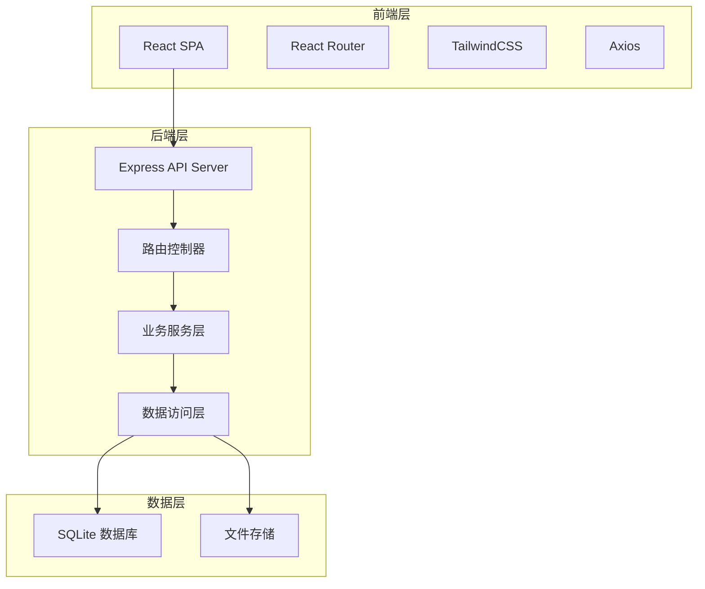
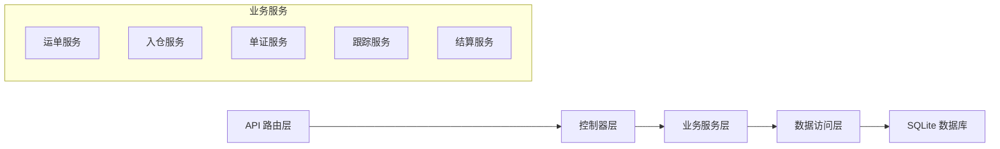
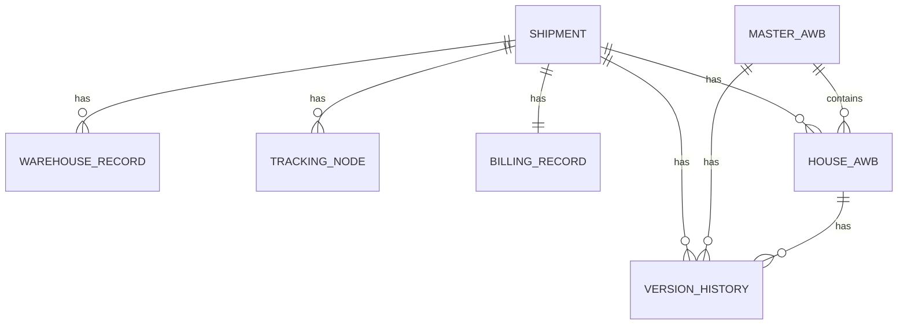

# 空运运单系统技术架构文档

## 1. 架构设计



## 2. 技术描述
- **前端**: React@18 + TailwindCSS@3 + Vite + React Router@6 + Axios
- **初始化工具**: Vite
- **后端**: Express@4 + cors + multer
- **数据库**: SQLite (data/app.sqlite)
- **ORM**: better-sqlite3
- **端口配置**: 前端端口 46825，后端端口 56825

## 3. 路由定义
| 路由 | 页面 |
|------|------|
| / | 首页仪表盘 |
| /shipments | 运单列表 |
| /shipments/:id | 运单详情 |
| /shipments/new | 新建运单 |
| /warehouse | 入仓安检 |
| /documents | 单证管理 |
| /tracking | 航班跟踪 |
| /billing | 费用结算 |
| /settings | 系统设置 |

## 4. API 定义

### 4.1 运单相关
```typescript
interface Shipment {
  id: number;
  shipmentNo: string;
  status: 'draft' | 'pending_review' | 'booked' | 'warehoused' | 'security_checked' | 'loaded' | 'departed' | 'arrived' | 'customs_cleared' | 'delivered' | 'cancelled';
  shipper: { name: string; phone: string; address: string; };
  consignee: { name: string; phone: string; address: string; };
  pieces: number;
  weight: number;
  length?: number;
  width?: number;
  height?: number;
  volumeWeight?: number;
  chargeableWeight: number;
  productName: string;
  isDangerous: boolean;
  isElectric: boolean;
  reviewStatus?: 'pending' | 'approved' | 'rejected';
  reviewComment?: string;
  origin: string;
  destination: string;
  flightNo?: string;
  flightDate?: string;
  serviceLevel: 'standard' | 'express' | 'priority';
  createdAt: string;
  updatedAt: string;
}

// GET /api/shipments - 获取运单列表
// GET /api/shipments/:id - 获取运单详情
// POST /api/shipments - 创建运单
// PUT /api/shipments/:id - 更新运单
// POST /api/shipments/:id/review - 危险品审核
```

### 4.2 入仓安检相关
```typescript
interface WarehouseRecord {
  id: number;
  shipmentId: number;
  actualPieces: number;
  actualWeight: number;
  actualLength?: number;
  actualWidth?: number;
  actualHeight?: number;
  weightDifference: number;
  photoUrls?: string[];
  anomalyDescription?: string;
  securityResult: 'pending' | 'passed' | 'failed';
  securityComment?: string;
  checkedBy: number;
  checkedAt: string;
}

// POST /api/warehouse - 创建入仓记录
// GET /api/warehouse/:shipmentId - 获取入仓记录
// POST /api/warehouse/:id/security - 提交安检结果
```

### 4.3 单证相关
```typescript
interface MasterAwb {
  id: number;
  awbNo: string;
  airline: string;
  flightNo: string;
  flightDate: string;
  origin: string;
  destination: string;
  totalPieces: number;
  totalWeight: number;
  version: number;
  createdAt: string;
}

interface HouseAwb {
  id: number;
  masterAwbId: number;
  shipmentId: number;
  houseAwbNo: string;
  version: number;
}

interface VersionHistory {
  id: number;
  entityType: 'master_awb' | 'house_awb' | 'shipment';
  entityId: number;
  version: number;
  changeType: 'flight_change' | 'split' | 'pull' | 'update';
  changeDescription: string;
  changedBy: number;
  changedAt: string;
}
```

### 4.4 航班跟踪相关
```typescript
interface TrackingNode {
  id: number;
  shipmentId: number;
  nodeType: 'departed' | 'arrived' | 'customs' | 'delivery' | 'pickup';
  status: 'pending' | 'completed' | 'failed';
  timestamp?: string;
  location?: string;
  description?: string;
}

// GET /api/tracking/:shipmentId - 获取跟踪节点
// POST /api/tracking/:shipmentId/nodes - 更新跟踪节点
```

### 4.5 费用结算相关
```typescript
interface BillingRecord {
  id: number;
  shipmentId: number;
  chargeableWeight: number;
  rate: number;
  freightAmount: number;
  otherCharges: { name: string; amount: number; }[];
  totalAmount: number;
  status: 'pending' | 'invoiced' | 'paid' | 'reconciled';
  reconciliationStatus?: 'matched' | 'mismatch' | 'pending';
}
```

## 5. 服务架构图



## 6. 数据模型

### 6.1 ER 图



### 6.2 DDL 语句

```sql
-- 运单表
CREATE TABLE shipments (
  id INTEGER PRIMARY KEY AUTOINCREMENT,
  shipment_no TEXT UNIQUE NOT NULL,
  status TEXT NOT NULL DEFAULT 'draft',
  shipper_name TEXT,
  shipper_phone TEXT,
  shipper_address TEXT,
  consignee_name TEXT,
  consignee_phone TEXT,
  consignee_address TEXT,
  pieces INTEGER NOT NULL,
  weight REAL NOT NULL,
  length REAL,
  width REAL,
  height REAL,
  volume_weight REAL,
  chargeable_weight REAL NOT NULL,
  product_name TEXT NOT NULL,
  is_dangerous INTEGER DEFAULT 0,
  is_electric INTEGER DEFAULT 0,
  review_status TEXT DEFAULT 'pending',
  review_comment TEXT,
  reviewed_by INTEGER,
  reviewed_at TEXT,
  origin TEXT NOT NULL,
  destination TEXT NOT NULL,
  flight_no TEXT,
  flight_date TEXT,
  service_level TEXT DEFAULT 'standard',
  created_at TEXT NOT NULL,
  updated_at TEXT NOT NULL
);

-- 入仓记录表
CREATE TABLE warehouse_records (
  id INTEGER PRIMARY KEY AUTOINCREMENT,
  shipment_id INTEGER NOT NULL,
  actual_pieces INTEGER NOT NULL,
  actual_weight REAL NOT NULL,
  actual_length REAL,
  actual_width REAL,
  actual_height REAL,
  weight_difference REAL NOT NULL,
  photo_urls TEXT,
  anomaly_description TEXT,
  security_result TEXT DEFAULT 'pending',
  security_comment TEXT,
  checked_by INTEGER,
  checked_at TEXT,
  created_at TEXT NOT NULL,
  FOREIGN KEY (shipment_id) REFERENCES shipments(id)
);

-- 主单表
CREATE TABLE master_awbs (
  id INTEGER PRIMARY KEY AUTOINCREMENT,
  awb_no TEXT UNIQUE NOT NULL,
  airline TEXT NOT NULL,
  flight_no TEXT NOT NULL,
  flight_date TEXT NOT NULL,
  origin TEXT NOT NULL,
  destination TEXT NOT NULL,
  total_pieces INTEGER NOT NULL,
  total_weight REAL NOT NULL,
  version INTEGER DEFAULT 1,
  created_at TEXT NOT NULL,
  updated_at TEXT NOT NULL
);

-- 分单表
CREATE TABLE house_awbs (
  id INTEGER PRIMARY KEY AUTOINCREMENT,
  master_awb_id INTEGER,
  shipment_id INTEGER NOT NULL,
  house_awb_no TEXT UNIQUE NOT NULL,
  version INTEGER DEFAULT 1,
  created_at TEXT NOT NULL,
  updated_at TEXT NOT NULL,
  FOREIGN KEY (master_awb_id) REFERENCES master_awbs(id),
  FOREIGN KEY (shipment_id) REFERENCES shipments(id)
);

-- 版本历史表
CREATE TABLE version_history (
  id INTEGER PRIMARY KEY AUTOINCREMENT,
  entity_type TEXT NOT NULL,
  entity_id INTEGER NOT NULL,
  version INTEGER NOT NULL,
  change_type TEXT NOT NULL,
  change_description TEXT NOT NULL,
  changed_by INTEGER,
  changed_at TEXT NOT NULL
);

-- 跟踪节点表
CREATE TABLE tracking_nodes (
  id INTEGER PRIMARY KEY AUTOINCREMENT,
  shipment_id INTEGER NOT NULL,
  node_type TEXT NOT NULL,
  status TEXT DEFAULT 'pending',
  timestamp TEXT,
  location TEXT,
  description TEXT,
  created_at TEXT NOT NULL,
  updated_at TEXT NOT NULL,
  FOREIGN KEY (shipment_id) REFERENCES shipments(id)
);

-- 费用记录表
CREATE TABLE billing_records (
  id INTEGER PRIMARY KEY AUTOINCREMENT,
  shipment_id INTEGER NOT NULL UNIQUE,
  chargeable_weight REAL NOT NULL,
  rate REAL NOT NULL,
  freight_amount REAL NOT NULL,
  other_charges TEXT,
  total_amount REAL NOT NULL,
  status TEXT DEFAULT 'pending',
  reconciliation_status TEXT DEFAULT 'pending',
  created_at TEXT NOT NULL,
  updated_at TEXT NOT NULL,
  FOREIGN KEY (shipment_id) REFERENCES shipments(id)
);

-- 用户表
CREATE TABLE users (
  id INTEGER PRIMARY KEY AUTOINCREMENT,
  username TEXT UNIQUE NOT NULL,
  name TEXT NOT NULL,
  role TEXT NOT NULL,
  created_at TEXT NOT NULL
);

-- 索引
CREATE INDEX idx_shipment_no ON shipments(shipment_no);
CREATE INDEX idx_shipment_status ON shipments(status);
CREATE INDEX idx_warehouse_shipment ON warehouse_records(shipment_id);
CREATE INDEX idx_tracking_shipment ON tracking_nodes(shipment_id);
CREATE INDEX idx_billing_shipment ON billing_records(shipment_id);
```
