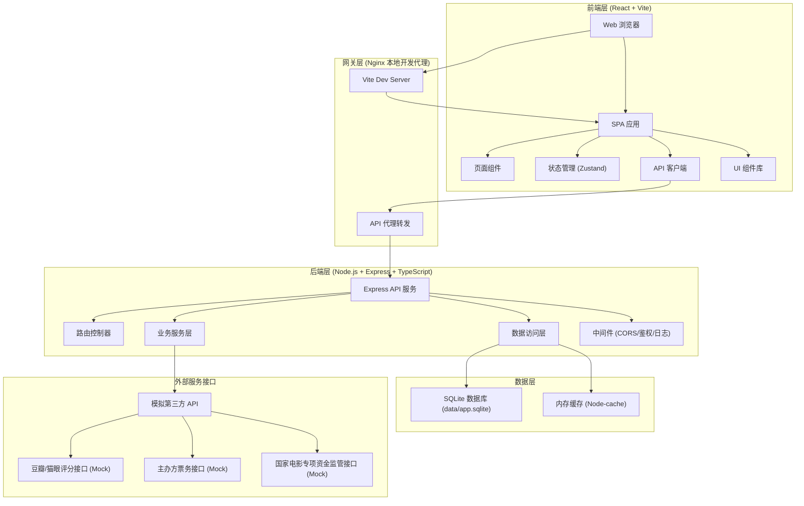
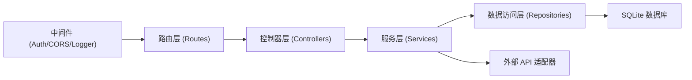
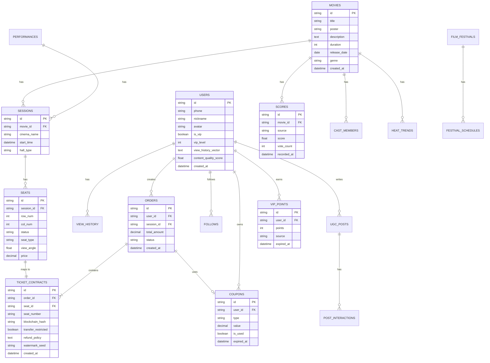

## 1. 架构设计



## 2. 技术描述

### 2.1 技术选型

| 层级 | 技术栈 | 版本 | 说明 |
|------|--------|------|------|
| 前端 | React | 18.x | UI 框架 |
| 前端 | TypeScript | 5.x | 类型系统 |
| 前端 | Vite | 5.x | 构建工具 |
| 前端 | React Router | 6.x | 路由管理 |
| 前端 | Zustand | 4.x | 状态管理 |
| 前端 | Tailwind CSS | 3.x | 样式框架 |
| 前端 | Lucide React | 0.x | 图标库 |
| 前端 | Recharts | 2.x | 图表库 |
| 后端 | Node.js | 20.x | 运行时 |
| 后端 | Express | 4.x | Web 框架 |
| 后端 | TypeScript | 5.x | 类型系统 |
| 后端 | better-sqlite3 | 9.x | SQLite 驱动 |
| 后端 | cors | 2.x | 跨域处理 |
| 后端 | jsonwebtoken | 9.x | JWT 鉴权 |
| 后端 | node-cache | 5.x | 内存缓存 |
| 数据库 | SQLite | 3.x | 嵌入式数据库 |

### 2.2 项目结构

```
may-88777/
├── .env                    # 环境配置（端口、数据库路径）
├── package.json            # 根项目配置
├── tsconfig.json           # TypeScript 配置
├── vite.config.ts          # Vite 配置
├── tailwind.config.js      # Tailwind 配置
├── data/
│   └── app.sqlite          # SQLite 数据库文件
├── api/                    # 后端代码
│   ├── src/
│   │   ├── index.ts        # 入口文件
│   │   ├── server.ts       # 服务器初始化
│   │   ├── routes/         # 路由定义
│   │   ├── controllers/    # 控制器
│   │   ├── services/       # 业务服务
│   │   ├── repositories/   # 数据访问
│   │   ├── models/         # 数据模型
│   │   ├── middleware/     # 中间件
│   │   ├── utils/          # 工具函数
│   │   └── config/         # 配置管理
│   └── tsconfig.json
├── src/                    # 前端代码
│   ├── main.tsx            # 入口文件
│   ├── App.tsx             # 根组件
│   ├── pages/              # 页面组件
│   ├── components/         # 通用组件
│   ├── hooks/              # 自定义 Hooks
│   ├── stores/             # Zustand 状态
│   ├── services/           # API 服务
│   ├── types/              # TypeScript 类型
│   ├── utils/              # 工具函数
│   └── styles/             # 全局样式
├── migrations/             # 数据库迁移脚本
├── frontend.log            # 前端日志
└── backend.log             # 后端日志
```

### 2.3 端口配置

项目目录: may-88777 → tail4 = 8777

| 槽位 | FRONTEND_PORT | BACKEND_PORT | 说明 |
|------|---------------|--------------|------|
| 默认 | 48777 | 58777 | 40000+8777 / 50000+8777 |
| 备用1 | 49777 | 59777 | 41000+8777 / 51000+8777 |
| 备用2 | 50777 | 60777 | 42000+8777 / 52000+8777 |
| 备用3 | 51777 | 61777 | 43000+8777 / 53000+8777 |
| 备用4 | 52777 | 62777 | 44000+8777 / 54000+8777 |
| 备用5 | 53777 | 63777 | 45000+8777 / 55000+8777 |

**约束**:
- 所有服务只监听 `127.0.0.1`
- Vite 启用 `strictPort: true`
- 启动前检查端口占用，被占用则自动切换备用槽位并写回 `.env`

## 3. 路由定义

### 3.1 前端路由

| 路由路径 | 页面组件 | 说明 |
|----------|----------|------|
| `/` | HomePage | 首页 |
| `/movie/:id` | MovieDetailPage | 影片详情 |
| `/performance/:id` | PerformanceDetailPage | 演出详情 |
| `/select-seat/:sessionId` | SeatSelectionPage | 智能选座 |
| `/tickets` | TicketCenterPage | 票务中心 |
| `/ticket/:id` | TicketDetailPage | 电子票详情 |
| `/vip` | VipCenterPage | 会员中心 |
| `/video` | VideoPage | 快看视频 |
| `/art-film` | ArtFilmPage | 艺术电影频道 |
| `/community` | CommunityPage | 社区广场 |
| `/post/:id` | PostDetailPage | 帖子详情 |
| `/profile` | ProfilePage | 个人中心 |
| `/admin` | AdminDashboard | 管理后台首页 |
| `/admin/content` | AdminContentPage | 内容管理 |
| `/admin/reporting` | AdminReportingPage | 监管数据上报 |
| `/login` | LoginPage | 登录页 |
| `/register` | RegisterPage | 注册页 |

### 3.2 后端 API 路由

| 方法 | 路由路径 | 说明 |
|------|----------|------|
| GET | `/api/health` | 健康检查 |
| GET | `/api/movies` | 获取影片列表 |
| GET | `/api/movies/:id` | 获取影片详情 |
| GET | `/api/movies/:id/scores` | 获取多源评分融合数据 |
| GET | `/api/movies/:id/trend` | 获取话题热度趋势 |
| GET | `/api/performances` | 获取演出列表 |
| GET | `/api/performances/:id` | 获取演出详情 |
| GET | `/api/sessions/:id` | 获取场次详情 |
| GET | `/api/sessions/:id/seats` | 获取座位状态 |
| POST | `/api/orders` | 创建订单 |
| GET | `/api/orders/:id` | 获取订单详情 |
| POST | `/api/tickets/:id/verify` | 验票接口 |
| GET | `/api/users/:id` | 获取用户信息 |
| GET | `/api/users/:id/history` | 观影历史 |
| POST | `/api/users/:id/follow` | 关注用户 |
| GET | `/api/vip/points` | 积分查询 |
| GET | `/api/vip/coupons` | 优惠券列表 |
| POST | `/api/vip/coupons/:id/use` | 使用优惠券 |
| GET | `/api/video/recommend` | 视频推荐列表 |
| GET | `/api/community/posts` | 社区帖子列表 |
| POST | `/api/community/posts` | 发布帖子 |
| GET | `/api/film-festival/schedule` | 电影节排片 |
| GET | `/api/admin/overview` | 后台数据概览 |
| POST | `/api/admin/reporting/submit` | 监管数据上报 |

## 4. API 定义

### 4.1 核心数据类型定义

```typescript
// 影片/演出
interface Media {
  id: string;
  type: 'movie' | 'performance';
  title: string;
  poster: string;
  description: string;
  duration: number;
  releaseDate: string;
  genre: string[];
  cast: CastMember[];
  scores: ScoreData;
  heatTrend: HeatPoint[];
}

// 多源评分融合
interface ScoreData {
  douban: { score: number; count: number };
  maoyan: { score: number; count: number };
  lighthouse: { score: number; count: number };
  fused: number;
}

// 主创IP影响力
interface CastMember {
  id: string;
  name: string;
  role: string;
  avatar: string;
  influenceWeight: number;
}

// 热度趋势
interface HeatPoint {
  date: string;
  value: number;
}

// 座位
interface Seat {
  id: string;
  row: number;
  col: number;
  status: 'available' | 'sold' | 'selected' | 'reserved';
  type: 'normal' | 'wheelchair' | 'companion' | 'vip';
  viewAngle: number;
  price: number;
}

// 票务合约
interface TicketContract {
  id: string;
  orderId: string;
  seatId: string;
  seatNumber: string;
  blockchainHash: string;
  transferRestricted: boolean;
  refundPolicy: RefundPolicy;
  watermarkSeed: string;
}

// 用户
interface User {
  id: string;
  phone: string;
  nickname: string;
  avatar: string;
  isVip: boolean;
  vipLevel: number;
  viewHistoryVector: number[];
  contentQualityScore: number;
  following: string[];
  followers: string[];
}
```

### 4.2 请求响应示例

#### GET /api/movies/:id/scores
**响应**:
```json
{
  "code": 0,
  "data": {
    "douban": { "score": 8.5, "count": 125000 },
    "maoyan": { "score": 9.2, "count": 89000 },
    "lighthouse": { "score": 8.8, "count": 45000 },
    "fused": 8.83
  }
}
```

#### POST /api/orders
**请求**:
```json
{
  "sessionId": "sess_001",
  "userId": "user_001",
  "seatIds": ["seat_001", "seat_002"],
  "couponId": "coup_001"
}
```

**响应**:
```json
{
  "code": 0,
  "data": {
    "orderId": "ord_001",
    "status": "pending",
    "totalAmount": 120,
    "tickets": [
      {
        "ticketId": "tick_001",
        "contractHash": "0xabc123..."
      }
    ]
  }
}
```

## 5. 后端分层架构



### 5.1 分层职责

- **路由层**: 定义 HTTP 端点，参数校验，请求转发
- **控制器层**: 处理请求上下文，组装响应，错误处理
- **服务层**: 核心业务逻辑，多源评分融合算法，推荐排序
- **数据访问层**: ORM 封装，SQL 操作，事务管理
- **中间件**: 鉴权、CORS、请求日志、限流

## 6. 数据模型

### 6.1 ER 图



### 6.2 DDL 语句

```sql
-- 用户表
CREATE TABLE users (
  id TEXT PRIMARY KEY,
  phone TEXT UNIQUE NOT NULL,
  nickname TEXT NOT NULL,
  avatar TEXT,
  is_vip INTEGER DEFAULT 0,
  vip_level INTEGER DEFAULT 0,
  view_history_vector TEXT,
  content_quality_score REAL DEFAULT 0,
  created_at DATETIME DEFAULT CURRENT_TIMESTAMP
);

-- 影片表
CREATE TABLE movies (
  id TEXT PRIMARY KEY,
  title TEXT NOT NULL,
  poster TEXT,
  description TEXT,
  duration INTEGER,
  release_date DATE,
  genre TEXT,
  created_at DATETIME DEFAULT CURRENT_TIMESTAMP
);

-- 多源评分表
CREATE TABLE scores (
  id TEXT PRIMARY KEY,
  movie_id TEXT NOT NULL,
  source TEXT NOT NULL,
  score REAL NOT NULL,
  vote_count INTEGER NOT NULL,
  recorded_at DATETIME DEFAULT CURRENT_TIMESTAMP,
  FOREIGN KEY (movie_id) REFERENCES movies(id)
);

-- 主创表
CREATE TABLE cast_members (
  id TEXT PRIMARY KEY,
  movie_id TEXT NOT NULL,
  name TEXT NOT NULL,
  role TEXT NOT NULL,
  avatar TEXT,
  influence_weight REAL DEFAULT 0,
  FOREIGN KEY (movie_id) REFERENCES movies(id)
);

-- 热度趋势表
CREATE TABLE heat_trends (
  id TEXT PRIMARY KEY,
  movie_id TEXT NOT NULL,
  trend_date DATE NOT NULL,
  value REAL NOT NULL,
  FOREIGN KEY (movie_id) REFERENCES movies(id)
);

-- 场次表
CREATE TABLE sessions (
  id TEXT PRIMARY KEY,
  movie_id TEXT NOT NULL,
  cinema_name TEXT NOT NULL,
  start_time DATETIME NOT NULL,
  hall_type TEXT NOT NULL,
  FOREIGN KEY (movie_id) REFERENCES movies(id)
);

-- 座位表
CREATE TABLE seats (
  id TEXT PRIMARY KEY,
  session_id TEXT NOT NULL,
  row_num INTEGER NOT NULL,
  col_num INTEGER NOT NULL,
  status TEXT NOT NULL DEFAULT 'available',
  seat_type TEXT NOT NULL DEFAULT 'normal',
  view_angle REAL,
  price DECIMAL(10,2) NOT NULL,
  FOREIGN KEY (session_id) REFERENCES sessions(id)
);

-- 订单表
CREATE TABLE orders (
  id TEXT PRIMARY KEY,
  user_id TEXT NOT NULL,
  session_id TEXT NOT NULL,
  total_amount DECIMAL(10,2) NOT NULL,
  status TEXT NOT NULL DEFAULT 'pending',
  created_at DATETIME DEFAULT CURRENT_TIMESTAMP,
  FOREIGN KEY (user_id) REFERENCES users(id),
  FOREIGN KEY (session_id) REFERENCES sessions(id)
);

-- 票务合约表
CREATE TABLE ticket_contracts (
  id TEXT PRIMARY KEY,
  order_id TEXT NOT NULL,
  seat_id TEXT NOT NULL,
  seat_number TEXT NOT NULL,
  blockchain_hash TEXT,
  transfer_restricted INTEGER DEFAULT 1,
  refund_policy TEXT,
  watermark_seed TEXT,
  created_at DATETIME DEFAULT CURRENT_TIMESTAMP,
  FOREIGN KEY (order_id) REFERENCES orders(id),
  FOREIGN KEY (seat_id) REFERENCES seats(id)
);

-- 积分表
CREATE TABLE vip_points (
  id TEXT PRIMARY KEY,
  user_id TEXT NOT NULL,
  points INTEGER NOT NULL,
  source TEXT NOT NULL,
  expired_at DATETIME,
  created_at DATETIME DEFAULT CURRENT_TIMESTAMP,
  FOREIGN KEY (user_id) REFERENCES users(id)
);

-- 优惠券表
CREATE TABLE coupons (
  id TEXT PRIMARY KEY,
  user_id TEXT NOT NULL,
  type TEXT NOT NULL,
  value DECIMAL(10,2) NOT NULL,
  is_used INTEGER DEFAULT 0,
  expired_at DATETIME,
  created_at DATETIME DEFAULT CURRENT_TIMESTAMP,
  FOREIGN KEY (user_id) REFERENCES users(id)
);

-- 社区帖子表
CREATE TABLE ugc_posts (
  id TEXT PRIMARY KEY,
  user_id TEXT NOT NULL,
  movie_id TEXT,
  title TEXT NOT NULL,
  content TEXT NOT NULL,
  quality_score REAL DEFAULT 0,
  likes_count INTEGER DEFAULT 0,
  comments_count INTEGER DEFAULT 0,
  created_at DATETIME DEFAULT CURRENT_TIMESTAMP,
  FOREIGN KEY (user_id) REFERENCES users(id)
);

-- 索引
CREATE INDEX idx_movies_title ON movies(title);
CREATE INDEX idx_scores_movie_source ON scores(movie_id, source);
CREATE INDEX idx_sessions_movie ON sessions(movie_id);
CREATE INDEX idx_seats_session ON seats(session_id);
CREATE INDEX idx_orders_user ON orders(user_id);
CREATE INDEX idx_posts_user ON ugc_posts(user_id);
```

### 6.3 初始化数据

数据库初始化时会自动插入以下演示数据：
- 10 部热门影片（含豆瓣/猫眼/灯塔评分）
- 20 个影片场次
- 200+ 座位数据（含无障碍席位）
- 3 个测试用户（1个VIP）
- 50+ 条积分记录
- 20 张优惠券
- 10 篇社区帖子

## 7. 核心算法模块

### 7.1 多源评分融合算法

```typescript
function fuseScores(scores: ScoreSource[], weights?: Record<string, number>): number {
  const defaultWeights = { douban: 0.4, maoyan: 0.35, lighthouse: 0.25 };
  const w = weights || defaultWeights;
  
  let totalWeight = 0;
  let weightedSum = 0;
  
  for (const s of scores) {
    const weight = w[s.source] || 0;
    const voteFactor = Math.min(s.voteCount / 100000, 1);
    weightedSum += s.score * weight * (0.7 + 0.3 * voteFactor);
    totalWeight += weight * (0.7 + 0.3 * voteFactor);
  }
  
  return totalWeight > 0 ? weightedSum / totalWeight : 0;
}
```

### 7.2 连座推荐算法

```typescript
function recommendConsecutiveSeats(
  seats: Seat[],
  count: number,
  preferWheelchair: boolean = false
): Seat[] {
  // 按行分组
  const rowGroups = groupBy(seats, 'row');
  
  for (const [row, rowSeats] of Object.entries(rowGroups)) {
    const sorted = [...rowSeats].sort((a, b) => a.col - b.col);
    
    for (let i = 0; i <= sorted.length - count; i++) {
      const candidate = sorted.slice(i, i + count);
      
      // 检查是否全部可用
      if (candidate.every(s => s.status === 'available')) {
        // 无障碍优先
        if (preferWheelchair && candidate.some(s => s.seatType === 'wheelchair')) {
          return candidate;
        }
        // 检查是否连续
        const cols = candidate.map(s => s.col);
        const isConsecutive = cols.every((c, idx) => c === cols[0] + idx);
        if (isConsecutive) return candidate;
      }
    }
  }
  
  return [];
}
```

### 7.3 多目标推荐排序

```typescript
function multiObjectiveRank(
  videos: VideoItem[],
  userProfile: UserProfile
): VideoItem[] {
  const weights = {
    completionRate: 0.35,
    interactionDensity: 0.3,
    crossPlatformMatch: 0.2,
    freshness: 0.15
  };
  
  return videos.map(v => {
    const score = 
      weights.completionRate * v.completionRate +
      weights.interactionDensity * (v.likes + v.comments * 2) / v.views +
      weights.crossPlatformMatch * cosineSimilarity(v.tags, userProfile.tags) +
      weights.freshness * (1 - (Date.now() - v.publishTime) / 86400000 / 30);
    return { ...v, rankScore: score };
  }).sort((a, b) => b.rankScore - a.rankScore);
}
```
