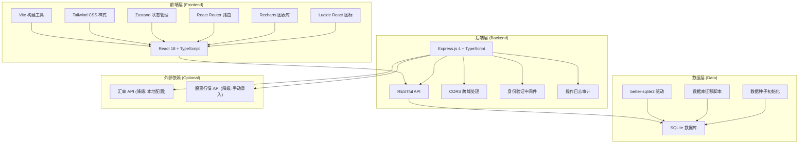
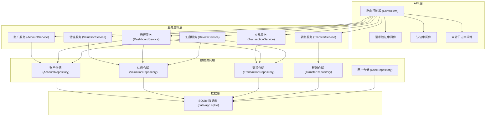
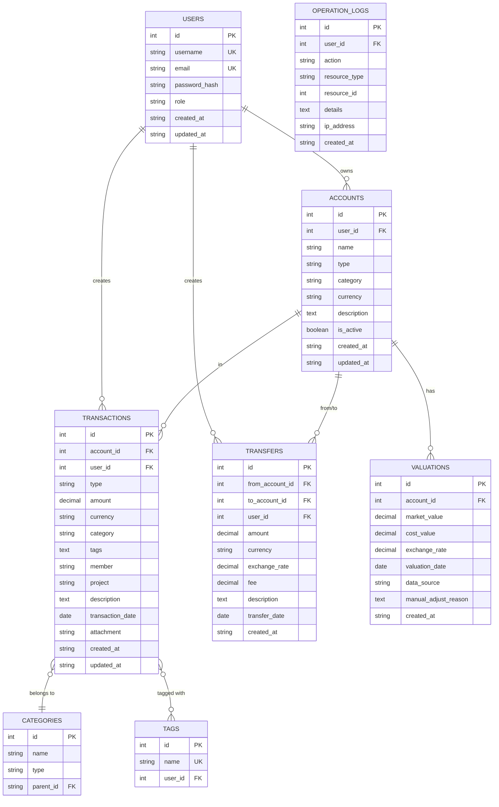

## 1. 架构设计



## 2. 技术栈说明

| 层级 | 技术选型 | 版本 | 说明 |
|------|----------|------|------|
| **前端框架** | React | 18.x | 使用函数式组件 + Hooks |
| **前端构建** | Vite | 5.x | 启用 strictPort，热更新 HMR |
| **前端语言** | TypeScript | 5.x | 严格类型检查 |
| **样式方案** | Tailwind CSS | 3.x | 原子化 CSS，自定义主题 |
| **状态管理** | Zustand | 4.x | 轻量级状态管理 |
| **路由管理** | React Router DOM | 6.x | 客户端路由 |
| **图表库** | Recharts | 2.x | 数据可视化 |
| **图标库** | Lucide React | 0.x | 统一图标风格 |
| **后端框架** | Express.js | 4.x | Node.js Web 框架 |
| **后端语言** | TypeScript | 5.x | ESM 模块格式 |
| **数据库** | SQLite | 3.x | 文件数据库 `data/app.sqlite` |
| **数据库驱动** | better-sqlite3 | 9.x | 同步 SQLite 驱动 |
| **HTTP 客户端** | fetch API | - | 浏览器原生 + 后端 node-fetch |
| **日期处理** | date-fns | 3.x | 日期格式化和计算 |

### 依赖原因与降级方案

- **SQLite**: 默认使用，无需额外服务，数据存储在 `data/app.sqlite`
- **汇率 API** (可选): 用于自动获取汇率，降级方案为本地手动配置汇率表
- **股票行情 API** (可选): 用于自动获取股票价格，降级方案为手动录入估值

## 3. 端口配置

### 端口计算公式
- 项目目录: `may-63490`
- N = 63490, tail4 = `3490` (后四位，不足4位补零)
- FRONTEND_PORT = 40000 + 3490 = **43490**
- BACKEND_PORT = 50000 + 3490 = **53490**

### 备用槽位 (端口占用时)
| 槽位 | FRONTEND_PORT | BACKEND_PORT |
|------|---------------|--------------|
| 默认 | 43490 | 53490 |
| 第1备用 | 44490 | 54490 |
| 第2备用 | 45490 | 55490 |
| 第3备用 | 46490 | 56490 |
| 第4备用 | 47490 | 57490 |
| 第5备用 | 48490 | 58490 |

## 4. 路由定义

### 前端路由

| 路由路径 | 页面组件 | 权限要求 | 说明 |
|----------|----------|----------|------|
| `/login` | LoginPage | 公开 | 登录页面 |
| `/register` | RegisterPage | 公开 | 注册页面 |
| `/` | DashboardPage | 已登录 | 净资产仪表盘首页 |
| `/accounts` | AccountsPage | 已登录 | 账户列表 |
| `/accounts/:id` | AccountDetailPage | 已登录 | 账户详情与估值记录 |
| `/transactions` | TransactionsPage | 已登录 | 收支流水 |
| `/transfers` | TransfersPage | 已登录 | 转账记录 |
| `/structure` | StructurePage | 已登录 | 资产结构分析 |
| `/monthly-review` | MonthlyReviewPage | 已登录 | 月度复盘报告 |
| `/goals` | GoalsPage | 已登录 | 财务目标管理 |
| `/settings` | SettingsPage | 已登录 | 系统设置 |
| `/admin` | AdminPage | 管理员 | 运营后台 |

### 后端 API 路由

| 方法 | 路径 | 模块 | 说明 |
|------|------|------|------|
| POST | `/api/auth/login` | 认证 | 用户登录 |
| POST | `/api/auth/register` | 认证 | 用户注册 |
| GET | `/api/auth/me` | 认证 | 获取当前用户 |
| GET | `/api/health` | 系统 | 健康检查 |
| GET | `/api/accounts` | 账户 | 获取账户列表 |
| POST | `/api/accounts` | 账户 | 创建账户 |
| GET | `/api/accounts/:id` | 账户 | 获取账户详情 |
| PUT | `/api/accounts/:id` | 账户 | 更新账户 |
| DELETE | `/api/accounts/:id` | 账户 | 删除账户 |
| GET | `/api/accounts/:id/valuations` | 估值 | 获取账户估值历史 |
| POST | `/api/accounts/:id/valuations` | 估值 | 新增估值记录 |
| GET | `/api/transactions` | 交易 | 获取收支流水 |
| POST | `/api/transactions` | 交易 | 创建收支记录 |
| PUT | `/api/transactions/:id` | 交易 | 更新收支记录 |
| DELETE | `/api/transactions/:id` | 交易 | 删除收支记录 |
| GET | `/api/transfers` | 转账 | 获取转账记录 |
| POST | `/api/transfers` | 转账 | 创建转账 |
| GET | `/api/dashboard/summary` | 看板 | 获取仪表盘汇总数据 |
| GET | `/api/dashboard/trend` | 看板 | 获取净资产趋势 |
| GET | `/api/dashboard/structure` | 看板 | 获取资产结构 |
| GET | `/api/monthly-review/:year/:month` | 复盘 | 获取月度复盘报告 |
| GET | `/api/admin/stats` | 管理 | 获取运营统计 |
| GET | `/api/admin/logs` | 管理 | 获取操作日志 |

## 5. API 类型定义

```typescript
// 共享类型定义 (shared/types.ts)

export interface User {
  id: number;
  username: string;
  email: string;
  role: 'user' | 'collaborator' | 'admin';
  createdAt: string;
}

export interface Account {
  id: number;
  userId: number;
  name: string;
  type: 'cash' | 'bank' | 'fund' | 'stock' | 'real_estate' | 'vehicle' | 'loan' | 'credit_card' | 'other';
  category: 'asset' | 'liability';
  currency: string;
  description?: string;
  isActive: boolean;
  createdAt: string;
  updatedAt: string;
}

export interface Valuation {
  id: number;
  accountId: number;
  marketValue: number;
  costValue: number;
  exchangeRate: number;
  valuationDate: string;
  dataSource: string;
  manualAdjustReason?: string;
  createdAt: string;
}

export interface Transaction {
  id: number;
  accountId: number;
  type: 'income' | 'expense';
  amount: number;
  currency: string;
  category: string;
  tags: string[];
  member?: string;
  project?: string;
  description?: string;
  transactionDate: string;
  attachment?: string;
  createdAt: string;
}

export interface Transfer {
  id: number;
  fromAccountId: number;
  toAccountId: number;
  amount: number;
  currency: string;
  exchangeRate?: number;
  fee?: number;
  description?: string;
  transferDate: string;
  createdAt: string;
}

export interface DashboardSummary {
  totalAssets: number;
  totalLiabilities: number;
  netWorth: number;
  debtRatio: number;
  monthlyIncome: number;
  monthlyExpense: number;
  monthlyCashFlow: number;
}

export interface MonthlyReview {
  year: number;
  month: number;
  netWorthChange: number;
  changeReasons: string[];
  abnormalExpenses: Array<{ category: string; amount: number; threshold: number }>;
  debtPlan: { current: number; target: number; progress: number };
  savingsRate: number;
  nextActions: string[];
}
```

## 6. 后端架构图



## 7. 数据模型

### 7.1 ER 图



### 7.2 DDL 语句

```sql
-- 用户表
CREATE TABLE IF NOT EXISTS users (
    id INTEGER PRIMARY KEY AUTOINCREMENT,
    username VARCHAR(50) UNIQUE NOT NULL,
    email VARCHAR(100) UNIQUE NOT NULL,
    password_hash VARCHAR(255) NOT NULL,
    role VARCHAR(20) NOT NULL DEFAULT 'user',
    created_at DATETIME DEFAULT CURRENT_TIMESTAMP,
    updated_at DATETIME DEFAULT CURRENT_TIMESTAMP
);

-- 账户表
CREATE TABLE IF NOT EXISTS accounts (
    id INTEGER PRIMARY KEY AUTOINCREMENT,
    user_id INTEGER NOT NULL REFERENCES users(id),
    name VARCHAR(100) NOT NULL,
    type VARCHAR(50) NOT NULL,
    category VARCHAR(20) NOT NULL CHECK(category IN ('asset', 'liability')),
    currency VARCHAR(10) NOT NULL DEFAULT 'CNY',
    description TEXT,
    is_active BOOLEAN NOT NULL DEFAULT 1,
    created_at DATETIME DEFAULT CURRENT_TIMESTAMP,
    updated_at DATETIME DEFAULT CURRENT_TIMESTAMP,
    INDEX idx_user_id (user_id),
    INDEX idx_category (category)
);

-- 估值记录表
CREATE TABLE IF NOT EXISTS valuations (
    id INTEGER PRIMARY KEY AUTOINCREMENT,
    account_id INTEGER NOT NULL REFERENCES accounts(id),
    market_value DECIMAL(20,4) NOT NULL,
    cost_value DECIMAL(20,4) NOT NULL DEFAULT 0,
    exchange_rate DECIMAL(15,6) NOT NULL DEFAULT 1,
    valuation_date DATE NOT NULL,
    data_source VARCHAR(50) NOT NULL,
    manual_adjust_reason TEXT,
    created_at DATETIME DEFAULT CURRENT_TIMESTAMP,
    INDEX idx_account_id (account_id),
    INDEX idx_valuation_date (valuation_date)
);

-- 收支流水表
CREATE TABLE IF NOT EXISTS transactions (
    id INTEGER PRIMARY KEY AUTOINCREMENT,
    account_id INTEGER NOT NULL REFERENCES accounts(id),
    user_id INTEGER NOT NULL REFERENCES users(id),
    type VARCHAR(10) NOT NULL CHECK(type IN ('income', 'expense')),
    amount DECIMAL(20,4) NOT NULL,
    currency VARCHAR(10) NOT NULL DEFAULT 'CNY',
    category VARCHAR(100) NOT NULL,
    tags TEXT,
    member VARCHAR(50),
    project VARCHAR(100),
    description TEXT,
    transaction_date DATE NOT NULL,
    attachment VARCHAR(255),
    created_at DATETIME DEFAULT CURRENT_TIMESTAMP,
    updated_at DATETIME DEFAULT CURRENT_TIMESTAMP,
    INDEX idx_account_id (account_id),
    INDEX idx_user_id (user_id),
    INDEX idx_transaction_date (transaction_date),
    INDEX idx_type (type)
);

-- 转账记录表
CREATE TABLE IF NOT EXISTS transfers (
    id INTEGER PRIMARY KEY AUTOINCREMENT,
    from_account_id INTEGER NOT NULL REFERENCES accounts(id),
    to_account_id INTEGER NOT NULL REFERENCES accounts(id),
    user_id INTEGER NOT NULL REFERENCES users(id),
    amount DECIMAL(20,4) NOT NULL,
    currency VARCHAR(10) NOT NULL DEFAULT 'CNY',
    exchange_rate DECIMAL(15,6),
    fee DECIMAL(20,4) DEFAULT 0,
    description TEXT,
    transfer_date DATE NOT NULL,
    created_at DATETIME DEFAULT CURRENT_TIMESTAMP,
    INDEX idx_from_account (from_account_id),
    INDEX idx_to_account (to_account_id),
    INDEX idx_user_id (user_id),
    INDEX idx_transfer_date (transfer_date)
);

-- 分类表
CREATE TABLE IF NOT EXISTS categories (
    id INTEGER PRIMARY KEY AUTOINCREMENT,
    name VARCHAR(50) NOT NULL,
    type VARCHAR(10) NOT NULL CHECK(type IN ('income', 'expense')),
    parent_id INTEGER REFERENCES categories(id),
    user_id INTEGER REFERENCES users(id),
    is_system BOOLEAN DEFAULT 0,
    UNIQUE(name, type, user_id)
);

-- 标签表
CREATE TABLE IF NOT EXISTS tags (
    id INTEGER PRIMARY KEY AUTOINCREMENT,
    name VARCHAR(50) NOT NULL,
    user_id INTEGER NOT NULL REFERENCES users(id),
    color VARCHAR(20),
    UNIQUE(name, user_id)
);

-- 操作日志表
CREATE TABLE IF NOT EXISTS operation_logs (
    id INTEGER PRIMARY KEY AUTOINCREMENT,
    user_id INTEGER REFERENCES users(id),
    action VARCHAR(50) NOT NULL,
    resource_type VARCHAR(50) NOT NULL,
    resource_id INTEGER,
    details TEXT,
    ip_address VARCHAR(50),
    created_at DATETIME DEFAULT CURRENT_TIMESTAMP,
    INDEX idx_user_id (user_id),
    INDEX idx_created_at (created_at)
);

-- 初始化系统分类
INSERT OR IGNORE INTO categories (name, type, is_system) VALUES
    ('工资', 'income', 1),
    ('奖金', 'income', 1),
    ('投资收益', 'income', 1),
    ('其他收入', 'income', 1),
    ('餐饮', 'expense', 1),
    ('交通', 'expense', 1),
    ('购物', 'expense', 1),
    ('娱乐', 'expense', 1),
    ('医疗', 'expense', 1),
    ('教育', 'expense', 1),
    ('住房', 'expense', 1),
    ('水电煤', 'expense', 1),
    ('通讯', 'expense', 1),
    ('其他支出', 'expense', 1);

-- 初始化默认管理员 (密码: admin123)
INSERT OR IGNORE INTO users (username, email, password_hash, role) VALUES
    ('admin', 'admin@example.com', '$2b$10$N9qo8uLOickgx2ZMRZoMyeIjZAgcfl7p92ldGxad68LJZdL17lhWy', 'admin');
```

## 8. 项目结构

```
may-63490/
├── .env                          # 环境变量配置
├── package.json                  # 项目依赖
├── tsconfig.json                 # TypeScript 配置
├── vite.config.ts                # Vite 前端配置
├── tailwind.config.js            # Tailwind CSS 配置
├── postcss.config.js             # PostCSS 配置
├── data/
│   └── app.sqlite                # SQLite 数据库文件
├── migrations/                   # 数据库迁移脚本
│   └── 001_initial_schema.sql
├── shared/                       # 前后端共享类型
│   └── types.ts
├── api/                          # 后端代码
│   ├── src/
│   │   ├── index.ts              # 后端入口
│   │   ├── server.ts             # 服务器配置
│   │   ├── config/               # 配置模块
│   │   ├── controllers/          # API 控制器
│   │   ├── middleware/           # 中间件
│   │   ├── services/             # 业务逻辑
│   │   ├── repositories/         # 数据访问
│   │   ├── utils/                # 工具函数
│   │   └── types/                # 后端类型
│   └── tsconfig.json
├── src/                          # 前端代码
│   ├── main.tsx                  # 前端入口
│   ├── App.tsx                   # 根组件
│   ├── router.tsx                # 路由配置
│   ├── store/                    # Zustand 状态管理
│   ├── pages/                    # 页面组件
│   ├── components/               # 通用组件
│   ├── hooks/                    # 自定义 Hooks
│   ├── utils/                    # 工具函数
│   ├── services/                 # API 调用
│   └── styles/                   # 全局样式
├── frontend.log                  # 前端日志
└── backend.log                   # 后端日志
```
