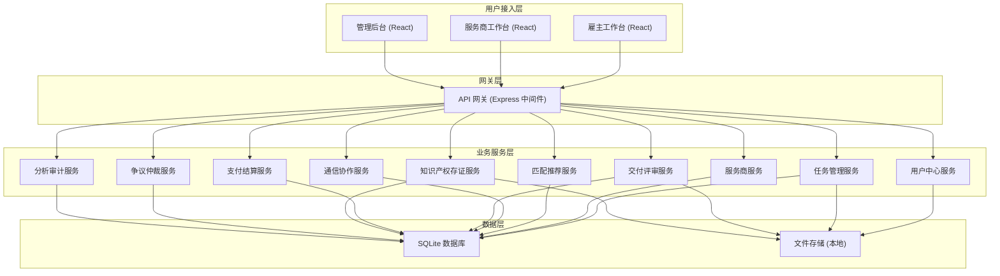
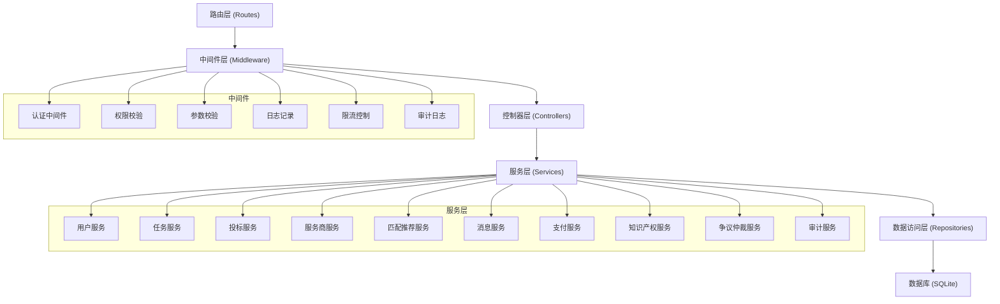
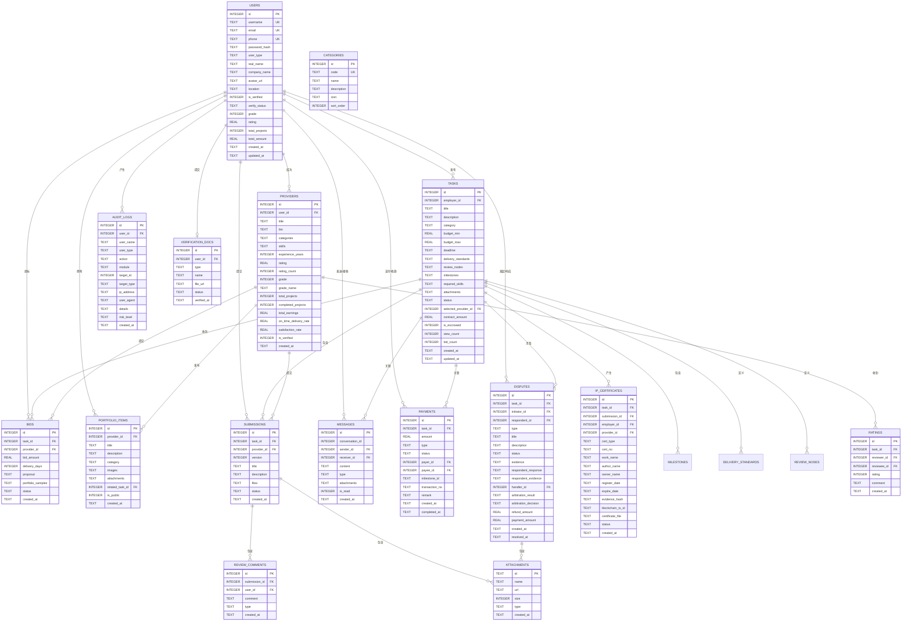

# 创意服务众包平台工作台 - 技术架构文档

## 1. 架构设计



## 2. 技术选型

### 2.1 前端技术栈
- **框架**：React 18 + TypeScript
- **构建工具**：Vite 5
- **UI 组件库**：Ant Design 5
- **路由**：React Router 6
- **状态管理**：Zustand
- **HTTP 客户端**：Axios
- **图表库**：ECharts 5
- **样式方案**：Tailwind CSS 3 + CSS Modules
- **工具库**：dayjs、lodash-es、ahooks
- **实时通信**：Socket.io Client

### 2.2 后端技术栈
- **运行时**：Node.js 20
- **框架**：Express 4 + TypeScript
- **数据库**：SQLite 3 + better-sqlite3
- **认证**：JWT + bcryptjs
- **实时通信**：Socket.io
- **中间件**：cors、morgan、helmet、express-rate-limit、multer
- **工具库**：dotenv、joi、uuid、dayjs

### 2.3 开发规范
- **代码规范**：ESLint + Prettier
- **端口配置**：前端 49101，后端 59101
- **服务绑定**：仅监听 127.0.0.1
- **项目目录**：crowdsourcing-frontend/、crowdsourcing-backend/

## 3. 路由定义

### 3.1 前端路由 (React Router)

| 路由路径 | 页面名称 | 权限要求 |
|---------|----------|----------|
| `/` | 首页/登录页 | 公开 |
| `/login` | 登录页 | 公开 |
| `/register` | 注册页 | 公开 |
| `/employer` | 雇主工作台首页 | 雇主 |
| `/employer/tasks` | 雇主任务列表 | 雇主 |
| `/employer/tasks/publish` | 发布任务 | 雇主 |
| `/employer/tasks/:id` | 任务详情 | 雇主 |
| `/employer/talents` | 人才库 | 雇主 |
| `/employer/talents/:id` | 人才详情 | 雇主 |
| `/employer/disputes` | 争议中心 | 雇主 |
| `/employer/finance` | 财务中心 | 雇主 |
| `/employer/settings` | 账户设置 | 雇主 |
| `/provider` | 服务商工作台 | 服务商 |
| `/provider/tasks` | 服务商任务列表 | 服务商 |
| `/provider/tasks/:id` | 任务详情 | 服务商 |
| `/provider/submissions` | 稿件提交 | 服务商 |
| `/provider/portfolio` | 作品集管理 | 服务商 |
| `/provider/disputes` | 争议中心 | 服务商 |
| `/provider/finance` | 财务中心 | 服务商 |
| `/provider/settings` | 账户设置 | 服务商 |
| `/admin` | 管理后台首页 | 管理员/审计 |
| `/admin/tasks` | 任务管理 | 管理员 |
| `/admin/tasks/board` | 任务看板 | 管理员 |
| `/admin/tasks/review` | 任务审核 | 管理员 |
| `/admin/providers` | 服务商管理 | 管理员 |
| `/admin/providers/grades` | 分级管理 | 管理员 |
| `/admin/ip` | 知识产权存证 | 管理员 |
| `/admin/disputes` | 争议仲裁 | 管理员/仲裁员 |
| `/admin/audit` | 合规审计 | 审计员 |
| `/admin/finance` | 财务中心 | 管理员 |
| `/admin/settings` | 系统设置 | 管理员 |

### 3.2 后端 API 路由

| 路由前缀 | 模块 | 说明 |
|---------|------|------|
| `/api/auth` | 认证模块 | 登录、注册、登出、token 刷新 |
| `/api/users` | 用户中心 | 用户信息、认证信息、权限配置 |
| `/api/tasks` | 任务管理 | 任务 CRUD、状态变更、审核、里程碑管理 |
| `/api/tasks/:id/bids` | 投标管理 | 投标提交、投标列表、中标确认 |
| `/api/tasks/:id/submissions` | 稿件管理 | 稿件提交、版本管理、评审意见 |
| `/api/tasks/:id/reviews` | 评审管理 | 评审提交、验收、驳回 |
| `/api/providers` | 服务商服务 | 服务商列表、详情、资质认证、分级 |
| `/api/providers/portfolio` | 作品集管理 | 作品 CRUD、作品集展示 |
| `/api/match` | 匹配推荐 | 任务匹配服务商、服务商匹配任务 |
| `/api/messages` | 通信服务 | 消息列表、发送消息、未读统计 |
| `/api/payments` | 支付结算 | 资金托管、付款、退款、交易流水 |
| `/api/ip` | 知识产权 | 存证提交、存证列表、存证证书、版权登记 |
| `/api/disputes` | 争议仲裁 | 申诉提交、证据上传、仲裁处理、裁决执行 |
| `/api/analytics` | 数据分析 | 平台统计、任务统计、财务统计、热力图数据 |
| `/api/audit` | 合规审计 | 操作日志、审计追溯、风险预警、合规报表 |
| `/api/health` | 健康检查 | 服务健康状态 |

## 4. API 定义

### 4.1 统一响应格式

```typescript
interface ApiResponse<T = any> {
  code: number;
  message: string;
  data: T;
  timestamp: string;
}

interface PagedResponse<T> {
  list: T[];
  total: number;
  page: number;
  pageSize: number;
}
```

### 4.2 核心接口定义

```typescript
// 用户模块
interface User {
  id: number;
  username: string;
  email: string;
  phone: string;
  userType: 'employer' | 'provider' | 'admin' | 'auditor';
  realName?: string;
  companyName?: string;
  avatarUrl?: string;
  isVerified: boolean;
  verifyStatus: 'pending' | 'approved' | 'rejected';
  grade?: number;
  rating?: number;
  totalProjects?: number;
  totalAmount?: number;
  createdAt: string;
}

interface LoginRequest {
  email: string;
  password: string;
}

interface LoginResponse {
  token: string;
  user: User;
  expiresAt: string;
}

// 任务模块
interface Task {
  id: number;
  employerId: number;
  employerName: string;
  title: string;
  description: string;
  category: 'ui-design' | 'industrial-design' | 'animation-design' | 'software-dev' | 'trademark' | 'copywriting';
  categoryName: string;
  budgetMin: number;
  budgetMax: number;
  deadline: string;
  deliveryStandards: DeliveryStandard[];
  reviewNodes: ReviewNode[];
  milestones: Milestone[];
  requiredSkills: string[];
  attachments: Attachment[];
  status: 'draft' | 'pending_review' | 'published' | 'bidding' | 'in_progress' | 'reviewing' | 'completed' | 'cancelled' | 'rejected';
  selectedProviderId?: number;
  selectedProviderName?: string;
  contractAmount?: number;
  isEscrowed: boolean;
  viewCount: number;
  bidCount: number;
  createdAt: string;
  updatedAt: string;
}

interface DeliveryStandard {
  id: string;
  name: string;
  description: string;
  fileFormat: string[];
  isRequired: boolean;
}

interface ReviewNode {
  id: string;
  name: string;
  description: string;
  order: number;
}

interface Milestone {
  id: string;
  name: string;
  description: string;
  dueDate: string;
  paymentRatio: number;
  status: 'pending' | 'in_progress' | 'completed' | 'paid';
}

interface Bid {
  id: number;
  taskId: number;
  providerId: number;
  providerName: string;
  providerAvatar?: string;
  providerRating?: number;
  bidAmount: number;
  deliveryDays: number;
  proposal: string;
  portfolioSamples: number[];
  status: 'pending' | 'accepted' | 'rejected';
  createdAt: string;
}

interface Submission {
  id: number;
  taskId: number;
  providerId: number;
  version: number;
  title: string;
  description: string;
  files: Attachment[];
  status: 'submitted' | 'under_review' | 'revision_requested' | 'accepted' | 'rejected';
  reviewComments: ReviewComment[];
  submittedAt: string;
}

interface ReviewComment {
  id: number;
  submissionId: number;
  userId: number;
  userName: string;
  comment: string;
  type: 'general' | 'revision' | 'approval';
  createdAt: string;
}

// 服务商模块
interface Provider {
  id: number;
  userId: number;
  realName: string;
  companyName?: string;
  avatarUrl?: string;
  title: string;
  bio: string;
  categories: string[];
  skills: string[];
  location?: string;
  experienceYears: number;
  rating: number;
  ratingCount: number;
  grade: number;
  gradeName: string;
  totalProjects: number;
  completedProjects: number;
  totalEarnings: number;
  onTimeDeliveryRate: number;
  satisfactionRate: number;
  isVerified: boolean;
  verificationDocs: VerificationDoc[];
  portfolioCount: number;
  createdAt: string;
}

interface PortfolioItem {
  id: number;
  providerId: number;
  title: string;
  description: string;
  category: string;
  images: string[];
  attachments: Attachment[];
  relatedTaskId?: number;
  isPublic: boolean;
  createdAt: string;
}

interface VerificationDoc {
  id: string;
  type: string;
  name: string;
  fileUrl: string;
  status: 'pending' | 'approved' | 'rejected';
  verifiedAt?: string;
}

// 匹配推荐
interface MatchResult {
  providerId: number;
  providerName: string;
  matchScore: number;
  matchReasons: string[];
  categoryMatch: boolean;
  skillMatch: number;
  ratingMatch: boolean;
  budgetMatch: boolean;
}

// 消息模块
interface Message {
  id: number;
  conversationId: number;
  senderId: number;
  senderName: string;
  senderAvatar?: string;
  receiverId: number;
  content: string;
  type: 'text' | 'file' | 'image' | 'system';
  attachments?: Attachment[];
  isRead: boolean;
  createdAt: string;
}

interface Conversation {
  id: number;
  taskId?: number;
  participants: number[];
  lastMessage?: Message;
  unreadCount: number;
  updatedAt: string;
}

// 支付模块
interface Payment {
  id: number;
  taskId: number;
  amount: number;
  type: 'escrow' | 'milestone' | 'refund' | 'release';
  status: 'pending' | 'completed' | 'failed';
  payerId: number;
  payeeId: number;
  milestoneId?: string;
  transactionNo: string;
  remark?: string;
  createdAt: string;
  completedAt?: string;
}

interface Transaction {
  id: number;
  paymentId: number;
  amount: number;
  type: 'income' | 'expense';
  balance: number;
  description: string;
  createdAt: string;
}

// 知识产权模块
interface IPCertificate {
  id: number;
  taskId: number;
  submissionId?: number;
  employerId: number;
  providerId: number;
  certType: 'copyright' | 'trademark' | 'patent';
  certNo: string;
  workName: string;
  authorName: string;
  ownerName: string;
  registerDate: string;
  expireDate?: string;
  evidenceHash: string;
  blockchainTxId?: string;
  certificateFile: string;
  status: 'pending' | 'registered' | 'rejected';
  createdAt: string;
}

// 争议仲裁模块
interface Dispute {
  id: number;
  taskId: number;
  initiatorId: number;
  respondentId: number;
  type: 'quality' | 'payment' | 'deadline' | 'other';
  title: string;
  description: string;
  status: 'pending' | 'under_review' | 'resolved' | 'appealed';
  evidence: Attachment[];
  respondentResponse?: string;
  respondentEvidence?: Attachment[];
  handlerId?: number;
  arbitrationResult?: string;
  arbitrationDecision?: 'refund_full' | 'refund_partial' | 'pay_full' | 'pay_partial' | 'continue_performance';
  refundAmount?: number;
  paymentAmount?: number;
  createdAt: string;
  resolvedAt?: string;
}

// 审计模块
interface AuditLog {
  id: number;
  userId: number;
  userName: string;
  userType: string;
  action: string;
  module: string;
  targetId?: number;
  targetType?: string;
  ipAddress: string;
  userAgent: string;
  details: Record<string, any>;
  riskLevel: 'low' | 'medium' | 'high';
  createdAt: string;
}

// 统计分析
interface PlatformStats {
  totalUsers: number;
  totalTasks: number;
  totalCompletedTasks: number;
  totalAmount: number;
  todayNewTasks: number;
  todayCompletedTasks: number;
  activeUsers: number;
  pendingReviewTasks: number;
  pendingDisputes: number;
}

interface CategoryStats {
  category: string;
  categoryName: string;
  taskCount: number;
  totalAmount: number;
  avgBudget: number;
}

interface HeatmapData {
  region: string;
  regionName: string;
  taskCount: number;
  providerCount: number;
  amount: number;
  coordinates: [number, number];
}

// 通用
interface Attachment {
  id: string;
  name: string;
  url: string;
  size: number;
  type: string;
  uploadedAt: string;
}
```

## 5. 后端架构分层



## 6. 数据模型

### 6.1 ER 图



### 6.2 数据库初始化脚本

```sql
-- 用户表
CREATE TABLE IF NOT EXISTS users (
  id INTEGER PRIMARY KEY AUTOINCREMENT,
  username TEXT UNIQUE NOT NULL,
  email TEXT UNIQUE NOT NULL,
  phone TEXT UNIQUE NOT NULL,
  password_hash TEXT NOT NULL,
  user_type TEXT NOT NULL DEFAULT 'employer',
  real_name TEXT,
  company_name TEXT,
  avatar_url TEXT,
  location TEXT,
  is_verified INTEGER DEFAULT 0,
  verify_status TEXT DEFAULT 'pending',
  grade INTEGER DEFAULT 1,
  rating REAL DEFAULT 5.0,
  total_projects INTEGER DEFAULT 0,
  total_amount REAL DEFAULT 0,
  created_at TEXT DEFAULT CURRENT_TIMESTAMP,
  updated_at TEXT DEFAULT CURRENT_TIMESTAMP
);

-- 服务商表
CREATE TABLE IF NOT EXISTS providers (
  id INTEGER PRIMARY KEY AUTOINCREMENT,
  user_id INTEGER NOT NULL,
  title TEXT,
  bio TEXT,
  categories TEXT,
  skills TEXT,
  experience_years INTEGER DEFAULT 0,
  rating REAL DEFAULT 5.0,
  rating_count INTEGER DEFAULT 0,
  grade INTEGER DEFAULT 1,
  grade_name TEXT DEFAULT '青铜服务商',
  total_projects INTEGER DEFAULT 0,
  completed_projects INTEGER DEFAULT 0,
  total_earnings REAL DEFAULT 0,
  on_time_delivery_rate REAL DEFAULT 100,
  satisfaction_rate REAL DEFAULT 100,
  is_verified INTEGER DEFAULT 0,
  created_at TEXT DEFAULT CURRENT_TIMESTAMP,
  FOREIGN KEY (user_id) REFERENCES users(id)
);

-- 分类表
CREATE TABLE IF NOT EXISTS categories (
  id INTEGER PRIMARY KEY AUTOINCREMENT,
  code TEXT UNIQUE NOT NULL,
  name TEXT NOT NULL,
  description TEXT,
  icon TEXT,
  sort_order INTEGER DEFAULT 0,
  created_at TEXT DEFAULT CURRENT_TIMESTAMP
);

-- 任务表
CREATE TABLE IF NOT EXISTS tasks (
  id INTEGER PRIMARY KEY AUTOINCREMENT,
  employer_id INTEGER NOT NULL,
  employer_name TEXT NOT NULL,
  title TEXT NOT NULL,
  description TEXT,
  category TEXT NOT NULL,
  category_name TEXT NOT NULL,
  budget_min REAL NOT NULL,
  budget_max REAL NOT NULL,
  deadline TEXT NOT NULL,
  delivery_standards TEXT,
  review_nodes TEXT,
  milestones TEXT,
  required_skills TEXT,
  attachments TEXT,
  status TEXT DEFAULT 'draft',
  selected_provider_id INTEGER,
  selected_provider_name TEXT,
  contract_amount REAL,
  is_escrowed INTEGER DEFAULT 0,
  view_count INTEGER DEFAULT 0,
  bid_count INTEGER DEFAULT 0,
  created_at TEXT DEFAULT CURRENT_TIMESTAMP,
  updated_at TEXT DEFAULT CURRENT_TIMESTAMP,
  FOREIGN KEY (employer_id) REFERENCES users(id)
);

-- 投标表
CREATE TABLE IF NOT EXISTS bids (
  id INTEGER PRIMARY KEY AUTOINCREMENT,
  task_id INTEGER NOT NULL,
  provider_id INTEGER NOT NULL,
  provider_name TEXT NOT NULL,
  bid_amount REAL NOT NULL,
  delivery_days INTEGER NOT NULL,
  proposal TEXT,
  portfolio_samples TEXT,
  status TEXT DEFAULT 'pending',
  created_at TEXT DEFAULT CURRENT_TIMESTAMP,
  FOREIGN KEY (task_id) REFERENCES tasks(id),
  FOREIGN KEY (provider_id) REFERENCES providers(id)
);

-- 稿件表
CREATE TABLE IF NOT EXISTS submissions (
  id INTEGER PRIMARY KEY AUTOINCREMENT,
  task_id INTEGER NOT NULL,
  provider_id INTEGER NOT NULL,
  version INTEGER NOT NULL DEFAULT 1,
  title TEXT NOT NULL,
  description TEXT,
  files TEXT,
  status TEXT DEFAULT 'submitted',
  created_at TEXT DEFAULT CURRENT_TIMESTAMP,
  FOREIGN KEY (task_id) REFERENCES tasks(id),
  FOREIGN KEY (provider_id) REFERENCES providers(id)
);

-- 评审意见表
CREATE TABLE IF NOT EXISTS review_comments (
  id INTEGER PRIMARY KEY AUTOINCREMENT,
  submission_id INTEGER NOT NULL,
  user_id INTEGER NOT NULL,
  user_name TEXT NOT NULL,
  comment TEXT NOT NULL,
  type TEXT DEFAULT 'general',
  created_at TEXT DEFAULT CURRENT_TIMESTAMP,
  FOREIGN KEY (submission_id) REFERENCES submissions(id)
);

-- 消息表
CREATE TABLE IF NOT EXISTS messages (
  id INTEGER PRIMARY KEY AUTOINCREMENT,
  conversation_id INTEGER NOT NULL,
  sender_id INTEGER NOT NULL,
  sender_name TEXT NOT NULL,
  sender_avatar TEXT,
  receiver_id INTEGER NOT NULL,
  content TEXT,
  type TEXT DEFAULT 'text',
  attachments TEXT,
  is_read INTEGER DEFAULT 0,
  created_at TEXT DEFAULT CURRENT_TIMESTAMP
);

-- 支付表
CREATE TABLE IF NOT EXISTS payments (
  id INTEGER PRIMARY KEY AUTOINCREMENT,
  task_id INTEGER NOT NULL,
  amount REAL NOT NULL,
  type TEXT NOT NULL,
  status TEXT DEFAULT 'pending',
  payer_id INTEGER NOT NULL,
  payee_id INTEGER NOT NULL,
  milestone_id TEXT,
  transaction_no TEXT UNIQUE NOT NULL,
  remark TEXT,
  created_at TEXT DEFAULT CURRENT_TIMESTAMP,
  completed_at TEXT,
  FOREIGN KEY (task_id) REFERENCES tasks(id)
);

-- 知识产权存证表
CREATE TABLE IF NOT EXISTS ip_certificates (
  id INTEGER PRIMARY KEY AUTOINCREMENT,
  task_id INTEGER NOT NULL,
  submission_id INTEGER,
  employer_id INTEGER NOT NULL,
  provider_id INTEGER NOT NULL,
  cert_type TEXT NOT NULL,
  cert_no TEXT UNIQUE NOT NULL,
  work_name TEXT NOT NULL,
  author_name TEXT NOT NULL,
  owner_name TEXT NOT NULL,
  register_date TEXT NOT NULL,
  expire_date TEXT,
  evidence_hash TEXT NOT NULL,
  blockchain_tx_id TEXT,
  certificate_file TEXT,
  status TEXT DEFAULT 'pending',
  created_at TEXT DEFAULT CURRENT_TIMESTAMP
);

-- 争议表
CREATE TABLE IF NOT EXISTS disputes (
  id INTEGER PRIMARY KEY AUTOINCREMENT,
  task_id INTEGER NOT NULL,
  initiator_id INTEGER NOT NULL,
  respondent_id INTEGER NOT NULL,
  type TEXT NOT NULL,
  title TEXT NOT NULL,
  description TEXT NOT NULL,
  status TEXT DEFAULT 'pending',
  evidence TEXT,
  respondent_response TEXT,
  respondent_evidence TEXT,
  handler_id INTEGER,
  arbitration_result TEXT,
  arbitration_decision TEXT,
  refund_amount REAL,
  payment_amount REAL,
  created_at TEXT DEFAULT CURRENT_TIMESTAMP,
  resolved_at TEXT,
  FOREIGN KEY (task_id) REFERENCES tasks(id)
);

-- 审计日志表
CREATE TABLE IF NOT EXISTS audit_logs (
  id INTEGER PRIMARY KEY AUTOINCREMENT,
  user_id INTEGER NOT NULL,
  user_name TEXT NOT NULL,
  user_type TEXT NOT NULL,
  action TEXT NOT NULL,
  module TEXT NOT NULL,
  target_id INTEGER,
  target_type TEXT,
  ip_address TEXT,
  user_agent TEXT,
  details TEXT,
  risk_level TEXT DEFAULT 'low',
  created_at TEXT DEFAULT CURRENT_TIMESTAMP
);

-- 作品集表
CREATE TABLE IF NOT EXISTS portfolio_items (
  id INTEGER PRIMARY KEY AUTOINCREMENT,
  provider_id INTEGER NOT NULL,
  title TEXT NOT NULL,
  description TEXT,
  category TEXT NOT NULL,
  images TEXT,
  attachments TEXT,
  related_task_id INTEGER,
  is_public INTEGER DEFAULT 1,
  created_at TEXT DEFAULT CURRENT_TIMESTAMP,
  FOREIGN KEY (provider_id) REFERENCES providers(id)
);

-- 认证文件表
CREATE TABLE IF NOT EXISTS verification_docs (
  id INTEGER PRIMARY KEY AUTOINCREMENT,
  user_id INTEGER NOT NULL,
  type TEXT NOT NULL,
  name TEXT NOT NULL,
  file_url TEXT NOT NULL,
  status TEXT DEFAULT 'pending',
  verified_at TEXT,
  created_at TEXT DEFAULT CURRENT_TIMESTAMP,
  FOREIGN KEY (user_id) REFERENCES users(id)
);

-- 评分表
CREATE TABLE IF NOT EXISTS ratings (
  id INTEGER PRIMARY KEY AUTOINCREMENT,
  task_id INTEGER NOT NULL,
  reviewer_id INTEGER NOT NULL,
  reviewee_id INTEGER NOT NULL,
  rating INTEGER NOT NULL,
  comment TEXT,
  created_at TEXT DEFAULT CURRENT_TIMESTAMP
);

-- 索引
CREATE INDEX IF NOT EXISTS idx_users_type ON users(user_type);
CREATE INDEX IF NOT EXISTS idx_tasks_employer ON tasks(employer_id);
CREATE INDEX IF NOT EXISTS idx_tasks_status ON tasks(status);
CREATE INDEX IF NOT EXISTS idx_tasks_category ON tasks(category);
CREATE INDEX IF NOT EXISTS idx_bids_task ON bids(task_id);
CREATE INDEX IF NOT EXISTS idx_bids_provider ON bids(provider_id);
CREATE INDEX IF NOT EXISTS idx_submissions_task ON submissions(task_id);
CREATE INDEX IF NOT EXISTS idx_messages_conversation ON messages(conversation_id);
CREATE INDEX IF NOT EXISTS idx_messages_receiver ON messages(receiver_id, is_read);
CREATE INDEX IF NOT EXISTS idx_payments_task ON payments(task_id);
CREATE INDEX IF NOT EXISTS idx_disputes_task ON disputes(task_id);
CREATE INDEX IF NOT EXISTS idx_disputes_status ON disputes(status);
CREATE INDEX IF NOT EXISTS idx_audit_user ON audit_logs(user_id);
CREATE INDEX IF NOT EXISTS idx_audit_module ON audit_logs(module);
CREATE INDEX IF NOT EXISTS idx_audit_time ON audit_logs(created_at);
CREATE INDEX IF NOT EXISTS idx_providers_grade ON providers(grade);
CREATE INDEX IF NOT EXISTS idx_providers_rating ON providers(rating);
```

### 6.3 初始数据

```typescript
// 初始管理员账号
// admin@example.com / admin123456

// 初始测试用户
// 雇主: employer@example.com / 123456
// 服务商: provider@example.com / 123456

// 任务分类
const categories = [
  { code: 'ui-design', name: 'UI设计', icon: 'DesktopOutlined', sortOrder: 1 },
  { code: 'industrial-design', name: '工业设计', icon: 'ToolOutlined', sortOrder: 2 },
  { code: 'animation-design', name: '动漫设计', icon: 'SmileOutlined', sortOrder: 3 },
  { code: 'software-dev', name: '软件开发', icon: 'CodeOutlined', sortOrder: 4 },
  { code: 'trademark', name: '商标注册', icon: 'CopyrightOutlined', sortOrder: 5 },
  { code: 'copywriting', name: '文案策划', icon: 'FileTextOutlined', sortOrder: 6 },
];

// 服务商等级配置
const providerGrades = [
  { grade: 1, name: '青铜服务商', minProjects: 0, minRating: 0 },
  { grade: 2, name: '白银服务商', minProjects: 10, minRating: 4.2 },
  { grade: 3, name: '黄金服务商', minProjects: 30, minRating: 4.5 },
  { grade: 4, name: '铂金服务商', minProjects: 60, minRating: 4.7 },
  { grade: 5, name: '钻石服务商', minProjects: 100, minRating: 4.8 },
];

// 初始模拟任务
const mockTasks = [
  {
    title: '公司官网UI设计',
    category: 'ui-design',
    budgetMin: 5000,
    budgetMax: 8000,
    deadline: '2026-07-15',
    description: '需要设计一套现代化企业官网UI，包含首页、产品页、关于我们、联系我们等10个页面。',
  },
  {
    title: '智能家居产品外观设计',
    category: 'industrial-design',
    budgetMin: 20000,
    budgetMax: 35000,
    deadline: '2026-08-01',
    description: '一款智能家居控制中心产品的外观工业设计，需要科技感、简约风格。',
  },
  {
    title: '品牌吉祥物IP设计',
    category: 'animation-design',
    budgetMin: 8000,
    budgetMax: 15000,
    deadline: '2026-07-20',
    description: '为科技品牌设计一套吉祥物IP形象，包含三视图、表情包、应用场景。',
  },
  {
    title: '微信小程序开发',
    category: 'software-dev',
    budgetMin: 30000,
    budgetMax: 50000,
    deadline: '2026-08-15',
    description: '开发一款社区团购微信小程序，包含商品展示、购物车、订单管理、支付功能。',
  },
  {
    title: '品牌商标注册咨询',
    category: 'trademark',
    budgetMin: 2000,
    budgetMax: 5000,
    deadline: '2026-07-01',
    description: '需要专业代理机构协助进行商标查询、注册申请、驳回复审等全流程服务。',
  },
  {
    title: '产品品牌文案策划',
    category: 'copywriting',
    budgetMin: 3000,
    budgetMax: 6000,
    deadline: '2026-07-10',
    description: '为新产品撰写品牌故事、产品介绍、营销软文、广告语等全套文案。',
  },
];

// 初始模拟服务商
const mockProviders = [
  {
    realName: '张设计',
    title: '资深UI设计师',
    categories: ['ui-design', 'animation-design'],
    skills: ['Figma', 'Sketch', 'Adobe XD', '动效设计', '品牌设计'],
    experienceYears: 8,
    rating: 4.9,
  },
  {
    realName: '李工程师',
    title: '工业设计专家',
    categories: ['industrial-design'],
    skills: ['Rhino', 'Keyshot', 'SolidWorks', '产品结构', 'CMF设计'],
    experienceYears: 12,
    rating: 4.8,
  },
  {
    realName: '王开发',
    title: '全栈开发工程师',
    categories: ['software-dev'],
    skills: ['React', 'Vue', 'Node.js', '小程序', '云服务'],
    experienceYears: 6,
    rating: 4.7,
  },
  {
    realName: '陈策划',
    title: '品牌文案策划',
    categories: ['copywriting', 'trademark'],
    skills: ['品牌策划', '文案撰写', '商标注册', '营销推广'],
    experienceYears: 10,
    rating: 4.9,
  },
];
```
