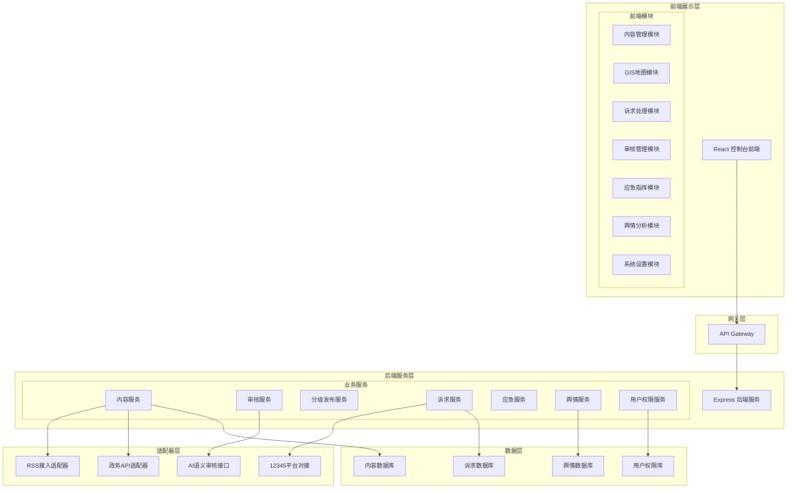
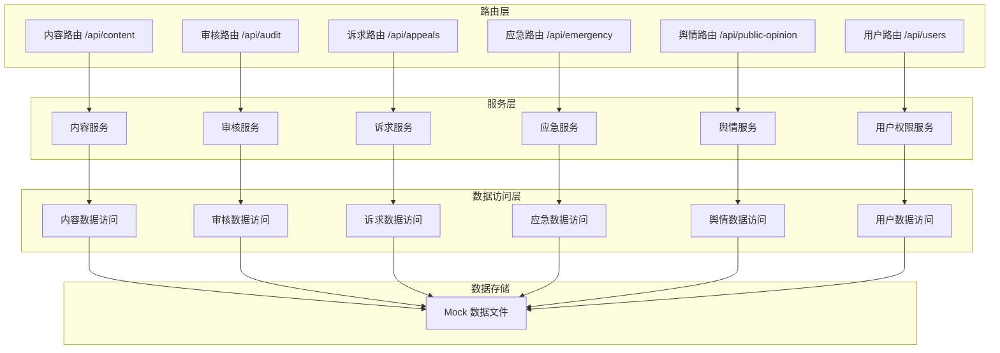
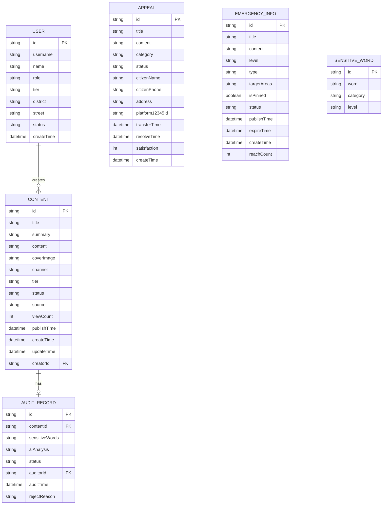

## 1. 架构设计



## 2. 技术描述

- **前端框架**：React@18 + TypeScript
- **构建工具**：Vite@5
- **样式方案**：TailwindCSS@3
- **状态管理**：Zustand
- **路由管理**：React Router DOM@6
- **图标库**：lucide-react
- **数据可视化**：ECharts@5 + echarts-for-react
- **地图组件**：ECharts GIS 地图
- **UI组件**：基于 TailwindCSS 自定义组件库
- **后端框架**：Express@4 + TypeScript
- **数据存储**：本地 JSON 模拟数据 + Mock 接口
- **HTTP客户端**：Axios

## 3. 路由定义

| 路由路径 | 页面名称 | 功能说明 |
|----------|----------|----------|
| /dashboard | 控制台首页 | 数据概览、应急横幅、快捷入口、舆情简报 |
| /content | 内容管理 | 多频道内容列表、内容发布编辑 |
| /content/publish | 内容发布 | 富文本编辑器、频道选择、分级设置 |
| /gis-map | GIS地图 | 公共服务地图、图层控制、详情弹窗 |
| /appeal | 市民诉求 | 诉求列表、诉求详情、转办操作 |
| /audit | 内容审核 | 待审列表、双轨审核结果、敏感词库 |
| /tiered | 分级发布 | 三级内容池管理、权限配置 |
| /emergency | 应急管理 | 应急发布、定向推送、应急列表 |
| /public-opinion | 舆情分析 | 热度仪表盘、传播溯源、热点追踪 |
| /settings | 系统设置 | 用户管理、角色权限、系统配置 |
| /settings/users | 用户管理 | 用户列表、角色分配 |
| /settings/roles | 角色权限 | 角色定义、权限配置 |

## 4. API 定义

### 4.1 内容相关接口

```typescript
// 内容项类型
interface ContentItem {
  id: string;
  title: string;
  summary: string;
  content: string;
  coverImage: string;
  channel: 'politics' | 'livelihood' | 'culture' | 'education';
  tier: 'city' | 'district' | 'street';
  status: 'draft' | 'pending' | 'published' | 'rejected';
  source: 'rss' | 'api' | 'manual';
  viewCount: number;
  publishTime: string;
  createTime: string;
  updateTime: string;
}

// 频道内容列表
GET /api/content?channel=&tier=&status=&page=&pageSize=
Response: { list: ContentItem[], total: number, page: number, pageSize: number }

// 内容详情
GET /api/content/:id
Response: ContentItem

// 创建内容
POST /api/content
Body: { title, summary, content, coverImage, channel, tier }
Response: ContentItem

// 更新内容
PUT /api/content/:id
Body: Partial<ContentItem>
Response: ContentItem

// 删除内容
DELETE /api/content/:id
Response: { success: boolean }
```

### 4.2 审核相关接口

```typescript
// 审核结果
interface AuditResult {
  contentId: string;
  sensitiveWords: { word: string; position: number; category: string }[];
  aiAnalysis: {
    score: number; // 0-100 风险分数
    level: 'safe' | 'warning' | 'danger';
    tags: string[];
    description: string;
  };
  status: 'pending' | 'passed' | 'rejected';
  auditor?: string;
  auditTime?: string;
  rejectReason?: string;
}

// 获取审核详情
GET /api/audit/:contentId
Response: AuditResult

// 提交审核
POST /api/audit/submit/:contentId
Response: AuditResult

// 人工审核
POST /api/audit/review/:contentId
Body: { status: 'passed' | 'rejected', reason?: string }
Response: AuditResult

// 敏感词库
interface SensitiveWord {
  id: string;
  word: string;
  category: string;
  level: 'low' | 'medium' | 'high';
}

GET /api/audit/sensitive-words
Response: SensitiveWord[]

POST /api/audit/sensitive-words
Body: { word, category, level }
Response: SensitiveWord
```

### 4.3 市民诉求接口

```typescript
interface Appeal {
  id: string;
  title: string;
  content: string;
  category: string;
  status: 'pending' | 'processing' | 'transferred' | 'resolved' | 'closed';
  citizenName: string;
  citizenPhone: string;
  address: string;
  platform12345Id?: string;
  transferTime?: string;
  resolveTime?: string;
  satisfaction?: number;
  createTime: string;
  logs: AppealLog[];
}

interface AppealLog {
  id: string;
  action: string;
  operator: string;
  remark: string;
  time: string;
}

GET /api/appeals?status=&page=&pageSize=
Response: { list: Appeal[], total: number }

GET /api/appeals/:id
Response: Appeal

POST /api/appeals
Body: { title, content, category, citizenName, citizenPhone, address }
Response: Appeal

POST /api/appeals/transfer/:id
Response: { success: boolean, platform12345Id: string }
```

### 4.4 应急信息接口

```typescript
interface EmergencyInfo {
  id: string;
  title: string;
  content: string;
  level: 'normal' | 'yellow' | 'orange' | 'red';
  type: string;
  targetAreas: string[];
  isPinned: boolean;
  status: 'draft' | 'published' | 'expired';
  publishTime?: string;
  expireTime?: string;
  createTime: string;
  reachCount: number;
}

GET /api/emergency?status=&page=&pageSize=
Response: { list: EmergencyInfo[], total: number }

POST /api/emergency
Body: { title, content, level, type, targetAreas, isPinned, expireTime }
Response: EmergencyInfo

PUT /api/emergency/:id
Body: Partial<EmergencyInfo>
Response: EmergencyInfo

POST /api/emergency/publish/:id
Response: { success: boolean }
```

### 4.5 舆情分析接口

```typescript
interface PublicOpinionSummary {
  heatIndex: number;
  trend: 'up' | 'down' | 'stable';
  hotTopics: { topic: string; heat: number; trend: number }[];
  totalMentions: number;
  positiveRate: number;
}

interface SpreadNode {
  id: string;
  name: string;
  type: 'source' | 'relay' | 'comment';
  value: number;
  x?: number;
  y?: number;
}

interface SpreadLink {
  source: string;
  target: string;
  value: number;
}

interface SpreadGraph {
  nodes: SpreadNode[];
  links: SpreadLink[];
}

GET /api/public-opinion/summary
Response: PublicOpinionSummary

GET /api/public-opinion/heat-trend?days=7
Response: { date: string; heat: number }[]

GET /api/public-opinion/spread-graph?topicId=
Response: SpreadGraph
```

### 4.6 用户权限接口

```typescript
interface User {
  id: string;
  username: string;
  name: string;
  role: string;
  tier: 'city' | 'district' | 'street';
  district?: string;
  street?: string;
  status: 'active' | 'disabled';
  createTime: string;
}

interface Role {
  id: string;
  name: string;
  code: string;
  description: string;
  permissions: string[];
}

GET /api/users?page=&pageSize=
Response: { list: User[], total: number }

POST /api/users
Body: { username, name, role, tier, district?, street? }
Response: User

GET /api/roles
Response: Role[]
```

## 5. 服务器架构图



## 6. 数据模型

### 6.1 数据模型定义



### 6.2 模拟数据说明

- 使用 JSON 文件存储所有模拟数据
- 数据文件位于 `api/data/` 目录下
- 每个模块有独立的数据文件
- 后端服务启动时加载数据到内存
- 提供 CRUD 操作的 Mock 实现
