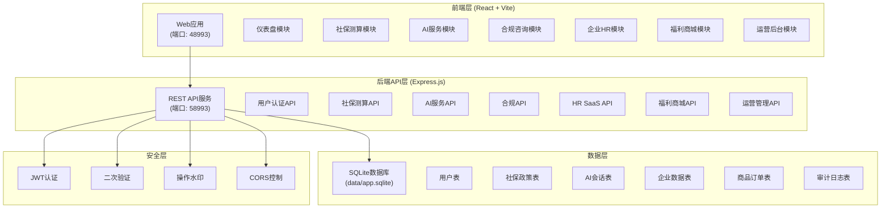
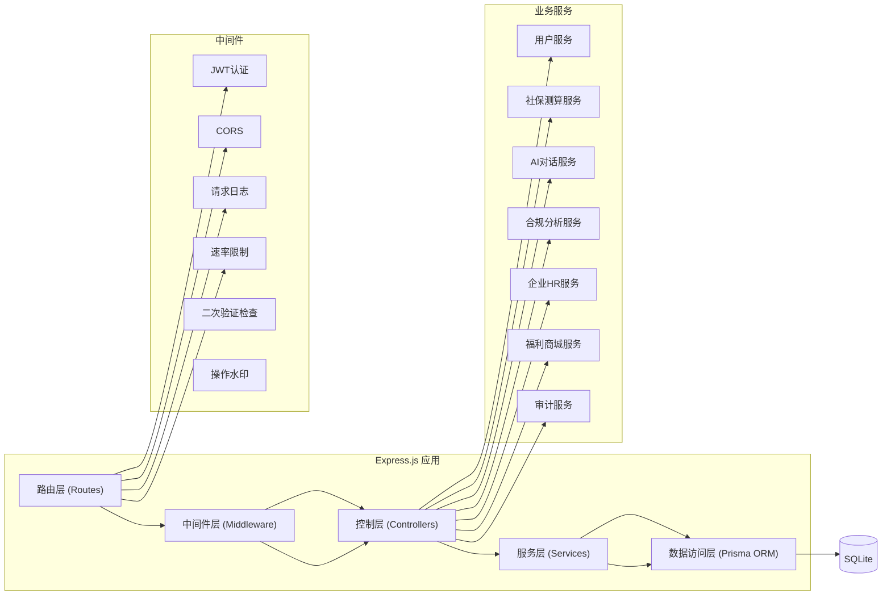
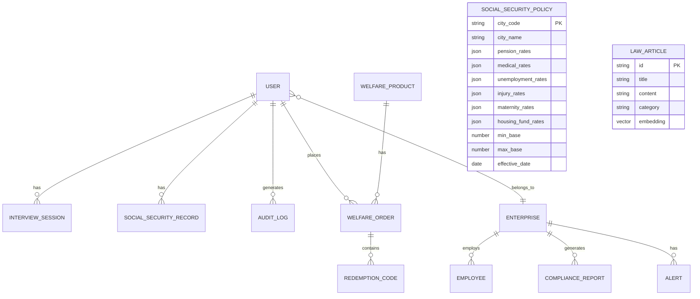

## 1. 架构设计



## 2. 技术说明

### 2.1 技术栈

| 层级 | 技术选型 | 版本 | 说明 |
|------|---------|------|------|
| 前端框架 | React | 18.x | 组件化开发，HMR热更新 |
| 构建工具 | Vite | 5.x | 快速开发构建，strictPort模式 |
| 样式方案 | TailwindCSS | 3.x | 原子化CSS，响应式设计 |
| 状态管理 | Zustand | 4.x | 轻量级状态管理 |
| 路由 | React Router | 6.x | 单页应用路由 |
| UI组件库 | Headless UI | 2.x | 无样式组件，可定制化 |
| 图表 | Recharts | 2.x | React图表库 |
| 后端框架 | Express.js | 4.x | Node.js Web框架 |
| 数据库 | SQLite3 | 5.x | 文件数据库，无需额外服务 |
| ORM | Prisma | 5.x | 类型安全的数据库访问 |
| 认证 | JWT | 9.x | JSON Web Token认证 |
| 文件上传 | Multer | 1.x | 文件上传处理 |

### 2.2 端口配置

根据项目目录 `may-88993`:
- tail4 = 8993
- FRONTEND_PORT = 48993
- BACKEND_PORT = 58993
- 备用槽位: 49993/59993, 50993/60993, ...

### 2.3 环境变量

`.env` 文件配置:
```
# 端口配置
FRONTEND_PORT=48993
BACKEND_PORT=58993

# 数据库
DATABASE_URL="file:./data/app.sqlite"

# JWT密钥
JWT_SECRET="your-secret-key-here"

# API地址
VITE_API_BASE_URL="http://127.0.0.1:58993/api"
```

## 3. 路由定义

### 3.1 前端路由

| 路由 | 页面 | 权限 |
|------|------|------|
| / | 首页仪表盘 | 登录用户 |
| /login | 登录页 | 公开 |
| /register | 注册页 | 公开 |
| /social-security | 社保测算 | 登录用户 |
| /ai-interview | AI模拟面试 | 登录用户 |
| /resume-optimize | 简历优化 | 登录用户 |
| /compliance | 合规咨询 | 登录用户 |
| /contract-scan | 合同扫描 | 登录用户 |
| /enterprise | 企业后台首页 | 企业管理员 |
| /enterprise/employees | 员工管理 | 企业管理员 |
| /enterprise/compliance | 合规巡检 | 企业管理员 |
| /mall | 福利商城 | 登录用户 |
| /mall/product/:id | 商品详情 | 登录用户 |
| /admin | 运营后台 | 运营人员 |
| /admin/audit | 审计日志 | 运营人员 |

### 3.2 后端API路由

| 路由 | 方法 | 说明 |
|------|------|------|
| /api/health | GET | 健康检查 |
| /api/auth/login | POST | 用户登录 |
| /api/auth/register | POST | 用户注册 |
| /api/auth/2fa/verify | POST | 二次验证 |
| /api/social-security/calculate | POST | 社保测算 |
| /api/social-security/policies | GET | 获取城市政策列表 |
| /api/ai/interview/start | POST | 开始面试会话 |
| /api/ai/interview/message | POST | 发送面试消息 |
| /api/ai/resume/analyze | POST | 简历分析优化 |
| /api/compliance/law/search | GET | 劳动法语义检索 |
| /api/compliance/contract/scan | POST | 合同风险扫描 |
| /api/enterprise/employees | GET/POST | 员工管理 |
| /api/enterprise/compliance/check | POST | 合规巡检 |
| /api/enterprise/alerts | GET | 社保异常预警 |
| /api/mall/products | GET | 商品列表 |
| /api/mall/orders | POST | 创建订单 |
| /api/mall/redeem | POST | 核销权益 |
| /api/admin/audit-logs | GET | 审计日志 |
| /api/admin/policies | POST | 政策配置 |

## 4. API定义

### 4.1 TypeScript类型定义

```typescript
// 用户相关
interface User {
  id: string;
  phone: string;
  email: string;
  name: string;
  role: 'user' | 'enterprise' | 'admin';
  enterpriseId?: string;
  socialSecurityBase?: number;
  resignationRisk?: 'low' | 'medium' | 'high';
  createdAt: Date;
}

// 社保测算
interface SocialSecurityCalculateRequest {
  cityCode: string;
  baseSalary: number;
  housingFundRatio: number;
}

interface SocialSecurityCalculateResponse {
  cityName: string;
  baseSalary: number;
  pension: { personal: number; company: number };
  medical: { personal: number; company: number };
  unemployment: { personal: number; company: number };
  injury: { company: number };
  maternity: { company: number };
  housingFund: { personal: number; company: number };
  totalPersonal: number;
  totalCompany: number;
  suggestions: string[];
}

// AI面试会话
interface InterviewSession {
  id: string;
  userId: string;
  position: string;
  messages: InterviewMessage[];
  status: 'active' | 'completed';
  score?: number;
  feedback?: string;
}

interface InterviewMessage {
  id: string;
  role: 'interviewer' | 'candidate';
  content: string;
  timestamp: Date;
}

// 企业数据
interface Enterprise {
  id: string;
  name: string;
  socialSecurityAccountStatus: 'active' | 'pending' | 'inactive';
  employeeCountThreshold: number;
  complianceScore: number;
  lastComplianceCheck?: Date;
}

// 福利商品
interface WelfareProduct {
  id: string;
  name: string;
  description: string;
  price: number;
  category: string;
  targetAudienceRules: string[];
  validityDays: number;
  autoExpire: boolean;
  stock: number;
}

// 审计日志
interface AuditLog {
  id: string;
  userId: string;
  action: string;
  resource: string;
  ip: string;
  userAgent: string;
  timestamp: Date;
  watermark: string;
  secondVerified: boolean;
}
```

## 5. 服务端架构图



## 6. 数据模型

### 6.1 ER图



### 6.2 DDL 语句

```sql
-- 用户表
CREATE TABLE User (
  id TEXT PRIMARY KEY,
  phone TEXT UNIQUE,
  email TEXT UNIQUE,
  name TEXT,
  password_hash TEXT NOT NULL,
  role TEXT NOT NULL DEFAULT 'user',
  enterprise_id TEXT,
  social_security_base REAL,
  resignation_risk TEXT DEFAULT 'low',
  two_factor_secret TEXT,
  created_at DATETIME DEFAULT CURRENT_TIMESTAMP,
  FOREIGN KEY (enterprise_id) REFERENCES Enterprise(id)
);

-- 企业表
CREATE TABLE Enterprise (
  id TEXT PRIMARY KEY,
  name TEXT NOT NULL,
  social_security_account_status TEXT NOT NULL DEFAULT 'pending',
  employee_count_threshold INTEGER DEFAULT 100,
  compliance_score REAL DEFAULT 100,
  last_compliance_check DATETIME,
  created_at DATETIME DEFAULT CURRENT_TIMESTAMP
);

-- 员工表
CREATE TABLE Employee (
  id TEXT PRIMARY KEY,
  enterprise_id TEXT NOT NULL,
  name TEXT NOT NULL,
  id_card TEXT UNIQUE,
  position TEXT,
  hire_date DATE,
  contract_expiry_date DATE,
  social_security_base REAL,
  social_security_status TEXT DEFAULT 'normal',
  resignation_risk_score REAL,
  created_at DATETIME DEFAULT CURRENT_TIMESTAMP,
  FOREIGN KEY (enterprise_id) REFERENCES Enterprise(id)
);

-- 社保测算记录表
CREATE TABLE SocialSecurityRecord (
  id TEXT PRIMARY KEY,
  user_id TEXT,
  employee_id TEXT,
  city_code TEXT NOT NULL,
  base_salary REAL NOT NULL,
  result_json TEXT NOT NULL,
  created_at DATETIME DEFAULT CURRENT_TIMESTAMP,
  FOREIGN KEY (user_id) REFERENCES User(id),
  FOREIGN KEY (employee_id) REFERENCES Employee(id)
);

-- 社保政策表
CREATE TABLE SocialSecurityPolicy (
  city_code TEXT PRIMARY KEY,
  city_name TEXT NOT NULL,
  pension_rates TEXT NOT NULL,
  medical_rates TEXT NOT NULL,
  unemployment_rates TEXT NOT NULL,
  injury_rates TEXT NOT NULL,
  maternity_rates TEXT NOT NULL,
  housing_fund_rates TEXT NOT NULL,
  min_base REAL NOT NULL,
  max_base REAL NOT NULL,
  effective_date DATE NOT NULL
);

-- AI面试会话表
CREATE TABLE InterviewSession (
  id TEXT PRIMARY KEY,
  user_id TEXT NOT NULL,
  position TEXT NOT NULL,
  status TEXT NOT NULL DEFAULT 'active',
  score REAL,
  feedback TEXT,
  created_at DATETIME DEFAULT CURRENT_TIMESTAMP,
  FOREIGN KEY (user_id) REFERENCES User(id)
);

-- AI面试消息表
CREATE TABLE InterviewMessage (
  id TEXT PRIMARY KEY,
  session_id TEXT NOT NULL,
  role TEXT NOT NULL,
  content TEXT NOT NULL,
  created_at DATETIME DEFAULT CURRENT_TIMESTAMP,
  FOREIGN KEY (session_id) REFERENCES InterviewSession(id)
);

-- 劳动法条文库
CREATE TABLE LawArticle (
  id TEXT PRIMARY KEY,
  title TEXT NOT NULL,
  content TEXT NOT NULL,
  category TEXT,
  embedding BLOB
);

-- 合同扫描记录表
CREATE TABLE ContractScan (
  id TEXT PRIMARY KEY,
  user_id TEXT,
  employee_id TEXT,
  file_name TEXT,
  ocr_result TEXT,
  risk_points TEXT,
  suggestions TEXT,
  created_at DATETIME DEFAULT CURRENT_TIMESTAMP,
  FOREIGN KEY (user_id) REFERENCES User(id),
  FOREIGN KEY (employee_id) REFERENCES Employee(id)
);

-- 福利商品表
CREATE TABLE WelfareProduct (
  id TEXT PRIMARY KEY,
  name TEXT NOT NULL,
  description TEXT,
  price REAL NOT NULL,
  category TEXT,
  target_audience_rules TEXT,
  validity_days INTEGER DEFAULT 365,
  auto_expire BOOLEAN DEFAULT 1,
  stock INTEGER DEFAULT 0,
  created_at DATETIME DEFAULT CURRENT_TIMESTAMP
);

-- 福利订单表
CREATE TABLE WelfareOrder (
  id TEXT PRIMARY KEY,
  user_id TEXT NOT NULL,
  product_id TEXT NOT NULL,
  quantity INTEGER NOT NULL DEFAULT 1,
  total_price REAL NOT NULL,
  status TEXT NOT NULL DEFAULT 'pending',
  created_at DATETIME DEFAULT CURRENT_TIMESTAMP,
  FOREIGN KEY (user_id) REFERENCES User(id),
  FOREIGN KEY (product_id) REFERENCES WelfareProduct(id)
);

-- 核销码表
CREATE TABLE RedemptionCode (
  id TEXT PRIMARY KEY,
  code TEXT UNIQUE NOT NULL,
  order_id TEXT NOT NULL,
  product_id TEXT NOT NULL,
  user_id TEXT NOT NULL,
  status TEXT NOT NULL DEFAULT 'active',
  redeemed_at DATETIME,
  expire_at DATETIME NOT NULL,
  FOREIGN KEY (order_id) REFERENCES WelfareOrder(id),
  FOREIGN KEY (product_id) REFERENCES WelfareProduct(id),
  FOREIGN KEY (user_id) REFERENCES User(id)
);

-- 合规巡检报告表
CREATE TABLE ComplianceReport (
  id TEXT PRIMARY KEY,
  enterprise_id TEXT NOT NULL,
  report_type TEXT NOT NULL,
  score REAL,
  findings TEXT,
  recommendations TEXT,
  created_at DATETIME DEFAULT CURRENT_TIMESTAMP,
  FOREIGN KEY (enterprise_id) REFERENCES Enterprise(id)
);

-- 预警表
CREATE TABLE Alert (
  id TEXT PRIMARY KEY,
  enterprise_id TEXT,
  employee_id TEXT,
  alert_type TEXT NOT NULL,
  severity TEXT NOT NULL,
  message TEXT NOT NULL,
  is_read BOOLEAN DEFAULT 0,
  created_at DATETIME DEFAULT CURRENT_TIMESTAMP,
  FOREIGN KEY (enterprise_id) REFERENCES Enterprise(id),
  FOREIGN KEY (employee_id) REFERENCES Employee(id)
);

-- 审计日志表
CREATE TABLE AuditLog (
  id TEXT PRIMARY KEY,
  user_id TEXT NOT NULL,
  action TEXT NOT NULL,
  resource TEXT NOT NULL,
  ip TEXT,
  user_agent TEXT,
  watermark TEXT,
  second_verified BOOLEAN DEFAULT 0,
  created_at DATETIME DEFAULT CURRENT_TIMESTAMP,
  FOREIGN KEY (user_id) REFERENCES User(id)
);
```

## 7. 启动与部署

### 7.1 启动命令

```bash
# 安装依赖
npm install
cd frontend && npm install && cd ..

# 数据库初始化
npx prisma generate
npx prisma db push

# 启动后端 (后台运行)
cd backend && npm run start > ../backend.log 2>&1 &

# 启动前端 (后台运行)
cd frontend && npm run dev > ../frontend.log 2>&1 &
```

### 7.2 端口检查脚本

```bash
#!/bin/bash
PROJECT_DIR="$(pwd)"
FRONTEND_PORT=48993
BACKEND_PORT=58993

# 检查端口占用
check_port() {
  local port=$1
  local pid=$(lsof -nP -iTCP:$port -sTCP:LISTEN -t | head -n1)
  if [ -n "$pid" ]; then
    local cwd=$(ps -o cwd= -p "$pid" | xargs)
    local cmd=$(ps -o command= -p "$pid")
    case "$cwd" in
      "$PROJECT_DIR"*)
        echo "Port $port used by current project, killing PID $pid"
        kill "$pid"
        sleep 2
        ;;
      *)
        echo "Port $port used by other project, switching to backup port"
        return 1
        ;;
    esac
  fi
  return 0
}

# 尝试主端口和备用端口
SLOT=0
BASE_SLOTS=(0 1000 2000 3000 4000 5000)
for slot in "${BASE_SLOTS[@]}"; do
  FP=$((40000 + slot + 8993))
  BP=$((50000 + slot + 8993))
  if check_port $FP && check_port $BP; then
    FRONTEND_PORT=$FP
    BACKEND_PORT=$BP
    SLOT=$slot
    break
  fi
done

# 更新.env
echo "FRONTEND_PORT=$FRONTEND_PORT" > .env
echo "BACKEND_PORT=$BACKEND_PORT" >> .env
echo "VITE_API_BASE_URL=http://127.0.0.1:$BACKEND_PORT/api" >> .env
```

### 7.3 健康检查

```bash
# 检查前端
curl -I --max-time 5 http://127.0.0.1:48993/

# 检查后端
curl -sS --max-time 5 http://127.0.0.1:58993/api/health
```
