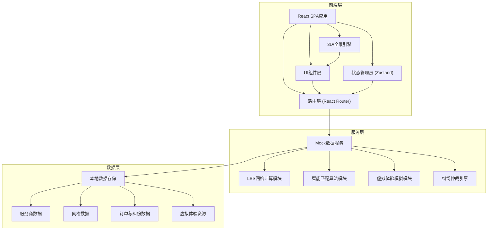
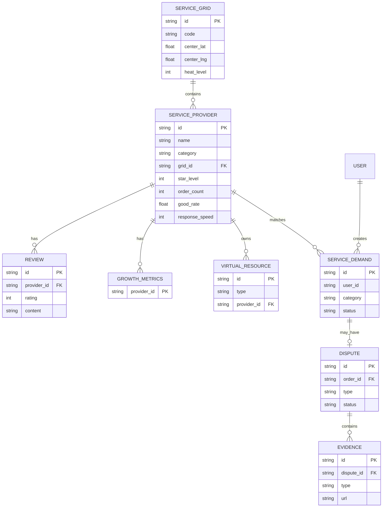

## 1. 架构设计



## 2. 技术说明

- **前端框架**：React@18 + TypeScript@5
- **构建工具**：Vite@5
- **样式方案**：TailwindCSS@3 + CSS Variables
- **路由**：React Router@6
- **状态管理**：Zustand@4
- **图表可视化**：Recharts@2（成长数据看板）
- **3D/全景引擎**：Three.js@0.160 + @react-three/fiber@8 + @react-three/drei@9（VR看房/360°探店）
- **UI组件库**：自研（无第三方UI库，定制化组件）
- **图标**：Lucide React
- **动效**：Framer Motion@11
- **后端**：无，全部使用Mock数据模拟
- **数据存储**：LocalStorage + TypeScript静态数据

## 3. 路由定义

| 路由 | 用途 |
|-------|------|
| / | 首页（城市定位、服务导航、智能需求发布、虚拟体验入口） |
| /grid | LBS服务网格化管理 |
| /experience/ar | AR试衣间 |
| /experience/vr | VR看房列表 |
| /experience/vr/:id | VR看房全景 |
| /experience/shop | 360°美食探店 |
| /demand | 服务需求发布大厅 |
| /demand/result | 智能匹配结果 |
| /growth | 服务商成长体系 |
| /dispute | 纠纷仲裁中心 |

## 4. 类型定义

```typescript
interface GeoPoint {
  lat: number;
  lng: number;
}

interface ServiceGrid {
  id: string;
  code: string;
  center: GeoPoint;
  bounds: [number, number, number, number];
  category: ('餐饮' | '家政' | '维修' | '快递' | '保洁' | '搬家' | '美容' | '教育';
  providerIds: string[];
  heatLevel: number;
}

interface ServiceProvider {
  id: string;
  name: string;
  avatar: string;
  category: string;
  gridId: string;
  location: GeoPoint;
  starLevel: 1 | 2 | 3 | 4 | 5;
  orderCount: number;
  goodRate: number;
  responseSpeed: number;
  trafficWeight: number;
  description: string;
  reviews: Review[];
}

interface Review {
  id: string;
  userId: string;
  rating: number;
  content: string;
  date: string;
  tags: string[];
}

interface ServiceDemand {
  id: string;
  userId: string;
  category: string;
  description: string;
  location: GeoPoint;
  expectedTime: string;
  status: 'pending' | 'matched' | 'completed';
  matchedProviders: string[];
}

interface Dispute {
  id: string;
  orderId: string;
  type: 'service_quality' | 'delay' | 'overcharge' | 'damage';
  description: string;
  evidences: Evidence[];
  status: 'submitted' | 'reviewing' | 'resolved';
  compensationStandard: string;
  result: string;
}

interface Evidence {
  id: string;
  type: 'image' | 'video';
  url: string;
}

interface VirtualResource {
  id: string;
  type: 'ar_clothing' | 'vr_house' | 'shop_360';
  title: string;
  thumbnail: string;
  resourceUrl: string;
  providerId: string;
}

interface GrowthMetrics {
  providerId: string;
  orderTrend: { date: string; value: number }[];
  rateTrend: { date: string; value: number }[];
  speedTrend: { date: string; value: number }[];
  radar: { dimension: string; value: number }[];
}
```

## 5. 核心模块算法

### 5.1 LBS网格计算

- 地球经纬度转网格编码（Geohash简化版）：
  - 基于中心点经纬度，500米边长计算
  - 网格编码：`{lat-500m-{latIdx}_{lngIdx}`

### 5.2 智能匹配算法

- 距离：Haversine公式计算3公里范围
- 排序权重：星级(40%) + 好评率(30%) + 响应速度(20%) + 距离(10%)

### 5.3 星级成长体系

| 星级 | 接单量 | 好评率 | 响应速度 | 流量权重 |
|------|--------|--------|----------|----------|
| 1星 | ≥50 | ≥80% | ≤60min | 0.6 |
| 2星 | ≥200 | ≥85% | ≤45min | 0.8 |
| 3星 | ≥500 | ≥90% | ≤30min | 1.0 |
| 4星 | ≥1000 | ≥93% | ≤20min | 1.3 |
| 5星 | ≥2000 | ≥96% | ≤10min | 1.8 |

### 5.4 赔偿标准匹配

| 纠纷类型 | 赔偿比例 | 上限金额 |
|---------|---------|---------|
| 服务质量 | 30%-100% | ¥2000 |
| 服务延误 | 每延误1小时赔10% | ¥500 |
| 乱收费 | 退还超额+20% | ¥1000 |
| 物品损坏 | 定损金额 | ¥5000 |

## 6. 数据模型（ER图）



## 7. 目录结构

```
src/
├── assets/          # 静态资源
├── components/    # 公共组件
│   ├── ui/         # 基础UI组件
│   ├── grid/       # LBS网格组件
│   ├── experience/   # 虚拟体验组件
│   ├── demand/       # 需求匹配组件
│   ├── growth/       # 成长体系组件
│   └── dispute/      # 纠纷仲裁组件
├── data/          # Mock数据
├── hooks/         # 自定义Hooks
├── pages/         # 页面组件
├── store/         # Zustand状态
├── types/         # TypeScript类型
├── utils/         # 工具函数（网格计算、匹配算法等）
├── App.tsx
├── main.tsx
└── index.css
```
