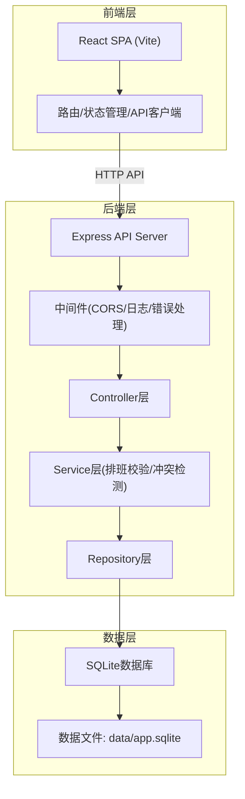
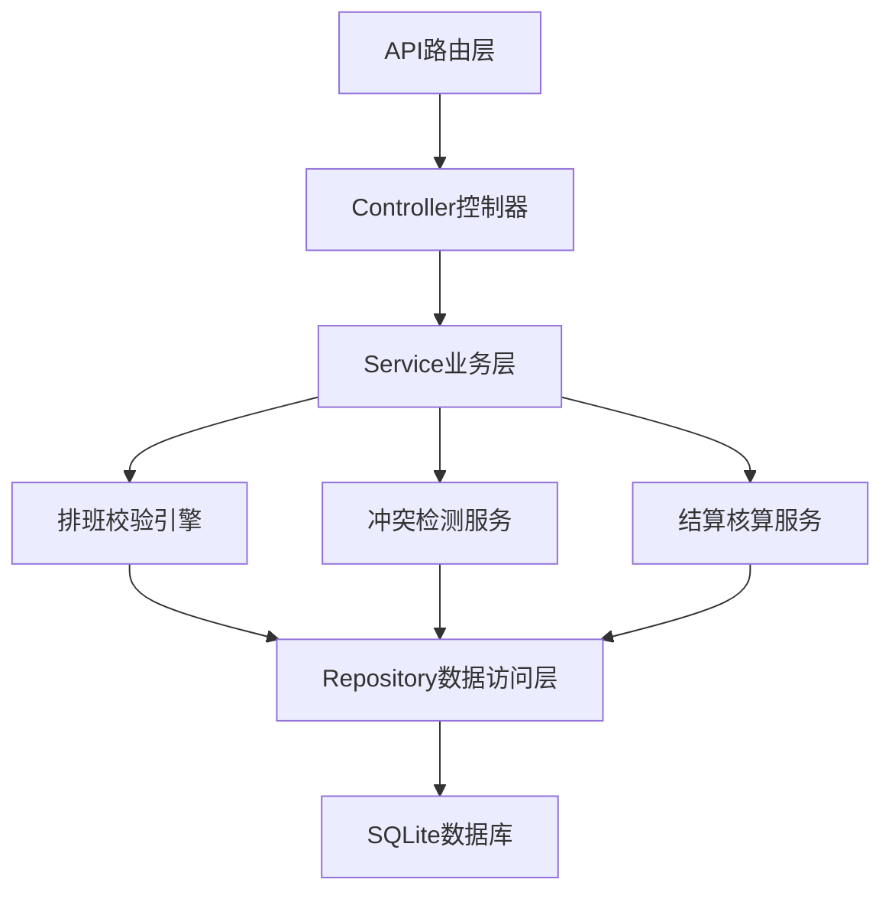
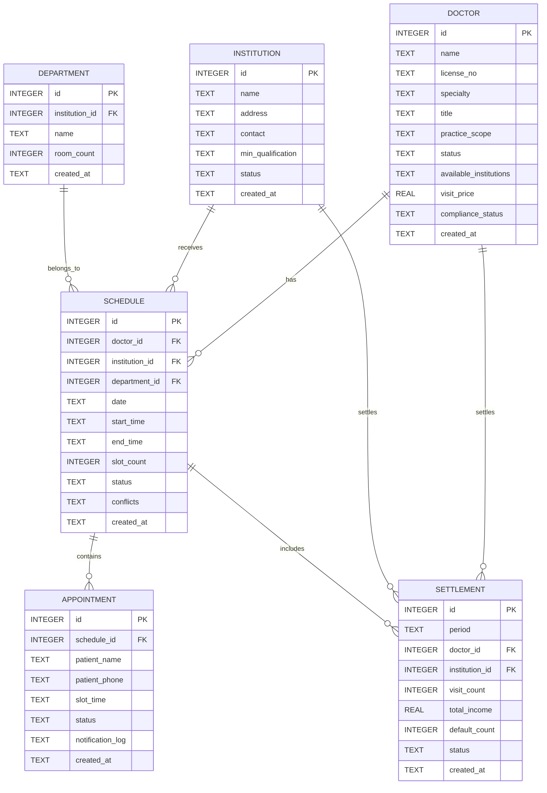

## 1. 架构设计



## 2. 技术描述

- **前端**: React 18 + TypeScript + Vite + React Router + Zustand + Tailwind CSS 3 + lucide-react
- **后端**: Express 4 + TypeScript + better-sqlite3 + cors
- **数据库**: SQLite (文件数据库, 无外部依赖)
- **构建工具**: Vite for frontend, ts-node for backend
- **包管理**: npm

### 技术选型说明
1. **SQLite**: 业务数据主要为结构化关系型数据，量级适中，SQLite 可满足全链路快速打通，无需额外安装数据库服务
2. **无外部服务依赖**: 不使用 Redis、消息队列、对象存储等，所有功能在单体应用内实现

## 3. 路由定义

| 路由路径 | 页面 | 说明 |
|----------|------|------|
| `/` | 仪表盘 | 运营数据总览 |
| `/doctors` | 医生列表 | 医生档案管理 |
| `/doctors/:id` | 医生详情 | 医生资质、出诊设置 |
| `/institutions` | 机构列表 | 合作机构管理 |
| `/scheduling` | 排班计划 | 日历视图、排班生成 |
| `/appointments` | 号源管理 | 号源展示、预约记录 |
| `/settlement` | 结算报表 | 收入核算、违约统计 |

## 4. API 定义

### 基础路径
`http://127.0.0.1:53460/api`

### 类型定义
```typescript
interface Doctor {
  id: number;
  name: string;
  licenseNo: string;
  specialty: string;
  title: string;
  practiceScope: string;
  status: 'active' | 'pending' | 'suspended';
  availableInstitutions: number[];
  visitPrice: number;
  createdAt: string;
}

interface Institution {
  id: number;
  name: string;
  departments: Department[];
  address: string;
  contact: string;
  minQualification: string;
  status: 'active' | 'inactive';
}

interface Schedule {
  id: number;
  doctorId: number;
  institutionId: number;
  departmentId: number;
  date: string;
  startTime: string;
  endTime: string;
  slotCount: number;
  status: 'draft' | 'confirmed' | 'cancelled' | 'completed';
  conflicts: ConflictItem[];
}

interface Appointment {
  id: number;
  scheduleId: number;
  patientName: string;
  patientPhone: string;
  slotTime: string;
  status: 'scheduled' | 'completed' | 'cancelled' | 'no_show';
  createdAt: string;
}

interface Settlement {
  id: number;
  period: string;
  doctorId: number;
  institutionId: number;
  visitCount: number;
  totalIncome: number;
  defaultCount: number;
  status: 'pending' | 'settled';
}

interface ConflictItem {
  type: 'hospital_shift' | 'cross_institution' | 'practice_scope' | 'rest_time';
  severity: 'warning' | 'error';
  message: string;
}
```

### API 端点
| 方法 | 路径 | 说明 |
|------|------|------|
| GET | `/health` | 健康检查 |
| GET | `/doctors` | 获取医生列表 |
| POST | `/doctors` | 新增医生 |
| GET | `/doctors/:id` | 获取医生详情 |
| PUT | `/doctors/:id` | 更新医生 |
| GET | `/institutions` | 获取机构列表 |
| POST | `/institutions` | 新增机构 |
| GET | `/schedules` | 获取排班列表 |
| POST | `/schedules` | 创建排班（含冲突检测） |
| POST | `/schedules/validate` | 排班校验 |
| GET | `/appointments` | 获取预约列表 |
| POST | `/appointments` | 创建预约 |
| GET | `/appointments/slots/:scheduleId` | 获取号源 |
| GET | `/settlements` | 获取结算报表 |
| GET | `/settlements/export` | 导出报表 |

## 5. 服务端架构图



## 6. 数据模型

### 6.1 ER 图



### 6.2 DDL 语句

```sql
-- 医生表
CREATE TABLE IF NOT EXISTS doctors (
    id INTEGER PRIMARY KEY AUTOINCREMENT,
    name TEXT NOT NULL,
    license_no TEXT UNIQUE NOT NULL,
    specialty TEXT NOT NULL,
    title TEXT NOT NULL,
    practice_scope TEXT NOT NULL,
    status TEXT DEFAULT 'pending',
    available_institutions TEXT,
    visit_price REAL DEFAULT 0,
    compliance_status TEXT DEFAULT 'pending',
    practice_cert_expiry TEXT,
    created_at TEXT DEFAULT CURRENT_TIMESTAMP
);

-- 机构表
CREATE TABLE IF NOT EXISTS institutions (
    id INTEGER PRIMARY KEY AUTOINCREMENT,
    name TEXT NOT NULL,
    address TEXT,
    contact TEXT,
    min_qualification TEXT DEFAULT '主治医师',
    status TEXT DEFAULT 'active',
    created_at TEXT DEFAULT CURRENT_TIMESTAMP
);

-- 科室表
CREATE TABLE IF NOT EXISTS departments (
    id INTEGER PRIMARY KEY AUTOINCREMENT,
    institution_id INTEGER NOT NULL,
    name TEXT NOT NULL,
    room_count INTEGER DEFAULT 1,
    created_at TEXT DEFAULT CURRENT_TIMESTAMP,
    FOREIGN KEY (institution_id) REFERENCES institutions(id)
);

-- 排班表
CREATE TABLE IF NOT EXISTS schedules (
    id INTEGER PRIMARY KEY AUTOINCREMENT,
    doctor_id INTEGER NOT NULL,
    institution_id INTEGER NOT NULL,
    department_id INTEGER NOT NULL,
    date TEXT NOT NULL,
    start_time TEXT NOT NULL,
    end_time TEXT NOT NULL,
    slot_count INTEGER DEFAULT 20,
    status TEXT DEFAULT 'draft',
    conflicts TEXT,
    is_hospital_shift INTEGER DEFAULT 0,
    created_at TEXT DEFAULT CURRENT_TIMESTAMP,
    FOREIGN KEY (doctor_id) REFERENCES doctors(id),
    FOREIGN KEY (institution_id) REFERENCES institutions(id),
    FOREIGN KEY (department_id) REFERENCES departments(id)
);

-- 预约表
CREATE TABLE IF NOT EXISTS appointments (
    id INTEGER PRIMARY KEY AUTOINCREMENT,
    schedule_id INTEGER NOT NULL,
    patient_name TEXT NOT NULL,
    patient_phone TEXT NOT NULL,
    slot_time TEXT NOT NULL,
    status TEXT DEFAULT 'scheduled',
    rescheduled_from INTEGER,
    notification_log TEXT,
    created_at TEXT DEFAULT CURRENT_TIMESTAMP,
    FOREIGN KEY (schedule_id) REFERENCES schedules(id)
);

-- 结算表
CREATE TABLE IF NOT EXISTS settlements (
    id INTEGER PRIMARY KEY AUTOINCREMENT,
    period TEXT NOT NULL,
    doctor_id INTEGER NOT NULL,
    institution_id INTEGER NOT NULL,
    visit_count INTEGER DEFAULT 0,
    total_income REAL DEFAULT 0,
    default_count INTEGER DEFAULT 0,
    status TEXT DEFAULT 'pending',
    created_at TEXT DEFAULT CURRENT_TIMESTAMP,
    FOREIGN KEY (doctor_id) REFERENCES doctors(id),
    FOREIGN KEY (institution_id) REFERENCES institutions(id)
);

-- 操作日志表
CREATE TABLE IF NOT EXISTS audit_logs (
    id INTEGER PRIMARY KEY AUTOINCREMENT,
    entity_type TEXT NOT NULL,
    entity_id INTEGER NOT NULL,
    action TEXT NOT NULL,
    old_value TEXT,
    new_value TEXT,
    operator TEXT DEFAULT 'system',
    created_at TEXT DEFAULT CURRENT_TIMESTAMP
);

-- 索引
CREATE INDEX IF NOT EXISTS idx_schedules_doctor_date ON schedules(doctor_id, date);
CREATE INDEX IF NOT EXISTS idx_schedules_institution_date ON schedules(institution_id, date);
CREATE INDEX IF NOT EXISTS idx_appointments_schedule ON appointments(schedule_id);
```
