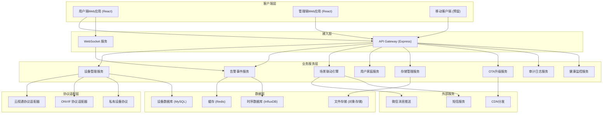
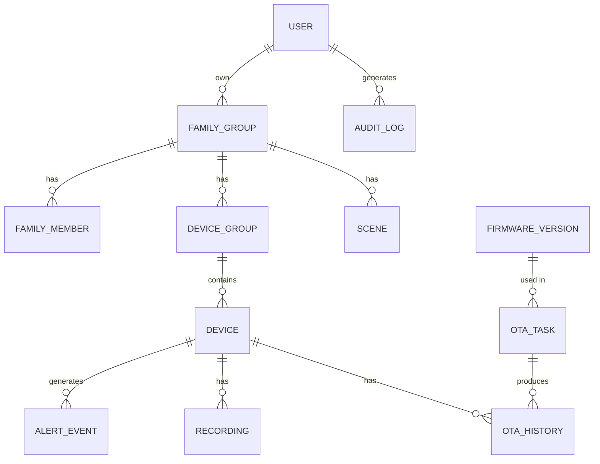

## 1. 架构设计



## 2. 技术描述

### 2.1 整体技术栈

| 层级 | 技术选型 | 版本 | 说明 |
|------|----------|------|------|
| 前端框架 | React | 18.2.0 | 使用函数组件 + Hooks |
| 构建工具 | Vite | 5.0.0 | 快速开发构建 |
| 语言 | TypeScript | 5.3.0 | 类型安全 |
| UI 组件库 | Ant Design | 5.12.0 | 企业级组件库 |
| 状态管理 | Zustand | 4.4.0 | 轻量级状态管理 |
| 路由 | React Router | 6.20.0 | 单页路由 |
| HTTP 客户端 | Axios | 1.6.0 | API 请求 |
| WebSocket | 原生 + 重连机制 | - | 实时消息推送 |
| 图表库 | ECharts | 5.4.0 | 数据可视化 |
| 样式方案 | Tailwind CSS | 3.3.0 | 原子化 CSS |
| 后端框架 | Express | 4.18.0 | Node.js Web 框架 |
| 后端语言 | TypeScript | 5.3.0 | 类型安全 |
| WebSocket 服务 | ws | 8.16.0 | WebSocket 服务端 |

### 2.2 目录结构

```
project/
├── server/                         # 后端服务
│   ├── src/
│   │   ├── index.ts               # 服务入口
│   │   ├── types/                 # 类型定义
│   │   ├── data/                  # Mock 数据
│   │   └── routes/                # API 路由
│   ├── package.json
│   └── tsconfig.json
├── web-user/                       # 用户端 Web 应用
│   ├── src/
│   │   ├── main.tsx
│   │   ├── App.tsx
│   │   ├── pages/                 # 页面组件
│   │   ├── components/            # 公共组件
│   │   ├── stores/                # 状态管理
│   │   ├── services/              # API 服务
│   │   ├── types/                 # 类型定义
│   │   └── utils/                 # 工具函数
│   ├── index.html
│   ├── package.json
│   ├── vite.config.ts
│   └── tsconfig.json
├── web-admin/                      # 管理端 Web 应用
│   ├── src/
│   │   ├── main.tsx
│   │   ├── App.tsx
│   │   ├── pages/
│   │   ├── components/
│   │   ├── stores/
│   │   ├── services/
│   │   └── types/
│   ├── index.html
│   ├── package.json
│   ├── vite.config.ts
│   └── tsconfig.json
└── .trae/
    └── documents/
        ├── PRD.md
        └── TechnicalArchitecture.md
```

## 3. 路由定义

### 3.1 用户端路由 (`/web-user`)

| 路由 | 页面 | 说明 |
|------|------|------|
| / | 设备列表页 | 首页，展示所有设备卡片 |
| /device/:id | 设备详情页 | 实时视频、云台控制、隐私设置 |
| /device/:id/playback | 录像回放页 | 时间轴录像回放 |
| /alerts | 告警中心 | 告警列表、筛选、详情 |
| /scenes | 场景联动 | 场景列表、创建编辑 |
| /family | 家庭管理 | 成员列表、邀请、权限 |
| /storage | 存储服务 | 套餐管理、SD卡管理 |
| /settings | 系统设置 | 个人信息、关于 |

### 3.2 管理端路由 (`/web-admin`)

| 路由 | 页面 | 说明 |
|------|------|------|
| / | 健康概览 | 设备健康数据看板 |
| /health/:deviceId | 设备健康详情 | 单设备健康分析 |
| /audit | 审计日志 | 用户操作审计记录 |
| /ota/firmwares | 固件管理 | 固件版本列表 |
| /ota/tasks | 发布任务 | OTA发布任务管理 |
| /ota/tasks/create | 创建任务 | 新建OTA发布任务 |

## 4. API 定义

### 4.1 设备管理 API

```typescript
// GET /api/devices
interface DeviceListResponse {
  code: number;
  data: Device[];
}

// GET /api/devices/:id
interface DeviceDetailResponse {
  code: number;
  data: Device;
}

// PUT /api/devices/:id/privacy
interface PrivacyControlRequest {
  cameraEnabled?: boolean;
  audioEnabled?: boolean;
  physicalLock?: boolean;
}

// POST /api/devices/bind
interface DeviceBindRequest {
  deviceId: string;
  wifiSsid: string;
  wifiPassword: string;
}
```

### 4.2 告警事件 API

```typescript
// GET /api/alerts
interface AlertListResponse {
  code: number;
  data: {
    list: AlertEvent[];
    total: number;
    page: number;
    pageSize: number;
  };
}

// PUT /api/alerts/:id/lock
// 锁定/解锁重要事件

// PUT /api/alerts/read
// 批量标记已读
```

### 4.3 场景联动 API

```typescript
// GET /api/scenes
interface SceneListResponse {
  code: number;
  data: Scene[];
}

// PUT /api/scenes/:id/toggle
// 启用/禁用场景

// POST /api/scenes/:id/trigger
// 手动触发场景
```

### 4.4 OTA 管理 API

```typescript
// GET /api/ota/firmwares
interface FirmwareListResponse {
  code: number;
  data: FirmwareVersion[];
}

// POST /api/ota/tasks
interface CreateOTATaskRequest {
  firmwareId: string;
  strategy: 'all' | 'region' | 'model' | 'manual';
  regions: string[];
  models: string[];
}
```

## 5. 数据模型

### 5.1 ER 图



### 5.2 核心数据结构

```typescript
// 设备
interface Device {
  id: string;
  name: string;
  type: 'IPC' | 'NVR' | 'doorbell';
  model: string;
  firmwareVersion: string;
  status: 'online' | 'offline' | 'upgrading';
  groupId: string;
  storage: {
    total: number;
    used: number;
    sdCard: boolean;
  };
  privacy: {
    cameraEnabled: boolean;
    audioEnabled: boolean;
    physicalLock: boolean;
  };
  signalStrength: number;
}

// 告警事件
interface AlertEvent {
  id: string;
  deviceId: string;
  type: 'motion' | 'sound' | 'occlusion' | 'person' | 'low_storage';
  level: 'info' | 'warning' | 'critical';
  timestamp: string;
  thumbnail?: string;
  videoUrl?: string;
  read: boolean;
  locked: boolean;
}

// 场景
interface Scene {
  id: string;
  name: string;
  enabled: boolean;
  trigger: {
    type: 'person_detect' | 'motion' | 'schedule' | 'manual';
    deviceIds: string[];
    condition?: any;
  };
  actions: SceneAction[];
}

// 固件版本
interface FirmwareVersion {
  id: string;
  version: string;
  model: string;
  releaseDate: string;
  releaseNotes: string;
  status: 'testing' | 'gray' | 'full' | 'recalled';
  grayRegions: string[];
  grayPercentage: number;
}

// OTA任务
interface OTATask {
  id: string;
  firmwareId: string;
  version: string;
  status: 'pending' | 'running' | 'completed' | 'failed';
  totalDevices: number;
  successDevices: number;
  failedDevices: number;
  strategy: 'all' | 'region' | 'model' | 'manual';
  regions: string[];
  models: string[];
}

// 审计日志
interface AuditLog {
  id: string;
  userId: string;
  userName: string;
  action: string;
  deviceId?: string;
  deviceName?: string;
  ip: string;
  timestamp: string;
  details: string;
}
```

## 6. 关键技术方案

### 6.1 WebSocket 实时通信

- 后端使用 `ws` 库实现 WebSocket 服务
- 前端实现自动重连机制（指数退避算法）
- 心跳机制保持连接活跃（30秒间隔）
- 用于实时告警推送、设备状态变更通知

### 6.2 隐私保护机制

- 隐私控制指令使用 AES-256 端到端加密
- 物理锁定指令写入设备安全芯片，无法通过软件绕过
- 所有隐私操作记录审计日志，不可删除

### 6.3 存储分级方案

- 7天云存储：低成本对象存储，自动循环删除
- 重要事件加锁：独立存储池，永久保留直到手动删除
- SD卡录像：本地优先存储，支持远程访问和下载

### 6.4 OTA 灰度发布

- 支持按地域、设备型号、自定义设备列表选择
- 分阶段发布策略：10% → 30% → 50% → 100%
- 失败率监控：超过阈值自动暂停并告警
- 支持一键回滚到上一版本

## 7. 开发规范

### 7.1 命名规范

- 组件名：大驼峰 `DeviceCard.tsx`
- 工具函数：小驼峰 `formatDate.ts`
- 常量：全大写下划线 `API_BASE_URL`
- 类型：后缀 `Type` 或 `I` 前缀

### 7.2 代码规范

- 使用 ESLint + Prettier 统一代码风格
- 组件遵循单一职责原则
- API 请求统一封装，添加请求/响应拦截器
- 错误边界处理，避免页面崩溃
