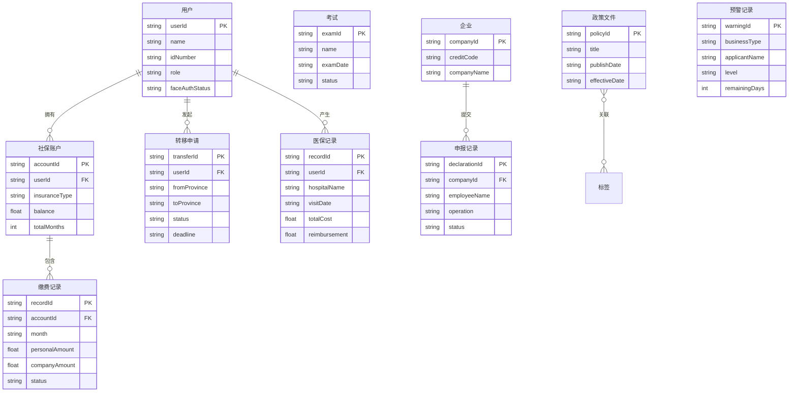

## 1. 架构设计

```mermaid
graph TB
    subgraph "前端层"
        "React SPA" --> "路由管理"
        "React SPA" --> "状态管理"
        "React SPA" --> "UI组件库"
    end
    subgraph "数据层"
        "Mock数据服务" --> "五险一金数据"
        "Mock数据服务" --> "医保就医数据"
        "Mock数据服务" --> "考试报名数据"
        "Mock数据服务" --> "企业管理数据"
        "Mock数据服务" --> "预警标签数据"
    end
    subgraph "外部服务（Mock模拟）"
        "金保工程核心数据库"
        "公安人口库"
        "区块链存证服务"
        "NFC闪付模块"
    end
    "前端层" --> "数据层"
    "数据层" --> "外部服务（Mock模拟）"
```

## 2. 技术说明

- **前端**：React@18 + TypeScript + TailwindCSS@3 + Vite
- **初始化工具**：Vite (react-ts template)
- **路由**：React Router@6
- **状态管理**：Zustand（轻量级，适合本平台数据流）
- **图表**：Recharts（社保缴费图表、数据看板）
- **动画**：Framer Motion（页面过渡、卡片交互、进度动画）
- **后端**：无独立后端，使用 Mock 数据模拟金保工程接口
- **数据库**：无，前端内置 Mock 数据集
- **接口规范**：所有 Mock 接口遵循《国家政务服务平台接口规范》数据结构

## 3. 路由定义

| 路由 | 用途 |
|------|------|
| `/` | 首页，平台入口、快捷导航、通知公告、数据看板 |
| `/personal` | 个人服务大厅，五险一金、医保、考试、电子社保卡 |
| `/personal/social-insurance` | 社保详情页，缴费明细、账户余额、转移进度 |
| `/personal/medical` | 医保就医记录页，就诊记录、药品目录、报销比例 |
| `/personal/exam` | 人事考试页，考试列表、报名、准考证 |
| `/personal/essc` | 电子社保卡页，卡面、申领、NFC闪付 |
| `/enterprise` | 企业服务大厅，参保增减员、失业金、电子合同 |
| `/enterprise/insurance-declaration` | 参保增减员申报页，批量导入、申报进度 |
| `/enterprise/unemployment` | 失业金申领预审页 |
| `/enterprise/e-contract` | 电子合同存证页 |
| `/admin` | 后台管理中心，超时预警、政策标签、实名认证 |
| `/admin/timeout-warning` | 超时预警督办页 |
| `/admin/policy-tags` | 政策智能标签页 |
| `/admin/identity-audit` | 实名认证审核页 |

## 4. API定义（Mock接口）

所有接口遵循《国家政务服务平台接口规范》统一响应结构：

```typescript
interface ApiResponse<T> {
  code: string
  message: string
  data: T
  requestId: string
  timestamp: number
}

interface SocialInsuranceDetail {
  insuranceType: "pension" | "medical" | "unemployment" | "injury" | "maternity"
  personalMonthly: number
  companyMonthly: number
  totalMonths: number
  accountBalance: number
  monthlyRecords: MonthlyRecord[]
}

interface MonthlyRecord {
  month: string
  base: number
  personalAmount: number
  companyAmount: number
  status: "paid" | "unpaid" | "adjusting"
}

interface TransferProgress {
  transferId: string
  fromProvince: string
  toProvince: string
  status: "pending" | "processing" | "timeout" | "completed"
  steps: TransferStep[]
  createdAt: string
  deadline: string
}

interface TransferStep {
  name: string
  status: "done" | "current" | "pending" | "timeout"
  completedAt?: string
  description: string
}

interface MedicalRecord {
  recordId: string
  hospitalName: string
  department: string
  visitDate: string
  diagnosis: string
  totalCost: number
  reimbursement: number
  reimbursementRatio: number
  drugs: DrugItem[]
}

interface DrugItem {
  name: string
  category: "甲类" | "乙类" | "丙类"
  price: number
  isCovered: boolean
}

interface ExamInfo {
  examId: string
  name: string
  registrationStart: string
  registrationEnd: string
  examDate: string
  status: "open" | "closed" | "upcoming"
  registeredCount: number
}

interface EmployeeDeclaration {
  employeeId: string
  name: string
  idNumber: string
  operation: "add" | "remove"
  insuranceTypes: string[]
  status: "pending" | "submitted" | "approved" | "rejected"
  submittedAt?: string
}

interface PolicyDocument {
  policyId: string
  title: string
  publishDate: string
  effectiveDate: string
  expiryDate?: string
  tags: PolicyTag[]
  summary: string
}

interface PolicyTag {
  name: string
  category: "人群" | "场景" | "时效"
  confidence: number
}

interface TimeoutWarning {
  warningId: string
  businessType: string
  applicantName: string
  submittedAt: string
  deadline: string
  remainingDays: number
  level: "red" | "orange" | "yellow"
  handler: string
}
```

## 5. 服务架构图

无独立后端服务，前端直接使用Mock数据。

## 6. 数据模型

### 6.1 数据模型定义



### 6.2 数据定义语言

前端Mock数据，无需DDL。数据以TypeScript常量形式定义在`src/mocks/`目录下。
