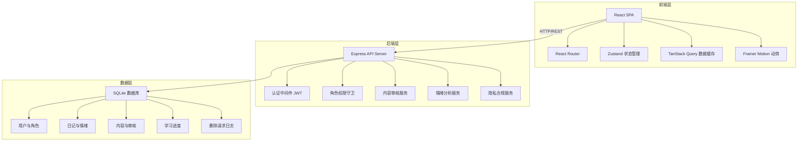
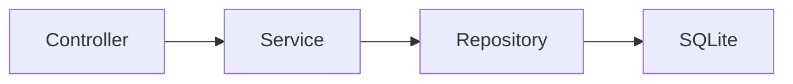
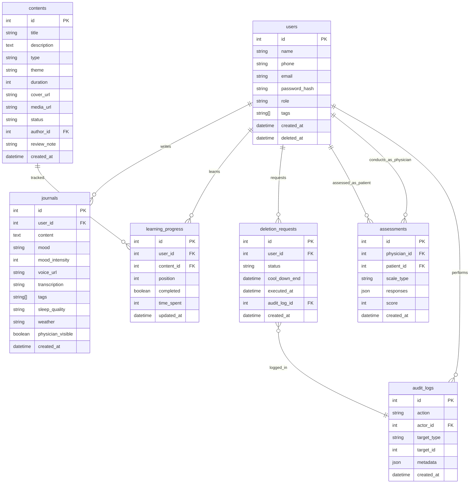

## 1. 架构设计



## 2. 技术说明

- **前端**：React@18 + TypeScript + TailwindCSS@3 + Vite
- **状态管理**：Zustand（全局状态）+ TanStack Query（服务端状态缓存）
- **动效**：Framer Motion
- **图表**：Recharts（趋势图/统计图）+ 自定义 SVG（热力图）
- **初始化工具**：vite-init
- **后端**：Express@4 + TypeScript（ESM）
- **数据库**：SQLite（better-sqlite3），轻量级本地存储，适配单机部署场景
- **认证**：JWT（jsonwebtoken），角色区分（用户/医师/管理员）

## 3. 路由定义

| 路由 | 用途 | 角色权限 |
|------|------|---------|
| `/` | 首页工作台 | 全部 |
| `/journal` | 感悟驿站-日记列表 | 用户 |
| `/journal/new` | 新建日记 | 用户 |
| `/journal/:id` | 日记详情 | 用户 |
| `/journal/heatmap` | 情绪热力图 | 用户 |
| `/journal/weekly` | 趋势周报 | 用户 |
| `/content` | 内容中枢-主题首页 | 全部 |
| `/content/theme/:themeId` | 主题详情与内容列表 | 全部 |
| `/content/play/:id` | 音视频播放 | 全部 |
| `/content/stats` | 学习统计 | 用户 |
| `/physician` | 医师端-患者概览 | 医师 |
| `/physician/patient/:id` | 医师端-患者详情 | 医师 |
| `/physician/assessment/:id` | 评估量表填写 | 医师 |
| `/admin` | 后台-数据概览 | 管理员 |
| `/admin/review` | 后台-内容审核 | 管理员 |
| `/admin/users` | 后台-用户管理 | 管理员 |
| `/admin/privacy` | 后台-隐私合规 | 管理员 |

## 4. API 定义

### 4.1 认证相关

```typescript
POST   /api/auth/register     { phone, email, password, name }      → { user, token }
POST   /api/auth/login        { account, password }                 → { user, token }
GET    /api/auth/me           -                                     → { user }
```

### 4.2 感悟驿站

```typescript
GET    /api/journal            { page, pageSize, mood?, startDate?, endDate? } → { items, total }
POST   /api/journal            { content, mood, voiceUrl?, tags, sleepQuality, weather } → { entry }
GET    /api/journal/:id        -                                                → { entry }
DELETE /api/journal/:id        -                                                → { success }
GET    /api/journal/heatmap    { year, month }                                  → { days: Array<{ date, mood, intensity }> }
GET    /api/journal/weekly     { weekStart }                                    → { summary, trends, insights }
POST   /api/journal/:id/voice  FormData(voiceBlob)                             → { voiceUrl, transcription }
```

### 4.3 多媒体内容

```typescript
GET    /api/content            { theme?, type?, q?, page, pageSize, status? } → { items, total }
GET    /api/content/:id        -                                               → { content, progress }
POST   /api/content/:id/progress { position, completed }                      → { progress }
POST   /api/content/:id/cache  -                                               → { downloadUrl }
GET    /api/content/stats      -                                               → { totalDuration, completedCount, streak, calendar }
POST   /api/content            { title, description, type, theme, duration, coverUrl, mediaUrl } → { content }  (管理员)
PUT    /api/content/:id        { ... }                                         → { content }  (管理员)
PATCH  /api/content/:id/status { status: 'APPROVED' | 'REJECTED', reviewNote? } → { content }  (管理员)
```

### 4.4 医师端

```typescript
GET    /api/physician/patients          → { patients: Array<{ user, latestMood, alertLevel }> }
GET    /api/physician/patient/:id       → { user, journals, moodSummary }
POST   /api/physician/assessment        { patientId, scaleType, responses } → { assessment }
GET    /api/physician/assessment/:id    → { assessment }
```

### 4.5 用户管理（管理员）

```typescript
GET    /api/admin/users          { page, pageSize, tag?, q? } → { items, total }
PATCH  /api/admin/users/:id/tags { tags: string[] }           → { user }
DELETE /api/admin/users/:id      -                             → { deletionRequest }
GET    /api/admin/deletion-requests                           → { requests }
POST   /api/admin/deletion-requests/:id/execute               → { success, auditLogId }
```

### 4.6 隐私合规

```typescript
POST   /api/privacy/deletion-request   -                               → { requestId, coolDownEnd }
POST   /api/privacy/deletion-request/:id/cancel  -                    → { success }
GET    /api/privacy/my-data             -                              → { exportUrl }
```

## 5. 服务端架构图



## 6. 数据模型

### 6.1 数据模型定义



### 6.2 数据定义语言

```sql
CREATE TABLE users (
  id INTEGER PRIMARY KEY AUTOINCREMENT,
  name TEXT NOT NULL,
  phone TEXT UNIQUE,
  email TEXT UNIQUE,
  password_hash TEXT NOT NULL,
  role TEXT NOT NULL DEFAULT 'user' CHECK(role IN ('user', 'physician', 'admin')),
  tags TEXT DEFAULT '[]',
  created_at TEXT DEFAULT (datetime('now')),
  deleted_at TEXT
);

CREATE TABLE journals (
  id INTEGER PRIMARY KEY AUTOINCREMENT,
  user_id INTEGER NOT NULL REFERENCES users(id),
  content TEXT NOT NULL,
  mood TEXT NOT NULL CHECK(mood IN ('happy', 'calm', 'neutral', 'anxious', 'sad')),
  mood_intensity INTEGER DEFAULT 3 CHECK(mood_intensity BETWEEN 1 AND 5),
  voice_url TEXT,
  transcription TEXT,
  tags TEXT DEFAULT '[]',
  sleep_quality TEXT CHECK(sleep_quality IN ('good', 'fair', 'poor')),
  weather TEXT,
  physician_visible INTEGER DEFAULT 0,
  created_at TEXT DEFAULT (datetime('now'))
);

CREATE TABLE contents (
  id INTEGER PRIMARY KEY AUTOINCREMENT,
  title TEXT NOT NULL,
  description TEXT,
  type TEXT NOT NULL CHECK(type IN ('AUDIO', 'VIDEO')),
  theme TEXT NOT NULL CHECK(theme IN ('BREATHING', 'MINDFULNESS', 'MONGOLIAN_WELLNESS')),
  duration INTEGER NOT NULL DEFAULT 0,
  cover_url TEXT,
  media_url TEXT,
  status TEXT NOT NULL DEFAULT 'PENDING' CHECK(status IN ('PENDING', 'APPROVED', 'REJECTED')),
  author_id INTEGER REFERENCES users(id),
  review_note TEXT,
  created_at TEXT DEFAULT (datetime('now'))
);

CREATE TABLE learning_progress (
  id INTEGER PRIMARY KEY AUTOINCREMENT,
  user_id INTEGER NOT NULL REFERENCES users(id),
  content_id INTEGER NOT NULL REFERENCES contents(id),
  position INTEGER DEFAULT 0,
  completed INTEGER DEFAULT 0,
  time_spent INTEGER DEFAULT 0,
  updated_at TEXT DEFAULT (datetime('now')),
  UNIQUE(user_id, content_id)
);

CREATE TABLE assessments (
  id INTEGER PRIMARY KEY AUTOINCREMENT,
  physician_id INTEGER NOT NULL REFERENCES users(id),
  patient_id INTEGER NOT NULL REFERENCES users(id),
  scale_type TEXT NOT NULL,
  responses TEXT NOT NULL DEFAULT '{}',
  score INTEGER,
  created_at TEXT DEFAULT (datetime('now'))
);

CREATE TABLE deletion_requests (
  id INTEGER PRIMARY KEY AUTOINCREMENT,
  user_id INTEGER NOT NULL REFERENCES users(id),
  status TEXT NOT NULL DEFAULT 'PENDING' CHECK(status IN ('PENDING', 'COOLING', 'EXECUTED', 'CANCELLED')),
  cool_down_end TEXT,
  executed_at TEXT,
  audit_log_id INTEGER REFERENCES audit_logs(id),
  created_at TEXT DEFAULT (datetime('now'))
);

CREATE TABLE audit_logs (
  id INTEGER PRIMARY KEY AUTOINCREMENT,
  action TEXT NOT NULL,
  actor_id INTEGER REFERENCES users(id),
  target_type TEXT,
  target_id INTEGER,
  metadata TEXT DEFAULT '{}',
  created_at TEXT DEFAULT (datetime('now'))
);

CREATE INDEX idx_journals_user ON journals(user_id, created_at DESC);
CREATE INDEX idx_journals_mood ON journals(user_id, mood);
CREATE INDEX idx_contents_theme ON contents(theme, status);
CREATE INDEX idx_contents_status ON contents(status);
CREATE INDEX idx_learning_user ON learning_progress(user_id);
CREATE INDEX idx_learning_content ON learning_progress(content_id);
CREATE INDEX idx_assessments_patient ON assessments(patient_id);
CREATE INDEX idx_deletion_user ON deletion_requests(user_id);
CREATE INDEX idx_audit_actor ON audit_logs(actor_id);
CREATE INDEX idx_audit_target ON audit_logs(target_type, target_id);
```
