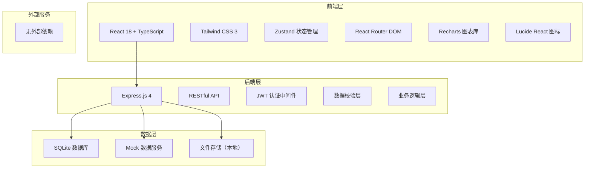
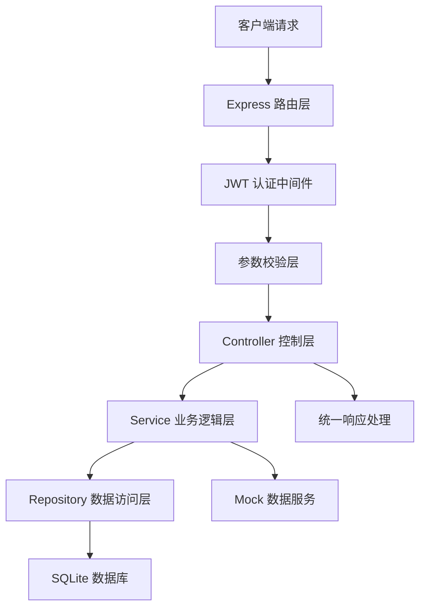
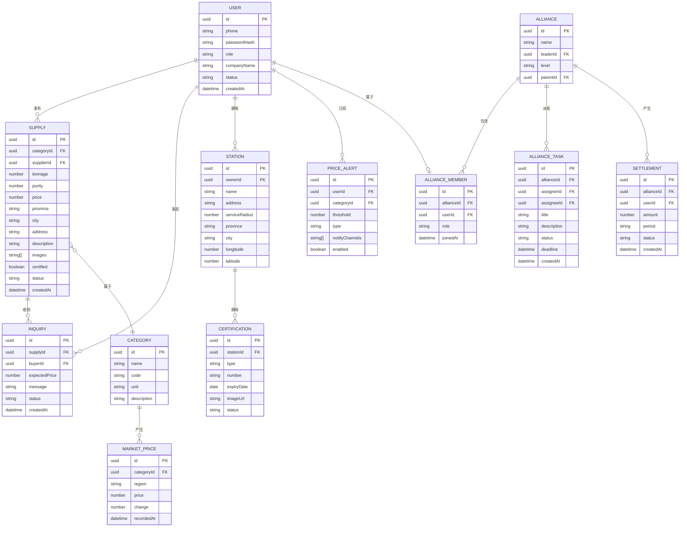

## 1. 架构设计



## 2. 技术描述

- **前端**：React@18 + TypeScript + Tailwind CSS@3 + Vite
- **初始化工具**：vite-init
- **状态管理**：Zustand
- **路由管理**：React Router DOM
- **图表可视化**：Recharts
- **图标库**：Lucide React
- **后端**：Express@4 + TypeScript
- **数据库**：SQLite（开发阶段使用Mock数据）
- **认证方式**：JWT Token
- **包管理器**：pnpm

## 3. 路由定义

| 路由 | 页面 | 权限要求 |
|------|------|----------|
| / | 行情看板首页 | 公开 |
| /market | 实时行情看板 | 登录用户 |
| /market/heatmap | 区域价差热力图 | 登录用户 |
| /market/trend | 历史走势对比 | 登录用户 |
| /market/alert | 价格预警订阅 | 登录用户 |
| /supplies | 货源列表 | 公开 |
| /supplies/publish | 货源发布 | 货源方 |
| /supplies/:id | 货源详情 | 公开 |
| /stations | 回收站列表 | 公开 |
| /stations/:id | 回收站数字名片 | 公开 |
| /alliance | 联盟管理首页 | 联盟成员 |
| /alliance/structure | 组织架构管理 | 盟主/分盟主 |
| /alliance/tasks | 任务派发中心 | 盟主/分盟主 |
| /alliance/settlement | 结算分账 | 盟主/分盟主/站点 |
| /dashboard | 数据看板 | 运营方/采购方 |
| /dashboard/supply-demand | 供需波动分析 | 运营方/采购方 |
| /dashboard/funnel | 转化漏斗分析 | 运营方/采购方 |
| /profile | 个人中心 | 登录用户 |
| /messages | 消息中心 | 登录用户 |
| /login | 登录页 | 公开 |
| /register | 注册页 | 公开 |

## 4. API 定义

### 4.1 认证接口

```typescript
// 用户登录
POST /api/auth/login
Request: { phone: string; password: string; role: 'supplier' | 'buyer' | 'operator' }
Response: { token: string; user: User }

// 用户注册
POST /api/auth/register
Request: { phone: string; password: string; role: string; companyName: string }
Response: { success: boolean; userId: string }

// 获取当前用户信息
GET /api/auth/me
Response: { user: User }
```

### 4.2 行情接口

```typescript
// 获取实时行情
GET /api/market/prices
Response: { 
  categories: CategoryPrice[],
  updateTime: string
}

// 获取历史走势数据
GET /api/market/history
Query: { category: string; startDate: string; endDate: string; region?: string }
Response: { data: PricePoint[] }

// 获取区域价格数据
GET /api/market/regional
Query: { category: string }
Response: { regions: RegionalPrice[] }

// 订阅价格预警
POST /api/market/alerts
Request: { category: string; threshold: number; type: 'above' | 'below'; notifyType: string[] }
Response: { alertId: string }

// 获取预警列表
GET /api/market/alerts
Response: { alerts: PriceAlert[] }
```

### 4.3 货源接口

```typescript
// 获取货源列表
GET /api/supplies
Query: { 
  category?: string; 
  minTonnage?: number; 
  maxTonnage?: number;
  minPurity?: number;
  region?: string;
  certified?: boolean;
  page?: number;
  pageSize?: number
}
Response: { list: Supply[]; total: number }

// 发布货源
POST /api/supplies
Request: {
  category: string;
  tonnage: number;
  purity: number;
  description: string;
  price: number;
  location: { province: string; city: string; address: string };
  images: string[]
}
Response: { supplyId: string }

// 获取货源详情
GET /api/supplies/:id
Response: { supply: SupplyDetail }

// 发起询价
POST /api/supplies/:id/inquiry
Request: { message: string; expectedPrice?: number }
Response: { inquiryId: string }
```

### 4.4 回收站接口

```typescript
// 获取回收站列表
GET /api/stations
Query: { region?: string; category?: string; page?: number }
Response: { list: Station[]; total: number }

// 获取回收站详情
GET /api/stations/:id
Response: { station: StationDetail }

// 更新回收站信息
PUT /api/stations/:id
Request: { 
  name: string; 
  address: string; 
  serviceRadius: number;
  certifications: Certification[]
}
Response: { success: boolean }
```

### 4.5 联盟接口

```typescript
// 获取联盟组织架构
GET /api/alliance/structure
Response: { structure: AllianceNode }

// 创建任务
POST /api/alliance/tasks
Request: { title: string; description: string; assigneeId: string; deadline: string }
Response: { taskId: string }

// 获取任务列表
GET /api/alliance/tasks
Response: { tasks: AllianceTask[] }

// 获取结算账单
GET /api/alliance/settlements
Query: { month?: string }
Response: { settlements: Settlement[] }

// 分账规则配置
POST /api/alliance/rules
Request: { role: string; percentage: number }
Response: { success: boolean }
```

### 4.6 数据看板接口

```typescript
// 获取供需波动数据
GET /api/dashboard/supply-demand
Query: { period: 'week' | 'month' | 'quarter' | 'year' }
Response: { supplyData: DataPoint[]; demandData: DataPoint[] }

// 获取转化漏斗数据
GET /api/dashboard/funnel
Query: { period: 'week' | 'month' | 'quarter' }
Response: { funnel: FunnelStep[] }

// 获取核心指标
GET /api/dashboard/metrics
Response: {
  totalTransaction: number;
  totalVolume: number;
  activeUsers: number;
  conversionRate: number;
  yoyGrowth: number;
  momGrowth: number
}
```

## 5. 服务端架构图



## 6. 数据模型

### 6.1 数据模型定义



### 6.2 核心数据类型定义

```typescript
interface User {
  id: string;
  phone: string;
  role: 'supplier' | 'buyer' | 'operator';
  companyName: string;
  status: 'pending' | 'approved' | 'rejected';
  createdAt: string;
}

interface Category {
  id: string;
  name: string;
  code: string;
  unit: string;
}

interface Supply {
  id: string;
  categoryId: string;
  categoryName: string;
  supplierId: string;
  supplierName: string;
  tonnage: number;
  purity: number;
  price: number;
  province: string;
  city: string;
  certified: boolean;
  status: 'active' | 'sold' | 'expired';
  createdAt: string;
  images: string[];
}

interface Station {
  id: string;
  ownerId: string;
  name: string;
  address: string;
  serviceRadius: number;
  province: string;
  city: string;
  certifications: Certification[];
}

interface Certification {
  id: string;
  type: string;
  number: string;
  expiryDate: string;
  imageUrl: string;
  status: 'valid' | 'expired' | 'pending';
}

interface MarketPrice {
  categoryId: string;
  categoryName: string;
  price: number;
  change: number;
  changePercent: number;
  region?: string;
  recordedAt: string;
}

interface PricePoint {
  date: string;
  price: number;
  category?: string;
}

interface RegionalPrice {
  region: string;
  province: string;
  price: number;
  avgPrice: number;
  diff: number;
}

interface AllianceNode {
  id: string;
  name: string;
  level: 'leader' | 'branch' | 'station';
  members: AllianceMember[];
  children: AllianceNode[];
}

interface AllianceTask {
  id: string;
  title: string;
  description: string;
  assignerName: string;
  assigneeName: string;
  status: 'pending' | 'in_progress' | 'completed' | 'cancelled';
  deadline: string;
}

interface Settlement {
  id: string;
  userName: string;
  role: string;
  amount: number;
  period: string;
  status: 'pending' | 'paid' | 'rejected';
}

interface FunnelStep {
  name: string;
  value: number;
  conversionRate: number;
}
```
