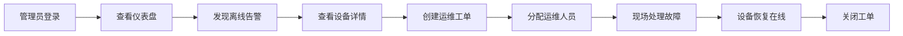
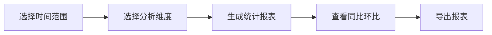

## 1. 产品概述

校园热水IoT服务管理平台Web管理后台，面向高校后勤管理部门，提供从设备接入、账户管理、支付核销到运维告警的完整闭环管理。平台集成智能水控终端管理、学生账户管理、能耗统计分析、运维工单管理等核心功能，实现校园热水服务的数字化、智能化管理。

## 2. 核心功能

### 2.1 用户角色

| 角色 | 注册方式 | 核心权限 |
|------|----------|----------|
| 超级管理员 | 后台创建 | 系统全部权限、用户管理、配置管理 |
| 管理员 | 后台创建 | 设备管理、学生管理、数据查看 |
| 运维人员 | 后台创建 | 告警处理、工单管理、设备维护 |
| 财务人员 | 后台创建 | 交易查询、对账管理、财务报表 |
| 运营人员 | 后台创建 | 设备配置、OTA升级、批量操作 |

### 2.2 功能模块

1. **登录页**：账号密码登录、权限验证、Token管理
2. **仪表板**：数据概览、实时设备状态、能耗趋势、告警统计
3. **设备管理**：设备列表、设备详情、心跳监控、OTA升级、批量配置
4. **学生账户**：账户列表、充值管理、挂失解挂、卡片管理
5. **交易管理**：交易记录、充值记录、消费记录、银行对账
6. **告警中心**：告警列表、告警处理、告警统计、规则配置
7. **工单管理**：工单列表、工单分配、工单处理、工单统计
8. **能耗分析**：能耗统计、多维度分析、同比环比、报表导出
9. **楼栋管理**：楼栋列表、水电表数据、故障率热力图
10. **系统设置**：用户管理、角色权限、系统配置

### 2.3 页面详情

| 页面名称 | 模块名称 | 功能描述 |
|-----------|----------|----------|
| 登录页 | 登录模块 | 账号密码登录、验证码、记住密码、忘记密码 |
| 仪表板 | 数据概览 | 设备总数、在线设备、离线设备、今日用水量、今日交易额、告警数量 |
| 仪表板 | 实时数据 | 实时设备状态、最新告警、最近交易 |
| 仪表板 | 趋势图表 | 用水趋势、能耗对比、楼栋对比 |
| 设备管理 | 设备列表 | 分页查询、筛选、导出、批量操作 |
| 设备管理 | 设备详情 | 设备信息、心跳历史、用水记录、告警记录 |
| 设备管理 | OTA升级 | 固件上传、批量升级、进度追踪 |
| 学生账户 | 账户列表 | 学生信息、余额、卡片状态、操作记录 |
| 学生账户 | 充值管理 | 人工充值、余额调整、充值记录 |
| 交易管理 | 交易记录 | 充值、消费、退款记录查询 |
| 交易管理 | 银行对账 | 对账流程、差异处理、对账报表 |
| 告警中心 | 告警列表 | 告警等级、类型、状态筛选、批量处理 |
| 工单管理 | 工单列表 | 工单状态流转、分配、处理、验收 |
| 能耗分析 | 统计报表 | 按楼栋/年级/季节/时段多维度分析 |
| 能耗分析 | 同比对比 | 同比环比分析、图表可视化 |
| 楼栋管理 | 楼栋列表 | 楼栋信息、设备统计、故障率热力图 |
| 系统设置 | 用户管理 | 管理员用户、角色权限配置 |

## 3. 核心流程

### 3.1 设备异常处理流程

管理员登录系统 → 查看仪表盘发现设备离线告警 → 查看设备详情确认故障原因 → 创建运维工单 → 分配给运维人员 → 运维人员处理 → 设备恢复在线 → 关闭工单和告警

### 3.2 能耗分析流程

选择时间范围 → 选择分析维度（楼栋/年级/季节）→ 生成统计报表 → 查看同比环比 → 导出报表

## 4. 用户界面设计

### 4.1 设计风格

- **主色调**：深蓝色系 (#1E3A8A) 作为主色，代表专业、科技感
- **辅助色**：青色 (#06B6D4) 作为交互元素
- **强调色**：橙色 (#F97316) 用于告警和警告
- **成功色**：绿色 (#10B981) 用于成功状态
- **背景色**：深灰 (#0F172A) 深色主题，科技感强

- **按钮风格**：圆角8px，悬停微放大1.02倍，阴影效果
- **字体**：Noto Sans SC 中文显示，现代无衬线字体
- **布局风格**：左侧导航栏+顶部栏+主内容区，卡片式布局
- **图标风格**：线性图标，统一24px尺寸

### 4.2 页面设计概览

| 页面名称 | 模块名称 | UI元素 |
|-----------|----------|--------|
| 登录页 | 登录模块 | 渐变背景、玻璃拟态登录框、动态背景动画 |
| 仪表板 | 数据概览 | 数据卡片、统计数字动画、图表渐变色 |
| 仪表板 | 实时数据 | 实时状态指示器、滚动动画列表 |
| 设备管理 | 设备列表 | 表格+卡片切换、状态标签、筛选器 |
| 告警中心 | 告警列表 | 严重程度颜色标签、批量操作工具栏 |
| 能耗分析 | 统计图表 | 多图表联动、交互式图表、钻取功能 |

### 4.3 响应式设计

- 桌面端优先设计（1920px）
- 平板端适配（1024px），隐藏次要导航
- 移动端适配（375px），汉堡菜单导航

### 4.4 动效设计

- 页面加载：骨架屏+渐显动画
- 数据更新：数字滚动动画
- 告警出现：从右侧滑入
- 按钮悬停：缩放+阴影
- 卡片悬停：上浮+阴影加深
