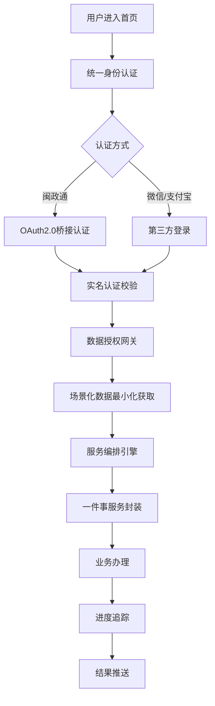
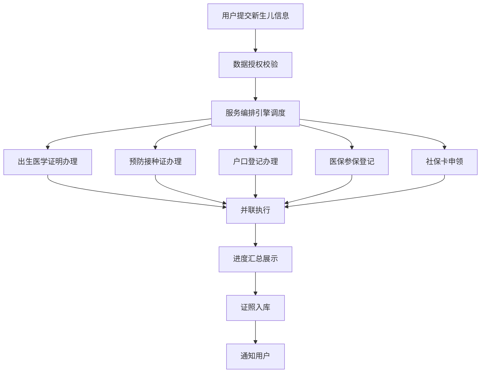
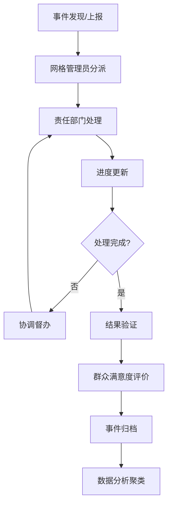

## 1. 产品概述

厦门市民一站式数字服务中枢是厦门市市级政务与民生服务统一入口，对接全市30+委办局系统，通过统一身份认证、数据授权网关和服务编排引擎，为市民、企业和基层治理人员提供全场景数字化服务。

- **核心目标**：打破政务数据孤岛，实现"一件事一次办"，提升城市治理现代化水平
- **目标用户**：厦门市民（个人）、市场主体（企业）、基层治理人员（街道/社区）
- **市场价值**：构建城市级数字服务生态，打造智慧厦门标杆，满足等保三级安全要求

## 2. 核心功能

### 2.1 用户角色

| 角色 | 注册方式 | 核心权限 |
|------|----------|----------|
| 个人用户 | 闽政通/OAuth2.0/微信/支付宝 | 个人数字空间、城市生活圈服务、办事预约 |
| 企业用户 | 统一社会信用代码认证 | 企业开办/注销、补贴申领、政策匹配 |
| 基层治理人员 | 政务内网账号 | 治理驾驶舱、网格事件处理、人口画像分析 |
| 系统管理员 | 运维账号 | 服务编排、权限管理、数据监控 |

### 2.2 功能模块

1. **首页**：统一入口导航、热门服务推荐、个人中心快捷入口、消息通知
2. **个人数字空间**：电子证照库、办事进度追踪、政策智能匹配推送
3. **企业服务台**：企业开办/注销全流程、补贴申领图谱化、政策精准推送
4. **城市生活圈**：公交地铁实时到站、预约挂号号源池、文体场馆余量可视化
5. **基层治理驾驶舱**：辖区人口画像、高频诉求聚类、网格事件闭环跟踪
6. **"一件事"服务**：新生儿五证联办、公民身后事、企业开办一窗通等
7. **统一身份认证**：多源身份认证桥接、单点登录、权限分级管理
8. **数据授权中心**：用户数据授权管理、最小化数据获取、授权审计追踪

### 2.3 页面详情

| 页面名称 | 模块名称 | 功能描述 |
|----------|----------|----------|
| 首页 | 导航与搜索 | 全局搜索、服务分类导航、热门服务快捷入口 |
| 首页 | 服务卡片 | 高频服务展示、"一件事"主题服务推荐 |
| 个人数字空间 | 证照库 | 电子证照列表、证照详情、证照授权使用记录 |
| 个人数字空间 | 办事进度 | 办件列表、进度追踪、材料补正提醒 |
| 个人数字空间 | 政策推送 | 基于用户画像的政策匹配、政策解读、申报入口 |
| 企业服务台 | 企业图谱 | 企业生命周期可视化、开办/注销流程节点 |
| 企业服务台 | 补贴申领 | 补贴政策图谱、 eligibility判断、申报进度 |
| 城市生活圈 | 公共交通 | 公交实时到站、地铁线路查询、换乘规划 |
| 城市生活圈 | 医疗健康 | 预约挂号、号源池实时查询、就诊提醒 |
| 城市生活圈 | 文体服务 | 场馆预订、活动查询、余量可视化展示 |
| 治理驾驶舱 | 人口画像 | 多维度人口分析、热力图、趋势预测 |
| 治理驾驶舱 | 诉求分析 | 高频诉求聚类、热点分布、处置时效 |
| 治理驾驶舱 | 网格管理 | 事件上报、分派、处置、闭环跟踪 |
| 登录认证页 | 身份认证 | 闽政通/微信/支付宝OAuth登录、实名认证 |
| 数据授权页 | 授权管理 | 数据授权申请、授权记录、权限撤销 |

## 3. 核心流程

### 3.1 用户办事主流程

### 3.2 新生儿"五证联办"流程

### 3.3 基层治理事件闭环流程

## 4. 用户界面设计

### 4.1 设计风格

- **主色调**：政务蓝 `#165DFF`（代表信任、专业），辅以活力橙 `#FF7D00`（代表服务、温暖）
- **中性色**：以锌灰色系（zinc）为基础，构建层次分明的信息架构
- **按钮风格**：圆角8px，微渐变填充，hover状态提升亮度和阴影
- **字体方案**：
  - 标题：Noto Sans SC Bold（庄重、清晰）
  - 正文：Noto Sans SC Regular（易读、现代）
  - 数字：JetBrains Mono（数据展示更清晰）
- **布局风格**：卡片式布局 + 模块化分区，顶部导航 + 侧边功能区
- **图标风格**：Lucide React 线性图标，统一24px尺寸，配色与主题一致
- **视觉层次**：通过阴影深度、圆角大小、边框粗细区分信息层级

### 4.2 页面设计概述

| 页面名称 | 模块名称 | UI元素 |
|----------|----------|--------|
| 首页 | Hero区域 | 城市天际线背景渐变、大标题、搜索框、动效波浪装饰 |
| 首页 | 服务矩阵 | 4x3网格卡片、图标+文字、hover上浮动效 |
| 首页 | 一件事专区 | 横向滚动卡片、流程节点可视化、进度条 |
| 个人数字空间 | 证照库 | 拟真证件卡片、翻转动效、3D堆叠效果 |
| 个人数字空间 | 办事进度 | 时间轴设计、节点状态颜色区分、进度百分比 |
| 企业服务台 | 企业图谱 | 力导向图布局、节点可拖拽、流程高亮 |
| 城市生活圈 | 实时数据 | 数据仪表盘、动态数字、实时刷新指示器 |
| 治理驾驶舱 | 数据大屏 | 深色主题、多图表联动、地图热力图、全屏模式 |
| 治理驾驶舱 | 网格地图 | 可缩放地图、网格分区着色、事件标记点 |

### 4.3 响应式设计

- **桌面优先**：1280px断点为基准，采用12列网格系统
- **平板适配**：768px断点，侧边栏收起为图标模式，服务网格调整为3列
- **手机适配**：375px断点，底部Tab导航，单列布局，优化触控区域
- **触控优化**：所有可点击元素最小44x44px，列表项间距不小于8px

### 4.4 动效设计

- **页面加载**：骨架屏 → 渐入显示，列表项依次延迟出现（staggered reveal）
- **卡片交互**：hover时上浮4px + 阴影加深 + 轻微缩放（1.02倍）
- **数据更新**：数字滚动动效、图表数据平滑过渡
- **模态框**：从底部滑入 + 背景模糊（backdrop-blur）
- **进度更新**：进度条平滑动画、状态变化脉冲提示

## 5. 安全与合规

### 5.1 等保三级要求

- 身份鉴别：双因素认证、登录失败锁定、密码复杂度策略
- 访问控制：最小权限原则、细粒度权限管理、操作审计
- 数据安全：数据加密存储、传输加密（TLS1.3）、数据脱敏展示
- 安全审计：全链路操作日志、异常行为检测、定期安全评估
- 数据边界：政务数据不出市云，内网外网物理隔离

### 5.2 数据授权机制

- 场景化最小授权：依业务场景仅申请必要数据
- 授权有效期：临时授权/永久授权可配置
- 授权追溯：完整的授权申请、使用、撤销审计链
- 用户可控：用户可随时查看和撤销已授权的数据访问
