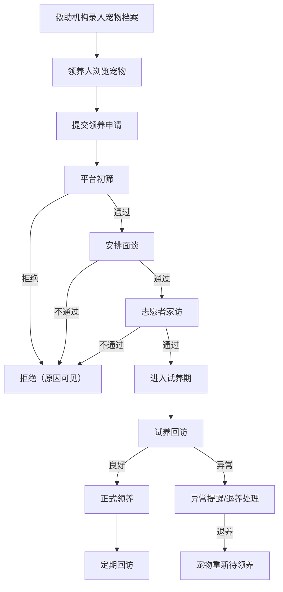

## 1. 产品概述
宠物救助与领养平台，连接救助机构、领养人、志愿者和平台审核员，实现宠物档案、领养申请、审核流程、试养回访的完整闭环，提高领养成功率并降低退养率。

## 2. 核心功能

### 2.1 用户角色
| 角色 | 注册方式 | 核心权限 |
|------|---------|---------|
| 救助机构 | 注册审核 | 创建/管理宠物档案、审核领养申请、安排回访 |
| 领养人 | 自由注册 | 浏览宠物、提交领养申请、补充资料、查看回访 |
| 志愿者 | 注册审核 | 接取家访/回访任务、提交反馈报告 |
| 平台审核员 | 系统分配 | 初筛申请、审核机构/志愿者、查看运营看板 |

### 2.2 功能模块
1. **宠物档案**：品种、年龄、性别、健康状况、疫苗记录、绝育状态、性格标签、照片、救助来源
2. **领养申请**：家庭条件、养宠经验、居住环境、联系人、承诺协议、资料补充
3. **审核流程**：初筛 → 面谈 → 家访 → 试养 → 正式领养，拒绝原因可见
4. **回访计划**：试养反馈、健康状态、照片、异常提醒、退养处理
5. **运营看板**：待领养统计、成功率、退养原因分析、志愿者任务、机构资源缺口

### 2.3 页面详情
| 页面名称 | 模块名称 | 功能描述 |
|---------|---------|---------|
| 首页 | 宠物展示 | 轮播图、待领养宠物卡片列表、快速搜索筛选 |
| 宠物列表 | 搜索筛选 | 按品种/年龄/性别/状态筛选，分页浏览 |
| 宠物详情 | 档案展示 | 完整档案、照片轮播、健康/疫苗/绝育标签、性格描述、救助故事 |
| 领养申请 | 申请表单 | 家庭条件、养宠经验、居住环境、联系人、承诺协议勾选 |
| 我的申请 | 申请追踪 | 查看申请状态、审核进度、补充资料入口 |
| 审核管理 | 审核工作台 | 待审核列表、初筛/面谈/家访/试养各阶段操作、拒绝原因填写 |
| 回访管理 | 回访计划 | 创建回访计划、记录反馈、健康状态、照片上传、异常提醒 |
| 退养处理 | 退养流程 | 退养申请、原因记录、宠物状态回退 |
| 运营看板 | 数据统计 | 待领养数、成功率、退养原因、志愿者任务、资源缺口图表 |
| 机构管理 | 机构工作台 | 机构宠物列表、志愿者管理、任务分配 |
| 志愿者中心 | 任务中心 | 可接任务列表、已接任务、反馈提交 |
| 登录/注册 | 认证 | 用户注册、登录、角色选择 |

## 3. 核心流程

领养闭环流程：救助机构录入宠物档案 → 领养人浏览并提交申请 → 平台初筛 → 安排面谈 → 志愿者家访 → 试养期（7-14天） → 试养回访 → 正式领养或退养

## 4. 用户界面设计

### 4.1 设计风格
- 主色调：暖橙 #F97316 + 柔绿 #22C55E（象征温暖与生命）
- 辅助色：石板灰 #475569 用于文字，浅灰 #F8FAFC 用于背景
- 按钮：圆角 8px，主按钮实色填充，次按钮描边
- 字体：Noto Sans SC 为主，Playfair Display 用于品牌标题
- 布局：左侧导航 + 主内容区，卡片式内容展示
- 图标：lucide-react 图标库
- 宠物照片以圆角卡片 + 阴影呈现

### 4.2 页面设计概览
| 页面名称 | 模块名称 | UI 元素 |
|---------|---------|--------|
| 首页 | 宠物展示 | Hero轮播、搜索栏、宠物卡片网格、筛选标签 |
| 宠物详情 | 档案展示 | 照片轮播、信息标签组、时间线、申请按钮 |
| 领养申请 | 申请表单 | 分步表单、文件上传、协议勾选、提交确认 |
| 审核管理 | 审核工作台 | 步骤条、审核卡片、操作按钮、拒绝原因弹窗 |
| 回访管理 | 回访计划 | 回访时间线、反馈卡片、状态标签、照片网格 |
| 运营看板 | 数据统计 | 统计卡片、图表（柱状/饼图）、表格 |

### 4.3 响应式设计
- 桌面优先，最小宽度 1024px
- 平板适配 768px-1024px，侧边栏折叠
- 移动端 768px 以下，底部导航

## 5. 端口配置
- 项目目录：may-63466，tail4 = 3466
- FRONTEND_PORT = 43466
- BACKEND_PORT = 53466
- 所有服务监听 127.0.0.1
