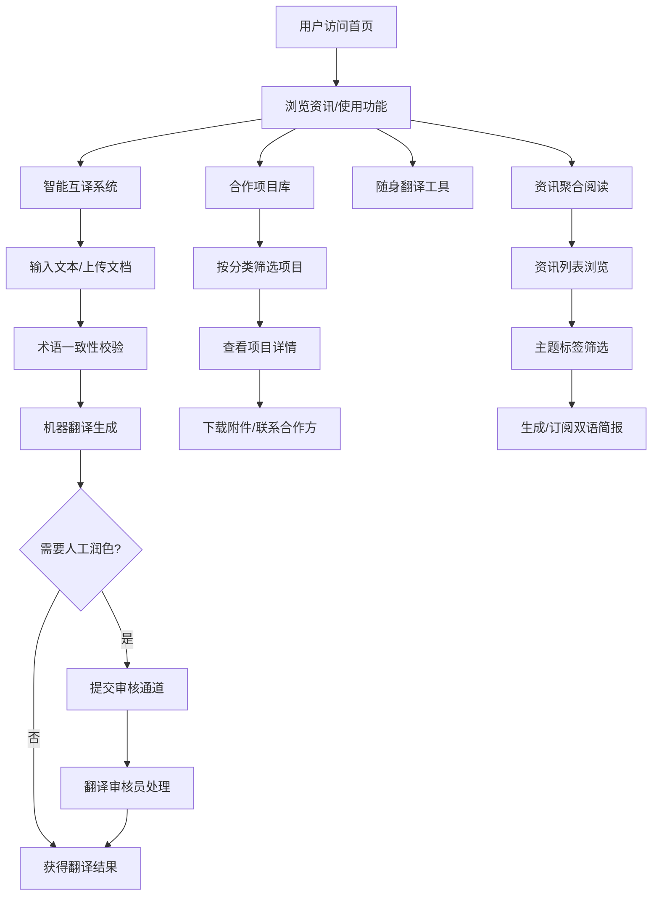

## 1. 产品概述

中意双语国际资讯与公共服务平台，为中意两国政府机构、文化组织与普通民众提供一站式双语资讯、合作对接与公共服务。核心目标是消除语言壁垒、促进信息流通、深化两国各领域合作。

- 解决问题：中意双语信息不对称、专业翻译服务门槛高、合作项目信息分散、跨境公共服务获取困难
- 目标用户：政府机构人员、文化组织从业者、经贸企业、教育科研人员、留学生、旅游者、普通民众
- 市场价值：构建中意两国官方与民间交流的数字枢纽，成为两国间最权威的双语信息平台

## 2. 核心功能

### 2.1 用户角色

| 角色 | 注册方式 | 核心权限 |
|------|----------|----------|
| 普通用户 | 邮箱/手机注册 | 浏览资讯、使用随身翻译、查看公开项目库 |
| 机构用户 | 机构认证注册 | 发布项目、上传内容、申请内容翻译 |
| 翻译审核员 | 后台邀请 | 术语校验、人工润色、内容审核 |
| 管理员 | 后台分配 | 全系统管理、用户审核、发布溯源 |

### 2.2 功能模块

1. **首页**：双语资讯聚合、快捷功能入口、项目亮点、简报订阅
2. **双语内容智能互译系统**：文档上传/输入、术语一致性校验、机器翻译、人工润色通道、版本对比
3. **中意合作项目库**：分类浏览（经贸/教育/文旅/科技）、项目详情、合作方信息、进展追踪、附件文档
4. **随身翻译工具**：语音识别、实时字幕、离线词库、场景模式（签证/医疗/法律）、历史记录
5. **多源信息聚合引擎**：资讯列表、主题标签、双语简报、订阅推送
6. **后台管理系统**：内容安全审核、敏感词过滤、人工复核、发布溯源、用户管理
7. **个人中心**：收藏夹、翻译历史、订阅设置、个人信息

### 2.3 页面详情

| 页面名称 | 模块名称 | 功能描述 |
|-----------|-------------|---------------------|
| 首页 | Hero 区域 | 双语切换、平台定位标语、核心功能快捷入口 |
| 首页 | 资讯速递 | 最新聚合资讯卡片展示，支持双语切换浏览 |
| 首页 | 精选项目 | 重点合作项目轮播/卡片展示 |
| 首页 | 功能导航 | 六大核心功能入口图标卡片 |
| 首页 | 简报订阅 | 输入邮箱订阅每周双语简报 |
| 智能互译页 | 文本输入区 | 支持中意双向文本输入、文档上传（PDF/Word） |
| 智能互译页 | 翻译结果区 | 机器翻译结果、术语高亮标注、置信度显示 |
| 智能互译页 | 人工润色通道 | 申请人工审核润色、进度追踪、版本对比 |
| 项目库页 | 分类筛选 | 经贸/教育/文旅/科技四大分类标签、多级筛选器 |
| 项目库页 | 项目卡片列表 | 项目名称、阶段标签、合作方、更新时间 |
| 项目详情页 | 基本信息 | 项目简介、合作方、联系人、阶段进度条 |
| 项目详情页 | 文档附件 | 相关文件下载、双语版本切换 |
| 随身翻译页 | 语音识别 | 实时语音转文字、双语言切换 |
| 随身翻译页 | 实时字幕 | 对话式双语字幕滚动显示 |
| 随身翻译页 | 场景模式 | 签证办理/医疗问诊/法律咨询专业词库切换 |
| 随身翻译页 | 离线管理 | 词包下载、离线模式状态指示 |
| 资讯聚合页 | 资讯流 | 多源资讯列表、来源标识、主题标签 |
| 资讯聚合页 | 主题标签云 | 热门话题标签、按主题筛选 |
| 资讯聚合页 | 双语简报 | 周报/日报生成、双语对照、下载导出 |
| 后台审核页 | 内容审核队列 | 待审核内容列表、敏感词标注 |
| 后台审核页 | 审核详情 | 原文对比、敏感词高亮、审核通过/驳回 |
| 后台审核页 | 发布溯源 | 发布历史记录、操作日志、责任追溯 |
| 个人中心页 | 收藏管理 | 资讯/项目收藏夹、分类整理 |
| 个人中心页 | 翻译历史 | 历史翻译记录、重复使用、收藏 |
| 个人中心页 | 订阅设置 | 简报频率、主题偏好、通知方式 |

## 3. 核心流程

用户访问平台首页后，可浏览聚合资讯或使用核心功能。翻译流程：用户输入/上传内容 → 系统术语校验 → 机器翻译生成结果 → 用户可申请人工润色 → 翻译审核员审核润色 → 返回最终版本。项目浏览流程：用户进入项目库 → 按分类/关键词筛选 → 查看项目详情 → 下载相关文档 → 联系合作方。后台审核流程：内容提交 → 系统敏感词过滤 → 人工复核 → 通过发布或驳回修改 → 全程操作留痕。

## 4. 用户界面设计

### 4.1 设计风格

- **主色调**：中国红 #DE2910 + 意大利绿 #009246，搭配暖金 #D4AF37 作为点缀
- **辅色调**：象牙白 #FFF8E7 背景、深炭灰 #2C2C2C 正文
- **设计风格**：典雅轻奢 · 文化交融 · 双语对照布局
- **按钮风格**：圆角 8px，主按钮渐变填充，悬停微上浮 + 阴影加深
- **字体选择**：标题使用"Noto Serif SC" + "Cormorant Garamond"（中西文衬线对），正文使用"Noto Sans SC" + "Inter"
- **布局风格**：左右双语对照布局、卡片式信息容器、顶部导航栏 + 语言切换器
- **视觉元素**：中意两国文化符号暗纹背景、金色分割线条、渐变光泽装饰

### 4.2 页面设计概述

| 页面名称 | 模块名称 | UI 元素 |
|-----------|-------------|-------------|
| 首页 | Hero 区域 | 全屏高度、中意双语大字标题左右排列、渐变色块装饰、背景加入两国文化元素的低透明度纹理 |
| 首页 | 资讯速递 | 3 列卡片网格、卡片悬浮有轻微上浮 + 阴影、图片角标显示来源 Logo、标签色区分主题 |
| 首页 | 功能导航 | 6 宫格图标卡、图标采用线面结合风格、悬停图标渐变色填充、卡片下方双语名称 |
| 智能互译页 | 主工作区 | 左右分栏对照布局、左栏原文输入右栏译文输出、顶部语言切换按钮、术语高亮标签样式 |
| 智能互译页 | 版本对比 | 上下对照 Diff 视图、差异处红绿色高亮标注、版本时间轴 |
| 项目库页 | 列表区 | 左侧筛选侧栏（固定宽度）、右侧卡片列表 2 列、进度条多彩分段显示、阶段标签胶囊样式 |
| 随身翻译页 | 字幕区 | 深色对话气泡式字幕、左右分屏显示中意双语、波纹动画表示正在录音、场景模式顶部 Tab |
| 后台审核页 | 审核列表 | 表格视图 + 状态色标、敏感词红色高亮标注、操作列快捷按钮、优先级侧边色条 |

### 4.3 响应式设计

- 桌面端优先（1440px 基准），适配 1280px、1024px 断点
- 平板端（768px）：导航折叠为汉堡菜单、双语布局改为上下堆叠、项目卡片改单列
- 移动端（375px）：功能入口改底部 Tab 栏、随身翻译全屏沉浸式、翻译区单列滚动

