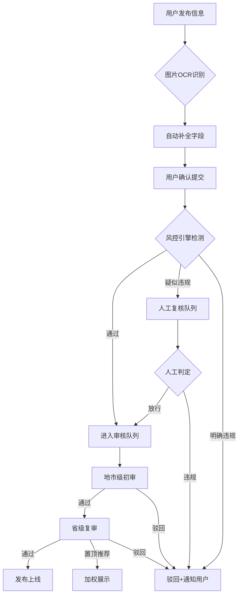
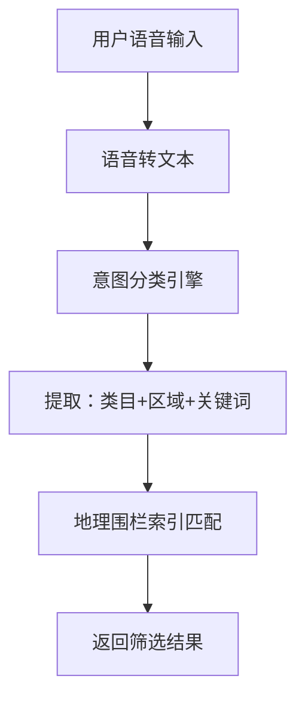
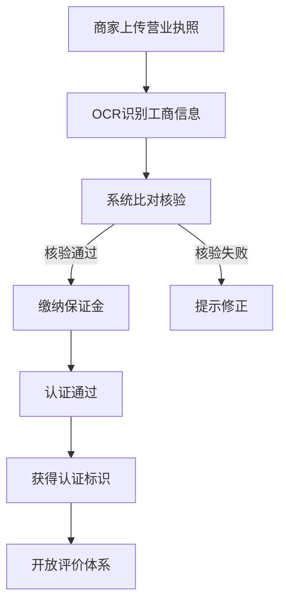

## 1. 产品概述

全国性分类信息公共服务平台，采用UGC+PGC混合内容治理模型，面向公众提供求职、租房、二手交易等12类生活信息服务。平台集成语音搜索意图匹配、图片OCR智能补全、商家认证体系等核心能力，并通过内容风控引擎与分级审核流保障信息质量。所有数据按行政区划做地理围栏索引，支持API开放给地方政府融媒体中心调用。

- 目标用户：普通市民（发布/浏览信息）、商家（认证经营）、地市级/省级审核员（内容治理）、政府融媒体中心（数据接入）
- 市场价值：构建可信、高效、智能的全国分类信息基础设施，连接公众生活服务与政府数字治理

## 2. 核心功能

### 2.1 用户角色

| 角色 | 注册方式 | 核心权限 |
|------|----------|----------|
| 普通用户 | 手机号注册 | 浏览信息、发布信息、语音搜索、图片OCR发布 |
| 认证商家 | 营业执照核验+保证金 | 商家主页、商业信息发布、服务评价管理 |
| 地市级审核员 | 管理员分配 | 初审辖区内容、标记违规 |
| 省级审核员 | 管理员分配 | 复审内容、置顶推荐、风控规则配置 |
| 平台管理员 | 系统分配 | 全量管理、API开放、流量分发、数据看板 |

### 2.2 功能模块

1. **首页**：地理围栏定位切换、12类目导航、语音搜索入口、热门推荐瀑布流、实时公告
2. **信息发布页**：类目选择器、图片OCR识别自动补全、字段校验、预览提交
3. **信息列表页**：多维筛选（类目/区域/价格/时间）、列表/卡片视图切换、地图模式
4. **信息详情页**：内容展示、图片画廊、联系信息脱敏展示、商家认证标识、评价区
5. **语音搜索页**：语音输入→文本转换→意图分类→结果匹配全流程可视化
6. **商家认证中心**：营业执照上传核验、保证金托管状态、服务评价沉淀、商家主页
7. **后台-内容风控引擎**：敏感词库管理、图像鉴黄结果、虚假电话识别、风险评分看板
8. **后台-流量分发看板**：阅读量趋势、留资率分析、转化漏斗、自媒体流量分配
9. **后台-分级审核流**：初审队列→复审队列→置顶推荐、审核统计、处理时效
10. **后台-地理围栏管理**：行政区划树形索引、区域数据热力图、API开放管理

### 2.3 页面详情

| 页面名称 | 模块名称 | 功能描述 |
|----------|----------|----------|
| 首页 | 地理围栏切换器 | 自动定位+手动选择省市区，切换后内容按地理围栏过滤 |
| 首页 | 类目导航 | 12类目图标矩阵：求职招聘、房屋出租、房屋合租、二手房、二手物品、车辆交易、本地服务、教育培训、宠物、婚恋交友、招商加盟、其他 |
| 首页 | 语音搜索入口 | 点击展开语音面板，动画反馈录音状态，实时转文本+意图分类 |
| 首页 | 热门推荐瀑布流 | 瀑布流卡片展示，含图片缩略图、标题、价格、区域标签、商家认证标 |
| 首页 | 实时公告栏 | 滚动播报平台公告和风控提醒 |
| 信息发布页 | 类目选择器 | 分步选择大类→小类，不同类目动态渲染对应表单字段 |
| 信息发布页 | 图片OCR识别 | 上传图片后自动识别并填充标题、价格、描述等字段，支持手动修正 |
| 信息发布页 | 表单区域 | 根据类目动态生成字段（如求职：期望薪资/工作年限；租房：面积/朝向/付款方式） |
| 信息发布页 | 预览提交 | 信息预览卡片+发布协议勾选+提交按钮 |
| 信息列表页 | 筛选侧栏 | 类目/区域/价格区间/发布时间/是否认证商家 多维筛选 |
| 信息列表页 | 列表/卡片/地图视图 | 三种视图模式切换，地图模式显示信息标记点 |
| 信息列表页 | 信息卡片 | 缩略图+标题+价格+区域+发布时间+认证标识 |
| 信息详情页 | 内容展示区 | 图片轮播、标题、价格、详细描述、结构化属性表 |
| 信息详情页 | 联系信息区 | 电话脱敏展示、点击拨号/复制、举报按钮 |
| 信息详情页 | 商家信息卡 | 商家认证等级、保证金状态、历史评价星级 |
| 信息详情页 | 评论区 | 用户评价列表、评分分布图 |
| 语音搜索页 | 语音输入面板 | 麦克风动画、波形可视化、录音时长 |
| 语音搜索页 | 文本转换区 | 实时显示语音转文本结果 |
| 语音搜索页 | 意图分类展示 | 展示分类结果（如'找朝阳区合租'→房屋合租-北京-朝阳） |
| 语音搜索页 | 搜索结果预览 | 匹配结果卡片列表 |
| 商家认证中心 | 营业执照核验 | 上传执照→OCR识别→工商信息比对→核验结果 |
| 商家认证中心 | 保证金托管 | 保证金缴纳状态、金额、托管协议 |
| 商家认证中心 | 服务评价 | 评价列表、评分统计、回复管理 |
| 商家认证中心 | 商家主页 | 商家信息展示、发布的信息列表 |
| 后台-风控引擎 | 敏感词管理 | 词库增删改查、分类标签、命中统计 |
| 后台-风控引擎 | 图像鉴黄 | 鉴黄结果列表、风险等级标识、人工复核队列 |
| 后台-风控引擎 | 虚假电话识别 | 异常电话标记、号码库管理、识别规则配置 |
| 后台-风控引擎 | 风险评分看板 | 全量内容风险评分分布、高风险预警列表 |
| 后台-流量看板 | 阅读量趋势 | 时间维度折线图、类目维度柱状图 |
| 后台-流量看板 | 留资率分析 | 留资率趋势、类目对比、区域热力 |
| 后台-流量看板 | 转化漏斗 | 浏览→点击→留资→成交 四级漏斗图 |
| 后台-流量看板 | 流量分配 | 自媒体账号流量配额、分发策略配置 |
| 后台-审核流 | 初审队列 | 按区域分配的待审内容列表、快捷操作（通过/驳回/标记） |
| 后台-审核流 | 复审队列 | 初审通过内容复核、置顶推荐操作 |
| 后台-审核流 | 审核统计 | 审核量/通过率/驳回率趋势、审核员效率排行 |
| 后台-地理围栏 | 行政区划树 | 省→市→区 三级树形索引，支持搜索 |
| 后台-地理围栏 | 区域热力图 | 信息发布密度热力可视化 |
| 后台-地理围栏 | API开放管理 | API Key管理、调用统计、权限配置、融媒体中心对接 |

## 3. 核心流程

**信息发布与审核流程**：用户选择类目→填写/OCR识别信息→提交→风控引擎自动检测→通过则进入审核队列→初审→复审→发布上线（违规则驳回并通知）。

**语音搜索流程**：用户点击语音搜索→麦克风录音→语音转文本→意图分类引擎匹配类目+区域+关键词→返回分类筛选结果列表。

**商家认证流程**：商家上传营业执照→OCR识别工商信息→系统比对核验→缴纳保证金→认证通过→获得认证标识→评价体系开放。

## 4. 用户界面设计

### 4.1 设计风格

- **主色调**：深海蓝（#0F2B46）传递权威信任感，辅助色暖橙（#FF6B35）引导行动操作
- **次色调**：浅灰蓝（#E8EEF4）背景层次，翡翠绿（#10B981）认证通过/成功状态，警示红（#EF4444）风控/违规
- **按钮风格**：圆角8px，主按钮深蓝底白字带微妙阴影，次按钮描边风格
- **字体**：标题使用 Noto Serif SC（衬线体传递权威），正文使用 Noto Sans SC（无衬线保证可读性）
- **布局风格**：顶部导航+侧边栏+内容区三栏布局，卡片化信息展示，后台数据看板采用仪表盘布局
- **图标风格**：线性图标（Lucide），配合12类目使用定制彩色图标
- **动效**：地理围栏切换使用涟漪扩散动画，语音搜索使用声波动画，审核流使用流程线动画

### 4.2 页面设计概览

| 页面名称 | 模块名称 | UI元素 |
|----------|----------|--------|
| 首页 | 地理围栏切换器 | 下拉选择器+定位图标，切换时涟漪动画扩散 |
| 首页 | 类目导航 | 3×4图标网格，每类目独立配色，hover缩放+阴影 |
| 首页 | 语音搜索入口 | 浮动圆形按钮，点击展开语音面板，声波动画 |
| 首页 | 瀑布流 | 双列瀑布流，卡片圆角12px，图片懒加载渐显 |
| 信息发布页 | 类目选择器 | 分步选择卡片，选中态深蓝边框+勾选图标 |
| 信息发布页 | OCR区域 | 拖拽上传区，识别后字段高亮动画填充 |
| 信息发布页 | 动态表单 | 分组折叠面板，必填项星号标注 |
| 信息列表页 | 筛选侧栏 | 手风琴式筛选组，标签式已选条件展示 |
| 信息列表页 | 地图视图 | 地图底图+信息气泡标记，点击弹出卡片 |
| 信息详情页 | 图片轮播 | 全屏轮播+缩略图条，支持手势滑动 |
| 信息详情页 | 商家信息卡 | 认证盾牌图标+星级评分+保证金标签 |
| 语音搜索页 | 语音面板 | 中央麦克风动画+环形声波+文本实时显示 |
| 语音搜索页 | 意图分类 | 分类标签彩色徽章，匹配结果高亮 |
| 后台-风控引擎 | 风险评分看板 | 仪表盘式评分图+红色预警列表+柱状分布图 |
| 后台-流量看板 | 转化漏斗 | 梯形漏斗图+每级转化率标注+趋势对比 |
| 后台-审核流 | 审核队列 | 左右分栏：列表+详情预览，快捷操作浮动按钮 |
| 后台-地理围栏 | 热力图 | 中国地图轮廓+区域色块热力+悬浮数据弹窗 |

### 4.3 响应式

- 桌面优先设计，最小宽度1024px
- 平板适配（768-1024px）：侧边栏折叠为抽屉，筛选栏变为顶部折叠
- 移动端适配（<768px）：单列布局，底部Tab导航，卡片全宽

### 4.4 3D场景指引

不适用
