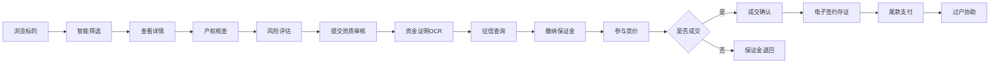

## 1. 产品概述

司法拍卖房产全流程服务平台，聚焦信息透明与交易保障。为竞买人提供从房源浏览、资质审核、尽调评估到竞价成交的一站式服务，通过智能化工具降低交易风险，提升拍卖效率。

- 核心价值：解决司法拍卖信息不对称、风险隐蔽、流程复杂的行业痛点
- 目标用户：房产投资者、刚需购房者、专业投资机构
- 市场定位：国内领先的司法拍卖房产专业服务平台

## 2. 核心功能

### 2.1 用户角色

| 角色 | 注册方式 | 核心权限 |
|------|----------|----------|
| 竞买人 | 手机号 + 实名认证 | 浏览房源、参与竞拍、资质审核、保证金缴纳 |
| 机构用户 | 企业认证 | 批量参拍、专属顾问、数据报表 |
| 平台管理员 | 后台登录 | 标的管理、订单审核、数据统计 |

### 2.2 功能模块

1. **首页大厅**：精选标的、市场行情看板、快速筛选、风险提示
2. **标的列表**：智能筛选、地图找房、排序对比
3. **标的详情**：房源信息、VR全景、产权报告、税费计算、拍卖进程
4. **智能选房**：同区域标的多维度对比矩阵
5. **竞买中心**：我的竞拍、保证金管理、资质审核
6. **尽调服务**：尽调报告、文档下载、专业咨询

### 2.3 页面详情

| 页面名称 | 模块名称 | 功能描述 |
|----------|----------|----------|
| 首页大厅 | 英雄区 | 平台定位标语、搜索框、核心数据统计 |
| 首页大厅 | 市场行情看板 | 近半年成交均价、流拍率、溢价率趋势图 |
| 首页大厅 | 精选标的 | 热门房源卡片轮播、一键参拍入口 |
| 首页大厅 | 风险提示引擎 | 常见风险类型介绍、风险预警示例 |
| 标的列表 | 筛选导航 | 区域、价格、面积、户型、拍卖阶段多维度筛选 |
| 标的列表 | 房源卡片 | 缩略图、基本信息、风险标签、开拍倒计时 |
| 标的详情 | 房源概览 | 主图轮播、核心参数、起拍价/评估价、保证金 |
| 标的详情 | VR全景看房 | 360°全景浏览、热点标注、户型图切换 |
| 标的详情 | 产权核查报告 | 产权状态、抵押信息、查封记录、欠费情况 |
| 标的详情 | 税费计算器 | 契税、个税、增值税、印花税自动计算 |
| 标的详情 | 拍卖进程 | 公告期/尽调期/保证金/竞价/成交节点时间线 |
| 标的详情 | 风险提示 | 抵押异常、户口未迁、租赁存续等风险标签 |
| 智能对比 | 对比矩阵 | 同区域3套标的多维度参数并列对比 |
| 智能对比 | 评分系统 | 综合性价比评分、各维度雷达图 |
| 竞买中心 | 我的竞拍 | 已报名、进行中、已结束标的列表 |
| 竞买中心 | 资质审核 | 资金证明上传、OCR识别、征信查询 |
| 竞买中心 | 保证金管理 | 缴纳记录、退款申请、监管账户信息 |
| 尽调服务 | 尽调文档库 | 产权报告、评估报告、拍卖公告下载 |
| 尽调服务 | 电子签约 | 成交确认书、委托协议在线签署存证 |

## 3. 核心流程

用户浏览标的 → 筛选对比 → 查看详情与尽调报告 → 提交资质审核 → 缴纳保证金 → 参与竞价 → 成交确认 → 电子签约 → 尾款支付 → 过户协助

## 4. 用户界面设计

### 4.1 设计风格

- **主色调**：司法蓝 (#0A2463) 搭配 金色 (#E0A458)，传达专业权威与价值感
- **辅助色**：深灰 (#2D3142) 用于文本，浅灰 (#F7F9FC) 用于背景
- **强调色**：警示红 (#D62828) 用于风险提示，成功绿 (#2D6A4F) 用于成交状态
- **按钮风格**：直角微圆角、描边质感、悬停微上浮效果
- **字体选择**：标题使用 Noto Serif SC 衬线字体增强权威感，正文使用 Inter 无衬线提升可读性
- **布局风格**：卡片式布局、信息层级分明、数据可视化突出
- **图标风格**：线性图标为主，关键数据使用图标+数字组合呈现

### 4.2 页面设计概览

| 页面名称 | 模块名称 | UI 元素 |
|----------|----------|---------|
| 首页大厅 | 英雄区 | 深蓝渐变背景、金色点缀、大标题衬线字体、搜索框悬浮效果 |
| 首页大厅 | 行情看板 | 数据卡片矩阵、折线图/柱状图可视化、数字滚动动画 |
| 首页大厅 | 精选标的 | 大卡片轮播、风险角标、倒计时动效、悬停放大 |
| 标的列表 | 筛选栏 | 可展开筛选面板、标签式筛选、快捷筛选芯片 |
| 标的列表 | 房源卡片 | 图片+信息双栏布局、风险标签高亮、价格突出显示 |
| 标的详情 | 概览区 | 图片轮播+参数双栏、价格大字展示、参拍按钮悬浮固定 |
| 标的详情 | 信息区 | Tab 切换、时间线组件、数据可视化图表 |
| 智能对比 | 对比矩阵 | 固定首列/首行、横向滚动、参数高亮差异 |
| 智能对比 | 评分展示 | 雷达图、综合评分环形进度、维度评分条 |

### 4.3 响应式

- 桌面端优先设计，适配 1200px+ 主流分辨率
- 平板端 (768-1199px)：两列布局、侧边栏收起为抽屉
- 移动端 (375-767px)：单列布局、底部导航、简化筛选

### 4.4 动效与交互

- 页面加载：元素渐入+上移动画，错落延迟
- 卡片悬停：轻微上浮+阴影加深+金色描边
- 数据更新：数字滚动动画、图表渐进绘制
- 风险标签：脉冲动画提示、悬停展示详情
- 倒计时：数字翻牌动效、临近结束红色闪烁
