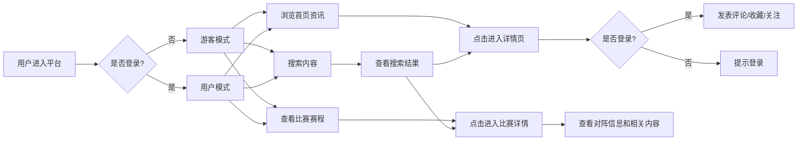

# 足球资讯社区平台 PRD

## 1. 产品概述
足球资讯社区平台是一款类似于懂球帝的足球资讯与赛事内容产品，为用户提供全面的足球新闻、实时赛程比分、球队球员信息及社区互动功能。
- 核心目标：打造一站式足球内容消费平台，满足球迷看新闻、查比赛、互动交流的核心需求
- 目标用户：足球爱好者、球迷群体，覆盖各年龄段和不同关注深度的用户

## 2. 核心功能

### 2.1 用户角色
| 角色 | 注册方式 | 核心权限 |
|------|----------|----------|
| 注册用户 | 手机号/邮箱注册 | 浏览资讯、查看比赛、搜索内容、发表评论、收藏文章、关注球队/球员 |
| 游客 | 无需注册 | 浏览资讯、查看比赛、搜索内容（无互动权限） |

### 2.2 功能模块
1. **首页**：头条轮播、资讯流、二级导航、搜索框（下拉出现）、频道滑动切换
2. **比赛模块**：赛程列表、实时比分、赛事入口、比赛详情页
3. **搜索模块**：热词推荐、历史记录、搜索结果列表（球队/球员/赛事/文章）
4. **内容详情页**：新闻正文、相关比赛信息、互动入口、评论区
5. **用户中心**：登录注册、个人信息、收藏列表、关注列表

### 2.3 页面详情
| 页面名称 | 模块名称 | 功能描述 |
|----------|----------|----------|
| 首页 | 头条轮播 | 重要新闻自动轮播展示，支持手动切换 |
| 首页 | 资讯流 | 无限滚动加载新闻列表，按时间/热度排序 |
| 首页 | 频道导航 | 横向滑动切换不同内容频道（英超、西甲、中超等） |
| 首页 | 搜索框 | 页面下拉时显示，点击进入搜索页 |
| 比赛页 | 赛程日历 | 按日期筛选比赛，展示当日所有赛事 |
| 比赛页 | 比分卡片 | 展示对阵双方、实时比分、比赛状态 |
| 比赛详情页 | 对阵信息 | 球队logo、名称、首发阵容、统计数据 |
| 比赛详情页 | 相关内容 | 关联的新闻文章、赛后报道 |
| 搜索页 | 热词推荐 | 展示当前热门搜索关键词 |
| 搜索页 | 历史记录 | 保存用户最近搜索记录 |
| 搜索页 | 结果分类 | 按球队、球员、文章、赛事分类展示结果 |
| 内容详情页 | 正文展示 | 支持图文混排、富文本渲染 |
| 内容详情页 | 评论区 | 登录用户可发表评论、查看他人评论 |
| 内容详情页 | 互动按钮 | 收藏、分享、关注作者/球队 |

## 3. 核心流程

## 4. 用户界面设计

### 4.1 设计风格
- **主色调**：深绿色（#1a472a）代表足球草坪，搭配亮绿色（#2ecc71）作为强调色
- **辅助色**：红色（#e74c3c）用于重要比分和提醒，蓝色（#3498db）用于链接和交互
- **中性色**：深灰（#2c3e50）、中灰（#7f8c8d）、浅灰（#ecf0f1）构建层次感
- **按钮风格**：圆角矩形（8px），悬浮时有轻微放大和阴影效果
- **字体**：标题使用Noto Sans SC Bold，正文使用Noto Sans SC Regular
- **布局风格**：卡片式布局，内容区域有明显边界和阴影
- **图标风格**：线性图标，统一2px描边，颜色与主题一致

### 4.2 页面设计概述
| 页面名称 | 模块名称 | UI元素 |
|----------|----------|--------|
| 首页 | 头条轮播 | 大图背景、渐变遮罩、白色标题文字、指示器圆点 |
| 首页 | 资讯卡片 | 左侧缩略图、右侧标题+摘要+时间+来源、hover时轻微上浮 |
| 首页 | 频道导航 | 横向滚动、选中项高亮下划线 |
| 比赛页 | 比分卡片 | 球队logo垂直排列、中间比分数字、比赛时间/状态 |
| 比赛页 | 日历选择器 | 横向日期列表、当日高亮 |
| 搜索页 | 搜索框 | 大圆角输入框、放大镜图标、清除按钮 |
| 搜索页 | 热词标签 | 圆角标签、不同颜色区分热度 |
| 详情页 | 文章正文 | 大标题、作者信息、正文段落、图文穿插 |
| 详情页 | 评论区 | 头像+用户名+时间+内容、输入框固定在底部 |

### 4.3 响应式
- **桌面优先**：以1440px宽度为基准设计
- **平板适配**：1024px时调整侧边栏和内容宽度
- **手机适配**：768px以下采用单列布局，导航改为底部Tab栏
- **触摸优化**：可点击区域不小于48x48px，增加触摸反馈

### 4.4 动效设计
- **页面加载**：骨架屏渐入，内容 staggered 显示
- **滚动交互**：导航栏背景透明度随滚动变化
- **卡片hover**：轻微 translateY + shadow 变化
- **比分更新**：数字变化时有跳动动画
- **评论发表**：新评论从底部滑入
