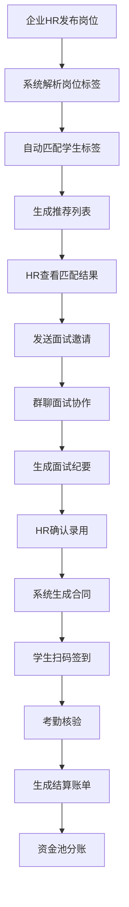

## 1. 产品概述

面向企业的校园兼职用工数字化平台，核心解决招聘效率低、过程难管控、结算不透明三大痛点。平台连接企业雇主与高校学生，通过智能匹配、流程管控、透明结算三大引擎，实现从岗位发布到薪资结算的全链路数字化管理。
- 目标用户：企业HR、城市分公司管理员、集团总部管理员、高校学生、企业导师
- 市场价值：将传统兼职招聘3-7天周期缩短至24小时内，考勤核验效率提升10倍，结算透明度达100%可追溯

## 2. 核心功能

### 2.1 用户角色

| 角色 | 注册方式 | 核心权限 |
|------|----------|----------|
| 企业HR | 企业邮箱注册+资质审核 | 发布岗位、面试协作、考勤管理、结算操作、评价学生 |
| 集团总部管理员 | 系统分配账号 | 统管分公司、查看全局数据、配置系统参数、风险监控 |
| 城市分公司管理员 | 总部分配账号 | 管理本分公司岗位与人员、本地考勤与结算 |
| 高校学生 | 学信网/校园邮箱认证 | 浏览岗位、投递简历、参加面试、签到考勤、查看结算、评价雇主 |
| 企业导师 | HR邀请加入 | 参与面试协作、评价学生、查看考勤 |

### 2.2 功能模块

1. **工作台首页**：数据概览仪表盘、快捷操作入口、待办事项、风险预警提示
2. **岗位管理中心**：岗位发布（寒暑假工/实习/线上任务）、岗位列表、自动匹配推荐
3. **人才库**：学生简历库、智能解析与关键词高亮、标签筛选
4. **面试协作**：群聊式面试（HR/导师/学生三方）、文件共享、面试纪要生成
5. **考勤管理**：扫码签到、批量考勤核验、异常考勤处理
6. **结算中心**：资金池管理、分账引擎、结算账单、手续费计提
7. **喵任务**：众包轻量任务发布（问卷/试玩/转发）、效果追踪
8. **信用体系**：双向互评、可信度标签、信用档案
9. **风控预警**：超时加班提示、未签合同提醒、异常行为预警
10. **系统管理**：多租户管理、分公司账号、权限配置、合规数据留存

### 2.3 页面详情

| 页面名称 | 模块名称 | 功能描述 |
|----------|----------|----------|
| 工作台首页 | 数据概览 | 实时显示在招岗位数、待处理简历数、进行中面试、本月结算金额等核心指标 |
| 工作台首页 | 快捷操作 | 一键发布岗位、批量导入学生、发起面试、生成考勤码 |
| 工作台首页 | 待办事项 | 按紧急程度排序的待办列表，支持一键跳转 |
| 工作台首页 | 风险预警 | 实时推送超时加班、未签合同等风险提醒 |
| 岗位管理 | 岗位列表 | 支持按类型（寒暑假工/实习/线上任务）筛选，显示状态、匹配人数、进度 |
| 岗位管理 | 岗位发布表单 | 多步骤表单：基本信息→技能要求→薪资设置→发布范围 |
| 岗位管理 | 匹配推荐 | 自动匹配学生标签（专业/年级/技能证书/历史评价），展示匹配度评分 |
| 人才库 | 简历列表 | 支持多维度筛选（专业/年级/技能/评分），卡片与列表视图切换 |
| 人才库 | 简历详情 | 智能解析简历内容，关键词高亮，右侧显示匹配岗位推荐 |
| 人才库 | 标签管理 | 管理学生标签体系，支持批量打标 |
| 面试协作 | 会话列表 | 显示进行中的面试会话，标注参与方状态 |
| 面试协作 | 群聊面试室 | HR/导师/学生三方会话界面，支持文字、文件共享、面试纪要 |
| 面试协作 | 面试纪要 | AI生成面试纪要，支持编辑与导出 |
| 考勤管理 | 考勤看板 | 按日期/岗位查看签到状态，异常考勤标红 |
| 考勤管理 | 扫码签到 | 生成动态签到二维码，学生扫码签到，防作弊检测 |
| 考勤管理 | 考勤核验 | 批量核验签到记录，支持位置/人脸辅助验证 |
| 结算中心 | 资金池 | 企业预存资金池余额、充值记录、冻结金额 |
| 结算中心 | 分账管理 | 按日/周结算配置，手续费自动计提，分账明细 |
| 结算中心 | 结算账单 | 历史结算账单，支持导出，满足合规留存要求 |
| 喵任务 | 任务发布 | 问卷/试玩/转发类轻量任务配置，设置单价与上限 |
| 喵任务 | 任务大厅 | 学生视角的任务列表，按类型与奖励筛选 |
| 喵任务 | 效果追踪 | 实时追踪任务完成数、质量评分、费用消耗 |
| 信用体系 | 互评管理 | 学生评雇主/雇主评学生的评价列表与统计 |
| 信用体系 | 信用档案 | 个人信用画像，可信度标签展示，历史评价汇总 |
| 风控预警 | 预警中心 | 超时加班/未签合同/异常行为等预警列表，支持一键处理 |
| 系统管理 | 租户管理 | 集团号管理下属城市分公司账号，层级树状展示 |
| 系统管理 | 权限配置 | 角色权限矩阵配置，细粒度功能权限控制 |
| 系统管理 | 合规留存 | 用工数据归档管理，满足《网络招聘服务管理规定》留存要求 |

## 3. 核心流程

### 3.1 岗位发布与匹配流程
企业HR发布岗位 → 系统解析岗位标签 → 自动匹配学生标签 → 生成推荐列表 → HR查看匹配结果 → 发送面试邀请

### 3.2 面试到入职流程
HR发起群聊面试 → 导师加入协作 → 三方会话+文件共享 → 生成面试纪要 → HR确认录用 → 系统生成合同 → 学生签约 → 生成考勤二维码

### 3.3 考勤与结算流程
学生扫码签到 → 系统记录考勤 → 异常考勤预警 → 考勤核验通过 → 按结算周期生成账单 → 资金池自动分账 → 手续费计提 → 结算完成

## 4. 用户界面设计

### 4.1 设计风格
- **主色调**：深海蓝（#0F4C75）+ 珊瑚橙（#FF6B35）强调色，传递专业与活力
- **辅助色**：冰蓝（#BBE1FA）用于背景与卡片，暖灰（#F8F9FA）用于内容区
- **按钮风格**：圆角8px，主按钮渐变填充，次按钮描边，强调按钮珊瑚橙实色
- **字体**：标题使用 DM Sans Bold，正文使用 Noto Sans SC Regular，数据数字使用 JetBrains Mono
- **布局风格**：左侧固定导航栏 + 顶部面包屑 + 右侧内容区，卡片式模块布局
- **图标风格**：Lucide线性图标，24px尺寸，与文字搭配使用

### 4.2 页面设计概览

| 页面名称 | 模块名称 | UI元素 |
|----------|----------|--------|
| 工作台首页 | 数据概览 | 4列指标卡片（图标+数字+趋势箭头），深海蓝渐变背景，JetBrains Mono数字 |
| 工作台首页 | 快捷操作 | 2x2圆角图标按钮网格，hover缩放+阴影动效 |
| 工作台首页 | 风险预警 | 右上角浮动通知，红色脉冲动画，点击展开详情 |
| 岗位管理 | 岗位列表 | 表格+筛选栏，类型标签色彩编码，状态徽章 |
| 岗位管理 | 岗位发布 | 左侧步骤导航+右侧表单，进度条动画 |
| 岗位管理 | 匹配推荐 | 学生卡片列表，匹配度环形进度条，标签云 |
| 人才库 | 简历列表 | 双栏布局（筛选+列表），卡片含头像/标签/匹配度 |
| 人才库 | 简历详情 | 左侧简历原文（关键词高亮）+右侧标签分析面板 |
| 面试协作 | 群聊面试室 | 居中聊天气泡，左上参与方头像，右上文件面板，底部纪要按钮 |
| 考勤管理 | 扫码签到 | 居中大尺寸动态二维码，倒计时，签到成功动画 |
| 结算中心 | 资金池 | 顶部大字余额+环形图（可用/冻结/待结算），下方交易流水表 |
| 喵任务 | 任务大厅 | 瀑布流卡片，任务类型图标，进度条+奖励标签 |
| 信用体系 | 信用档案 | 雷达图展示多维信用，可信度标签徽章，历史评价时间线 |
| 风控预警 | 预警中心 | 红黄绿三色预警卡片列表，筛选标签，一键处理按钮 |
| 系统管理 | 租户管理 | 树形组织架构图+右侧详情面板，拖拽排序 |

### 4.3 响应式设计
- 桌面优先（1440px基准），平板适配（1024px），移动端基本可用（768px）
- 导航栏在移动端折叠为汉堡菜单，表格在移动端转为卡片视图
- 触摸优化：按钮最小44px点击区域，刷卡操作支持手势

### 4.4 动效设计
- 页面加载：卡片依次淡入（stagger 100ms），数字滚动动画
- 岗位匹配：匹配度环形进度条动画填充
- 扫码签到：成功后绿色对勾+粒子扩散效果
- 风险预警：红色脉冲呼吸灯，弹窗滑入
- 结算分账：资金流向动态线条动画
