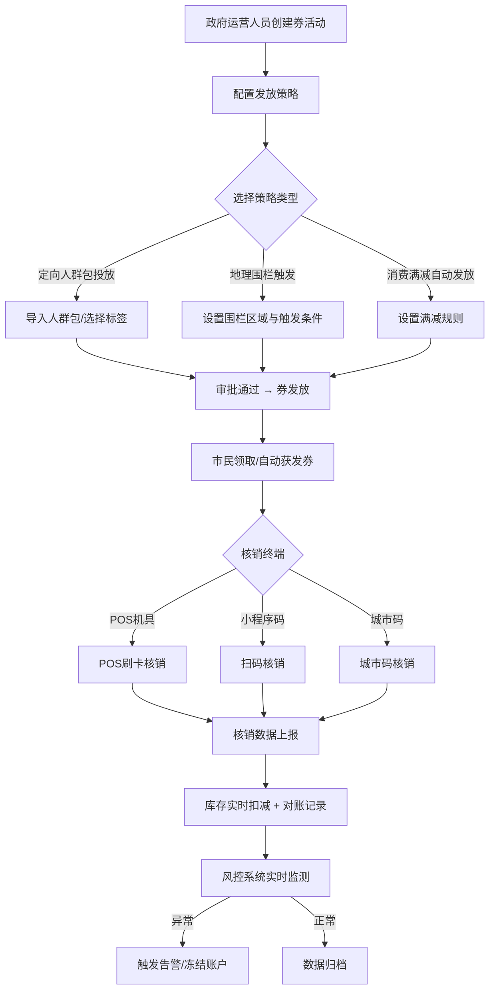
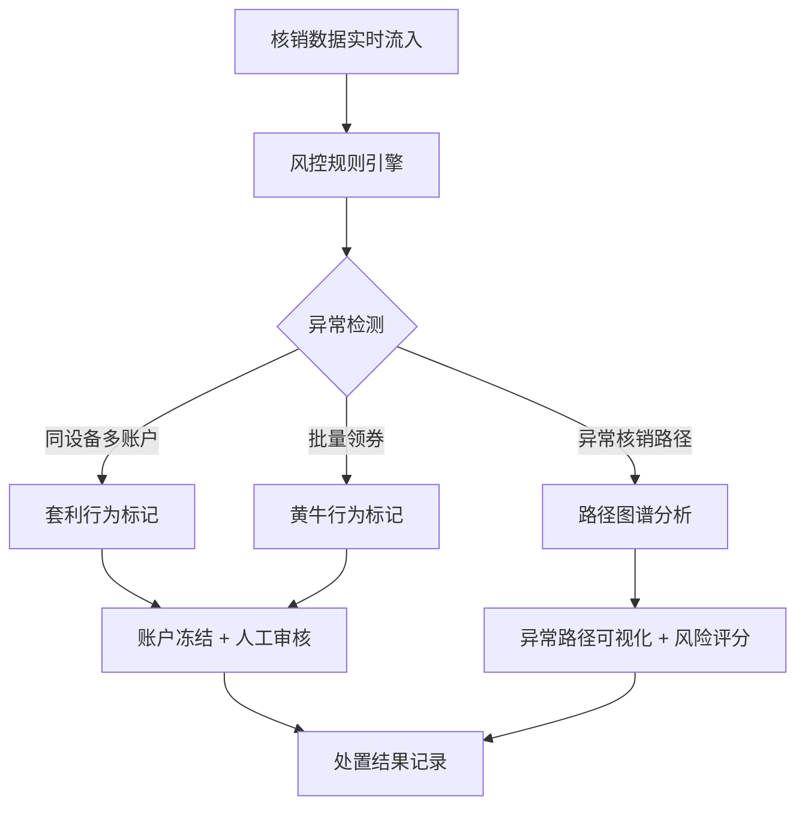

## 1. 产品概述

沈阳市全域惠民服务聚合平台，以"福利券"为核心运营抓手，串联政务、民生、商业三类供给主体，实现券资产全生命周期管理。平台面向政府运营人员、商户管理者与市民三类用户群体，提供从券发放、核销、风控到智能推荐的全链路数字化解决方案，助力沈阳市惠民补贴精准触达、高效流转。

## 2. 核心功能

### 2.1 用户角色

| 角色 | 注册方式 | 核心权限 |
|------|----------|----------|
| 政府运营人员 | 后台分配账号 | 券活动创建与审批、发放策略配置、风控规则管理、数据看板、财政补贴拨付 |
| 商户管理者 | 资质审核注册 | 券活动管理、库存管理、核销对账、核销率预警、门店管理 |
| 市民 | 实名认证（身份证+手机号） | 领券、券包查看、智能推荐、核销扫码、消费记录 |

### 2.2 功能模块

1. **运营总览看板**：核心指标实时监控（发放总量、核销率、活跃商户数、惠民金额）、区域热力图、趋势图表
2. **券活动管理**：活动创建/编辑/上下架、多策略发放配置（人群包/地理围栏/满减自动发放）、库存与预算管理
3. **核销管理**：多终端核销数据（POS机具/小程序码/城市码）、核销流水、核销对账报表
4. **风控中心**：券滥用识别看板、设备多账户套利监控、黄牛囤券预警、异常核销路径图谱
5. **商户后台**：门店券活动管理、库存实时扣减、核销对账、核销率趋势预警
6. **市民端（券包）**：智能推荐券包、我的券包、领券中心、消费记录、扫码核销
7. **系统配置**：省级平台跨市结算通道配置、财政补贴资金拨付接口、商户资质审核

### 2.3 页面详情

| 页面名称 | 模块名称 | 功能描述 |
|----------|----------|----------|
| 运营总览看板 | 核心指标卡片区 | 展示发放总量、核销率、活跃商户数、惠民金额等关键KPI |
| 运营总览看板 | 区域热力图 | 沈阳市各区券核销热力分布可视化 |
| 运营总览看板 | 趋势分析图 | 券发放/核销趋势、品类占比、商圈排行 |
| 券活动管理 | 活动列表 | 活动搜索、筛选、状态标签、批量操作 |
| 券活动管理 | 活动创建/编辑 | 基本信息、券面额/总量、发放策略配置、预算设定 |
| 券活动管理 | 发放策略配置 | 人群包投放、地理围栏触发、消费满减自动发放三种策略 |
| 券活动管理 | 库存与预算管理 | 实时库存监控、预算使用进度条、预警阈值设定 |
| 核销管理 | 核销数据概览 | 多终端核销统计、日/周/月核销趋势 |
| 核销管理 | 核销流水列表 | 按终端类型/时间/商户筛选核销明细 |
| 核销管理 | 核销对账报表 | 商户对账单生成、差异标记、导出 |
| 风控中心 | 风控概览 | 风险事件统计、风险等级分布、实时告警 |
| 风控中心 | 设备多账户监控 | 同设备多账户领券/核销记录、关联图谱 |
| 风控中心 | 黄牛囤券预警 | 批量领券行为检测、异常账户名单 |
| 风控中心 | 异常核销路径图谱 | 核销路径可视化、异常路径高亮 |
| 商户后台 | 商户总览 | 商户核销统计、券活动参与情况 |
| 商户后台 | 券活动管理 | 参与的券活动列表、库存实时扣减、核销操作 |
| 商户后台 | 核销对账 | 对账单查看、差异处理、导出 |
| 商户后台 | 核销率趋势预警 | 核销率趋势图表、预警通知 |
| 市民端（券包） | 首页推荐 | 基于用户画像的智能券包推荐、热门活动 |
| 市民端（券包） | 领券中心 | 分类浏览可领取券、搜索、筛选 |
| 市民端（券包） | 我的券包 | 已领券列表（待使用/已使用/已过期）、扫码核销入口 |
| 系统配置 | 结算通道配置 | 省级平台跨市结算参数、接口状态监控 |
| 系统配置 | 财政补贴拨付 | 补贴资金拨付记录、审批流程、接口配置 |
| 系统配置 | 商户资质审核 | 商户入驻审核、资质证照管理 |

## 3. 核心流程

### 3.1 券发放到核销全流程

政府运营人员在平台创建券活动，配置发放策略（人群包/地理围栏/满减触发），审核通过后券进入发放阶段。市民通过市民端领取或自动获得福利券，在商户处消费时通过POS机具/小程序码/城市码进行核销。核销数据实时同步至平台，触发库存扣减与对账记录。风控系统持续监控异常行为。

### 3.2 风控处理流程

## 4. 用户界面设计

### 4.1 设计风格

- **主色调**：深靛蓝 #1B2A4A（政务沉稳感）+ 琥珀金 #E8A838（惠民温暖感）
- **辅助色**：翡翠绿 #2ECC71（正向指标）、珊瑚红 #E74C3C（预警/风控）、雾灰 #F4F6F9（背景）
- **按钮风格**：圆角8px，主按钮深靛蓝填充，次按钮描边风格
- **字体**：标题用思源黑体/Noto Sans SC Bold，正文用Noto Sans SC Regular
- **布局风格**：左侧固定导航栏 + 右侧内容区，卡片式布局，数据看板风格
- **图标风格**：线性图标（Lucide图标库），与文字搭配使用
- **整体调性**：政务严谨但不冰冷，数据可视化丰富但不过度装饰，强调信息的清晰传达

### 4.2 页面设计概览

| 页面名称 | 模块名称 | UI元素 |
|----------|----------|--------|
| 运营总览看板 | 核心指标卡片区 | 4张渐变色指标卡片，数字突出，同比/环比小字 |
| 运营总览看板 | 区域热力图 | 沈阳市地图SVG，颜色深浅表示核销量 |
| 运营总览看板 | 趋势分析图 | 折线图+柱状图组合，可切换时间维度 |
| 券活动管理 | 活动列表 | 表格布局，状态标签彩色，操作按钮组 |
| 券活动管理 | 活动创建/编辑 | 分步表单，步骤条引导，策略配置折叠面板 |
| 核销管理 | 核销流水 | 表格+筛选栏，终端类型图标区分 |
| 风控中心 | 风控概览 | 风险等级环形图，告警列表实时滚动 |
| 风控中心 | 异常路径图谱 | 节点-关系图，节点大小表示风险权重，红色路径高亮 |
| 商户后台 | 商户总览 | 简洁指标卡+操作快捷入口 |
| 市民端 | 首页推荐 | 卡片瀑布流，券面额醒目，倒计时角标 |
| 市民端 | 我的券包 | Tab切换（待使用/已使用/已过期），券卡片带二维码 |

### 4.3 响应式设计

- 桌面端优先（1920px/1440px/1280px）
- 平板端适配（768px-1024px）：导航栏收缩为汉堡菜单
- 移动端市民端优化（375px-428px）：底部Tab导航，大按钮触控优化

### 4.4 动效设计

- 页面加载：指标数字滚动计数动画
- 数据更新：图表平滑过渡动画
- 卡片交互：hover轻微上浮+阴影加深
- 风控告警：脉冲动画提示紧急程度
- 券领取：成功弹窗+券卡片飞入动画
