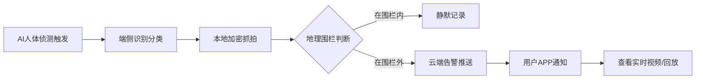
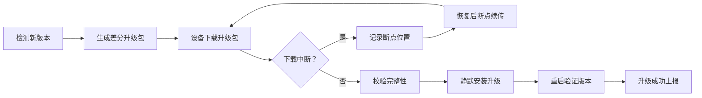

## 1. 产品概述

Wi-Fi猫眼设备远程管理与安防事件响应平台，聚焦低延迟、高可靠、隐私优先的智能家居安防解决方案。为家庭用户提供设备管理、实时监控、智能侦测、告警响应等一体化服务。

- 核心价值：通过AI赋能的智能猫眼设备，实现7×24小时家庭门户安全守护，兼顾便捷性与隐私保护
- 目标用户：关注家庭安全、追求智能化生活体验的家庭用户

## 2. 核心功能

### 2.1 用户角色

| 角色 | 注册方式 | 核心权限 |
|------|----------|----------|
| 家庭管理员 | 手机号/邮箱注册 | 设备管理、告警配置、成员管理、隐私设置 |
| 家庭成员 | 邀请加入 | 实时查看、告警接收、语音对讲 |

### 2.2 功能模块

1. **设备健康看板**：信号强度、存储余量、电池衰减趋势、设备在线状态
2. **实时视频监控**：P2P+中继双链路切换、H.265高清流、1080P@15fps
3. **AI侦测告警**：人体/宠物识别、访客/家人区分、本地抓拍+云端推送
4. **固件OTA管理**：差分升级、断点续传、版本回滚、升级进度监控
5. **双向语音对讲**：端侧降噪、回声消除、通话质量监控
6. **夜视与日志**：红外夜视自动切换、曝光补偿记录、设备运行日志
7. **地理围栏**：家庭地址3km范围触发、离家/回家模式自动切换
8. **隐私与存储**：端到端加密、私有云存储、设备零明文存储

### 2.3 页面详情

| 页面名称 | 模块名称 | 功能描述 |
|----------|----------|----------|
| 设备健康看板 | 概览卡片 | 设备在线数、今日告警数、存储使用率、电池健康度 |
| 设备健康看板 | 信号强度趋势 | 实时Wi-Fi信号强度曲线图、信号质量评级 |
| 设备健康看板 | 存储监控 | 存储容量饼图、历史增长趋势、清理建议 |
| 设备健康看板 | 电池衰减分析 | 电池容量衰减趋势曲线、预估剩余寿命 |
| 实时视频监控 | 视频播放区 | 主画面显示、分辨率切换、全屏模式 |
| 实时视频监控 | 链路状态 | P2P/中继双链路状态指示、延迟数据、自动切换 |
| 实时视频监控 | 快捷操作 | 抓拍、录像、语音对讲、夜视切换 |
| AI侦测事件 | 事件列表 | 按时间/类型筛选、缩略图预览、事件详情 |
| AI侦测事件 | 识别统计 | 访客/家人/宠物分类统计、时段分布图表 |
| AI侦测事件 | 告警配置 | 灵敏度调节、告警时段、推送方式设置 |
| 固件OTA管理 | 版本管理 | 当前版本、可用版本、版本更新日志 |
| 固件OTA管理 | 升级进度 | 差分包大小、下载进度、断点续传状态 |
| 固件OTA管理 | 升级历史 | 历史升级记录、成功率统计、版本回滚操作 |
| 地理围栏设置 | 围栏配置 | 家庭地址设置、围栏半径（3km）、地图可视化 |
| 地理围栏设置 | 触发规则 | 进入/离开触发动作、通知策略配置 |
| 隐私与存储 | 加密设置 | 端到端加密开关、密钥管理、加密状态 |
| 隐私与存储 | 存储管理 | 云端存储容量、视频片段管理、一键清理 |
| 语音对讲日志 | 通话记录 | 历史通话列表、通话时长、质量评分 |
| 语音对讲日志 | 夜视日志 | 红外切换记录、曝光补偿参数、环境光照数据 |

## 3. 核心流程

### 3.1 设备告警响应流程

用户设备检测到人体移动 → AI识别分类（访客/家人/宠物） → 本地抓拍加密存储 → 判断地理围栏状态 → 推送告警通知 → 用户查看实时视频/历史记录

### 3.2 固件OTA升级流程

## 4. 用户界面设计

### 4.1 设计风格

- **主色调**：深空蓝（#0A1628）为主背景，科技感青色（#00D4FF）为强调色，警戒红（#FF4757）用于告警
- **辅助色**：成功绿（#2ED573）、警告橙（#FFA502）、信息蓝（#1E90FF）
- **整体风格**：科技感深色主题、安防专业感、数据可视化突出
- **按钮风格**：圆角矩形（8px）、微悬浮效果、状态色边框
- **字体**：主字体使用 JetBrains Mono（等宽科技感），数字字体使用 Roboto Mono
- **布局风格**：左侧导航栏 + 右侧内容区，卡片式信息模块，栅格化布局
- **图标风格**：线性图标 + 渐变填充，科技感轮廓

### 4.2 页面设计概览

| 页面名称 | 模块名称 | UI 元素 |
|----------|----------|---------|
| 设备健康看板 | 概览卡片 | 深色玻璃拟态卡片、渐变数据数字、状态指示灯 |
| 设备健康看板 | 趋势图表 | 面积图渐变填充、实时数据点动画、多维度切换 |
| 实时视频监控 | 视频播放区 | 黑色视频背景、HUD式信息叠加、角落状态标 |
| 实时视频监控 | 链路状态 | 双链路并排指示、延迟数字跳动、链路切换动效 |
| AI侦测事件 | 事件列表 | 时间轴布局、缩略图卡片、分类标签色标 |
| 固件OTA管理 | 升级进度 | 进度条渐变、断点标记、百分比数字 |
| 地理围栏设置 | 地图区域 | 圆形围栏可视化、中心点标记、半径调节滑块 |

### 4.3 响应式设计

- 桌面端为主（1440px+），三栏式布局
- 平板端（768-1440px），折叠侧边栏为图标模式
- 移动端（<768px），底部Tab导航，卡片纵向堆叠

### 4.4 动效与交互

- 页面加载：模块渐入 + 轻微上移动画，错峰延迟
- 数据更新：数字滚动过渡、图表曲线绘制动画
- 告警提示：呼吸灯闪烁效果 + 顶部滑入通知
- 状态切换：平滑过渡动画（300ms ease）
- 悬停反馈：卡片轻微上浮 + 阴影加深
