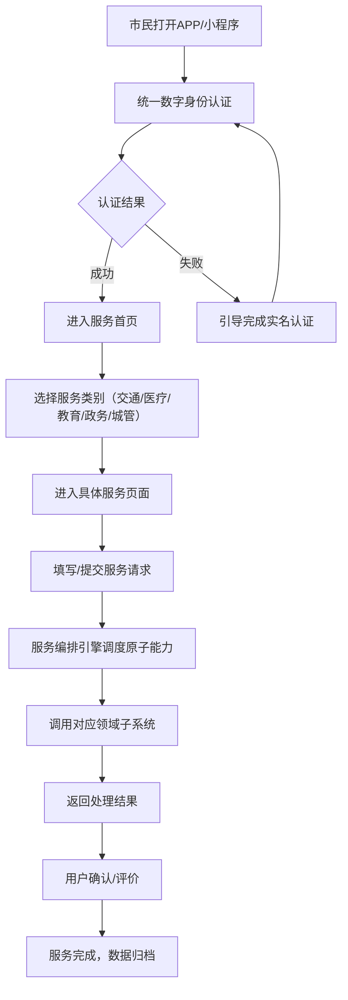
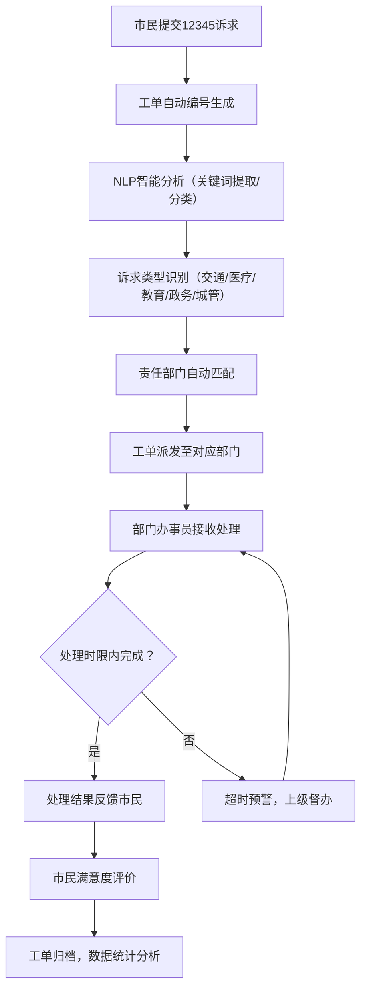

## 1. 产品概述

南宁城市级公共服务操作系统作为"城市大脑"民生服务层，打通交通、医疗、教育、政务、城管五大领域60+子系统，为市民提供一站式城市公共服务入口。系统融合统一数字身份体系，支撑BRT扫码乘车、医院挂号缴费、小学入学报名、违章查询、智慧停车等高频民生场景，提升城市治理效能与市民生活便利度。

- 核心价值：实现城市服务"一网通办、一码通行、一屏统览"，构建智慧民生服务新生态
- 目标用户：南宁市民、企业机构、城市管理者
- 市场定位：面向西南地区的智慧城市标杆项目，可复制推广的城市级公共服务平台

## 2. 核心功能

### 2.1 用户角色

| 角色 | 注册方式 | 核心权限 |
|------|----------|----------|
| 市民用户 | 身份证实名注册/人脸认证 | 使用各类民生服务、查看个人信息、提交诉求 |
| 企业用户 | 营业执照认证 | 办理企业相关政务服务、查看经营数据 |
| 城市管理员 | 管理员账号授权 | 查看城市运行体征、管理服务编排、处理工单 |
| 部门办事员 | 部门账号分配 | 处理本部门工单、发布政策文件、维护服务数据 |

### 2.2 功能模块

1. **首页仪表盘**：城市服务入口、个人中心快捷入口、常用服务推荐、城市动态资讯
2. **统一数字身份**：电子身份证/社保卡/驾驶证/电动车牌照管理、身份认证、一码通行
3. **交通服务**：BRT扫码乘车、公交实时查询、违章查询处理、智慧停车、电动车管理
4. **医疗服务**：医院挂号、在线缴费、报告查询、候诊时长热力图、健康档案
5. **教育服务**：小学入学报名、学区查询、学籍管理、教育资源查询
6. **政务服务**：证件办理、事项申报、进度查询、政策文件查询与解读
7. **城管服务**：12345诉求提交、工单查询、城市问题上报、执法公示
8. **城市体征监测**：水电燃气用量趋势、公交准点率、医院候诊热力图、交通流量监测
9. **市民诉求分拨**：12345工单NLP分类、自动派发、进度跟踪、满意度评价
10. **政策AI解读**：政策文件结构化拆解、智能解读推送、个性化政策匹配
11. **服务编排引擎**：原子能力封装、服务组件管理、流程编排设计、服务监控

### 2.3 页面详情

| 页面名称 | 模块名称 | 功能描述 |
|----------|----------|----------|
| 首页 | 服务入口矩阵 | 展示五大领域服务入口，支持搜索和个性化推荐 |
| 首页 | 城市动态卡片 | 实时展示城市运行关键指标、新闻资讯、政策通知 |
| 数字身份中心 | 卡包管理 | 展示和管理电子身份证、社保卡、驾驶证、电动车牌照 |
| 数字身份中心 | 身份认证 | 人脸认证、指纹认证、实名认证流程 |
| 交通服务页 | BRT乘车码 | 生成动态乘车二维码，支持扫码进出站 |
| 交通服务页 | 智慧停车 | 显示附近停车场空位、实时计费、在线支付 |
| 医疗服务页 | 挂号缴费 | 选择医院科室、预约挂号、在线支付、查看候诊队列 |
| 医疗服务页 | 候诊热力图 | 各医院各科室候诊时长实时热力图展示 |
| 教育服务页 | 入学报名 | 小学入学在线报名、材料上传、进度查询 |
| 政务服务页 | 事项办理 | 各类政务事项在线申报、材料提交、进度跟踪 |
| 政务服务页 | 政策解读 | 政策文件结构化展示、AI智能解读、相关推荐 |
| 城管服务页 | 12345诉求 | 诉求提交、工单查询、满意度评价 |
| 城市体征仪表盘 | 监测大屏 | 多维度城市运行数据可视化展示、实时更新 |
| 服务编排中心 | 流程设计器 | 可视化服务编排、原子能力组件拖拽组合 |
| 个人中心 | 账户管理 | 个人信息、实名认证、设置、消息通知 |

## 3. 核心流程

### 3.1 市民服务使用主流程

市民通过统一身份认证登录后，可在服务大厅选择所需服务，系统自动调用对应子系统能力完成业务办理，全流程留痕可追溯。

### 3.2 12345市民诉求智能分拨流程

市民提交诉求后，系统通过NLP技术自动分类并派发至对应部门，部门处理后反馈结果，形成完整闭环。

## 4. 用户界面设计

### 4.1 设计风格

**设计理念**："智慧城市·山水南宁"——融合现代科技感与南宁绿城特色，打造高效、亲民、有温度的城市服务界面

- **主色调**：
  - 科技蓝 (#0066CC)：代表智慧、高效、信任，作为系统主色
  - 生态绿 (#22AA66)：代表南宁"绿城"特色，用于医疗、教育等民生服务
  - 暖阳橙 (#FF8833)：代表活力、温暖，用于交通、城管等服务
  - 深灰 (#333333)：文字主色，确保可读性
  
- **辅助色**：
  - 警示红 (#E53935)：用于重要提醒、违章、超时预警
  - 成功绿 (#4CAF50)：用于办理成功、正常状态
  - 信息蓝 (#2196F3)：用于一般信息提示

- **字体选择**：
  - 标题字体："PingFang SC Bold" - 现代简洁，辨识度高
  - 正文字体："PingFang SC Regular" - 清晰易读
  - 数字字体："SF Mono" - 用于数据展示，增强科技感

- **按钮风格**：
  - 主按钮：圆角8px，渐变背景，悬停上浮效果
  - 次按钮：圆角8px，边框样式，点击反馈
  - 服务卡片：圆角16px，轻阴影，悬停微放大效果

- **布局风格**：
  - 顶部导航栏 + 左侧服务分类 + 主内容区的三栏布局（桌面端）
  - 卡片式模块化设计，信息层级清晰
  - 仪表盘采用数据可视化大屏风格，支持多维度切换

- **图标风格**：
  - 使用 Lucide 图标库，线性风格
  - 服务入口采用彩色渐变图标，增强识别度
  - 状态图标使用扁平化设计，色彩语义明确

### 4.2 页面设计概览

| 页面名称 | 模块名称 | UI 元素 |
|----------|----------|---------|
| 首页 | 服务入口矩阵 | 5×3 服务卡片网格，彩色渐变图标，悬停微动效，搜索框置顶 |
| 首页 | 城市动态卡片 | 轮播Banner + 数据概览小卡片，实时数据刷新动画 |
| 数字身份中心 | 卡包管理 | 堆叠式卡片设计，左右滑动切换，点击展开详情，仿实体卡质感 |
| 交通服务页 | BRT乘车码 | 大尺寸动态二维码，背景渐变，自动刷新倒计时，亮度调节 |
| 医疗服务页 | 候诊热力图 | 网格热力图，颜色深浅代表候诊时长，鼠标悬停显示详情 |
| 城市体征仪表盘 | 监测大屏 | 深色背景，荧光色数据曲线，3D柱状图，实时数据流效果 |
| 服务编排中心 | 流程设计器 | 可视化画布，节点拖拽连线，属性配置面板，实时预览 |
| 政务服务页 | 政策解读 | 左右分栏，左侧目录树，右侧富文本+AI解读悬浮卡片 |

### 4.3 响应式设计

- **桌面端优先**：针对1920×1080及以上分辨率优化，充分利用大屏展示多维度数据
- **平板适配**：1024×768分辨率，调整为左右两栏布局，适当压缩间距
- **移动端适配**：375×667及以上，底部Tab导航，垂直流式布局，触摸友好的大尺寸按钮
- **触摸优化**：所有可点击元素最小尺寸44×44px，手势操作支持（滑动、缩放）
- **断点设置**：sm(640px)、md(768px)、lg(1024px)、xl(1280px)、2xl(1536px)

### 4.4 动效与交互

- **页面加载**：骨架屏渐入，内容模块错峰出现（staggered reveal）
- **数据更新**：数字滚动动画，图表平滑过渡，新数据高亮提示
- **卡片交互**：悬停上浮2px + 阴影加深，点击缩放0.98反馈
- **导航切换**：Tab切换滑动指示条，页面过渡淡入淡出
- **仪表盘动效**：数据曲线绘制动画，热力图颜色渐变过渡
