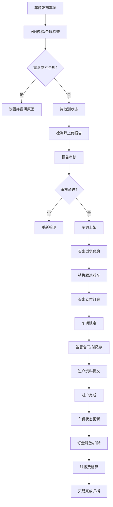

## 1. 产品概述

二手车交易平台是一个全栈Web业务系统，构建车源发布、检测报告、预约看车、订金锁车、合同过户和服务费结算的可信交易链路。系统服务车商、买家、检测师、销售、客服和财务六大角色，所有核心动作落库可复查，每个按钮背后都有权限控制、状态迁移、数据留痕和可追溯报表。

## 2. 核心功能

### 2.1 用户角色

| 角色 | 注册方式 | 核心权限 |
|------|----------|----------|
| 车商 | 后台审核注册 | 发布车源、管理车辆、查看交易进度 |
| 买家 | 自助注册 | 浏览车源、预约看车、支付订金、签署合同 |
| 检测师 | 后台审核注册 | 上传检测报告、路试记录、维保信息 |
| 销售 | 后台创建 | 跟进意向、预约看车、协助订车 |
| 客服 | 后台创建 | 处理投诉、退订申请、异常纠纷 |
| 财务 | 后台创建 | 订金管理、服务费结算、财务对账 |

### 2.2 功能模块

1. **登录页面**：角色身份认证、权限拦截、登录日志
2. **工作台仪表盘**：角色化数据看板、待办事项、快捷操作
3. **车源管理**：车源发布、VIN校验、重复车源检测、证件管理
4. **检测报告**：事故/水泡/火烧检测、维保记录、漆面检测、路试结果、报告审核
5. **预约看车**：意向登记、时间安排、销售分配、车源锁定
6. **订金管理**：订金支付、车辆锁定、退款申请、订金释放/扣除
7. **合同过户**：电子合同、尾款管理、金融方案、过户资料、过户进度
8. **服务费结算**：费用计算、结算规则、对账报表、发票管理
9. **运营统计**：车源转化、价格调整、检测异常、退订原因、销售效率
10. **审计追溯**：操作日志、状态迁移历史、数据变更记录、异常处理追踪
11. **异常管理**：虚假车源、事故隐瞒、订金退款、过户失败、里程争议、重复售卖

### 2.3 页面详情

| 页面名称 | 模块名称 | 功能描述 |
|----------|----------|----------|
| 登录页 | 身份认证 | 账号密码登录、角色切换、登录日志记录、权限校验 |
| 工作台 | 仪表盘 | 角色化数据概览、待办任务、今日数据、快捷入口 |
| 车源列表 | 车源管理 | 车源筛选、状态标签、批量操作、权限控制按钮 |
| 车源发布 | 车源管理 | VIN录入、基础信息、图片上传、证件上传、合规校验 |
| 车源详情 | 车源管理 | 车辆信息、检测报告、交易记录、状态历史、操作按钮 |
| 检测报告列表 | 检测管理 | 报告状态、检测师、审核状态、异常标记 |
| 检测报告上传 | 检测管理 | 事故/水泡/火烧检测、维保记录、漆面、路试结果录入 |
| 预约看车列表 | 预约管理 | 意向单状态、预约时间、销售跟进、车源锁定状态 |
| 预约创建 | 预约管理 | 意向登记、买家信息、看车时间、销售分配 |
| 订金管理 | 交易管理 | 订金支付记录、车辆锁定状态、退款申请、释放/扣除 |
| 合同管理 | 交易管理 | 电子合同、尾款支付、金融方案、过户资料 |
| 过户管理 | 交易管理 | 过户进度、资料审核、过户完成确认 |
| 结算管理 | 财务管理 | 服务费计算、结算单、对账、发票 |
| 运营报表 | 统计分析 | 车源转化漏斗、价格调整、检测异常、退订原因、销售效率 |
| 审计日志 | 系统管理 | 操作日志、状态迁移、数据变更、追溯查询 |
| 异常处理 | 系统管理 | 异常工单、处理记录、纠纷仲裁 |
| 用户管理 | 系统管理 | 用户创建、角色分配、权限配置 |

## 3. 核心流程

### 3.1 车源发布与审核流程
车商登录 → 录入VIN/里程/配置/图片/价格/证件 → 后端校验重复VIN和基础合规 → 待检测状态 → 检测师上传检测报告 → 报告审核通过 → 车源上架展示

### 3.2 看车预约流程
买家浏览车源 → 提交预约看车/试驾 → 系统记录意向单 → 分配销售跟进 → 确认看车时间 → 临时锁定车源 → 看车完成 → 更新意向状态

### 3.3 订车交易流程
买家确认购买 → 支付订金 → 后端锁定车辆 → 生成合同 → 签署电子合同 → 选择金融方案/支付尾款 → 提交过户资料 → 过户审核 → 过户完成 → 更新车辆状态 → 释放/扣除订金 → 结算平台服务费

### 3.4 异常处理流程
异常发现 → 创建异常工单 → 分配处理人 → 调查取证 → 纠纷仲裁 → 执行处理（退款/赔偿/封号）→ 记录处理结果 → 关闭工单

### 3.5 核心流程图

## 4. 用户界面设计

### 4.1 设计风格
- **主色调**：深靛蓝 #1E3A8A（专业可信），搭配琥珀橙 #F59E0B（行动警示）
- **辅助色**：翡翠绿 #10B981（成功/通过），赤红 #EF4444（异常/危险），冷灰 #6B7280（中性信息）
- **按钮风格**：直角矩形、2px圆角、微妙阴影、hover状态上移1px、active状态下压
- **字体**：标题使用"Noto Serif SC"宋体类衬线（专业稳重），正文使用"Noto Sans SC"无衬线（清晰可读）
- **布局风格**：左侧导航栏 + 顶部状态栏 + 主内容区，卡片式数据展示，表格为核心数据载体
- **图标风格**：lucide-react线性图标，16px/20px尺寸，与文字保持4px间距

### 4.2 页面设计概述

| 页面名称 | 模块名称 | UI元素 |
|----------|----------|--------|
| 登录页 | 身份认证 | 渐变背景、居中卡片、角色切换标签、表单校验动效、错误提示 |
| 工作台 | 仪表盘 | 数据卡片网格、趋势折线图、待办列表、快捷操作区、角色化数据 |
| 车源列表 | 车源管理 | 筛选栏、数据表格、状态标签、行内操作按钮、批量操作、分页 |
| 车源发布 | 车源管理 | 分步表单、VIN自动解析、图片预览、证件上传、实时校验提示 |
| 车源详情 | 车源管理 | 信息分组标签页、时间线状态历史、操作区权限控制、关联数据 |
| 检测报告 | 检测管理 | 分项评分卡片、检测项明细、异常高亮、审核操作、电子签名 |
| 预约看车 | 预约管理 | 日历时间选择、销售分配下拉、意向等级、跟进记录时间线 |
| 订金管理 | 交易管理 | 支付流水、锁定状态徽章、退款审批、操作日志 |
| 合同过户 | 交易管理 | 合同预览、资料上传区、进度步骤条、状态流转 |
| 结算管理 | 财务管理 | 费用明细表格、计算公式展示、结算单打印、对账标记 |
| 运营报表 | 统计分析 | 漏斗图、柱状图、趋势图、数据透视、导出按钮 |
| 审计日志 | 系统管理 | 操作人、时间、IP、操作类型、变更前后对比、筛选查询 |

### 4.3 响应式
- 桌面优先设计，最小支持1366px宽度
- 关键表格支持横向滚动
- 导航栏在窄屏可折叠为图标模式
- 表单在中等屏幕自动调整为两列布局

### 4.4 交互与动效
- 页面加载：顶部进度条 + 骨架屏占位
- 按钮点击：微缩放 + 颜色过渡
- 状态变更：高亮闪烁提示 + 操作成功toast
- 表格行：hover背景色变化，选中行标记
- 表单校验：失焦即时校验，错误信息滑入显示
- 模态框：背景模糊 + 缩放进入动画
