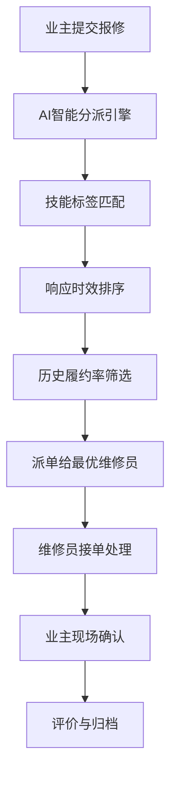

## 1. 产品概述
社区生活服务协同平台是连接业主、物业、本地商户三方主体的全栈 Web 系统，旨在打通社区服务最后一公里，提升社区治理效率和居民生活品质。
- 解决社区服务碎片化、信息不对称、物业服务响应慢、本地商户获客难等痛点
- 目标是构建智能化、人性化、可持续的社区生活服务生态

## 2. 核心功能

### 2.1 用户角色
| 角色 | 注册方式 | 核心权限 |
|------|----------|----------|
| 业主/住户 | 实名认证+楼栋绑定 | 浏览社区动态、发布邻里帖、报修缴费、闲置交易、评分商户 |
| 物业管理员 | 官方认证开通 | 工单分派、门禁管理、费用催缴、公告发布、数据看板 |
| 本地商户 | 营业执照核验 | 店铺管理、服务上架、订单处理、经营数据查看 |
| 平台运营 | 后台账号 | 用户审核、商户认证、内容风控、全局数据统计 |

### 2.2 功能模块
1. **首页仪表盘**: 社区概览、通知摘要、快捷入口、温度指数
2. **楼栋住户图谱**: 楼栋-单元-住户层级管理、住户信息、身份核验
3. **物业服务中心**: 报修工单、门禁权限、费用催缴、智能分派
4. **邻里内容社区**: 实名认证发帖、话题标签、点赞/举报/精华
5. **本地商户广场**: 商户档案、服务类目、居民评分、街道地图
6. **闲置流转集市**: 物品发布、信用担保、自提点管理、交易记录
7. **AI 信息聚合**: 活动通知摘要、维修进度跟踪、群聊精华提取
8. **数据运营看板**: 商户经营数据、社区温度指数、工单效率分析

### 2.3 页面详情
| 页面名称 | 模块名称 | 功能描述 |
|----------|----------|----------|
| 首页仪表盘 | 社区概览卡片 | 展示社区温度指数、今日工单、活跃商户、新发帖 |
| 首页仪表盘 | AI 摘要面板 | 自动聚合活动通知、维修进度、热门话题精华 |
| 首页仪表盘 | 快捷入口 | 一键报修、发帖、缴费、找商户、发布闲置 |
| 楼栋管理 | 楼栋图谱 | 可视化展示楼栋-单元-住户层级关系 |
| 楼栋管理 | 住户档案 | 住户基本信息、实名认证状态、房屋产权 |
| 物业服务 | 工单列表 | 报修工单状态跟踪、智能分派、处理进度 |
| 物业服务 | 门禁权限 | 人员权限管理、开门记录、临时授权 |
| 物业服务 | 费用中心 | 物业费/水电费账单、在线缴费、催缴记录 |
| 邻里社区 | 帖子列表 | 按话题分类、热门排序、精华置顶 |
| 邻里社区 | 发帖编辑器 | 富文本编辑、话题标签、实名认证标识 |
| 商户广场 | 商户列表 | 按类目筛选、评分排序、地图展示 |
| 商户广场 | 商户详情 | 服务项目、用户评价、营业执照、联系方式 |
| 闲置集市 | 物品列表 | 分类浏览、信用标识、自提点位置 |
| 闲置集市 | 发布物品 | 物品描述、图片上传、价格设置、担保选择 |
| 数据看板 | 商户经营 | 曝光量、咨询转化、复购率、趋势图表 |
| 数据看板 | 社区指数 | 活跃度、互助频次、矛盾化解率、温度曲线 |
| 数据看板 | 工单效率 | 响应时效、履约率、技能标签匹配度 |

## 3. 核心流程

### 3.1 业主报修流程
业主提交报修单 → AI 智能分派（按技能+时效+履约率）→ 维修工接单处理 → 业主确认评价 → 工单完结归档

### 3.2 商户入驻流程
商户提交申请 → 上传营业执照 → 平台核验 → 服务类目审核 → 缴纳保证金 → 店铺开通上线

### 3.3 闲置交易流程
用户发布物品 → 信用担保评估 → 物品上架展示 → 买家咨询下单 → 线下自提/验货 → 双方确认评价

## 4. 用户界面设计

### 4.1 设计风格
- 主色调：温暖橙红 (#FF6B35) 代表社区温度，搭配深蓝 (#1E3A5F) 体现专业可信
- 辅助色：清新绿 (#4CAF50) 代表互助，暖黄 (#FFC107) 代表活力
- 按钮风格：圆角 12px，微渐变填充，悬停时有轻微上浮和阴影增强
- 字体：标题使用 Noto Serif SC 衬线体体现人文温度，正文使用 Inter 无衬线保证可读性
- 布局：卡片式布局为主，配合留白和柔和阴影，营造温馨舒适的视觉感受
- 图标：使用线性图标配合柔和圆角，适当加入 emoji 增强亲和力

### 4.2 页面设计概述
| 页面名称 | 模块名称 | UI 元素 |
|----------|----------|----------|
| 首页仪表盘 | 社区温度卡片 | 大数字展示、环形进度条、渐变色背景、微动效 |
| 首页仪表盘 | AI 摘要面板 | 卡片式布局、时间轴设计、标签分组、展开/收起动画 |
| 楼栋管理 | 楼栋图谱 | 树状可视化、节点交互、层级展开、颜色区分身份 |
| 物业服务 | 工单卡片 | 状态标签、优先级标识、处理进度条、倒计时提醒 |
| 邻里社区 | 帖子列表 | 瀑布流布局、用户头像、话题标签、互动按钮组 |
| 商户广场 | 地图视图 | 分类标记点、信息弹窗、筛选控件、缩放过渡动画 |
| 数据看板 | 图表区域 | 折线图趋势、柱状图对比、热力图、数据钻取交互 |

### 4.3 响应式
- 桌面端优先设计（1280px+），适配 1440px、1920px 等主流分辨率
- 平板端（768px-1279px）：侧边栏折叠为图标，卡片两列布局
- 移动端（<768px）：底部 Tab 导航，单列瀑布流，表单元素全宽
- 所有交互元素支持触摸操作，最小点击区域 44x44px

### 4.4 街道服务地图
- 地图底色：柔和浅灰底纹，降低视觉噪音
- 标记点设计：不同类型商户使用不同颜色和图标，悬浮时放大并显示详情
- 交互：点击标记点滑出侧边信息面板，支持缩放和平移过渡动画
- 信息面板：展示商户基本信息、评分、热门服务、联系按钮
