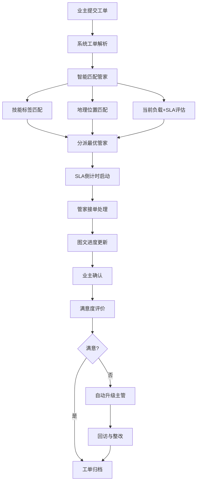

# 社区治理与生活服务融合SaaS化物业工作台 PRD

## 1. 产品概述
面向业主、物业管家、社区商户三类角色的一体化智慧物业SaaS平台，融合社区治理、生活服务、电商经济与普惠金融，打造高效、透明、温暖的社区生态。
- 解决传统物业服务效率低、响应慢、缺乏数据支撑的痛点
- 实现物业数字化运营、社区经济增值、邻里社交活跃的多重价值

## 2. 核心功能

### 2.1 用户角色
| 角色 | 注册方式 | 核心权限 |
|------|----------|----------|
| 业主 | 手机号+房屋认证 | 工单提交、缴费、电商购物、活动报名、健康档案查看 |
| 物业管家 | 企业后台分配 | 工单处理、SLA响应、业主沟通、进度汇报、数据查看 |
| 物业管理员 | 超级管理员分配 | 人员管理、工单分派、权限配置、数据仪表盘、业委会对接 |
| 社区商户 | 入驻申请+审核 | SKU上架、订单管理、核销管理、经营数据 |
| 业委会成员 | 业主认证+选举登记 | 物业费收缴审核、重大事项审批、数据监督、隐私审计 |
| 第三方服务商 | API密钥申请 | 开放API调用、数据对接、服务集成 |

### 2.2 功能模块
1. **工作台首页**: 数据仪表盘、快捷操作、待办提醒、公告通知
2. **小区管理**: 小区信息、楼宇/单元/户室结构树、住户信息、房屋绑定
3. **工单系统**: 报修/投诉/建议/预约工单、智能分派、SLA监控、进度留痕、满意度评价
4. **社区电商**: 商品SKU管理、购物车、订单支付、商户入驻、核销提货
5. **邻里活动**: 活动发布、在线报名、签到核销、活动回顾、参与热力图
6. **普惠金融**: 保险产品、养老储蓄、缴费代扣、理财产品展示
7. **健康档案**: 体检数据同步、健康指标趋势、家庭档案管理、社区医院对接
8. **缴费中心**: 物业费、水电费、停车费在线缴纳、账单查询、代扣签约
9. **系统设置**: 角色权限、数据脱敏、业委会审核流程、API管理
10. **开放平台**: API文档、密钥管理、调用日志、第三方应用管理

### 2.3 页面详情
| 页面名称 | 模块名称 | 功能描述 |
|----------|----------|----------|
| 登录页 | 角色选择 | 业主/管家/商户/管理员角色切换登录 |
| 登录页 | 认证方式 | 密码登录、短信验证码、人脸识别 |
| 工作台首页 | 数据仪表盘 | 物业费收缴率、工单处理时效、电商GMV、活动参与率多维度图表 |
| 工作台首页 | 待办中心 | 待处理工单、待审核商户、待审批事项、即将逾期SLA预警 |
| 工作台首页 | 快捷操作 | 一键派单、快速报修、发布活动、SKU上架入口 |
| 小区管理页 | 结构树 | 小区→楼宇→单元→户室多级树形结构，支持拖拽、搜索、筛选 |
| 小区管理页 | 住户档案 | 业主信息、家庭成员、房屋绑定状态、隐私脱敏展示 |
| 工单列表页 | 工单看板 | 按状态/类型/优先级/管家多维度筛选与分组 |
| 工单列表页 | 智能分派 | 基于技能标签+地理位置+SLA时效自动匹配最优管家 |
| 工单详情页 | 进度留痕 | 图文进度更新、语音备注、时间轴展示、业主确认节点 |
| 工单详情页 | 满意度闭环 | 星级评分、文字评价、投诉升级、回访记录 |
| 电商首页 | 商品展示 | 自营商品与商户商品混合推荐、分类检索、促销标识 |
| 电商商品页 | SKU详情 | 规格选择、库存显示、商户信息、用户评价、关联推荐 |
| 电商订单页 | 订单管理 | 下单、支付、发货、核销、退款全流程 |
| 商户后台页 | 入驻管理 | 资质上传、审核进度、保证金、经营数据看板 |
| 活动列表页 | 活动中心 | 进行中/已结束活动、报名人数、热度排序、分类筛选 |
| 活动详情页 | 报名与核销 | 在线报名、二维码签到、人数统计、活动相册 |
| 金融产品页 | 产品展示 | 保险方案、养老储蓄、代扣服务、风险提示、在线投保 |
| 健康档案页 | 数据中心 | 体检报告、血压/血糖趋势、家庭成员档案、就医记录 |
| 缴费中心页 | 账单管理 | 多类型账单、在线支付、代扣签约、电子发票 |
| 权限设置页 | 角色管理 | RBAC权限矩阵、数据脱敏规则、审批流程配置 |
| 业委会审核页 | 审批中心 | 物业费调价、维修基金使用、商户入驻等重大事项审批 |
| 开放平台页 | API管理 | API文档浏览、密钥生成、调用监控、沙箱环境 |

## 3. 核心流程

### 3.1 工单智能分派与处理流程
业主提交报修工单 → 系统解析工单类型与位置 → 匹配技能标签+地理位置+当前负载的最优管家 → SLA时效倒计时启动 → 管家接单并上门处理 → 图文进度实时更新 → 业主确认完成 → 满意度评价 → 不满意度自动升级至主管

### 3.2 社区电商交易流程
商户入驻审核 → SKU上架 → 业主浏览下单 → 在线支付 → 商户接单 → 配送/自提核销 → 订单完成 → 结算分账

## 4. 用户界面设计

### 4.1 设计风格
- **主色调**: 深海蓝 `#0A2540`（专业可信）搭配活力橙 `#FF6B35`（温暖服务）
- **辅助色**: 翡翠绿 `#10B981`（成功/健康）、警示黄 `#F59E0B`（预警）、胭脂红 `#EF4444`（紧急/告警）
- **按钮风格**: 圆角6px、微立体阴影、hover状态轻微上浮+光晕
- **字体方案**: 标题用 `Noto Serif SC`（人文质感），正文用 `Noto Sans SC`（清晰易读），数据数字用 `JetBrains Mono`
- **布局风格**: 左侧导航栏+顶部状态栏的经典B端布局，内容区采用卡片式设计，主数据区使用数据可视化大屏风格
- **图标风格**: 线性图标 `Lucide`，活动/电商类场景搭配彩色渐变图标
- **背景纹理**: 主背景使用细腻噪点纹理+微弱渐变网格，关键数据卡片使用毛玻璃效果

### 4.2 页面设计概述
| 页面名称 | 模块名称 | UI元素 |
|----------|----------|--------|
| 工作台首页 | 数据仪表盘 | 深色数据大屏风格，数字带渐变色，图表动画入场，卡片毛玻璃质感 |
| 工作台首页 | 待办中心 | 时间轴式待办列表，SLA倒计时红色脉冲动画，优先级色彩标识 |
| 小区管理页 | 结构树 | 可折叠树形组件，节点带房屋状态图标，hover显示住户名片卡片 |
| 工单列表页 | 工单看板 | 泳道式看板，可拖拽改变状态，卡片显示紧急度渐变边框 |
| 工单详情页 | 进度留痕 | 垂直时间轴，每个节点带缩略图预览，点击展开大图 |
| 电商首页 | 商品展示 | 瀑布流+卡片混合布局，商品图带角标，hover显示快捷购买浮层 |
| 活动列表页 | 活动中心 | 大卡片式轮播+列表，报名进度条，参与热力图小部件 |
| 健康档案页 | 数据中心 | 医疗数据风格图表，指标趋势带参考区间阴影，异常值红色高亮 |
| 权限设置页 | 角色管理 | 矩阵式权限表格，单元格点击切换，数据脱敏预览效果 |

### 4.3 响应式
- Desktop-first设计，主要适配1440px及以上分辨率
- 平板端：左侧导航栏可折叠为图标模式，卡片自适应2列布局
- 移动端：顶部Tab导航，底部快捷操作栏，工单/电商模块单独优化为列表流

### 4.4 动效设计
- 页面加载：卡片级联淡入上浮（stagger 80ms）
- 数据更新：数字滚动动画、图表线条绘制动画
- 操作反馈：按钮按压微弹、下拉展开缓动、Toast通知滑入
- 状态变更：工单状态切换时卡片翻转过渡，SLA临近时边框呼吸灯效果
