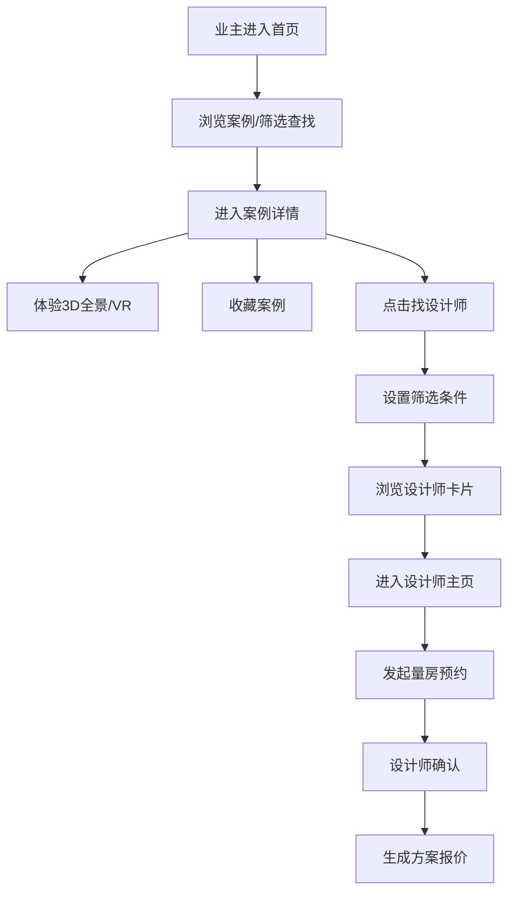
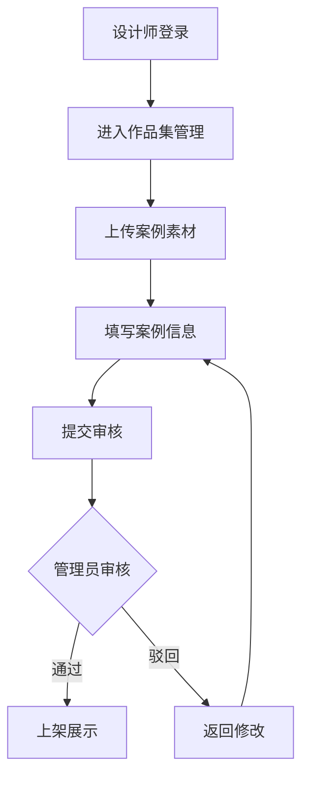
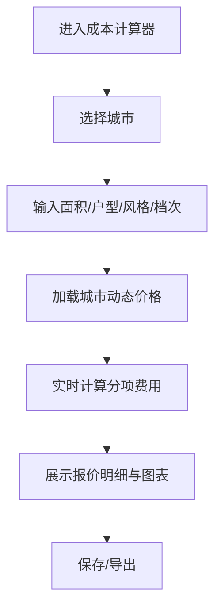

## 1. 产品概述

筑居——专业家装灵感与决策支持平台，服务业主与设计师两大群体。业主通过多维筛选浏览装修案例、体验3D/VR全景、匹配认证设计师、获取智能报价；设计师展示作品集、管理项目、接收业主委托。平台沉淀用户行为数据，驱动个性化推荐与风格趋势洞察。

## 2. 核心功能

### 2.1 用户角色

| 角色 | 注册方式 | 核心权限 |
|------|----------|----------|
| 业主 | 手机号/微信注册 | 浏览案例、VR体验、收藏、预约设计师、使用成本计算器 |
| 设计师 | 认证注册（资质审核） | 作品集管理、接收委托、方案报价生成、案例发布 |
| 管理员 | 后台分配 | 案例审核、设计师认证管理、数据报表、趋势周报 |

### 2.2 功能模块

1. **首页**: 品牌视觉展示、热门案例推荐、风格趋势预览、设计师精选、快速搜索入口
2. **案例库页**: 多维筛选面板、案例瀑布流/网格切换、案例卡片（封面+标签+收藏）
3. **案例详情页**: 平面图查看、3D全景漫游（WebGL）、材料清单、施工节点时间线、VR模式切换
4. **找设计师页**: 地域/风格/报价智能匹配、设计师卡片、在线量房预约、方案报价生成器
5. **设计师主页**: 作品集展示、认证标识、服务项目、业主评价
6. **成本计算器页**: 按城市选择、面积输入、风格偏好、动态人工辅料价格、分项报价明细
7. **收藏夹页**: 案例收藏、设计师收藏、跨设备同步
8. **后台管理页**: 案例审核流（原创性水印校验）、设计师作品集管理、业主收藏同步、数据看板、趋势周报生成

### 2.3 页面详情

| 页面名称 | 模块名称 | 功能描述 |
|----------|----------|----------|
| 首页 | Hero轮播 | 沉浸式全屏轮播展示精选案例，3秒自动切换，支持手势滑动 |
| 首页 | 风格趋势卡片 | 展示当前热门风格标签，点击进入筛选结果 |
| 首页 | 设计师推荐 | 横向滚动卡片展示认证设计师，含头像/姓名/擅长/评分 |
| 首页 | 快速入口 | 装修计算器、VR体验、预约量房快捷入口 |
| 案例库页 | 筛选面板 | 风格（现代/北欧/中式/日式/轻奢/工业等）、户型（1-5居/复式/别墅）、面积区间、预算区间四维筛选 |
| 案例库页 | 案例网格 | 响应式瀑布流布局，每卡片含封面图/标题/标签/收藏按钮 |
| 案例详情页 | 平面图查看 | 可缩放拖拽的平面图展示，标注功能分区 |
| 案例详情页 | 3D全景漫游 | WebGL渲染的3D空间，支持鼠标拖拽旋转/滚轮缩放，热点标注材料信息 |
| 案例详情页 | 材料清单 | 分区材料列表，含品牌/型号/单价/用量，支持导出 |
| 案例详情页 | 施工节点 | 时间线形式展示各施工阶段说明与周期 |
| 案例详情页 | VR模式 | 全屏沉浸模式，兼容手机陀螺仪旋转与PC鼠标交互 |
| 找设计师页 | 智能匹配筛选 | 地域/擅长风格/报价区间三维筛选，支持排序 |
| 找设计师页 | 设计师卡片 | 头像/姓名/认证等级/作品数/评分/擅长标签/报价区间 |
| 找设计师页 | 量房预约 | 日历式预约表单，选择时段提交预约 |
| 找设计师页 | 报价生成器 | 选择服务项+面积+风格，自动生成方案报价 |
| 设计师主页 | 作品集 | 网格展示设计师案例，点击进入详情 |
| 设计师主页 | 认证标识 | 土巴兔认证体系标识展示 |
| 成本计算器页 | 城市选择 | 下拉选择城市，动态加载该城市人工辅料价格 |
| 成本计算器页 | 计算表单 | 面积/户型/风格/装修档次输入，实时计算分项费用 |
| 成本计算器页 | 报价明细 | 分项展示（人工/辅料/主材/家具/家电），饼图+柱状图可视化 |
| 收藏夹页 | 收藏分组 | 案例收藏/设计师收藏分组展示 |
| 后台管理页 | 案例审核 | 待审核列表，含原创性水印校验结果，通过/驳回操作 |
| 后台管理页 | 作品集管理 | 设计师作品集编辑/上下架 |
| 后台管理页 | 数据看板 | 用户浏览路径分析、转化漏斗、热门风格统计 |
| 后台管理页 | 趋势周报 | 自动生成热门风格趋势周报，含图表与文字解读 |

## 3. 核心流程

### 3.1 业主浏览案例并预约设计师流程

业主进入首页 → 浏览热门案例/使用筛选查找 → 进入案例详情 → 体验3D全景/VR漫游 → 收藏案例 → 点击"找设计师" → 设置筛选条件 → 浏览设计师卡片 → 进入设计师主页查看作品集 → 发起量房预约 → 设计师确认 → 生成方案报价

### 3.2 设计师发布案例并审核流程

设计师登录 → 进入作品集管理 → 上传案例素材（含水印图） → 填写案例信息 → 提交审核 → 管理员审核（原创性校验） → 通过后上架展示 / 驳回返回修改

### 3.3 装修成本计算流程

用户进入成本计算器 → 选择城市 → 输入面积/户型/风格/档次 → 系统加载该城市动态价格 → 实时计算分项费用 → 展示报价明细与图表 → 保存/导出

## 4. 用户界面设计

### 4.1 设计风格

- **设计基调**: 建筑杂志感——精致、温暖、有呼吸感，兼具专业度与生活美学
- **主色**: 暖砂色 `#C4A882`（温暖质感）搭配深炭色 `#2C2C2C`（专业沉稳）
- **辅助色**: 奶白色 `#F7F3EE`（背景）、鼠尾草绿 `#8B9E7E`（点缀）、柔金色 `#D4B896`（高光）
- **按钮风格**: 圆角6px，主按钮实心暖砂色，次按钮描边风格，悬浮微上浮+阴影
- **字体**: 标题使用 `Playfair Display`（衬线优雅），正文使用 `Noto Sans SC`（中文清晰）
- **布局**: 顶部固定导航+侧边筛选面板，内容区最大宽度1400px居中，大量留白营造呼吸感
- **图标**: Lucide图标库，线条风格统一
- **动效**: 页面切换渐隐渐显，卡片悬浮缓浮，3D场景平滑过渡

### 4.2 页面设计概览

| 页面名称 | 模块名称 | UI元素 |
|----------|----------|--------|
| 首页 | Hero轮播 | 全屏视差轮播，大标题衬线字体，底部渐变遮罩，指标圆点导航 |
| 首页 | 风格趋势 | 横向标签云，活跃标签暖砂色底，悬浮缩放 |
| 首页 | 设计师推荐 | 横向滚动卡片，圆角头像+认证徽章，悬浮投影加深 |
| 首页 | 快速入口 | 四宫格图标入口，毛玻璃背景，图标微动 |
| 案例库页 | 筛选面板 | 左侧固定面板，下拉+滑块组合，折叠分组，应用/重置按钮 |
| 案例库页 | 案例网格 | 瀑布流布局，卡片圆角12px，悬浮缩放1.02+阴影，标签徽章 |
| 案例详情页 | 3D全景 | 全宽WebGL画布，底部控制栏（旋转/缩放/VR切换），热点气泡弹窗 |
| 案例详情页 | 材料清单 | 表格+分区手风琴，行悬浮高亮，总价汇总底栏 |
| 案例详情页 | 施工节点 | 纵向时间线，节点圆点+连接线，展开/折叠详情 |
| 找设计师页 | 匹配筛选 | 顶部横排筛选器，下拉+标签选择，筛选结果实时刷新 |
| 找设计师页 | 设计师卡片 | 左图右文布局，认证等级星标，悬浮展示更多作品缩略图 |
| 找设计师页 | 预约表单 | 模态弹窗，日历组件，时段选择，备注文本域 |
| 成本计算器页 | 计算表单 | 左右分栏（表单/结果），实时联动，滑块+输入框双控件 |
| 成本计算器页 | 报价图表 | 饼图（费用占比）+柱状图（分项对比），悬浮tooltip |
| 后台管理页 | 审核列表 | 表格布局，状态标签彩色区分，行操作按钮 |
| 后台管理页 | 数据看板 | 卡片式指标+折线图+热力图，深色主题 |

### 4.3 响应式设计

- 桌面优先设计，最大宽度1400px居中
- 平板端（768-1024px）：筛选面板折叠为顶部抽屉，卡片双列
- 移动端（<768px）：单列布局，底部导航栏，筛选全屏弹窗，VR模式全屏陀螺仪

### 4.4 3D场景指引

- **环境**: 室内家居场景，自然光为主（HDRI环境贴图），暖色氛围光
- **灯光**: 环境光+平行光模拟日光+点光源模拟射灯，阴影柔和
- **相机**: 透视相机，FOV 60，初始位置人眼高度，限制旋转范围防止穿模
- **交互**: OrbitControls旋转缩放，热点Hotspot点击弹窗，VR模式陀螺仪控制
- **性能**: 模型面数控制在50万以内，纹理压缩，LOD加载，目标60fps
