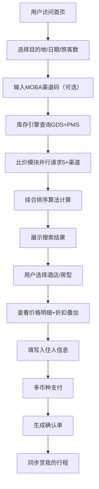
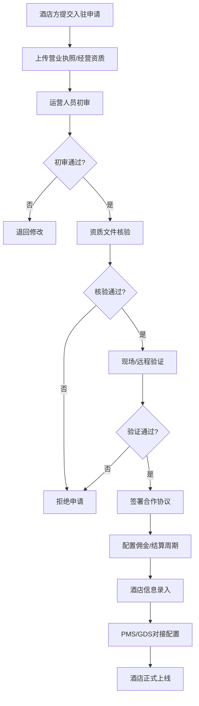
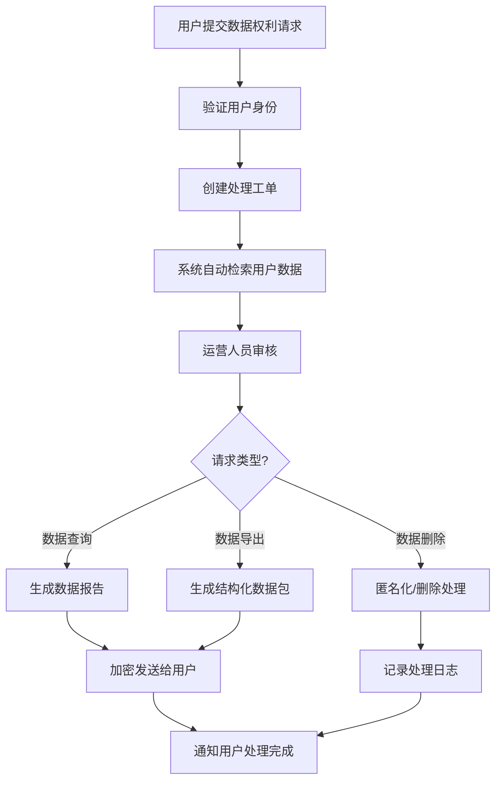

## 1. 产品概述

StayGlobal 是一个面向全球旅行者与酒店集团的跨境住宿预订SaaS平台，提供多语言多币种预订体验、智能比价、会员权益管理及酒店入驻后台管理等全链路服务。

- 核心价值：通过聚合GDS、直连PMS及多渠道比价，为旅行者提供最优价格选择，为酒店集团提供高效的库存与分销管理
- 目标用户：全球休闲/商务旅行者、连锁酒店集团、独立酒店业主、平台运营管理人员

---

## 2. 核心功能

### 2.1 用户角色

| 角色 | 注册方式 | 核心权限 |
|------|----------|----------|
| 旅行者用户 | 邮箱/手机号/社交账号 | 搜索预订、比价、行程管理、会员权益使用 |
| 酒店管理员 | 酒店入驻审核后开通 | 库存管理、房价设置、订单处理、数据报表 |
| 平台运营 | 内部账号系统 | 酒店入驻审核、佣金配置、税务规则管理、GDPR数据处理 |
| 财务人员 | 内部账号系统 | 佣金结算、发票管理、对账报表 |

### 2.2 功能模块

1. **前台预订系统**：多语言切换、多币种展示、目的地搜索、日期选择、MOBA渠道码识别、折扣叠加计算
2. **智能比价引擎**：并行请求5+渠道接口、综合评分算法（价格35%+评分25%+取消灵活度20%+位置权重20%）
3. **库存管理引擎**：GDS对接、直连PMS、实时房态同步、价格波动监控、取消政策管理
4. **行程管理工具**：多段预订合并、离线确认单、共享行程链接、行程提醒
5. **会员体系**：Silver/Gold等级、VIP房型锁定、延迟退房、积分兑换
6. **运营后台**：酒店入驻审核流、佣金周期配置、税务规则适配（VAT自动计算）、GDPR数据主体权利通道

### 2.3 页面详情

| 页面名称 | 模块名称 | 功能描述 |
|----------|----------|----------|
| 首页 | Hero搜索区 | 目的地搜索、日期选择、旅客人数、MOBA优惠码输入 |
| 首页 | 热门目的地 | 全球热门城市卡片展示、季节性推荐 |
| 首页 | 会员权益展示 | Silver/Gold等级权益预览、会员入口 |
| 搜索结果页 | 筛选面板 | 价格区间、星级、设施、取消政策、房型筛选 |
| 搜索结果页 | 比价结果列表 | 多渠道价格对比、综合排序、渠道标识 |
| 搜索结果页 | 排序控制 | 综合排序/价格从低到高/评分优先/距离优先 |
| 酒店详情页 | 酒店信息 | 图片轮播、评分展示、位置地图、设施标签 |
| 酒店详情页 | 房型列表 | 多房型展示、价格明细、取消政策说明 |
| 酒店详情页 | 价格对比 | 同房型不同渠道价格对比、折扣叠加计算 |
| 预订确认页 | 入住信息 | 入住人信息填写、特殊需求备注 |
| 预订确认页 | 价格明细 | 房费、税费、服务费、折扣明细、总价计算 |
| 预订确认页 | 支付方式 | 多币种支付、信用卡/数字钱包选择 |
| 我的行程 | 行程列表 | 进行中/已完成/已取消预订分类展示 |
| 我的行程 | 行程详情 | 多段行程合并展示、确认单下载、离线查看、分享链接 |
| 会员中心 | 等级权益 | 当前等级、升级进度、权益列表 |
| 会员中心 | 积分管理 | 积分余额、积分明细、积分兑换 |
| 酒店入驻后台 | 入驻申请 | 酒店信息提交、资质上传、审核进度查询 |
| 酒店运营后台 | 库存管理 | 房态设置、房价调整、取消政策配置 |
| 酒店运营后台 | 订单管理 | 订单列表、订单处理、入住/退房管理 |
| 平台运营后台 | 酒店审核 | 入驻审核流程、资质验证、酒店上线/下线 |
| 平台运营后台 | 佣金配置 | 佣金比例设置、结算周期配置、对账管理 |
| 平台运营后台 | 税务管理 | 各国VAT税率配置、自动计税规则、税务报表 |
| 平台运营后台 | GDPR管理 | 数据查询请求、数据删除请求、数据导出处理 |

---

## 3. 核心流程

### 3.1 搜索预订流程

用户在首页输入目的地和日期，系统自动识别MOBA渠道码，调用库存引擎查询实时房态，比价模块并行请求多渠道接口，按综合算法排序展示结果，用户选择房型后完成支付，生成确认单并同步至行程管理。

### 3.2 酒店入驻审核流程

酒店方提交入驻申请及资质文件，平台运营人员进行初审→资质核验→现场验证→合同签署→酒店配置上线的完整审核流程。

### 3.3 GDPR数据主体权利响应流程

用户提交数据查询/删除/导出请求，系统自动创建工单，运营人员在规定时限内处理，完成后通知用户。

---

## 4. 用户界面设计

### 4.1 设计风格

- **主色调**：深海蓝 (#0F2B46) - 传达信任与专业
- **辅助色**：珊瑚橙 (#FF6B4A) - 突出行动号召；金箔色 (#D4AF37) - 体现高端会员感
- **中性色**：云白 (#FAFAFA)、石墨灰 (#2D3748)、烟灰 (#718096)
- **按钮风格**：圆角8px，悬停时有微妙的提升阴影，点击时有按压反馈
- **字体**：标题使用 Playfair Display（优雅高端），正文使用 Inter（清晰易读）
- **布局风格**：卡片式布局，大量留白，内容区块有微妙的边框和阴影层次
- **图标风格**：线性图标 lucide-react，统一1.5px线条宽度
- **整体风格**：轻奢极简主义，适合高端旅行场景，界面干净优雅但富有细节质感

### 4.2 页面设计概览

| 页面名称 | 模块名称 | UI元素 |
|----------|----------|--------|
| 首页 | Hero搜索区 | 全屏背景图、大标题叠印、搜索框带毛玻璃效果、渐入动画 |
| 搜索结果页 | 比价卡片 | 左侧酒店缩略图、中间信息区、右侧价格对比条、渠道logo徽章 |
| 酒店详情页 | 图片轮播 | 全屏宽图、缩略图导航、平滑过渡、图片放大预览 |
| 预订确认页 | 价格明细 | 折叠式费用明细、动态货币转换、折扣高亮显示 |
| 我的行程 | 时间轴 | 多段行程纵向时间轴、入住/退房节点标记、状态色标 |
| 会员中心 | 权益卡片 | 渐变背景、等级徽章动画、权益图标配说明文字 |
| 运营后台 | 数据看板 | KPI卡片网格、趋势图表、操作快捷入口 |

### 4.3 响应式

- **设计原则**：桌面端优先（1280px+），向下适配平板（768px）和移动端（375px）
- **桌面端**：三栏/两栏布局，侧边导航，内容区最大宽度1440px居中
- **平板端**：侧边栏折叠为图标菜单，搜索结果改为两列卡片
- **移动端**：底部Tab导航，搜索结果单列，图片轮播全屏，表单简化为纵向布局
- **触摸优化**：最小点击区域44x44px，滑动手势支持日期选择和图片浏览

### 4.4 微交互与动画

- **页面加载**：顶部进度条 + 内容区块渐入（staggered delay）
- **搜索动画**：搜索按钮点击后展开loading状态，搜索结果卡片逐个滑入
- **比价过程**：实时显示"已获取X家渠道价格"进度条
- **价格变化**：价格更新时数字滚动动画，价格下降显示绿色向上箭头
- **悬停效果**：卡片轻微上浮+阴影加深，按钮背景色渐变过渡
- **表单交互**：输入框聚焦时边框动画，错误提示抖动效果
