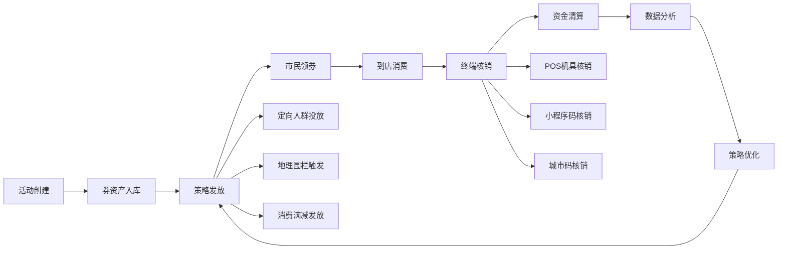
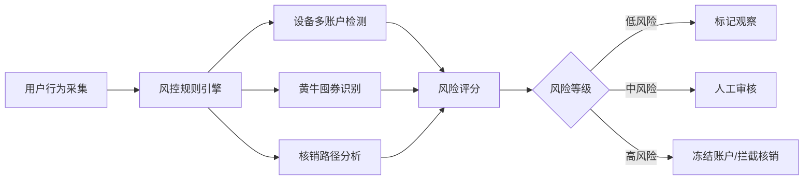

## 1. 产品概述
沈阳市全域惠民服务聚合平台，以"福利券"为核心运营抓手，串联政务、民生、商业三类供给主体，实现券资产全生命周期管理，赋能商户经营，惠及民生消费。

- 核心目标：构建政府、商户、市民三位一体的消费券生态系统
- 目标用户：政府监管部门、入驻商户、沈阳市民
- 市场价值：刺激消费、拉动经济、提升民生福祉、优化政务服务

## 2. 核心功能

### 2.1 用户角色

| 角色 | 注册方式 | 核心权限 |
|------|----------|----------|
| 平台管理员 | 政务账号登录 | 全平台管理、数据监控、财政结算 |
| 商户管理员 | 营业执照认证 | 券活动创建、库存管理、核销对账 |
| 收银员 | 商户账号授权 | 扫码核销、收款确认 |
| 市民用户 | 实名认证/城市码 | 领券、用券、查看券包、智能推荐 |
| 风控人员 | 后台授权 | 风险监控、异常处理、模型调优 |

### 2.2 功能模块

1. **商户管理后台**：仪表盘、券活动管理、库存管理、核销对账、数据报表、预警中心
2. **市民小程序**：首页推荐、券包管理、扫码核销、商圈地图、个人中心
3. **发放策略引擎**：定向人群包投放、地理位置围栏触发、消费满减自动发放
4. **核销终端集成**：POS机具对接、小程序码核销、城市码对接
5. **风控中台**：设备多账户检测、黄牛囤券识别、异常核销路径图谱
6. **智能推荐系统**：历史核销分析、商圈偏好、消费能力分层
7. **跨平台对接**：省级消费券平台接口、财政补贴拨付接口

### 2.3 页面详情

| 页面名称 | 模块名称 | 功能描述 |
|-----------|-------------|---------------------|
| 仪表盘 | 数据概览 | 核销率趋势、实时库存、营收统计、活动状态监控 |
| 券活动列表 | 活动管理 | 创建/编辑/停用活动、活动状态筛选、批量操作 |
| 券活动详情 | 活动配置 | 基础信息、发放规则、使用规则、关联商户 |
| 库存管理 | 库存监控 | 实时扣减、库存预警、批次管理、入库记录 |
| 核销对账 | 财务对账 | 核销流水、对账报表、差异处理、结算申请 |
| 数据报表 | 数据分析 | 核销率趋势、用户画像、商圈热力、品类分析 |
| 预警中心 | 风险监控 | 库存预警、核销率异常、风控预警、消息通知 |
| 商户配置 | 商户信息 | 基础资料、门店管理、POS终端配置、接口设置 |
| 风控监控 | 风险大屏 | 实时风险事件、异常用户列表、设备关联图谱 |
| 省级平台对接 | 跨市结算 | 结算通道配置、资金拨付记录、对账同步 |

## 3. 核心流程

**券资产全生命周期流程**

**风控检测流程**

## 4. 用户界面设计

### 4.1 设计风格
- **主色调**：政务蓝 #1E40AF，代表政府公信力
- **辅助色**：活力橙 #F97316，代表惠民服务热情
- **成功色**：绿色 #10B981，警示色：红色 #EF4444
- **字体系统**：PingFang SC - 现代简洁的中文显示
- **布局风格**：卡片式设计 + 数据可视化大屏 + 侧边导航
- **视觉风格**：现代政务风格，专业可靠，数据突出，操作便捷

### 4.2 页面设计概览

| 页面名称 | 模块名称 | UI元素 |
|-----------|-------------|-------------|
| 仪表盘 | 数据概览 | 顶部导航、侧边栏、KPI卡片、趋势图表、实时数据滚动、预警通知栏 |
| 券活动列表 | 活动管理 | 表格视图、筛选器、搜索框、操作按钮组、状态标签、分页器 |
| 库存管理 | 库存监控 | 库存卡片、进度条、预警图标、流水表格、入库弹窗 |
| 核销对账 | 财务对账 | 日期范围选择、数据表格、导出按钮、对账状态、差异高亮 |
| 预警中心 | 风险监控 | 预警卡片列表、风险等级色标、处理状态、详情抽屉 |

### 4.3 响应性
- **桌面端优先**：后台管理系统主要面向桌面用户（1280px+）
- **平板适配**：支持 768px-1279px 平板设备
- **关键触控优化**：按钮最小高度 36px，数据表格支持横向滚动
- **数据可视化自适应**：图表组件使用 echarts 响应式配置

### 4.4 数据可视化规范
- 使用 ECharts 作为图表库
- 仪表盘采用卡片式布局，间距统一为 16px
- 趋势图使用面积图增强视觉冲击力
- 地图组件支持沈阳行政区划 GeoJSON
- 数据大屏支持全屏模式
