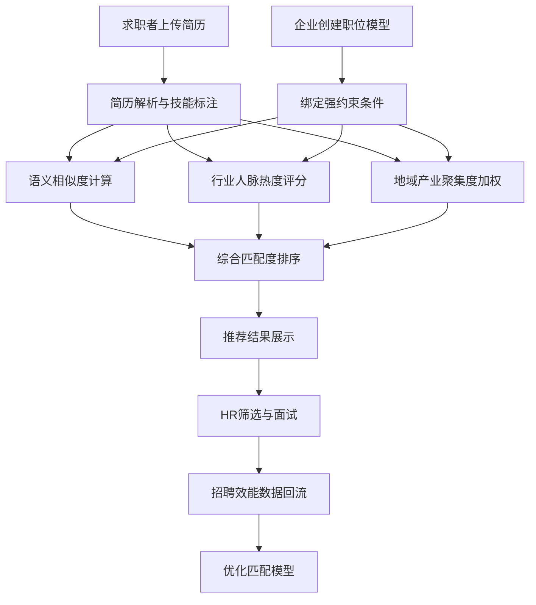

## 1. 产品概述

垂直汽车行业人才匹配平台，专注汽车制造、零部件、新能源、智能驾驶四大细分领域，通过行业知识图谱与多维度匹配引擎，实现人才与岗位的精准对接，解决汽车行业人才供需信息不对称、传统招聘平台缺乏行业深度的问题。

- 目标用户：汽车行业求职者（工程师、技术专家、管理人员）与招聘企业（整车厂、Tier1/Tier2供应商、新能源/智驾企业）
- 核心价值：将行业隐性知识（车型项目经验、认证资质、产业集群分布）显性化并融入匹配逻辑，大幅提升招聘精准度与效率

## 2. 核心功能

### 2.1 用户角色

| 角色 | 注册方式 | 核心权限 |
|------|----------|----------|
| 求职者 | 邮箱/手机注册 | 简历解析、技能标注、岗位匹配、能力缺口提示 |
| 企业HR | 企业邮箱注册 | 职位建模、候选人匹配、招聘效能分析 |
| 猎头 | 邮箱注册+资质认证 | 人才搜索、推荐追踪、合作ROI查看 |
| 平台管理员 | 后台授权 | 知识图谱维护、数据管理、系统配置 |

### 2.2 功能模块

1. **首页**: 行业数据概览、快速搜索入口、四大领域导航、热门岗位推荐
2. **人才中心**: 简历上传与解析、技能标签自动标注、能力缺口分析、职业发展路径
3. **职位中心**: 职位建模工具、强约束条件绑定、职位发布与管理、候选人列表
4. **智能匹配**: 多维度匹配结果展示、匹配度可视化、地域产业聚集推荐、行业人脉热度
5. **数据分析**: 简历转化漏斗、岗位填补周期、猎头合作ROI、行业人才趋势
6. **知识图谱**: 岗位技能标签体系、车企认证体系映射、技能关联浏览、行业图谱可视化

### 2.3 页面详情

| 页面名称 | 模块名称 | 功能描述 |
|----------|----------|----------|
| 首页 | Hero区域 | 行业标语、搜索框、四大领域入口卡片 |
| 首页 | 行业数据看板 | 实时岗位数、活跃人才数、匹配成功数 |
| 首页 | 热门岗位 | 按领域分类的热门岗位滚动展示 |
| 首页 | 产业集群地图 | 长春/武汉/合肥等集群可视化入口 |
| 人才中心 | 简历上传 | 支持PDF/Word格式，自动解析结构化信息 |
| 人才中心 | 技能标注 | 基于知识图谱自动标注CATIA/ANSYS/ASPICE等硬技能 |
| 人才中心 | 能力缺口提示 | 对比目标岗位要求，高亮缺失技能与认证 |
| 人才中心 | 职业路径 | 基于行业数据推荐职业发展方向 |
| 职位中心 | 职位建模器 | 可视化构建岗位模型，绑定强约束条件 |
| 职位中心 | 约束条件绑定 | 车型项目经验、试验场测试经历、IATF16949内审员资质等 |
| 职位中心 | 候选人列表 | 匹配度排序的候选人卡片，支持筛选与对比 |
| 智能匹配 | 匹配结果面板 | 三维匹配度（语义/人脉/地域）雷达图 |
| 智能匹配 | 人脉热度 | 校友/前司重合度可视化 |
| 智能匹配 | 地域推荐 | 产业集群优先推荐，地图热力展示 |
| 数据分析 | 转化漏斗 | 简历→筛选→面试→Offer各阶段转化率 |
| 数据分析 | 填补周期 | 各岗位类型平均填补天数趋势 |
| 数据分析 | 猎头ROI | 合作猎头推荐效率、费用/到岗比 |
| 知识图谱 | 技能图谱 | 行业技能标签树，支持点击展开关联 |
| 知识图谱 | 认证映射 | 车企认证体系与岗位等级对应关系 |

## 3. 核心流程

**求职者流程**: 注册→上传简历→系统自动解析与技能标注→查看能力缺口→浏览匹配岗位→查看三维匹配度→投递/联系

**企业HR流程**: 注册→创建职位模型→绑定强约束条件→发布职位→系统智能匹配→查看候选人列表→筛选对比→发起面试

**匹配引擎流程**: 岗位描述与简历项目经历语义相似度计算→行业人脉热度评分（校友/前司重合度）→地域产业聚集度加权→综合匹配度排序→推荐结果展示

## 4. 用户界面设计

### 4.1 设计风格

- **主色调**: 深邃蓝钢色(#0A1628)搭配科技琥珀色(#F59E0B)，传达汽车工业的精密感与新能源的活力
- **辅助色**: 冰蓝(#38BDF8)用于数据可视化，工业灰(#6B7280)用于文字与边框
- **按钮风格**: 圆角微立体(8px)，主按钮为琥珀色实心，次按钮为描边+悬停填充
- **字体**: 标题使用 Audiowide（汽车工业感），正文使用 Noto Sans SC（中文可读性），数据使用 JetBrains Mono
- **布局风格**: 左侧固定导航栏 + 顶部搜索栏 + 内容区域卡片式布局
- **图标风格**: Lucide线性图标，搭配汽车行业专属图标（齿轮/电路/电池等）

### 4.2 页面设计概览

| 页面名称 | 模块名称 | UI元素 |
|----------|----------|--------|
| 首页 | Hero区域 | 全幅深色背景、粒子动画模拟汽车产线、居中搜索框、四领域卡片(制造/零部件/新能源/智驾) |
| 首页 | 行业数据看板 | 三列数据卡片，数字计数动画，底部微光渐变 |
| 首页 | 产业集群地图 | 简化中国地图SVG，标注六大汽车产业集群热点 |
| 人才中心 | 简历解析 | 拖拽上传区域、解析进度环形图、解析结果结构化卡片 |
| 人才中心 | 技能标注 | 技能标签云、颜色区分硬技能/软技能/认证、点击展开详情 |
| 人才中心 | 能力缺口 | 雷达图对比当前技能vs目标要求，缺口区域红色高亮 |
| 职位中心 | 职位建模器 | 步骤式构建器(基本信息→技能要求→强约束→发布)，拖拽排序优先级 |
| 职位中心 | 约束条件 | 标签选择器(车型项目/试验场/认证)，已选条件卡片展示 |
| 智能匹配 | 匹配面板 | 三维雷达图(语义/人脉/地域)、候选人列表卡片、匹配度进度条 |
| 智能匹配 | 人脉热度 | 关系图谱可视化，连线粗细表示关联强度 |
| 智能匹配 | 地域推荐 | 地图热力图层叠，推荐城市气泡标注 |
| 数据分析 | 转化漏斗 | 漏斗图(简历→筛选→面试→Offer)，各阶段转化率标注 |
| 数据分析 | 填补周期 | 折线趋势图+岗位类型分组柱状图 |
| 数据分析 | 猎头ROI | 瀑布图展示费用/到岗比，猎头效率排名表 |
| 知识图谱 | 技能图谱 | 力导向图可视化，节点大小表示热度，连线表示关联 |
| 知识图谱 | 认证映射 | 层级树形图，左列岗位等级右列认证要求 |

### 4.3 响应式策略

- 桌面端优先（1920/1440/1280三档）
- 平板端：导航栏收缩为图标模式，卡片由多列变单列
- 移动端：底部Tab导航，卡片堆叠，图表简化为关键数据

### 4.4 动效设计

- 页面加载：卡片交错淡入（stagger 100ms）
- 数据变化：数字滚动动画（countUp效果）
- 匹配计算：进度条脉冲动画+扫描线效果
- 知识图谱：节点弹性布局，悬停放大+连线高亮
- 地图交互：悬停区域浮起+光晕效果
