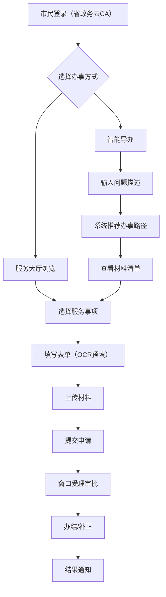
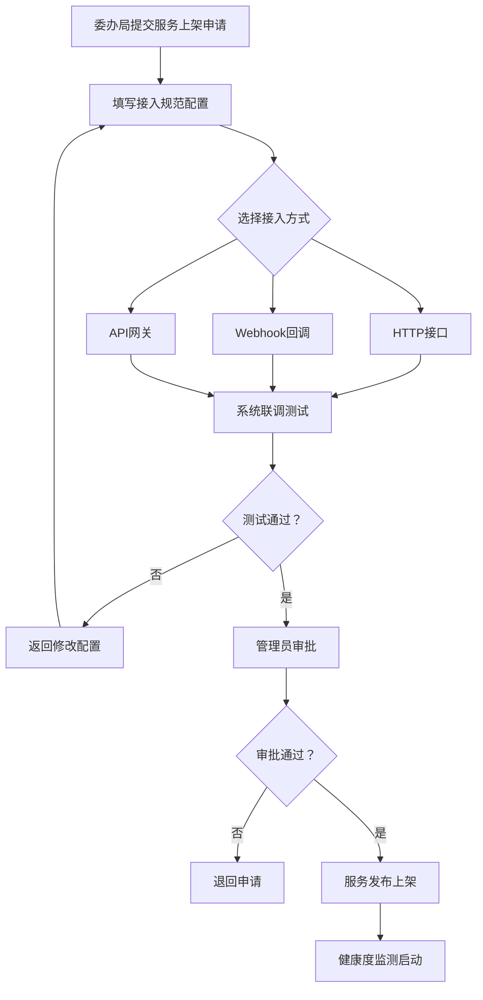

## 1. 产品概述

地市级政务中枢型城市服务工作台，以"一网通办"为底座，整合市本级及县区两级服务资源，实现政务服务事项与便民服务的统一接入、智能导办和运维监测。面向市民提供"一站式"办事体验，面向管理人员提供服务健康度监测、办事热力图和材料减免分析等精细化管理能力，并预留与省级政务中台的双向数据回传通道。

- 目标用户：市民（办事群众）、窗口工作人员、系统管理员/运维人员
- 核心价值：让群众"少跑腿、好办事"，让管理者"看得见、管得住"

## 2. 核心功能

### 2.1 用户角色

| 角色 | 注册方式 | 核心权限 |
|------|----------|----------|
| 市民用户 | 省政务云CA统一认证 | 浏览服务、在线申办、智能导办、个人中心 |
| 窗口工作人员 | 内部账号分配 | 受理审批、材料审核、业务办理 |
| 系统管理员 | 内部账号分配 | 服务上架管理、健康度监测、热力图分析、材料减免配置 |

### 2.2 功能模块

1. **工作台首页**：数据概览、快捷入口、通知公告、热办事项推荐
2. **服务大厅**：政务服务分类浏览、便民服务分类浏览、服务搜索、服务详情
3. **智能导办**：问题描述输入、办事路径推荐、材料清单OCR识别预填、办事进度追踪
4. **管理监测**：服务健康度看板、办事热力图、材料减免分析、省级回传通道状态
5. **服务接入管理**：标准接入规范配置（HTTP/Webhook/API网关）、服务上架/下架、服务审批

### 2.3 页面详情

| 页面名称 | 模块名称 | 功能描述 |
|----------|----------|----------|
| 工作台首页 | 数据概览卡片 | 展示今日办件量、在线服务数、好评率、平均办理时长 |
| 工作台首页 | 快捷入口 | 常用服务快捷入口（社保缴纳、税务预约、水电气缴费等） |
| 工作台首页 | 通知公告 | 最新政策公告滚动展示 |
| 工作台首页 | 热办事项 | 按热度排序的TOP10办事事项 |
| 服务大厅 | 服务分类导航 | 政务服务（社保、税务、投诉反馈）+ 便民服务（水电气、不动产、违章） |
| 服务大厅 | 服务卡片列表 | 每个服务以卡片形式展示名称、图标、简介、办理人数 |
| 服务大厅 | 服务搜索 | 关键词搜索 + 热门搜索标签 |
| 服务详情 | 服务信息 | 服务名称、办理指南、所需材料、办理流程、收费标准 |
| 服务详情 | 在线申办 | 填写表单、上传材料、提交申请 |
| 智能导办 | 问题描述 | 自然语言输入办事需求描述 |
| 智能导办 | 路径推荐 | 根据描述推荐办事路径（含步骤图） |
| 智能导办 | 材料OCR预填 | 上传材料图片自动识别关键字段并预填表单 |
| 智能导办 | 进度追踪 | 查看当前办件进度状态 |
| 管理监测 | 健康度看板 | 各委办局接口响应时长、失败率、超时告警实时监控 |
| 管理监测 | 办事热力图 | 区域/时段/事项三维热力图可视化 |
| 管理监测 | 材料减免分析 | 重复提交字段自动识别、合并建议、减免率统计 |
| 管理监测 | 省级回传通道 | 双向数据回传状态监控与手动触发 |
| 服务接入管理 | 接入规范配置 | HTTP/Webhook/API网关三种接入方式配置 |
| 服务接入管理 | 服务上架审批 | 新服务上架申请、审批、发布流程 |
| 服务接入管理 | 服务生命周期 | 服务版本管理、上下线状态控制 |

## 3. 核心流程

### 3.1 市民办事流程

市民登录系统后，可通过两种方式办理业务：直接在服务大厅查找服务，或通过智能导办获取推荐路径。选择服务后，填写表单并上传材料（支持OCR预填），提交后进入审批流程，可实时追踪办理进度。

### 3.2 服务上架流程

## 4. 用户界面设计

### 4.1 设计风格

- **主色调**：政务蓝（#1A5FB4）为主色，辅以青绿（#2EC4B6）表示便民服务，橙红（#E76F51）表示告警
- **按钮风格**：圆角6px，主按钮使用实色填充，次按钮使用描边样式
- **字体**：标题使用思源黑体（Noto Sans SC），正文使用系统默认无衬线字体，数据数字使用等宽字体
- **布局风格**：左侧固定导航栏 + 顶部工具栏 + 右侧内容区，卡片式内容组织
- **图标风格**：线性图标（Lucide图标库），统一2px描边
- **整体风格**：沉稳专业、信息密度高但不拥挤、政务感与现代化平衡

### 4.2 页面设计概览

| 页面名称 | 模块名称 | UI元素 |
|----------|----------|--------|
| 工作台首页 | 数据概览卡片 | 四宫格卡片布局，深色渐变背景，大号数据数字，同比环比趋势小箭头 |
| 工作台首页 | 快捷入口 | 2行5列图标网格，圆形图标背景，悬停微放大效果 |
| 工作台首页 | 通知公告 | 水平滚动公告栏，左侧标签，右侧时间 |
| 工作台首页 | 热办事项 | 列表布局，左侧排名数字，右侧进度条表示热度 |
| 服务大厅 | 分类导航 | 左侧垂直标签页切换，政务蓝/青绿双色标识 |
| 服务大厅 | 服务卡片 | 3列网格卡片，图标+标题+简介+办理人数标签 |
| 服务大厅 | 搜索栏 | 顶部居中搜索框，下方热门标签chip |
| 智能导办 | 问题描述 | 居中大输入框，对话式交互，底部快捷问题标签 |
| 智能导办 | 路径推荐 | 纵向步骤流程图，每步含图标+描述+材料标签 |
| 智能导办 | OCR预填 | 左侧图片预览区+右侧表单自动填充区，高亮识别字段 |
| 管理监测 | 健康度看板 | 顶部总览仪表盘+下方各委办局状态列表，红黄绿三色标识 |
| 管理监测 | 热力图 | 地图底图+热力叠加层，右侧筛选面板（区域/时段/事项） |
| 管理监测 | 材料减免 | 左侧重复字段表格+右侧合并建议卡片+底部减免率趋势图 |
| 服务接入管理 | 接入配置 | 表单式配置面板，三种接入方式Tab切换，实时测试按钮 |

### 4.3 响应式设计

- 桌面优先设计，核心分辨率1920×1080
- 中等屏幕（1366×768）自适应缩放卡片列数
- 移动端暂不作为优先适配目标，但保证基本可用性

### 4.4 无3D场景需求
