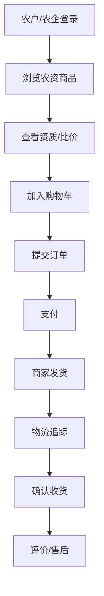
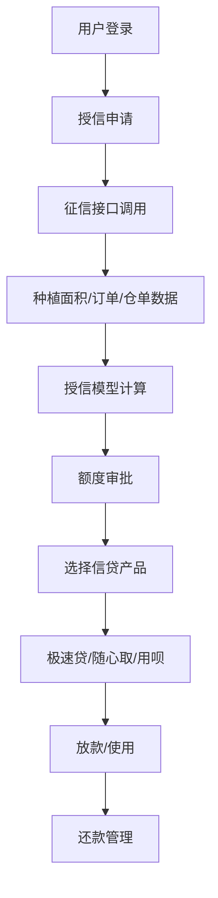
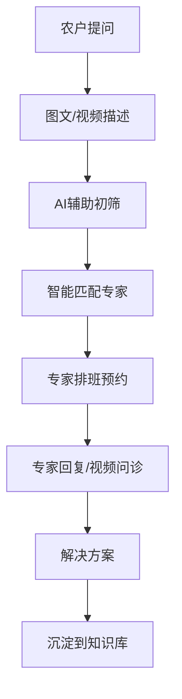
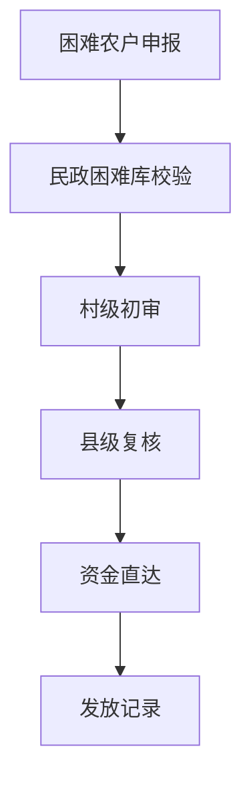

## 1. 产品概述

服务县域经济的综合性助农数字平台，通过整合农资采购、农品上行、普惠信贷、农技支持、本地生活与公益响应六大业务域，构建全方位赋能县域经济。

## 2. 核心功能

### 2.1 用户角色

| 角色 | 注册方式 | 核心权限 |
|------|---------|----------|
| 农户（含合作社） | 手机号注册+实名认证 | 农资采购、农品发布、贷款申请、农技问诊、公益申报 |
| 农企 | 企业资质审核注册 | 农资批量采购、农品集采、信贷申请、供应链管理 |
| 农技专家 | 专家资质审核注册 | 农技答疑、视频问诊、知识库维护、排班管理 |
| 村镇金融机构 | 机构资质审核注册 | 信贷审批、征信查询、额度管理、贷后管理 |
| 基层政务员 | 政务系统对接注册 | 公益审核、数据统计、政策发布、应急响应 |

### 2.2 功能模块

1. **首页导航**：数据大屏、快捷入口、政策公告、热门推荐
2. **农资商城**：商品分类、资质审核、比价系统、订单管理、物流追踪、售后服务
3. **中和金服**：征信接入、授信模型、极速贷、随心取、用呗分期
4. **农品直采**：产地溯源、B2C预售、B2B集采、冷链监控
5. **农技支持**：图文问诊、视频问诊、专家排班、知识库、AI初筛
6. **公益援助**：困难库对接、一键申报、村级初审、县级复核、资金直达
7. **本地生活**：便民服务、政务服务、信息发布
8. **管理后台**：用户管理、商品管理、订单管理、信贷管理、数据统计、系统配置

### 2.3 页面详情

| 页面名称 | 模块名称 | 功能描述 |
|---------|---------|----------|
| 登录注册页 | 身份认证 | 手机号登录、角色选择、实名认证 |
| 首页 | 数据概览 | 角色专属首页、快捷入口、政策公告 |
| 农资商城首页 | 商品展示 | 分类导航、搜索筛选、商品列表、资质标签 |
| 农资商品详情页 | 商品详情 | 规格选择、价格对比、资质展示、评价、加入购物车 |
| 农资下单页 | 订单创建 | 地址选择、优惠券、发票、提交订单 |
| 农资订单列表页 | 订单管理 | 待付款、待发货、待收货、已完成、售后 |
| 农资订单详情页 | 订单详情 | 物流轨迹、物流信息、售后申请 |
| 农资售后页 | 售后服务 | 退换货申请、售后处理、退款 |
| 中和金服首页 | 金融服务 | 授信额度、信贷产品展示、申请入口 |
| 极速贷申请页 | 极速贷 | 资料提交、自动审批、24h放款 |
| 随心取申请页 | 循环贷 | 额度申请、支取、还款 |
| 用呗申请页 | 消费分期 | 分期申请、还款计划 |
| 信贷管理页 | 机构端 | 申请列表、审批、放款、贷后 |
| 农品直采首页 | 农品展示 | 产地溯源标签、预售/集采入口 |
| 农品预售页 | B2C预售 | 预售商品、下单、冷链监控 |
| 农品集采页 | B2B集采 | 集采需求、报价、撮合 |
| 农品溯源页 | 溯源查询 | 溯源信息、冷链监控 |
| 农技首页 | 农技服务 | 问诊入口、专家列表、知识库 |
| 图文问诊页 | 图文咨询 | 问题描述、图片上传、AI初筛、专家回复 |
| 视频问诊页 | 视频咨询 | 预约排班、视频通话、问诊记录 |
| 专家排班页 | 排班管理 | 专家可预约时间 |
| 知识库页 | 知识沉淀 | 农技文章、视频、搜索 |
| 公益援助首页 | 公益服务 | 援助政策、申报入口、进度查询 |
| 公益申报页 | 申报填写 | 困难信息、证明材料上传 |
| 公益审核页 | 审核流程 | 村级初审、县级复核 |
| 资金发放页 | 资金管理 | 资金直达、发放记录 |
| 本地生活首页 | 生活服务 | 便民服务、政务服务入口 |
| 管理后台首页 | 数据概览 | 平台数据统计、运营管理入口 |
| 用户管理页 | 用户管理 | 用户列表、角色管理、权限配置 |
| 商品管理页 | 商品管理 | 农资/农品上架、审核 |
| 订单管理页 | 订单管理 | 所有订单查询、处理 |
| 信贷管理页 | 信贷管理 | 信贷产品、审批、风控 |
| 数据统计页 | 数据分析 | 交易数据、用户数据、业务数据 |

## 3. 核心流程

### 3.1 农资采购流程

### 3.2 信贷申请流程

### 3.3 农技问诊流程

### 3.4 公益援助流程

## 4. 用户界面设计

### 4.1 设计风格

- **主色调**：#2E7D32（农业绿）
- **辅助色**：#FF8F00（丰收橙）、#1565C0（信任蓝）
- **按钮风格**：圆角矩形、渐变填充、微阴影
- **字体**：Noto Sans SC 中文显示
- **布局**：顶部导航 + 左侧菜单 + 内容卡片式布局
- **图标**：农业主题图标，线稿风格

### 4.2 页面设计概览

| 页面名称 | 模块名称 | UI 元素 |
|---------|---------|----------|
| 登录页 | 身份选择 | 大卡片式角色选择、渐变背景 |
| 首页 | 数据概览 | 数据卡片、图表可视化 |
| 农资商城 | 商品列表 | 卡片式商品展示、资质标签 |
| 信贷首页 | 金融服务 | 额度卡片、产品展示 |
| 农技问答 | 问诊列表 | 对话式布局、视频通话 |
| 公益援助 | 申报流程 | 步骤指示器、表单 |
| 管理后台 | 数据统计 | 仪表盘、数据可视化 |

### 4.3 响应式

- 桌面端优先设计，适配 1920px 及以上分辨率
- 平板端自适应布局自适应
- 移动端单列布局，触控优化

## 5. 非功能性需求

### 5.1 性能要求

- 页面加载时间 < 2秒
- API 响应时间 < 500ms
- 支持 1000+ 并发用户

### 5.2 安全要求

- 数据加密传输（HTTPS）
- 敏感数据加密存储
- 操作日志完整记录
- 权限严格控制

### 5.3 数据要求

- 所有核心操作落库
- 支持审计追踪
- 数据备份机制
