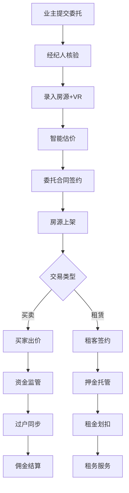

## 1. 产品概述

租售装服一体化居住服务平台——覆盖分散式合租/整租、集中式公寓、二手房买卖全场景，连接租客、买家、业主与经纪人，整合保洁/维修/搬家/装修等服务工单，实现从找房、签约、交易到售后的一站式线上闭环。

- 解决多类型房源分散管理、交易流程不透明、租务与售后服务割裂的痛点
- 面向中小型房产经纪公司与服务商，提供可落地的一体化运营系统

## 2. 核心功能

### 2.1 用户角色

| 角色 | 注册方式 | 核心权限 |
|------|----------|----------|
| 租客/买家 | 手机号注册 | 浏览房源、在线签约、提交工单、查看交易进度 |
| 业主 | 手机号注册 | 发布房源委托、查看估价、管理合同、查看收益 |
| 经纪人（自营） | 后台分配账号 | 房源录入/跟进、带看管理、佣金结算、工单派发 |
| 经纪人（加盟） | 手机号注册审核 | 同自营，但佣金比例独立配置 |
| 管理员 | 后台分配账号 | 全模块管理、业绩看板、系统配置 |

### 2.2 功能模块

1. **房源管理中心**：多类型房源CRUD、VR全景嵌入、户型图结构化标注、智能估价、委托合同电子签约
2. **交易流程中心**：买房佣金五折计费、资金监管账户、过户进度节点同步
3. **租务管理中心**：租约周期管理、租金自动划扣、押金托管与退还、租客信用分联动、维修工单派单与SLA考核
4. **服务工单中心**：保洁/维修/搬家/装修工单创建与流转、SLA时效考核
5. **后台运营中心**：经纪人业绩看板、房源健康度诊断、供应链协同中心

### 2.3 页面详情

| 页面名称 | 模块名称 | 功能描述 |
|----------|----------|----------|
| 登录页 | 登录表单 | 手机号+密码登录，角色选择 |
| 工作台首页 | 数据概览 | 待办事项、快捷入口、关键指标卡片 |
| 房源列表页 | 房源筛选 | 按类型/区域/价格/状态筛选，支持列表/卡片切换 |
| 房源详情页 | 房源信息 | VR全景嵌入区、户型图标注、估价结果、操作按钮 |
| 房源录入页 | 表单录入 | 多步骤表单，支持上传VR链接、标注户型图 |
| 估价报告页 | 智能估价 | 基于小区成交价+装修指数+楼层系数的估价明细 |
| 合同签约页 | 电子签约 | 合同模板预览、电子签名、存证哈希展示 |
| 交易列表页 | 交易管理 | 买房交易进度、佣金计算、资金监管状态 |
| 交易详情页 | 交易流程 | 过户节点时间线、资金流水、佣金明细 |
| 租约列表页 | 租约管理 | 租约状态筛选、到期预警、续约操作 |
| 租约详情页 | 租约信息 | 租金划扣记录、押金托管状态、信用分展示 |
| 工单列表页 | 工单管理 | 按类型/状态/SLA筛选，超时标红 |
| 工单详情页 | 工单处理 | 工单流转记录、SLA倒计时、派单/完成操作 |
| 经纪人看板 | 业绩统计 | 成交量/带看量/佣金排行、趋势图 |
| 房源诊断页 | 健康度分析 | 空置率/带看转化率/价格偏离度图表 |
| 供应链中心 | 协同管理 | 装修建材商/家政服务商列表、合作状态管理 |
| 系统设置页 | 系统配置 | 佣金规则、SLA规则、信用分权重配置 |

## 3. 核心流程

### 3.1 房源委托与估价流程

业主提交房源委托 → 经纪人上门核验 → 录入房源信息（含VR/户型图） → 系统智能估价 → 业主确认委托价格 → 签订委托合同（电子签约+存证） → 房源上架

### 3.2 买房交易流程

买家浏览房源 → 预约带看 → 经纪人带看记录 → 买家出价 → 业主确认 → 签订买卖合同 → 资金存入监管账户 → 过户流程节点同步 → 资金划转 → 佣金结算（五折计费）

### 3.3 租务管理流程

租客选房 → 签订租约 → 押金托管 → 租金自动划扣（月度） → 租客信用分联动 → 维修工单提交 → 派单与SLA考核 → 租约到期/续约/退租 → 押金退还

## 4. 用户界面设计

### 4.1 设计风格

- 主色调：深靛蓝 #1E3A5F（信任/专业），辅色：暖橙 #F59E0B（活力/行动）
- 按钮：圆角8px，主按钮填充深靛蓝，次按钮描边
- 字体：思源黑体/苹方，正文14px，标题20-28px
- 布局：左侧导航+右侧内容区，卡片式内容组织
- 图标：线性图标风格（Lucide）

### 4.2 页面设计概览

| 页面名称 | 模块名称 | UI要素 |
|----------|----------|--------|
| 工作台首页 | 数据概览 | 4列指标卡片、待办列表、快捷操作按钮 |
| 房源列表页 | 筛选+列表 | 左侧筛选面板、右侧卡片网格/列表切换 |
| 房源详情页 | VR+信息 | 顶部VR全景嵌入区、中部户型图标注、底部信息卡 |
| 合同签约页 | 签约流程 | 步骤条、合同预览区、签名板、存证哈希 |
| 交易详情页 | 节点时间线 | 左侧时间线、右侧详情卡片 |
| 租约详情页 | 租约信息 | 信息卡片组、划扣日历、押金进度条 |
| 工单列表页 | 工单卡片 | 状态标签颜色区分、SLA倒计时高亮 |
| 经纪人看板 | 业绩图表 | 柱状图/折线图、排行榜样式 |
| 房源诊断页 | 诊断图表 | 仪表盘式指标、趋势折线图 |

### 4.3 响应式设计

- 桌面优先（1920px/1440px/1280px），平板（768px）可横向滚动
- 导航栏在窄屏下折叠为汉堡菜单
- 表格在窄屏下转为卡片列表

### 4.4 3D场景指引

- 不涉及3D场景，VR全景通过iframe嵌入第三方VR服务商页面
