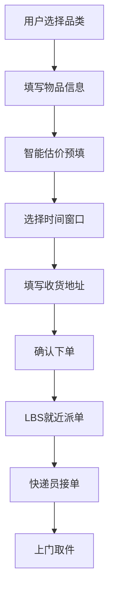
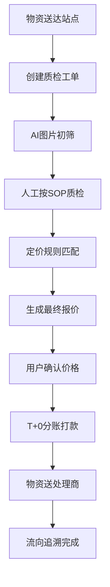
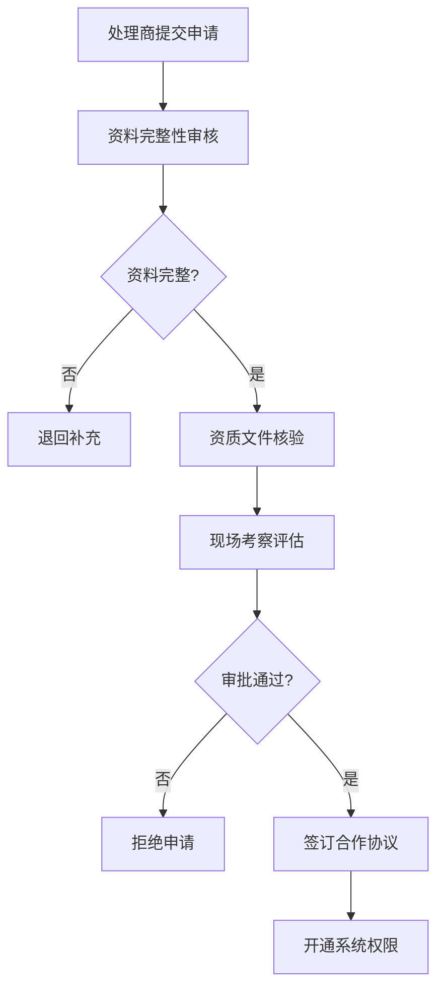

## 1. 产品概述

C2B旧物回收履约中台系统，聚焦衣服、图书、手机三类标的物，支持预约-上门-质检-估价-打款全链路线上化。系统面向C端用户提供便捷的旧物回收服务，面向B端运营人员提供完整的质检、定价、分账、物流管理能力。

- 主要目的：构建高效的旧物回收履约闭环，提升回收效率与用户体验
- 目标用户：C端个人用户、运营质检人员、财务人员、物流管理员、环保处理商
- 市场价值：推动闲置资源循环利用，建立标准化、可追溯的回收履约体系

## 2. 核心功能

### 2.1 用户角色

| 角色 | 注册方式 | 核心权限 |
|------|----------|----------|
| C端用户 | 手机号/微信登录 | 预约回收、智能估价、订单追踪、查看打款记录、公益追溯 |
| 运营管理员 | 后台账号 | 质检工单处理、定价规则配置、用户与订单管理 |
| 财务人员 | 后台账号 | 分账审核、打款操作、对账报表 |
| 物流调度员 | 后台账号 | 快递员派单、物流状态跟踪、物流商对接 |
| 环保处理商 | 资质申请入驻 | 接收回收物资、处理进度上报 |

### 2.2 功能模块

1. **用户端首页**：品类入口、智能估价、预约入口、订单快捷入口、回收数据展示
2. **智能估价页**：品类选择(衣服/图书/手机)、品牌/型号选择、成色评估、预估价格展示
3. **预约下单页**：回收品类确认、上门时间窗口选择、地址管理、快递员就近派单
4. **订单追踪页**：订单全流程状态、物流实时位置、质检进度、打款状态
5. **运营仪表盘**：核心数据指标、待处理工单、今日回收概览、趋势图表
6. **质检工单系统**：工单列表、质检SOP流程、图片上传、AI初筛结果、人工复核
7. **定价规则引擎**：多级定价规则配置、按重量/型号/行情浮动、规则测试模拟
8. **分账管理页**：待打款列表、T+0分账操作、微信零钱/银行卡打款、公益捐赠追溯
9. **物流调度页**：快递员管理、LBS就近派单、顺丰/京东物流对接、运单追踪
10. **环保处理商管理**：资质审核工作流、处理商列表、物资流向追溯
11. **数据统计看板**：用户回收频次、品类偏好分析、地域分布、回收量趋势

### 2.3 页面详情

| 页面名称 | 模块名称 | 功能描述 |
|----------|----------|----------|
| 用户端首页 | 品类入口区 | 三大品类卡片(衣服/图书/手机)，点击进入对应估价流程 |
| 用户端首页 | 智能估价快速入口 | 表单式快速估价，选择品类后展示预估价格区间 |
| 用户端首页 | 我的订单快捷区 | 最近订单状态卡片，一键查看详情 |
| 用户端首页 | 环保数据展示 | 累计回收量、减碳量、公益捐赠数据 |
| 智能估价页 | 品类选择器 | 三大品类切换，展示各品类回收说明 |
| 智能估价页 | 品牌型号选择 | 支持手机品牌/型号、图书ISBN/分类、衣物材质/重量 |
| 智能估价页 | 成色评估 | 成色拉条/选项，实时影响估价结果 |
| 智能估价页 | 价格展示 | 预估价格区间、价格计算公式说明 |
| 预约下单页 | 时间窗口选择 | 未来7天可选择时间段，显示快递员可用状态 |
| 预约下单页 | 地址管理 | 新增/编辑/选择收货地址，支持LBS定位 |
| 预约下单页 | 订单确认 | 品类数量、预估价格、上门信息确认 |
| 订单追踪页 | 状态时间轴 | 预约-上门-质检-估价-打款全流程状态 |
| 订单追踪页 | 物流地图 | 快递员实时位置、预计到达时间 |
| 订单追踪页 | 质检报告 | 质检图片、AI初筛结果、最终估价 |
| 运营仪表盘 | KPI指标卡 | 今日订单、待质检、待打款、累计回收量 |
| 运营仪表盘 | 趋势图表 | 近7日/30日订单量、回收品类占比饼图 |
| 运营仪表盘 | 待办列表 | 紧急工单、异常订单提醒 |
| 质检工单系统 | 工单列表 | 筛选、搜索、批量操作、状态标签 |
| 质检工单系统 | 质检详情 | SOP步骤导航、图片上传区、AI识别结果展示 |
| 质检工单系统 | 人工复核 | 成色确认、重量输入、瑕疵标记、最终定价 |
| 定价规则引擎 | 规则列表 | 按品类分组的定价规则，启用/禁用状态 |
| 定价规则引擎 | 规则编辑器 | 条件组合(重量/成色/品牌)、价格计算公式、优先级 |
| 定价规则引擎 | 模拟测试 | 输入参数测试定价结果，规则冲突检测 |
| 分账管理页 | 待打款列表 | 订单信息、收款账户、打款金额、批量操作 |
| 分账管理页 | 打款操作 | 微信零钱/银行卡选择、T+0实时到账、打款凭证 |
| 分账管理页 | 公益追溯 | 捐赠流向、受捐机构、捐赠证书下载 |
| 物流调度页 | 快递员管理 | 快递员列表、在线状态、服务区域、评分 |
| 物流调度页 | 智能派单 | LBS就近匹配、订单分配、派单状态跟踪 |
| 物流调度页 | 物流对接 | 顺丰/京东物流API配置、运单同步、异常处理 |
| 环保处理商管理 | 资质审核 | 申请列表、资料审核、现场核验、审批流程 |
| 环保处理商管理 | 处理商管理 | 合作处理商列表、处理能力、评级管理 |
| 环保处理商管理 | 物资追溯 | 物资批次、流向追踪、处理结果反馈 |
| 数据统计看板 | 用户分析 | 回收频次分布、用户活跃度、复购率 |
| 数据统计看板 | 品类分析 | 各品类回收量、均价趋势、品牌排行 |
| 数据统计看板 | 运营分析 | 地域分布、渠道来源、质检效率、打款时效 |

## 3. 核心流程

### 3.1 用户回收预约流程

用户选择回收品类 → 填写物品信息 → 智能估价预填 → 选择上门时间窗口 → 填写/选择地址 → 确认下单 → 系统LBS就近派单 → 快递员接单 → 上门取件

### 3.2 质检定价打款流程

快递员送回站点 → 质检工单创建 → AI初筛(图片识别) → 人工质检SOP流程 → 多级定价规则匹配 → 最终定价确认 → 用户确认价格 → T+0分账打款 → 物资送至环保处理商 → 流向追溯完成

### 3.3 环保处理商资质审核流程

处理商提交申请 → 资料完整性审核 → 资质文件核验 → 现场考察评估 → 审批决策 → 签订合作协议 → 开通系统权限

## 4. 用户界面设计

### 4.1 设计风格

- **主色调**：环保绿色系(#10B981 主绿、#059669 深绿、#34D399 浅绿)，传递可持续、环保理念
- **辅助色**：温暖橙色(#F97316)用于行动按钮和强调元素，深蓝(#1E40AF)用于数据和金融模块
- **中性色**：暖灰系(#1F2937、#4B5563、#9CA3AF、#F3F4F6)，确保信息层次清晰
- **按钮风格**：圆角矩形(radius-xl)，主按钮绿色渐变填充，悬停时轻微上浮+阴影增强，点击有按压反馈
- **字体**：中文使用Noto Sans SC，数字和英文使用Inter，标题字重600-700，正文400-500
- **布局风格**：卡片式布局，运营端采用左侧导航+顶部工作区的经典后台结构，用户端采用底部Tab导航
- **图标风格**：线性图标，圆角端点，与整体圆润风格统一

### 4.2 页面设计概览

| 页面名称 | 模块名称 | UI元素 |
|----------|----------|--------|
| 用户端首页 | 品类入口区 | 大卡片+品类图标，渐变色背景，悬浮动效 |
| 用户端首页 | 环保数据展示 | 数字滚动动画，环形进度条，图标徽章 |
| 智能估价页 | 品类选择器 | Tab切换，选中态底部绿色指示条 |
| 智能估价页 | 成色评估 | 滑杆组件，实时价格联动动画 |
| 预约下单页 | 时间窗口选择 | 日历网格，可选时段高亮，已约满置灰 |
| 订单追踪页 | 状态时间轴 | 竖线时间轴，完成态绿色对勾，进行态脉冲动画 |
| 运营仪表盘 | KPI指标卡 | 数字大字号，趋势迷你图，环比数据标签 |
| 质检工单系统 | 工单列表 | 表格+筛选栏，状态彩色标签，优先级标记 |
| 质检工单系统 | AI初筛结果 | 图片+识别结果对比卡片，置信度进度条 |
| 定价规则引擎 | 规则编辑器 | 条件卡片拖拽排序，公式编辑器，实时预览 |
| 分账管理页 | 打款操作 | 账户选择卡片，打款确认弹窗，成功动画 |
| 数据统计看板 | 图表区域 | ECharts图表，渐变色填充，数据悬浮提示 |

### 4.3 响应式设计

- 采用桌面优先策略，用户端适配1024px以上桌面及平板横屏
- 运营后台主内容区最小宽度1280px，侧边栏可折叠
- 表格组件在窄屏下支持横向滚动，关键列固定
- 触控设备优化：点击热区≥44px，滑动手势支持

### 4.4 动画与交互

- 页面进入：内容区块渐入+轻微上移，stagger延迟100ms
- 卡片悬浮：translateY(-2px)，阴影从shadow-md增强至shadow-lg
- 状态切换：时间轴节点脉冲动画，进度条平滑过渡
- 数据更新：数字递增动画，图表数据渐变过渡
- 成功反馈：绿色勾号绘制动画，轻量toast提示
