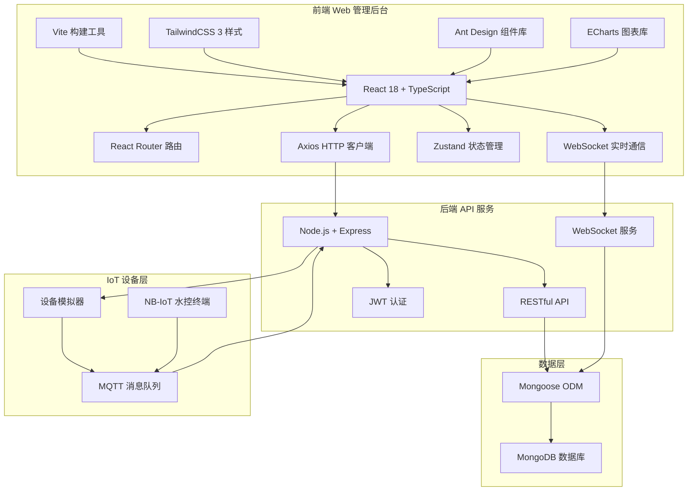
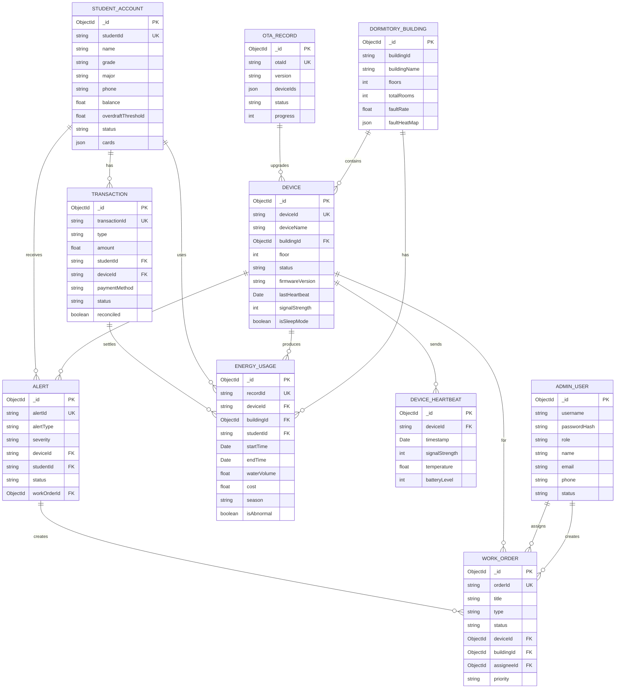

## 1. 架构设计



## 2. 技术描述

- **前端框架**: React@18 + TypeScript@5
- **构建工具**: Vite@5
- **样式方案**: TailwindCSS@3
- **UI组件库**: Ant Design@5
- **图表库**: ECharts@5
- **路由管理**: React Router@6
- **状态管理**: Zustand@4
- **HTTP客户端**: Axios@1
- **实时通信**: WebSocket (ws@8)
- **后端服务**: Node.js + Express@4 (已完成)
- **数据库**: MongoDB (已完成)
- **认证方案**: JWT (已完成)

## 3. 路由定义

| 路由 | 页面 | 权限要求 |
|------|------|----------|
| /login | 登录页 | 公开 |
| /dashboard | 仪表板 | 已登录 |
| /devices | 设备列表 | admin, operator |
| /devices/:id | 设备详情 | admin, operator |
| /devices/ota | OTA升级 | admin, operator |
| /students | 学生账户 | admin, finance |
| /students/:id | 学生详情 | admin, finance |
| /transactions | 交易记录 | admin, finance |
| /transactions/reconciliation | 银行对账 | admin, finance |
| /alerts | 告警中心 | admin, maintenance |
| /workorders | 工单管理 | admin, maintenance |
| /workorders/:id | 工单详情 | admin, maintenance |
| /energy | 能耗分析 | admin |
| /buildings | 楼栋管理 | admin, operator |
| /settings/users | 用户管理 | super_admin |
| /settings/roles | 角色权限 | super_admin |

## 4. API 定义

### 4.1 类型定义

```typescript
// 通用响应
interface ApiResponse<T> {
  success: boolean;
  message?: string;
  data: T;
}

interface PaginationData<T> {
  records: T[];
  pagination: {
    page: number;
    limit: number;
    total: number;
    pages: number;
  };
}

// 设备
interface Device {
  _id: string;
  deviceId: string;
  deviceName: string;
  status: 'online' | 'offline' | 'fault' | 'sleep';
  buildingId: string;
  floor: number;
  location: string;
  firmwareVersion: string;
  lastHeartbeat: Date;
  signalStrength: number;
  isSleepMode: boolean;
  createdAt: Date;
}

// 学生账户
interface StudentAccount {
  _id: string;
  studentId: string;
  name: string;
  grade: string;
  major: string;
  phone: string;
  balance: number;
  overdraftThreshold: number;
  status: 'active' | 'suspended' | 'lost';
  cards: Card[];
}

interface Card {
  cardNo: string;
  type: 'physical' | 'virtual';
  status: 'active' | 'lost' | 'expired';
  bindAt: Date;
}

// 交易
interface Transaction {
  _id: string;
  transactionId: string;
  type: 'recharge' | 'consume' | 'refund';
  amount: number;
  studentId: string;
  deviceId?: string;
  paymentMethod?: 'wechat' | 'alipay' | 'bank';
  status: 'success' | 'failed' | 'pending';
  createdAt: Date;
}

// 告警
interface Alert {
  _id: string;
  alertId: string;
  alertType: 'device_offline' | 'abnormal_usage' | 'water_leak' | 'low_balance' | 'fault';
  severity: 'critical' | 'warning' | 'info';
  deviceId?: string;
  studentId?: string;
  title: string;
  description: string;
  status: 'new' | 'acknowledged' | 'processing' | 'resolved';
  createdAt: Date;
}

// 工单
interface WorkOrder {
  _id: string;
  orderId: string;
  title: string;
  description: string;
  type: 'repair' | 'maintenance' | 'installation';
  status: 'pending' | 'assigned' | 'in_progress' | 'completed' | 'cancelled';
  deviceId?: string;
  buildingId?: string;
  assigneeId?: string;
  priority: 'high' | 'medium' | 'low';
  createdAt: Date;
}

// 能耗记录
interface EnergyUsage {
  _id: string;
  recordId: string;
  deviceId: string;
  buildingId: string;
  studentId?: string;
  startTime: Date;
  endTime: Date;
  duration: number;
  waterVolume: number;
  cost: number;
  season: 'spring' | 'summer' | 'autumn' | 'winter';
  isAbnormal: boolean;
}

// 管理员
interface AdminUser {
  _id: string;
  username: string;
  name: string;
  role: 'super_admin' | 'admin' | 'operator' | 'maintenance' | 'finance' | 'viewer';
  email: string;
  phone: string;
  status: 'active' | 'disabled';
}
```

### 4.2 API 接口列表

| 方法 | 路径 | 描述 |
|------|------|------|
| POST | /api/auth/admin/login | 管理员登录 |
| GET | /api/auth/me | 获取当前用户信息 |
| GET | /api/devices | 获取设备列表 |
| GET | /api/devices/:id | 获取设备详情 |
| GET | /api/devices/statistics | 设备统计 |
| POST | /api/devices/:id/command | 发送设备命令 |
| POST | /api/devices/batch-sleep | 批量休眠 |
| GET | /api/students | 获取学生列表 |
| POST | /api/students/:id/recharge | 学生充值 |
| POST | /api/students/:id/report-loss | 挂失 |
| GET | /api/transactions | 获取交易列表 |
| GET | /api/transactions/statistics | 交易统计 |
| POST | /api/transactions/:id/refund | 退款 |
| POST | /api/transactions/reconcile | 银行对账 |
| GET | /api/alerts | 获取告警列表 |
| POST | /api/alerts/:id/acknowledge | 确认告警 |
| POST | /api/alerts/:id/resolve | 解决告警 |
| POST | /api/alerts/:id/create-workorder | 创建工单 |
| GET | /api/workorders | 获取工单列表 |
| POST | /api/workorders | 创建工单 |
| POST | /api/workorders/:id/assign | 分配工单 |
| POST | /api/workorders/:id/start | 开始处理 |
| POST | /api/workorders/:id/complete | 完成工单 |
| GET | /api/energy/statistics | 能耗统计 |
| GET | /api/energy/export | 导出能耗数据 |
| GET | /api/buildings | 获取楼栋列表 |
| GET | /api/buildings/:id/energy-report | 楼栋能耗报告 |
| GET | /api/dashboard/overview | 仪表板概览 |
| GET | /api/dashboard/trends | 趋势数据 |
| GET | /api/ota | OTA任务列表 |
| POST | /api/ota | 创建OTA任务 |
| POST | /api/ota/:id/approve | 审批OTA |

## 5. 后端架构

```mermaid
flowchart TB
    subgraph "API 路由层"
        A["auth.js"]
        B["devices.js"]
        C["students.js"]
        D["transactions.js"]
        E["alerts.js"]
        F["workorders.js"]
        G["energy.js"]
        H["buildings.js"]
        I["ota.js"]
        J["dashboard.js"]
    end

    subgraph "中间件层"
        K["auth.js - 认证中间件"]
        L["errorHandler.js - 错误处理"]
    end

    subgraph "服务层"
        M["anomalyDetector.js - 异常检测"]
        N["deviceSimulator.js - 设备模拟"]
        O["websocketServer.js - WebSocket"]
        P["energyAnalyzer.js - 能耗分析"]
    end

    subgraph "数据模型层"
        Q["Device.js"]
        R["StudentAccount.js"]
        S["Transaction.js"]
        T["Alert.js"]
        U["WorkOrder.js"]
        V["EnergyUsage.js"]
        W["DormitoryBuilding.js"]
        X["AdminUser.js"]
        Y["OTARecord.js"]
        Z["DeviceHeartbeat.js"]
    end

    A --> K
    B --> K
    C --> K
    D --> K
    E --> K
    F --> K
    G --> K
    H --> K
    I --> K
    J --> K
    A --> Q
    B --> Q
    C --> R
    D --> S
    E --> T
    F --> U
    G --> V
    H --> W
    I --> Y
    J --> V
    M --> T
    M --> Q
    M --> W
    N --> Q
    N --> V
    O --> T
    O --> Q
    O --> S
    O --> U
    P --> V
    L --> A
```



## 6. 数据模型

### 6.1 ER 图



### 6.2 索引设计

| 集合 | 索引 | 类型 |
|------|------|------|
| devices | deviceId | 唯一索引 |
| devices | status, lastHeartbeat | 复合索引 |
| devices | buildingId, floor | 复合索引 |
| student_accounts | studentId | 唯一索引 |
| student_accounts | phone | 唯一索引 |
| transactions | transactionId | 唯一索引 |
| transactions | studentId, createdAt | 复合索引 |
| transactions | type, status | 复合索引 |
| energy_usage | recordId | 唯一索引 |
| energy_usage | startTime, buildingId | 复合索引 |
| energy_usage | studentId, startTime | 复合索引 |
| energy_usage | year, month, buildingId | 复合索引 |
| alerts | alertId | 唯一索引 |
| alerts | status, severity | 复合索引 |
| alerts | deviceId, createdAt | 复合索引 |
| work_orders | orderId | 唯一索引 |
| work_orders | status, assigneeId | 复合索引 |
| device_heartbeats | deviceId, timestamp | 复合时序索引 |
