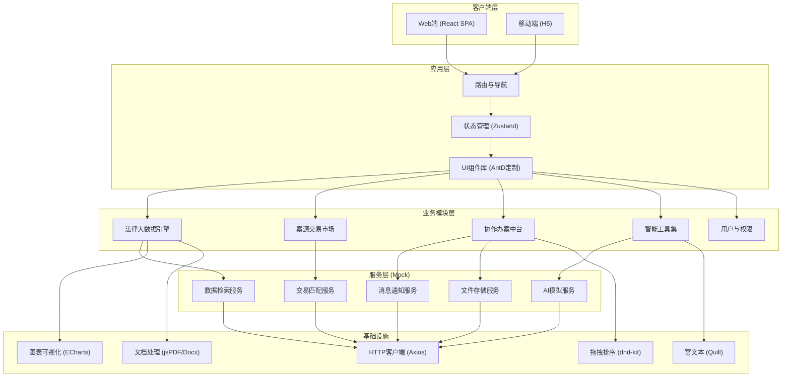

## 1. 架构设计



## 2. 技术描述

- **前端框架**：React@18 + TypeScript@5
- **构建工具**：Vite@5
- **样式方案**：TailwindCSS@3 + SCSS Modules
- **状态管理**：Zustand（轻量级状态管理）+ React Query（服务端状态）
- **UI组件库**：Ant Design@5（深度主题定制）
- **图表可视化**：ECharts@5 + G6（关系图谱）
- **路由方案**：React Router@6
- **HTTP客户端**：Axios + 请求/响应拦截器
- **文件处理**：jsPDF（PDF生成）、docx（Word生成）
- **富文本**：React Quill
- **拖拽交互**：@dnd-kit
- **表单处理**：React Hook Form + Zod
- **数据Mock**：MSW（Mock Service Worker）
- **代码规范**：ESLint + Prettier + Husky

## 3. 路由定义

| 路由路径 | 页面名称 | 模块归属 | 说明 |
|----------|----------|----------|------|
| `/login` | 登录页 | 认证模块 | 手机验证码/密码登录 |
| `/` | 首页工作台 | 公共模块 | 数据看板、待办、消息 |
| `/search` | 大数据检索 | 法律大数据引擎 | 多条件组合检索 |
| `/search/company/:id` | 企业详情 | 法律大数据引擎 | 企业全景画像 |
| `/reports` | 报告中心 | 法律大数据引擎 | 报告列表与生成 |
| `/reports/new` | 创建报告 | 法律大数据引擎 | 报告配置与导出 |
| `/developers` | API管理 | 法律大数据引擎 | 开发者中心 |
| `/cases` | 案源市场 | 案源交易市场 | 案源列表与筛选 |
| `/cases/:id` | 案源详情 | 案源交易市场 | 案源信息与竞标 |
| `/cases/publish` | 发布案源 | 案源交易市场 | 新建案源 |
| `/cases/bidding` | 竞标大厅 | 案源交易市场 | 在线竞标中心 |
| `/contracts` | 合同签署 | 案源交易市场 | 电子签约中心 |
| `/workspace` | 办案中台 | 协作办案中台 | 案件管理中心 |
| `/workspace/case/:id` | 案件详情 | 协作办案中台 | 单案件全视图 |
| `/workspace/board` | 任务看板 | 协作办案中台 | 可视化协作看板 |
| `/workspace/evidence` | 证据库 | 协作办案中台 | 证据材料管理 |
| `/tools` | 工具中心 | 智能工具集 | 智能工具导航 |
| `/tools/calculator` | 法律计算器 | 智能工具集 | 7类计算器 |
| `/tools/ai` | 法条助手 | 智能工具集 | AI法律问答 |
| `/tools/templates` | 文书模板 | 智能工具集 | 法律文书模板库 |
| `/team` | 团队管理 | 系统模块 | 组织架构与权限 |
| `/finance` | 财务中心 | 系统模块 | 结算与发票 |
| `/settings` | 个人设置 | 系统模块 | 账号与偏好 |

## 4. 数据类型定义

```typescript
// 用户相关类型
interface User {
  id: string;
  phone: string;
  name: string;
  avatar: string;
  role: 'lawyer' | 'admin' | 'enterprise' | 'operator';
  creditScore: number;
  verified: boolean;
  licenseInfo?: LicenseInfo;
  firmInfo?: FirmInfo;
  enterpriseInfo?: EnterpriseInfo;
  createdAt: string;
}

interface LicenseInfo {
  licenseNumber: string;
  licenseImage: string;
  issuingAuthority: string;
  issueDate: string;
  verifiedAt: string;
}

// 企业相关类型
interface Company {
  id: string;
  name: string;
  creditCode: string;
  legalPerson: string;
  registeredCapital: string;
  establishDate: string;
  status: 'active' | 'cancelled' | 'revoked';
  industry: string;
  province: string;
  city: string;
  address: string;
  businessScope: string;
  riskLevel: 'low' | 'medium' | 'high' | 'critical';
  riskScore: number;
  shareholders: Shareholder[];
  lawsuits: Lawsuit[];
  executions: Execution[];
  bids: Bid[];
}

interface Shareholder {
  id: string;
  name: string;
  type: 'person' | 'company';
  ratio: number;
  amount: string;
}

interface Lawsuit {
  id: string;
  caseNumber: string;
  title: string;
  cause: string;
  court: string;
  date: string;
  status: 'pending' | 'first' | 'second' | 'enforcement' | 'closed';
  role: 'plaintiff' | 'defendant' | 'third_party';
  amount?: string;
}

// 案源相关类型
interface CaseSource {
  id: string;
  title: string;
  description: string;
  cause: string;
  amount: number;
  province: string;
  city: string;
  deadline: string;
  deposit: number;
  publisherId: string;
  publisherName: string;
  status: 'draft' | 'published' | 'bidding' | 'selected' | 'processing' | 'completed' | 'cancelled';
  tags: string[];
  bids: CaseBid[];
  selectedLawyerId?: string;
  createdAt: string;
}

interface CaseBid {
  id: string;
  caseId: string;
  lawyerId: string;
  lawyerName: string;
  lawyerAvatar: string;
  lawyerFirm: string;
  price: number;
  proposal: string;
  estimatedDays: number;
  submittedAt: string;
}

// 案件协作类型
interface WorkCase {
  id: string;
  caseNumber?: string;
  title: string;
  clientName: string;
  caseSourceId?: string;
  leadLawyerId: string;
  teamMembers: TeamMember[];
  status: 'intake' | 'preparation' | 'trial' | 'enforcement' | 'archived';
  priority: 'low' | 'medium' | 'high';
  nodes: CaseNode[];
  evidence: EvidenceItem[];
  createdAt: string;
}

interface Task {
  id: string;
  caseId: string;
  title: string;
  description: string;
  assigneeId: string;
  assigneeName: string;
  status: 'todo' | 'in_progress' | 'review' | 'done' | 'archived';
  priority: 'low' | 'medium' | 'high';
  dueDate?: string;
  tags: string[];
  createdAt: string;
}

interface EvidenceItem {
  id: string;
  caseId: string;
  folderId?: string;
  name: string;
  type: 'document' | 'image' | 'video' | 'audio' | 'archive';
  fileUrl: string;
  fileSize: number;
  uploadedBy: string;
  ocrText?: string;
  tags: string[];
  createdAt: string;
}

// 计算器类型
interface CalculatorResult {
  type: string;
  inputs: Record<string, any>;
  result: {
    total: number;
    breakdown: { label: string; amount: number }[];
    formula: string;
    legalBasis: string[];
  };
}

// AI问答类型
interface AIMessage {
  id: string;
  role: 'user' | 'assistant';
  content: string;
  citations?: {
    law: string;
    article: string;
    content: string;
  }[];
  relatedCases?: {
    id: string;
    title: string;
    caseNumber: string;
    similarity: number;
  }[];
  timestamp: string;
}
```

## 5. 前端组件架构

```mermaid
graph TB
    subgraph "布局组件"
        A["AppLayout"] --> A1["Sidebar"]
        A --> A2["TopBar"]
        A --> A3["Breadcrumb"]
        A --> A4["ContentArea"]
    end
    subgraph "通用业务组件"
        B["DataCard"]
        C["SearchBox"]
        D["FilterPanel"]
        E["RiskBadge"]
        F["CreditScoreGauge"]
        G["AvatarUploader"]
        H["Timeline"]
        I["StatusTag"]
        J["Pagination"]
    end
    subgraph "大数据模块组件"
        K["CompanyCard"]
        L["RelationGraph"]
        M["RiskRadar"]
        N["LawsuitTimeline"]
        O["ReportConfigForm"]
    end
    subgraph "案源模块组件"
        P["CaseCard"]
        Q["BidForm"]
        R["TagCloud"]
        S["AmountSlider"]
        T["ContractSignPad"]
    end
    subgraph "协作模块组件"
        U["KanbanBoard"]
        V["KanbanColumn"]
        W["TaskCard"]
        X["EvidenceUploader"]
        Y["NodeReminder"]
    end
    subgraph "工具模块组件"
        Z["CalculatorCard"]
        AA["CalculatorForm"]
        AB["ResultBreakdown"]
        AC["AIChatBox"]
        AD["CitationBubble"]
    end
    B --> A4
    C --> A4
    D --> A4
    E --> A4
    F --> A4
    K --> A4
    L --> A4
    P --> A4
    U --> A4
    Z --> A4
```



## 6. 项目目录结构

```
legalcloud/
├── public/
│   ├── favicon.ico
│   └── mockServiceWorker.js
├── src/
│   ├── assets/
│   │   ├── fonts/          # 思源宋体等自定义字体
│   │   ├── icons/          # SVG图标
│   │   └── images/         # 静态图片
│   ├── components/
│   │   ├── layout/         # 布局组件
│   │   ├── common/         # 通用业务组件
│   │   ├── search/         # 大数据模块组件
│   │   ├── cases/          # 案源模块组件
│   │   ├── workspace/      # 协作模块组件
│   │   └── tools/          # 工具模块组件
│   ├── pages/
│   │   ├── Login/
│   │   ├── Dashboard/
│   │   ├── Search/
│   │   ├── CompanyDetail/
│   │   ├── Reports/
│   │   ├── Developers/
│   │   ├── CaseMarket/
│   │   ├── CaseDetail/
│   │   ├── CasePublish/
│   │   ├── Bidding/
│   │   ├── Contracts/
│   │   ├── Workspace/
│   │   ├── CaseWorkspace/
│   │   ├── KanbanBoard/
│   │   ├── Evidence/
│   │   ├── Tools/
│   │   ├── Calculator/
│   │   ├── AIHelper/
│   │   ├── Templates/
│   │   ├── Team/
│   │   ├── Finance/
│   │   └── Settings/
│   ├── store/              # Zustand状态管理
│   │   ├── userStore.ts
│   │   ├── searchStore.ts
│   │   └── caseStore.ts
│   ├── hooks/              # 自定义Hooks
│   │   ├── useDebounce.ts
│   │   ├── usePagination.ts
│   │   └── useWebSocket.ts
│   ├── services/           # API服务层
│   │   ├── request.ts
│   │   ├── user.ts
│   │   ├── search.ts
│   │   ├── cases.ts
│   │   ├── workspace.ts
│   │   └── tools.ts
│   ├── mocks/              # MSW Mock数据
│   │   ├── handlers/
│   │   └── browser.ts
│   ├── types/              # TypeScript类型定义
│   │   ├── index.ts
│   │   ├── user.ts
│   │   ├── company.ts
│   │   ├── case.ts
│   │   └── workspace.ts
│   ├── utils/              # 工具函数
│   │   ├── calculator.ts   # 计算器逻辑
│   │   ├── format.ts       # 格式化
│   │   └── validator.ts
│   ├── constants/          # 常量配置
│   │   ├── routes.ts
│   │   ├── caseCauses.ts   # 案由列表
│   │   └── regions.ts      # 行政区划
│   ├── styles/
│   │   ├── index.scss
│   │   ├── variables.scss  # SCSS变量
│   │   └── theme.ts        # AntD主题定制
│   ├── router/             # 路由配置
│   │   └── index.tsx
│   ├── App.tsx
│   └── main.tsx
├── .env
├── .env.development
├── .env.production
├── .eslintrc.cjs
├── .prettierrc
├── index.html
├── package.json
├── tsconfig.json
├── vite.config.ts
└── tailwind.config.js
```

## 7. 核心算法说明

### 7.1 法律计算器算法

```typescript
// 诉讼费计算（依据《诉讼费用交纳办法》）
function calculateCourtFee(amount: number, caseType: 'property' | 'divorce' | 'labor' | 'intellectual'): CalculatorResult {
  let fee = 0;
  const breakdown: { label: string; amount: number }[] = [];
  
  if (caseType === 'property') {
    // 财产案件分段累计计算
    const brackets = [
      { limit: 10000, rate: 50, base: 0 },
      { limit: 100000, rate: 0.025, base: 50 },
      { limit: 200000, rate: 0.02, base: 2300 },
      { limit: 500000, rate: 0.015, base: 4300 },
      { limit: 1000000, rate: 0.01, base: 8800 },
      { limit: 2000000, rate: 0.009, base: 13800 },
      { limit: 5000000, rate: 0.008, base: 22800 },
      { limit: 10000000, rate: 0.007, base: 46800 },
      { limit: 20000000, rate: 0.006, base: 81800 },
      { limit: Infinity, rate: 0.005, base: 141800 },
    ];
    // ... 分段计算逻辑
  }
  
  return {
    type: 'court_fee',
    inputs: { amount, caseType },
    result: { total: fee, breakdown, formula: '分段累计交纳', legalBasis: ['《诉讼费用交纳办法》第十三条'] }
  };
}

// 工伤赔偿计算
function calculateInjuryCompensation(level: number, salary: number, region: string): CalculatorResult {
  // 依据《工伤保险条例》第三十五条至第三十七条
  // 一次性伤残补助金：一级27个月工资，二级25个月...十级7个月
  const monthlyRatio = [27, 25, 23, 21, 18, 16, 13, 11, 9, 7];
  // ... 详细计算逻辑
}
```

### 7.2 企业风险评分算法

```typescript
function calculateRiskScore(company: Company): { score: number; level: 'low' | 'medium' | 'high' | 'critical' } {
  let score = 100;
  
  // 涉诉风险权重 (30分)
  const lawsuitPenalty = company.lawsuits.length * 3 + 
    company.lawsuits.filter(l => l.status === 'enforcement').length * 5;
  score -= Math.min(lawsuitPenalty, 30);
  
  // 执行风险权重 (25分)
  const executionPenalty = company.executions.length * 5;
  score -= Math.min(executionPenalty, 25);
  
  // 经营异常权重 (20分)
  // 股权冻结、行政处罚等
  // ...
  
  // 信用评级映射
  const level = score >= 80 ? 'low' : score >= 60 ? 'medium' : score >= 40 ? 'high' : 'critical';
  
  return { score, level };
}
```

### 7.3 律师信用分算法

```typescript
function calculateCreditScore(user: User, history: BidHistory[]): number {
  let score = 60; // 基础分
  
  // 执业年限加分 (最高+10)
  // 胜诉率加权 (最高+15)
  // 客户评价分 (最高+10)
  // 履约记录扣分
  // ...
  
  return Math.min(Math.max(score, 0), 100);
}
```
