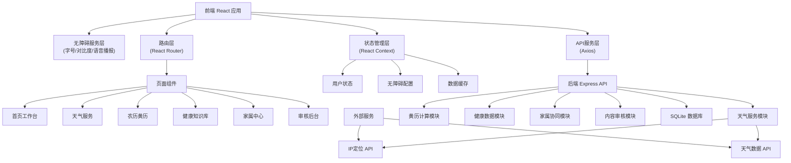
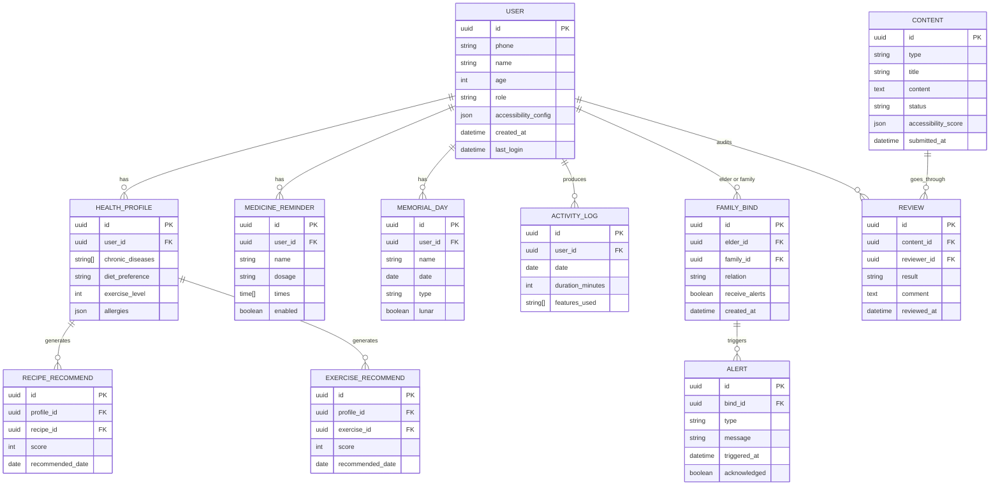

## 1. 架构设计



## 2. 技术选型

- **前端框架**: React 18 + TypeScript
- **构建工具**: Vite 5
- **样式方案**: Tailwind CSS 3 + CSS Variables
- **路由管理**: React Router 6
- **状态管理**: React Context + useReducer
- **HTTP客户端**: Axios
- **语音播报**: Web Speech API
- **图标库**: Lucide React
- **后端框架**: Express 4
- **数据库**: SQLite 3 + better-sqlite3
- **农历计算**: lunar-javascript
- **日期处理**: dayjs
- **视频播放**: HTML5 Video API

## 3. 目录结构

```
may-89145/
├── client/                          # 前端应用
│   ├── src/
│   │   ├── components/              # 可复用组件
│   │   │   ├── AccessibilityBar.tsx    # 无障碍设置栏
│   │   │   ├── WeatherCard.tsx         # 天气卡片
│   │   │   ├── CalendarCard.tsx        # 黄历卡片
│   │   │   ├── HealthCard.tsx          # 健康卡片
│   │   │   ├── LargeButton.tsx         # 大按钮组件
│   │   │   └── VoiceButton.tsx         # 语音播报按钮
│   │   ├── pages/                   # 页面组件
│   │   │   ├── Home.tsx                # 首页工作台
│   │   │   ├── Weather.tsx             # 天气详情
│   │   │   ├── Calendar.tsx            # 黄历详情
│   │   │   ├── Health.tsx              # 健康中心
│   │   │   ├── Family.tsx              # 家属中心
│   │   │   └── Admin/Review.tsx        # 审核后台
│   │   ├── context/                 # 状态管理
│   │   │   ├── AccessibilityContext.tsx # 无障碍上下文
│   │   │   ├── UserContext.tsx          # 用户上下文
│   │   │   └── WeatherContext.tsx       # 天气数据上下文
│   │   ├── hooks/                   # 自定义Hooks
│   │   │   ├── useWeather.ts           # 天气数据Hook
│   │   │   ├── useCalendar.ts          # 黄历计算Hook
│   │   │   ├── useVoice.ts             # 语音播报Hook
│   │   │   └── useAccessibility.ts     # 无障碍设置Hook
│   │   ├── services/                # API服务
│   │   │   ├── weather.ts              # 天气API
│   │   │   ├── calendar.ts             # 黄历API
│   │   │   ├── health.ts               # 健康API
│   │   │   └── family.ts               # 家属API
│   │   ├── types/                   # 类型定义
│   │   │   ├── weather.ts              # 天气类型
│   │   │   ├── calendar.ts             # 黄历类型
│   │   │   ├── health.ts               # 健康类型
│   │   │   └── user.ts                 # 用户类型
│   │   ├── utils/                   # 工具函数
│   │   │   ├── calendar.ts              # 黄历计算
│   │   │   ├── voice.ts                 # 语音工具
│   │   │   └── accessibility.ts         # 无障碍工具
│   │   ├── data/                    # Mock数据
│   │   │   ├── recipes.ts               # 食谱数据
│   │   │   ├── exercises.ts             # 运动数据
│   │   │   └── medicines.ts             # 药品数据
│   │   ├── App.tsx
│   │   ├── main.tsx
│   │   └── index.css
│   ├── index.html
│   ├── package.json
│   ├── tsconfig.json
│   ├── vite.config.ts
│   └── tailwind.config.js
├── server/                          # 后端服务
│   ├── src/
│   │   ├── routes/                  # 路由
│   │   │   ├── weather.ts              # 天气路由
│   │   │   ├── calendar.ts             # 黄历路由
│   │   │   ├── health.ts               # 健康路由
│   │   │   ├── family.ts               # 家属路由
│   │   │   ├── auth.ts                 # 认证路由
│   │   │   └── admin.ts                # 审核路由
│   │   ├── services/                # 业务逻辑
│   │   │   ├── weatherService.ts       # 天气服务
│   │   │   ├── calendarService.ts      # 黄历服务
│   │   │   ├── healthService.ts        # 健康服务
│   │   │   ├── familyService.ts        # 家属服务
│   │   │   └── reviewService.ts        # 审核服务
│   │   ├── models/                  # 数据模型
│   │   │   ├── user.ts                 # 用户模型
│   │   │   ├── health.ts               # 健康模型
│   │   │   ├── content.ts              # 内容模型
│   │   │   └── family.ts               # 家属模型
│   │   ├── middleware/              # 中间件
│   │   │   ├── auth.ts                 # 认证中间件
│   │   │   ├── accessibility.ts        # 无障碍检测
│   │   │   └── activity.ts             # 活跃度检测
│   │   ├── db/                      # 数据库
│   │   │   ├── index.ts                # 数据库连接
│   │   │   └── schema.sql              # 表结构
│   │   └── index.ts                 # 应用入口
│   ├── package.json
│   └── tsconfig.json
└── .trae/
    └── documents/                   # 项目文档
```

## 4. 路由定义

### 前端路由

| 路由 | 页面 | 说明 |
|------|------|------|
| / | 首页工作台 | 无障碍设置、功能卡片入口、今日提醒 |
| /weather | 天气详情 | 精细化天气、生活指数、强提醒 |
| /calendar | 黄历详情 | 宜忌解析、节气养生、纪念日 |
| /health | 健康中心 | 食谱、八段锦、用药提醒 |
| /family | 家属中心 | 账号绑定、异常预警、使用统计 |
| /admin/review | 审核后台 | 内容审核、审核记录 |
| /login | 登录页 | 老年用户/家属/审核员登录 |

### 后端API路由

| 方法 | 路由 | 功能 |
|------|------|------|
| GET | /api/weather/current | 获取当前天气 |
| GET | /api/weather/forecast | 获取天气预报 |
| GET | /api/weather/indices | 获取生活指数 |
| GET | /api/calendar/today | 获取今日黄历 |
| GET | /api/calendar/yi-ji | 获取宜忌事项 |
| GET | /api/calendar/solar-term | 获取节气养生 |
| GET | /api/health/recipes | 获取食谱列表 |
| GET | /api/health/exercises | 获取运动视频 |
| GET | /api/health/medicines | 获取用药提醒 |
| POST | /api/family/bind | 绑定家属账号 |
| GET | /api/family/activity | 获取活跃度数据 |
| GET | /api/family/alerts | 获取异常预警 |
| GET | /api/admin/review/list | 获取待审核内容 |
| POST | /api/admin/review/approve | 审核通过 |
| POST | /api/admin/review/reject | 审核驳回 |
| POST | /api/auth/login | 用户登录 |
| GET | /api/auth/activity | 上报用户活跃度 |

## 5. 数据模型

### 5.1 ER图



### 5.2 DDL语句

```sql
-- 用户表
CREATE TABLE users (
    id TEXT PRIMARY KEY,
    phone TEXT UNIQUE NOT NULL,
    name TEXT NOT NULL,
    age INTEGER,
    role TEXT NOT NULL CHECK (role IN ('elder', 'family', 'admin')),
    accessibility_config TEXT DEFAULT '{"fontSize":"large","contrast":"normal","voiceEnabled":true}',
    created_at DATETIME DEFAULT CURRENT_TIMESTAMP,
    last_login DATETIME
);

-- 健康档案表
CREATE TABLE health_profiles (
    id TEXT PRIMARY KEY,
    user_id TEXT NOT NULL REFERENCES users(id),
    chronic_diseases TEXT DEFAULT '[]',
    diet_preference TEXT,
    exercise_level INTEGER DEFAULT 1,
    allergies TEXT DEFAULT '[]'
);

-- 用药提醒表
CREATE TABLE medicine_reminders (
    id TEXT PRIMARY KEY,
    user_id TEXT NOT NULL REFERENCES users(id),
    name TEXT NOT NULL,
    dosage TEXT NOT NULL,
    times TEXT NOT NULL,
    enabled BOOLEAN DEFAULT 1
);

-- 纪念日表
CREATE TABLE memorial_days (
    id TEXT PRIMARY KEY,
    user_id TEXT NOT NULL REFERENCES users(id),
    name TEXT NOT NULL,
    date TEXT NOT NULL,
    type TEXT NOT NULL,
    is_lunar BOOLEAN DEFAULT 0
);

-- 活跃度日志表
CREATE TABLE activity_logs (
    id TEXT PRIMARY KEY,
    user_id TEXT NOT NULL REFERENCES users(id),
    date TEXT NOT NULL,
    duration_minutes INTEGER DEFAULT 0,
    features_used TEXT DEFAULT '[]',
    UNIQUE(user_id, date)
);

-- 家属绑定表
CREATE TABLE family_binds (
    id TEXT PRIMARY KEY,
    elder_id TEXT NOT NULL REFERENCES users(id),
    family_id TEXT NOT NULL REFERENCES users(id),
    relation TEXT NOT NULL,
    receive_alerts BOOLEAN DEFAULT 1,
    created_at DATETIME DEFAULT CURRENT_TIMESTAMP,
    UNIQUE(elder_id, family_id)
);

-- 预警表
CREATE TABLE alerts (
    id TEXT PRIMARY KEY,
    bind_id TEXT NOT NULL REFERENCES family_binds(id),
    type TEXT NOT NULL,
    message TEXT NOT NULL,
    triggered_at DATETIME DEFAULT CURRENT_TIMESTAMP,
    acknowledged BOOLEAN DEFAULT 0
);

-- 内容表
CREATE TABLE contents (
    id TEXT PRIMARY KEY,
    type TEXT NOT NULL CHECK (type IN ('recipe', 'exercise', 'article', 'audio')),
    title TEXT NOT NULL,
    content TEXT NOT NULL,
    status TEXT NOT NULL CHECK (status IN ('pending', 'approved', 'rejected')),
    accessibility_score TEXT,
    submitted_at DATETIME DEFAULT CURRENT_TIMESTAMP
);

-- 审核记录表
CREATE TABLE reviews (
    id TEXT PRIMARY KEY,
    content_id TEXT NOT NULL REFERENCES contents(id),
    reviewer_id TEXT NOT NULL REFERENCES users(id),
    result TEXT NOT NULL CHECK (result IN ('approved', 'rejected')),
    comment TEXT,
    reviewed_at DATETIME DEFAULT CURRENT_TIMESTAMP
);

-- 索引
CREATE INDEX idx_activity_date ON activity_logs(user_id, date);
CREATE INDEX idx_alerts_bind ON alerts(bind_id, acknowledged);
CREATE INDEX idx_content_status ON contents(status);
```

## 6. 无障碍配置规范

### 6.1 CSS变量定义

```css
:root {
  /* 字号 */
  --font-size-base: 18px;
  --font-size-large: 22px;
  --font-size-xlarge: 26px;
  
  /* 标准模式颜色 */
  --color-primary: #FF7A45;
  --color-secondary: #2C7A7B;
  --color-bg: #FFF8F4;
  --color-text: #1A1A1A;
  --color-text-secondary: #555555;
  --color-card-bg: #FFFFFF;
  --color-border: #E5E5E5;
  
  /* 高对比模式颜色 */
  --hc-color-bg: #000000;
  --hc-color-text: #FFD700;
  --hc-color-primary: #00FFFF;
  --hc-color-card-bg: #1A1A1A;
  --hc-color-border: #FFD700;
}

/* 字号类 */
.font-size-base { --font-size-current: var(--font-size-base); }
.font-size-large { --font-size-current: var(--font-size-large); }
.font-size-xlarge { --font-size-current: var(--font-size-xlarge); }

/* 高对比类 */
.high-contrast {
  --color-bg: var(--hc-color-bg);
  --color-text: var(--hc-color-text);
  --color-primary: var(--hc-color-primary);
  --color-card-bg: var(--hc-color-card-bg);
  --color-border: var(--hc-color-border);
}
```

### 6.2 语音播报接口

```typescript
interface VoiceConfig {
  enabled: boolean;
  voice: 'male' | 'female';
  rate: number;      // 语速 0.5-1.5
  pitch: number;     // 音调 0.5-2
  volume: number;    // 音量 0-1
}

interface VoiceService {
  speak(text: string): void;
  stop(): void;
  pause(): void;
  resume(): void;
  setConfig(config: Partial<VoiceConfig>): void;
  isSupported(): boolean;
}
```

## 7. 安全与隐私

1. **数据加密**：敏感数据使用AES-256加密存储
2. **身份认证**：JWT Token + 短信验证码双因素认证
3. **接口鉴权**：基于角色的访问控制(RBAC)
4. **隐私保护**：健康数据仅本人及绑定家属可见
5. **操作日志**：所有敏感操作记录审计日志
6. **内容安全**：所有上传内容经过审核后发布
