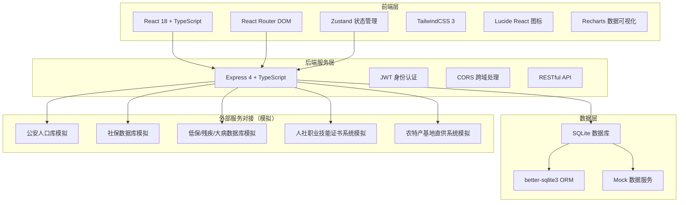
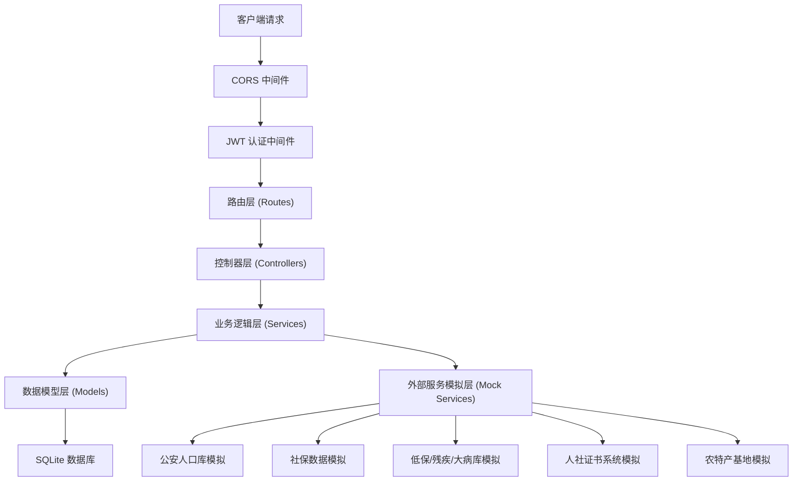
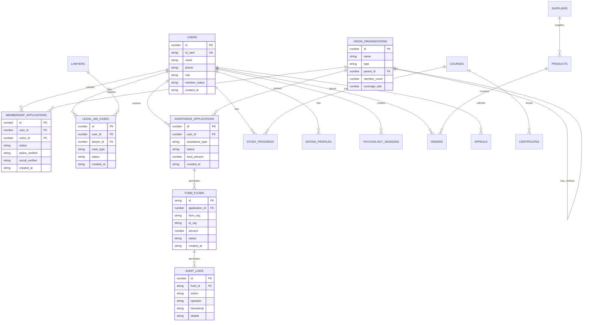

## 1. 架构设计



## 2. 技术描述

### 2.1 技术栈选型

- **前端**: React@18.3.1 + TypeScript@5.8.3 + Vite@6.3.5
- **路由**: react-router-dom@7.3.0
- **状态管理**: zustand@5.0.3
- **样式**: tailwindcss@3.4.17
- **图标**: lucide-react@0.511.0
- **数据可视化**: recharts@2.12.0
- **后端**: Express@4.18.2 + TypeScript
- **数据库**: SQLite + better-sqlite3
- **HTTP客户端**: axios@1.6.0
- **认证**: jsonwebtoken@9.0.2
- **工具库**: clsx@2.1.1, tailwind-merge@3.0.2

### 2.2 项目目录结构

```
may-89250/
├── src/                          # 前端代码
│   ├── components/               # 公共组件
│   │   ├── layout/              # 布局组件
│   │   ├── ui/                  # 基础UI组件
│   │   └── charts/              # 图表组件
│   ├── pages/                    # 页面组件
│   │   ├── auth/                # 登录注册
│   │   ├── membership/          # 实名制入会
│   │   ├── legal-aid/           # 法律援助
│   │   ├── assistance/          # 困难帮扶
│   │   ├── academy/             # 工匠学院
│   │   ├── dating/              # 婚恋交友
│   │   ├── psychology/          # 心理驿站
│   │   ├── mall/                # 普惠商城
│   │   └── admin/               # 后台管理
│   ├── hooks/                    # 自定义Hooks
│   ├── store/                    # Zustand状态管理
│   ├── api/                      # API请求封装
│   ├── types/                    # TypeScript类型定义
│   ├── utils/                    # 工具函数
│   ├── lib/                      # 公共库
│   ├── assets/                   # 静态资源
│   ├── App.tsx                   # 根组件
│   ├── main.tsx                  # 入口文件
│   └── index.css                 # 全局样式
├── api/                          # 后端代码
│   ├── src/
│   │   ├── controllers/         # 控制器
│   │   ├── routes/              # 路由定义
│   │   ├── middleware/          # 中间件
│   │   ├── services/            # 业务逻辑
│   │   ├── models/              # 数据模型
│   │   ├── db/                  # 数据库连接
│   │   ├── mock/                # Mock数据
│   │   ├── types/               # 类型定义
│   │   └── index.ts             # 入口文件
│   └── tsconfig.json
├── shared/                       # 前后端共享类型
├── migrations/                   # 数据库迁移
├── .trae/documents/              # 项目文档
├── vite.config.ts                # Vite配置
├── tailwind.config.js            # Tailwind配置
├── tsconfig.json                 # TypeScript配置
└── package.json                  # 项目配置
```

## 3. 路由定义

| 路由路径 | 页面名称 | 权限要求 |
|----------|----------|----------|
| `/` | 首页 | 公开 |
| `/login` | 登录页 | 公开 |
| `/membership` | 实名制入会 | 已登录 |
| `/membership/apply` | 入会申请 | 已登录 |
| `/membership/status` | 申请状态 | 已登录 |
| `/legal-aid` | 法律援助首页 | 已登录 |
| `/legal-aid/apply` | 申请援助 | 已登录 |
| `/legal-aid/cases` | 我的案件 | 已登录 |
| `/legal-aid/cases/:id` | 案件详情 | 已登录 |
| `/assistance` | 困难帮扶首页 | 已登录 |
| `/assistance/apply` | 帮扶申请 | 已登录 |
| `/assistance/review` | 智能初审 | 已登录 |
| `/assistance/status` | 申请进度 | 已登录 |
| `/academy` | 工匠学院首页 | 已登录 |
| `/academy/courses` | 课程列表 | 已登录 |
| `/academy/courses/:id` | 课程学习 | 已登录 |
| `/academy/learning` | 我的学习 | 已登录 |
| `/dating` | 婚恋交友首页 | 已登录 |
| `/dating/profile` | 我的资料 | 已登录 |
| `/dating/matches` | 匹配推荐 | 已登录 |
| `/dating/chat` | 消息列表 | 已登录 |
| `/psychology` | 心理驿站首页 | 已登录 |
| `/psychology/chat` | AI心理咨询 | 已登录 |
| `/psychology/report` | 情绪报告 | 已登录 |
| `/mall` | 普惠商城首页 | 已登录 |
| `/mall/products` | 商品列表 | 已登录 |
| `/mall/products/:id` | 商品详情 | 已登录 |
| `/mall/orders` | 我的订单 | 已登录 |
| `/admin/org-chart` | 组织图谱 | 管理员 |
| `/admin/sentiment` | 诉求分析 | 管理员 |
| `/admin/audit` | 资金审计 | 管理员 |

## 4. API 定义

### 4.1 认证接口

```typescript
// POST /api/auth/login
interface LoginRequest {
  idCard: string;
  password: string;
}

interface LoginResponse {
  token: string;
  user: {
    id: number;
    name: string;
    role: 'worker' | 'union_admin' | 'provincial_admin' | 'lawyer';
    memberStatus: 'pending' | 'approved' | 'rejected';
  };
}

// POST /api/auth/register
interface RegisterRequest {
  idCard: string;
  name: string;
  phone: string;
  password: string;
}
```

### 4.2 实名制入会接口

```typescript
// POST /api/membership/apply
interface MembershipApplyRequest {
  personalInfo: {
    name: string;
    idCard: string;
    gender: 'male' | 'female';
    birthDate: string;
    ethnicity: string;
    education: string;
  };
  workInfo: {
    companyName: string;
    jobTitle: string;
    workYears: number;
    socialSecurityMonths: number;
  };
  unionId: number;
}

// GET /api/membership/verify-police/:idCard
interface PoliceVerifyResponse {
  verified: boolean;
  nameMatch: boolean;
}

// GET /api/membership/verify-social/:idCard
interface SocialVerifyResponse {
  verified: boolean;
  contributionMonths: number;
  lastContributionDate: string;
}

// GET /api/membership/status/:userId
interface MembershipStatusResponse {
  status: 'draft' | 'police_verify' | 'social_verify' | 'union_review' | 'provincial_review' | 'approved' | 'rejected';
  currentStep: number;
  totalSteps: number;
  approvalHistory: Array<{
    step: string;
    status: string;
    date: string;
    remark?: string;
  }>;
}
```

### 4.3 法律援助接口

```typescript
// POST /api/legal-aid/apply
interface LegalAidApplyRequest {
  caseType: 'labor' | 'civil' | 'criminal' | 'other';
  caseTitle: string;
  caseDescription: string;
  evidenceIds: string[];
}

// GET /api/legal-aid/lawyers/match/:caseType
interface LawyerMatchResponse {
  lawyers: Array<{
    id: number;
    name: string;
    avatar: string;
    specialty: string[];
    experienceYears: number;
    caseCount: number;
    rating: number;
  }>;
}

// GET /api/legal-aid/cases
interface CaseListResponse {
  cases: Array<{
    id: number;
    title: string;
    type: string;
    status: 'pending' | 'matched' | 'processing' | 'closed';
    lawyerName?: string;
    createDate: string;
  }>;
}
```

### 4.4 困难帮扶接口

```typescript
// POST /api/assistance/apply
interface AssistanceApplyRequest {
  assistanceType: 'minimum_allowance' | 'disability' | 'serious_illness' | 'disaster' | 'other';
  familyIncome: number;
  familyMemberCount: number;
  description: string;
  documentIds: string[];
}

// POST /api/assistance/auto-review/:applicationId
interface AutoReviewResponse {
  passed: boolean;
  score: number;
  checks: Array<{
    type: 'minimum_allowance' | 'disability' | 'serious_illness';
    matched: boolean;
    details?: string;
  }>;
  needManualReview: boolean;
}

// GET /api/assistance/status/:applicationId
interface AssistanceStatusResponse {
  status: 'draft' | 'auto_review' | 'manual_review' | 'union_approved' | 'provincial_approved' | 'funded' | 'rejected';
  fundAmount?: number;
  fundDate?: string;
  auditTrail: Array<{
    action: string;
    operator: string;
    date: string;
    remark: string;
  }>;
}
```

### 4.5 工匠学院接口

```typescript
// GET /api/academy/courses
interface CourseListResponse {
  courses: Array<{
    id: number;
    title: string;
    category: string;
    coverImage: string;
    totalHours: number;
    skillLevel: 'beginner' | 'intermediate' | 'advanced';
    progress?: number;
  }>;
}

// POST /api/academy/study-progress
interface StudyProgressRequest {
  courseId: number;
  chapterId: number;
  studySeconds: number;
  completed: boolean;
}

// GET /api/academy/certificates/:userId
interface CertificateResponse {
  certificates: Array<{
    id: number;
    courseName: string;
    totalHours: number;
    issueDate: string;
    certificateNumber: string;
  }>;
}
```

### 4.6 婚恋交友接口

```typescript
// GET /api/dating/profiles
interface DatingProfileResponse {
  profiles: Array<{
    id: number;
    maskedLabel: string; // 如：'35岁成都IT男'
    ageRange: string;
    city: string;
    occupation: string;
    tags: string[];
    compatibilityScore: number;
  }>;
}

// GET /api/dating/masked-profile/:userId
interface MaskedProfile {
  maskedLabel: string;
  ageRange: string;
  city: string;
  occupation: string;
  heightRange: string;
  tags: string[];
  hobbies: string[];
}
```

### 4.7 心理驿站接口

```typescript
// POST /api/psychology/chat
interface ChatMessage {
  message: string;
  sessionId: string;
}

interface ChatResponse {
  reply: string;
  emotion: 'positive' | 'neutral' | 'negative' | 'crisis';
  emotionScore: number;
  crisisDetected: boolean;
  crisisKeywords: string[];
  transferredToHuman: boolean;
}

// GET /api/psychology/report/:sessionId
interface PsychologyReport {
  sessionId: string;
  duration: number;
  emotionTrend: Array<{ time: string; emotion: string; score: number }>;
  mainConcerns: string[];
  suggestions: string[];
  riskLevel: 'low' | 'medium' | 'high';
}
```

### 4.8 普惠商城接口

```typescript
// GET /api/mall/products
interface ProductListResponse {
  products: Array<{
    id: number;
    name: string;
    price: number;
    originalPrice: number;
    image: string;
    category: string;
    supplier: string;
    supplyBase: string;
    stock: number;
  }>;
}

// GET /api/mall/products/:id/supply-chain
interface SupplyChainResponse {
  productId: number;
  supplyChain: Array<{
    stage: string;
    location: string;
    operator: string;
    date: string;
    description: string;
  }>;
}
```

### 4.9 后台管理接口

```typescript
// GET /api/admin/org-chart
interface OrgChartResponse {
  root: {
    id: number;
    name: string;
    type: 'provincial' | 'city' | 'district' | 'enterprise';
    memberCount: number;
    coverageRate: number;
    children?: OrgChartNode[];
  };
}

// GET /api/admin/sentiment-analysis
interface SentimentAnalysisResponse {
  period: string;
  totalCount: number;
  categories: {
    complaint: number;
    suggestion: number;
    praise: number;
  };
  trendData: Array<{
    date: string;
    complaint: number;
    suggestion: number;
    praise: number;
  }>;
}

// GET /api/admin/fund-audit
interface FundAuditResponse {
  totalFund: number;
  totalProjects: number;
  fundFlow: Array<{
    id: string;
    from: string;
    to: string;
    amount: number;
    date: string;
    purpose: string;
    status: 'pending' | 'approved' | 'released' | 'received';
  }>;
  auditTrail: Array<{
    fundId: string;
    action: string;
    operator: string;
    timestamp: string;
    details: string;
  }>;
}
```

## 5. 服务器架构图



## 6. 数据模型

### 6.1 ER 图



### 6.2 数据定义语言 (DDL)

```sql
-- 用户表
CREATE TABLE users (
  id INTEGER PRIMARY KEY AUTOINCREMENT,
  id_card VARCHAR(18) UNIQUE NOT NULL,
  name VARCHAR(50) NOT NULL,
  phone VARCHAR(11) NOT NULL,
  password VARCHAR(255) NOT NULL,
  role VARCHAR(20) NOT NULL DEFAULT 'worker',
  member_status VARCHAR(20) DEFAULT 'pending',
  created_at DATETIME DEFAULT CURRENT_TIMESTAMP
);

-- 工会组织表
CREATE TABLE union_organizations (
  id INTEGER PRIMARY KEY AUTOINCREMENT,
  name VARCHAR(100) NOT NULL,
  type VARCHAR(20) NOT NULL,
  parent_id INTEGER REFERENCES union_organizations(id),
  member_count INTEGER DEFAULT 0,
  total_employees INTEGER DEFAULT 0,
  coverage_rate DECIMAL(5,2) DEFAULT 0,
  created_at DATETIME DEFAULT CURRENT_TIMESTAMP
);

-- 入会申请表
CREATE TABLE membership_applications (
  id INTEGER PRIMARY KEY AUTOINCREMENT,
  user_id INTEGER REFERENCES users(id),
  union_id INTEGER REFERENCES union_organizations(id),
  status VARCHAR(30) DEFAULT 'draft',
  police_verified BOOLEAN DEFAULT FALSE,
  social_verified BOOLEAN DEFAULT FALSE,
  social_security_months INTEGER DEFAULT 0,
  current_step INTEGER DEFAULT 0,
  created_at DATETIME DEFAULT CURRENT_TIMESTAMP
);

-- 律师表
CREATE TABLE lawyers (
  id INTEGER PRIMARY KEY AUTOINCREMENT,
  user_id INTEGER REFERENCES users(id),
  license_number VARCHAR(50) UNIQUE NOT NULL,
  specialty VARCHAR(200) NOT NULL,
  experience_years INTEGER DEFAULT 0,
  case_count INTEGER DEFAULT 0,
  rating DECIMAL(3,2) DEFAULT 5.0,
  verified BOOLEAN DEFAULT FALSE
);

-- 法律援助案件表
CREATE TABLE legal_aid_cases (
  id INTEGER PRIMARY KEY AUTOINCREMENT,
  user_id INTEGER REFERENCES users(id),
  lawyer_id INTEGER REFERENCES lawyers(id),
  case_type VARCHAR(20) NOT NULL,
  case_title VARCHAR(200) NOT NULL,
  case_description TEXT,
  status VARCHAR(20) DEFAULT 'pending',
  created_at DATETIME DEFAULT CURRENT_TIMESTAMP
);

-- 困难帮扶申请表
CREATE TABLE assistance_applications (
  id INTEGER PRIMARY KEY AUTOINCREMENT,
  user_id INTEGER REFERENCES users(id),
  assistance_type VARCHAR(30) NOT NULL,
  family_income DECIMAL(10,2) NOT NULL,
  family_member_count INTEGER NOT NULL,
  description TEXT,
  status VARCHAR(30) DEFAULT 'draft',
  auto_review_passed BOOLEAN,
  auto_review_score INTEGER,
  fund_amount DECIMAL(10,2),
  created_at DATETIME DEFAULT CURRENT_TIMESTAMP
);

-- 资金流向表
CREATE TABLE fund_flows (
  id VARCHAR(32) PRIMARY KEY,
  application_id INTEGER REFERENCES assistance_applications(id),
  from_org VARCHAR(100) NOT NULL,
  to_org VARCHAR(100) NOT NULL,
  amount DECIMAL(10,2) NOT NULL,
  status VARCHAR(20) DEFAULT 'pending',
  purpose VARCHAR(200),
  created_at DATETIME DEFAULT CURRENT_TIMESTAMP
);

-- 审计日志表
CREATE TABLE audit_logs (
  id INTEGER PRIMARY KEY AUTOINCREMENT,
  fund_id VARCHAR(32) REFERENCES fund_flows(id),
  action VARCHAR(50) NOT NULL,
  operator VARCHAR(50) NOT NULL,
  operator_role VARCHAR(20) NOT NULL,
  details TEXT,
  created_at DATETIME DEFAULT CURRENT_TIMESTAMP
);

-- 课程表
CREATE TABLE courses (
  id INTEGER PRIMARY KEY AUTOINCREMENT,
  title VARCHAR(200) NOT NULL,
  category VARCHAR(50) NOT NULL,
  cover_image VARCHAR(255),
  total_hours INTEGER NOT NULL,
  skill_level VARCHAR(20) NOT NULL,
  description TEXT,
  created_at DATETIME DEFAULT CURRENT_TIMESTAMP
);

-- 学习进度表
CREATE TABLE study_progress (
  id INTEGER PRIMARY KEY AUTOINCREMENT,
  user_id INTEGER REFERENCES users(id),
  course_id INTEGER REFERENCES courses(id),
  chapter_id INTEGER NOT NULL,
  study_seconds INTEGER DEFAULT 0,
  completed BOOLEAN DEFAULT FALSE,
  created_at DATETIME DEFAULT CURRENT_TIMESTAMP,
  UNIQUE(user_id, course_id, chapter_id)
);

-- 证书表
CREATE TABLE certificates (
  id INTEGER PRIMARY KEY AUTOINCREMENT,
  user_id INTEGER REFERENCES users(id),
  course_id INTEGER REFERENCES courses(id),
  certificate_number VARCHAR(50) UNIQUE NOT NULL,
  total_hours INTEGER NOT NULL,
  issue_date DATETIME DEFAULT CURRENT_TIMESTAMP
);

-- 婚恋资料表
CREATE TABLE dating_profiles (
  id INTEGER PRIMARY KEY AUTOINCREMENT,
  user_id INTEGER REFERENCES users(id) UNIQUE,
  age INTEGER,
  city VARCHAR(50),
  occupation VARCHAR(50),
  height INTEGER,
  tags TEXT,
  hobbies TEXT,
  privacy_mode BOOLEAN DEFAULT TRUE,
  created_at DATETIME DEFAULT CURRENT_TIMESTAMP
);

-- 心理咨询会话表
CREATE TABLE psychology_sessions (
  id VARCHAR(32) PRIMARY KEY,
  user_id INTEGER REFERENCES users(id),
  start_time DATETIME DEFAULT CURRENT_TIMESTAMP,
  end_time DATETIME,
  risk_level VARCHAR(10) DEFAULT 'low',
  crisis_detected BOOLEAN DEFAULT FALSE,
  transferred_to_human BOOLEAN DEFAULT FALSE,
  human_counselor_id INTEGER
);

-- 聊天消息表
CREATE TABLE chat_messages (
  id INTEGER PRIMARY KEY AUTOINCREMENT,
  session_id VARCHAR(32) REFERENCES psychology_sessions(id),
  sender_type VARCHAR(10) NOT NULL,
  content TEXT NOT NULL,
  emotion VARCHAR(20),
  emotion_score DECIMAL(5,2),
  created_at DATETIME DEFAULT CURRENT_TIMESTAMP
);

-- 商品表
CREATE TABLE products (
  id INTEGER PRIMARY KEY AUTOINCREMENT,
  name VARCHAR(200) NOT NULL,
  price DECIMAL(10,2) NOT NULL,
  original_price DECIMAL(10,2),
  image VARCHAR(255),
  category VARCHAR(50) NOT NULL,
  supplier_id INTEGER REFERENCES suppliers(id),
  supply_base VARCHAR(100),
  stock INTEGER DEFAULT 0,
  created_at DATETIME DEFAULT CURRENT_TIMESTAMP
);

-- 供应商表
CREATE TABLE suppliers (
  id INTEGER PRIMARY KEY AUTOINCREMENT,
  name VARCHAR(100) NOT NULL,
  contact_person VARCHAR(50),
  phone VARCHAR(20),
  address VARCHAR(255),
  base_location VARCHAR(100),
  verified BOOLEAN DEFAULT FALSE
);

-- 订单表
CREATE TABLE orders (
  id INTEGER PRIMARY KEY AUTOINCREMENT,
  user_id INTEGER REFERENCES users(id),
  product_id INTEGER REFERENCES products(id),
  quantity INTEGER NOT NULL,
  total_amount DECIMAL(10,2) NOT NULL,
  status VARCHAR(20) DEFAULT 'pending',
  tracking_number VARCHAR(50),
  created_at DATETIME DEFAULT CURRENT_TIMESTAMP
);

-- 职工诉求表
CREATE TABLE appeals (
  id INTEGER PRIMARY KEY AUTOINCREMENT,
  user_id INTEGER REFERENCES users(id),
  title VARCHAR(200) NOT NULL,
  content TEXT NOT NULL,
  category VARCHAR(20) NOT NULL,
  sentiment VARCHAR(20),
  sentiment_score DECIMAL(5,2),
  status VARCHAR(20) DEFAULT 'pending',
  created_at DATETIME DEFAULT CURRENT_TIMESTAMP
);

-- 创建索引
CREATE INDEX idx_users_id_card ON users(id_card);
CREATE INDEX idx_union_parent ON union_organizations(parent_id);
CREATE INDEX idx_membership_user ON membership_applications(user_id);
CREATE INDEX idx_legal_aid_user ON legal_aid_cases(user_id);
CREATE INDEX idx_assistance_user ON assistance_applications(user_id);
CREATE INDEX idx_fund_application ON fund_flows(application_id);
CREATE INDEX idx_study_user_course ON study_progress(user_id, course_id);
CREATE INDEX idx_appeals_created ON appeals(created_at DESC);
```
