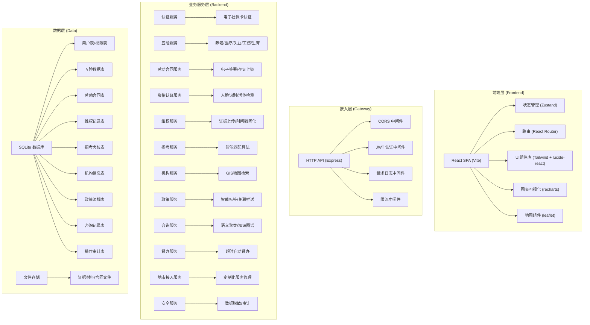
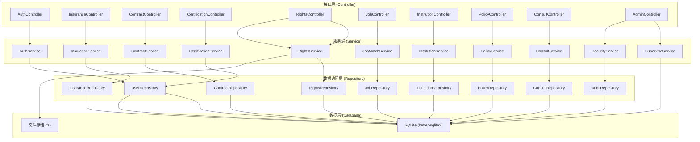
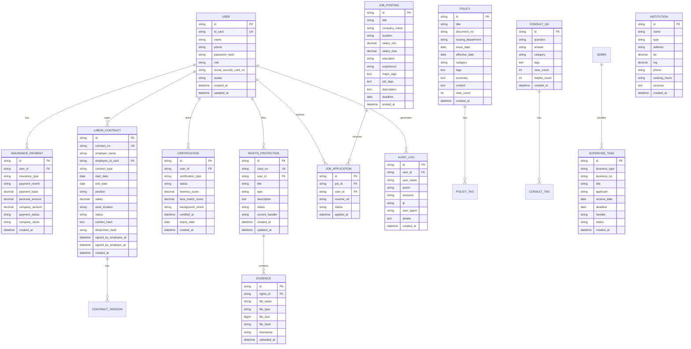

## 1. 架构设计



## 2. 技术描述

### 2.1 技术栈选型

- **前端**: React@18 + TypeScript + Vite@5 + tailwindcss@3 + react-router-dom@6 + zustand@4
- **后端**: Express@4 + TypeScript + better-sqlite3 + jsonwebtoken + bcrypt
- **数据库**: SQLite (data/app.sqlite)
- **文件存储**: 本地文件系统 (data/uploads/)
- **图表**: recharts@2
- **地图**: leaflet@1.9 + react-leaflet@4
- **图标**: lucide-react@0.344
- **认证**: JWT + bcrypt + 模拟电子社保卡认证

### 2.2 初始化工具

使用 `react-express-ts` 模板初始化全栈项目：
```sh
npm init vite-init@latest -y . -- --template react-express-ts --force
```

### 2.3 端口配置

从 `.env` 文件读取：
- FRONTEND_PORT=49077 (Vite 开发服务器)
- BACKEND_PORT=59077 (Express 后端)
- HOST=127.0.0.1
- VITE_API_URL=http://127.0.0.1:59077/api

## 3. 路由定义

### 3.1 前端路由

| 路由 | 页面 | 权限 |
|------|------|------|
| `/` | 首页服务大厅 | 公开 |
| `/login` | 登录页 | 公开 |
| `/dashboard` | 个人中心 | 需登录 |
| `/insurance/pension` | 养老保险 | 需登录 |
| `/insurance/medical` | 医疗保险 | 需登录 |
| `/insurance/unemployment` | 失业保险 | 需登录 |
| `/insurance/injury` | 工伤保险 | 需登录 |
| `/insurance/maternity` | 生育保险 | 需登录 |
| `/contract` | 劳动合同列表 | 需登录 |
| `/contract/:id` | 合同详情/签署 | 需登录 |
| `/certification` | 资格认证 | 需登录 |
| `/rights` | 劳动维权 | 需登录 |
| `/rights/:id` | 维权进度 | 需登录 |
| `/jobs` | 招考平台 | 公开 |
| `/jobs/:id` | 职位详情 | 需登录 |
| `/map` | 服务机构地图 | 公开 |
| `/policies` | 政策法规 | 公开 |
| `/policies/:id` | 政策详情 | 公开 |
| `/consult` | 咨询中心 | 公开 |
| `/admin` | 后台首页 | 管理员 |
| `/admin/supervise` | 督办中心 | 管理员 |
| `/admin/knowledge` | 知识图谱 | 管理员 |
| `/admin/city` | 地市接入 | 管理员 |
| `/admin/security` | 安全中心 | 管理员 |

### 3.2 后端 API 路由

| 方法 | 路由 | 描述 | 权限 |
|------|------|------|------|
| GET | `/api/health` | 健康检查 | 公开 |
| POST | `/api/auth/login` | 登录认证 | 公开 |
| POST | `/api/auth/logout` | 登出 | 需登录 |
| GET | `/api/user/profile` | 获取用户信息 | 需登录 |
| GET | `/api/insurance/summary` | 五险总览 | 需登录 |
| GET | `/api/insurance/:type` | 险种明细 | 需登录 |
| GET | `/api/insurance/:type/payments` | 缴费明细 | 需登录 |
| GET | `/api/contract` | 合同列表 | 需登录 |
| GET | `/api/contract/:id` | 合同详情 | 需登录 |
| POST | `/api/contract/:id/sign` | 签署合同 | 需登录 |
| GET | `/api/certification` | 认证记录 | 需登录 |
| POST | `/api/certification` | 提交认证 | 需登录 |
| GET | `/api/rights` | 维权列表 | 需登录 |
| POST | `/api/rights` | 提交维权 | 需登录 |
| GET | `/api/rights/:id` | 维权详情 | 需登录 |
| POST | `/api/rights/:id/upload` | 上传证据 | 需登录 |
| GET | `/api/jobs` | 岗位列表 | 公开 |
| GET | `/api/jobs/:id` | 岗位详情 | 公开 |
| GET | `/api/jobs/match` | 智能匹配 | 需登录 |
| POST | `/api/jobs/:id/apply` | 投递简历 | 需登录 |
| GET | `/api/institutions` | 机构列表 | 公开 |
| GET | `/api/institutions/nearby` | 附近机构 | 公开 |
| GET | `/api/policies` | 政策列表 | 公开 |
| GET | `/api/policies/:id` | 政策详情 | 公开 |
| GET | `/api/policies/recommend` | 关联推荐 | 公开 |
| GET | `/api/consult/qa` | 常见问题 | 公开 |
| POST | `/api/consult/ask` | 提问咨询 | 公开 |
| GET | `/api/admin/dashboard` | 运营总览 | 管理员 |
| GET | `/api/admin/supervise` | 督办列表 | 管理员 |
| POST | `/api/admin/supervise/:id/urge` | 督办提醒 | 管理员 |
| GET | `/api/admin/knowledge/graph` | 知识图谱 | 管理员 |
| GET | `/api/admin/knowledge/cluster` | 咨询聚类 | 管理员 |
| GET | `/api/admin/city` | 地市列表 | 管理员 |
| POST | `/api/admin/city/config` | 配置地市 | 管理员 |
| GET | `/api/admin/security/logs` | 操作日志 | 管理员 |
| GET | `/api/admin/security/audit` | 审计报表 | 管理员 |

## 4. API 定义

### 4.1 类型定义

```typescript
// shared/types/index.ts

export interface User {
  id: string;
  idCard: string;
  name: string;
  phone: string;
  avatar?: string;
  role: 'user' | 'company' | 'operator' | 'admin';
  socialSecurityCardNo?: string;
  createdAt: string;
  updatedAt: string;
}

export interface InsuranceSummary {
  pension: InsuranceStatus;
  medical: InsuranceStatus;
  unemployment: InsuranceStatus;
  injury: InsuranceStatus;
  maternity: InsuranceStatus;
  totalPaymentMonths: number;
  totalAccountBalance: number;
}

export interface InsuranceStatus {
  type: string;
  status: 'normal' | 'suspended' | 'terminated';
  paymentMonths: number;
  personalAccountBalance: number;
  overallAccountBalance: number;
  lastPaymentDate: string;
}

export interface PaymentRecord {
  id: string;
  insuranceType: string;
  paymentMonth: string;
  paymentBase: number;
  personalAmount: number;
  companyAmount: number;
  totalAmount: number;
  paymentStatus: 'paid' | 'unpaid' | 'overdue';
  companyName: string;
}

export interface LaborContract {
  id: string;
  contractNo: string;
  employerName: string;
  employeeName: string;
  employeeIdCard: string;
  contractType: 'fixed' | 'unfixed' | 'project';
  startDate: string;
  endDate?: string;
  position: string;
  salary: number;
  workLocation: string;
  status: 'draft' | 'pending_sign' | 'active' | 'modified' | 'terminated';
  signedByEmployeeAt?: string;
  signedByEmployerAt?: string;
  blockchainHash?: string;
  createdAt: string;
}

export interface CertificationRecord {
  id: string;
  userId: string;
  type: 'pension' | 'subsidy' | 'unemployment';
  status: 'pending' | 'success' | 'failed';
  livenessScore: number;
  faceMatchScore: number;
  backgroundCheck: 'pass' | 'fail';
  certifiedAt?: string;
  expiryDate: string;
}

export interface RightsProtection {
  id: string;
  caseNo: string;
  title: string;
  type: 'wage' | 'social_security' | 'dismissal' | 'injury' | 'other';
  description: string;
  status: 'pending' | 'processing' | 'transferred' | 'resolved' | 'closed';
  currentHandler: string;
  evidenceCount: number;
  createdAt: string;
  updatedAt: string;
}

export interface Evidence {
  id: string;
  rightsId: string;
  fileName: string;
  fileType: 'image' | 'video' | 'audio' | 'document';
  fileSize: number;
  fileHash: string;
  timestamp: string;
  uploadedAt: string;
}

export interface JobPosting {
  id: string;
  title: string;
  companyName: string;
  location: string;
  salaryRange: string;
  salaryMin: number;
  salaryMax: number;
  education: 'high_school' | 'college' | 'bachelor' | 'master' | 'phd';
  experience: 'entry' | '1-3' | '3-5' | '5-10' | '10+';
  major: string[];
  tags: string[];
  description: string;
  postedAt: string;
  deadline: string;
  matchScore?: number;
}

export interface Institution {
  id: string;
  name: string;
  type: 'social_security' | 'medical_insurance' | 'employment' | 'training' | 'other';
  address: string;
  lat: number;
  lng: number;
  phone: string;
  workingHours: string;
  services: string[];
  distance?: number;
}

export interface Policy {
  id: string;
  title: string;
  documentNo: string;
  issuingDepartment: string;
  issueDate: string;
  effectiveDate: string;
  category: string;
  tags: string[];
  summary: string;
  content: string;
  relatedPolicies: string[];
  viewCount: number;
}

export interface ConsultationQA {
  id: string;
  question: string;
  answer: string;
  category: string;
  tags: string[];
  viewCount: number;
  helpfulCount: number;
}

export interface KnowledgeNode {
  id: string;
  label: string;
  category: string;
  value: number;
}

export interface KnowledgeEdge {
  source: string;
  target: string;
  weight: number;
}

export interface SuperviseItem {
  id: string;
  businessType: string;
  businessNo: string;
  title: string;
  applicant: string;
  receiveDate: string;
  deadline: string;
  remainingDays: number;
  handler: string;
  status: 'normal' | 'warning' | 'overdue';
}

export interface AuditLog {
  id: string;
  userId: string;
  userName: string;
  action: string;
  resource: string;
  ip: string;
  userAgent: string;
  details: string;
  createdAt: string;
}

export interface ApiResponse<T> {
  code: number;
  message: string;
  data: T;
  timestamp: string;
}
```

### 4.2 请求/响应示例

**登录请求**
```typescript
POST /api/auth/login
Request:
{
  "idCard": "530102199001011234",
  "password": "password123",
  "authType": "password"
}

Response:
{
  "code": 200,
  "message": "success",
  "data": {
    "token": "eyJhbGciOiJIUzI1NiIsInR5cCI6IkpXVCJ9...",
    "user": {
      "id": "u001",
      "idCard": "530102199001011234",
      "name": "张三",
      "phone": "13800138000",
      "role": "user",
      "socialSecurityCardNo": "530102199001011234"
    }
  },
  "timestamp": "2026-06-07T10:00:00Z"
}
```

## 5. 后端架构



## 6. 数据模型

### 6.1 ER 图



### 6.2 DDL 语句

```sql
-- 用户表
CREATE TABLE IF NOT EXISTS users (
  id TEXT PRIMARY KEY,
  id_card TEXT UNIQUE NOT NULL,
  name TEXT NOT NULL,
  phone TEXT NOT NULL,
  password_hash TEXT NOT NULL,
  role TEXT NOT NULL DEFAULT 'user',
  social_security_card_no TEXT,
  avatar TEXT,
  created_at DATETIME DEFAULT CURRENT_TIMESTAMP,
  updated_at DATETIME DEFAULT CURRENT_TIMESTAMP
);

CREATE INDEX IF NOT EXISTS idx_users_id_card ON users(id_card);
CREATE INDEX IF NOT EXISTS idx_users_role ON users(role);

-- 五险缴费记录表
CREATE TABLE IF NOT EXISTS insurance_payments (
  id TEXT PRIMARY KEY,
  user_id TEXT NOT NULL,
  insurance_type TEXT NOT NULL,
  payment_month TEXT NOT NULL,
  payment_base REAL NOT NULL,
  personal_amount REAL NOT NULL,
  company_amount REAL NOT NULL,
  total_amount REAL NOT NULL,
  payment_status TEXT NOT NULL DEFAULT 'paid',
  company_name TEXT NOT NULL,
  created_at DATETIME DEFAULT CURRENT_TIMESTAMP,
  FOREIGN KEY (user_id) REFERENCES users(id)
);

CREATE INDEX IF NOT EXISTS idx_insurance_user_type ON insurance_payments(user_id, insurance_type);
CREATE INDEX IF NOT EXISTS idx_insurance_month ON insurance_payments(payment_month);

-- 劳动合同表
CREATE TABLE IF NOT EXISTS labor_contracts (
  id TEXT PRIMARY KEY,
  contract_no TEXT UNIQUE NOT NULL,
  employer_name TEXT NOT NULL,
  employee_id_card TEXT NOT NULL,
  contract_type TEXT NOT NULL,
  start_date DATE NOT NULL,
  end_date DATE,
  position TEXT NOT NULL,
  salary REAL NOT NULL,
  work_location TEXT NOT NULL,
  status TEXT NOT NULL DEFAULT 'draft',
  content_hash TEXT,
  blockchain_hash TEXT,
  signed_by_employee_at DATETIME,
  signed_by_employer_at DATETIME,
  created_at DATETIME DEFAULT CURRENT_TIMESTAMP,
  FOREIGN KEY (employee_id_card) REFERENCES users(id_card)
);

CREATE INDEX IF NOT EXISTS idx_contract_employee ON labor_contracts(employee_id_card);
CREATE INDEX IF NOT EXISTS idx_contract_status ON labor_contracts(status);

-- 资格认证表
CREATE TABLE IF NOT EXISTS certifications (
  id TEXT PRIMARY KEY,
  user_id TEXT NOT NULL,
  certification_type TEXT NOT NULL,
  status TEXT NOT NULL DEFAULT 'pending',
  liveness_score REAL,
  face_match_score REAL,
  background_check TEXT,
  certified_at DATETIME,
  expiry_date DATE NOT NULL,
  created_at DATETIME DEFAULT CURRENT_TIMESTAMP,
  FOREIGN KEY (user_id) REFERENCES users(id)
);

CREATE INDEX IF NOT EXISTS idx_certification_user ON certifications(user_id);
CREATE INDEX IF NOT EXISTS idx_certification_expiry ON certifications(expiry_date);

-- 维权记录表
CREATE TABLE IF NOT EXISTS rights_protections (
  id TEXT PRIMARY KEY,
  case_no TEXT UNIQUE NOT NULL,
  user_id TEXT NOT NULL,
  title TEXT NOT NULL,
  type TEXT NOT NULL,
  description TEXT NOT NULL,
  status TEXT NOT NULL DEFAULT 'pending',
  current_handler TEXT,
  created_at DATETIME DEFAULT CURRENT_TIMESTAMP,
  updated_at DATETIME DEFAULT CURRENT_TIMESTAMP,
  FOREIGN KEY (user_id) REFERENCES users(id)
);

CREATE INDEX IF NOT EXISTS idx_rights_user ON rights_protections(user_id);
CREATE INDEX IF NOT EXISTS idx_rights_status ON rights_protections(status);

-- 证据表
CREATE TABLE IF NOT EXISTS evidences (
  id TEXT PRIMARY KEY,
  rights_id TEXT NOT NULL,
  file_name TEXT NOT NULL,
  file_type TEXT NOT NULL,
  file_size INTEGER NOT NULL,
  file_hash TEXT NOT NULL,
  timestamp TEXT NOT NULL,
  uploaded_at DATETIME DEFAULT CURRENT_TIMESTAMP,
  FOREIGN KEY (rights_id) REFERENCES rights_protections(id)
);

CREATE INDEX IF NOT EXISTS idx_evidence_rights ON evidences(rights_id);

-- 招考岗位表
CREATE TABLE IF NOT EXISTS job_postings (
  id TEXT PRIMARY KEY,
  title TEXT NOT NULL,
  company_name TEXT NOT NULL,
  location TEXT NOT NULL,
  salary_min REAL NOT NULL,
  salary_max REAL NOT NULL,
  education TEXT NOT NULL,
  experience TEXT NOT NULL,
  major_tags TEXT,
  job_tags TEXT,
  description TEXT NOT NULL,
  deadline DATE NOT NULL,
  posted_at DATETIME DEFAULT CURRENT_TIMESTAMP
);

CREATE INDEX IF NOT EXISTS idx_jobs_location ON job_postings(location);
CREATE INDEX IF NOT EXISTS idx_jobs_education ON job_postings(education);

-- 岗位申请表
CREATE TABLE IF NOT EXISTS job_applications (
  id TEXT PRIMARY KEY,
  job_id TEXT NOT NULL,
  user_id TEXT NOT NULL,
  resume_url TEXT,
  status TEXT NOT NULL DEFAULT 'pending',
  applied_at DATETIME DEFAULT CURRENT_TIMESTAMP,
  FOREIGN KEY (job_id) REFERENCES job_postings(id),
  FOREIGN KEY (user_id) REFERENCES users(id)
);

CREATE INDEX IF NOT EXISTS idx_application_job ON job_applications(job_id);
CREATE INDEX IF NOT EXISTS idx_application_user ON job_applications(user_id);

-- 服务机构表
CREATE TABLE IF NOT EXISTS institutions (
  id TEXT PRIMARY KEY,
  name TEXT NOT NULL,
  type TEXT NOT NULL,
  address TEXT NOT NULL,
  lat REAL NOT NULL,
  lng REAL NOT NULL,
  phone TEXT,
  working_hours TEXT,
  services TEXT,
  created_at DATETIME DEFAULT CURRENT_TIMESTAMP
);

CREATE INDEX IF NOT EXISTS idx_institutions_type ON institutions(type);
CREATE INDEX IF NOT EXISTS idx_institutions_location ON institutions(lat, lng);

-- 政策法规表
CREATE TABLE IF NOT EXISTS policies (
  id TEXT PRIMARY KEY,
  title TEXT NOT NULL,
  document_no TEXT,
  issuing_department TEXT,
  issue_date DATE,
  effective_date DATE,
  category TEXT,
  tags TEXT,
  summary TEXT,
  content TEXT NOT NULL,
  view_count INTEGER DEFAULT 0,
  created_at DATETIME DEFAULT CURRENT_TIMESTAMP
);

CREATE INDEX IF NOT EXISTS idx_policies_category ON policies(category);
CREATE INDEX IF NOT EXISTS idx_policies_date ON policies(issue_date);

-- 咨询问答表
CREATE TABLE IF NOT EXISTS consult_qas (
  id TEXT PRIMARY KEY,
  question TEXT NOT NULL,
  answer TEXT NOT NULL,
  category TEXT,
  tags TEXT,
  view_count INTEGER DEFAULT 0,
  helpful_count INTEGER DEFAULT 0,
  created_at DATETIME DEFAULT CURRENT_TIMESTAMP
);

CREATE INDEX IF NOT EXISTS idx_qa_category ON consult_qas(category);

-- 督办任务表
CREATE TABLE IF NOT EXISTS supervise_tasks (
  id TEXT PRIMARY KEY,
  business_type TEXT NOT NULL,
  business_no TEXT NOT NULL,
  title TEXT NOT NULL,
  applicant TEXT NOT NULL,
  receive_date DATE NOT NULL,
  deadline DATE NOT NULL,
  handler TEXT,
  status TEXT NOT NULL DEFAULT 'normal',
  created_at DATETIME DEFAULT CURRENT_TIMESTAMP
);

CREATE INDEX IF NOT EXISTS idx_supervise_status ON supervise_tasks(status);
CREATE INDEX IF NOT EXISTS idx_supervise_deadline ON supervise_tasks(deadline);

-- 审计日志表
CREATE TABLE IF NOT EXISTS audit_logs (
  id TEXT PRIMARY KEY,
  user_id TEXT NOT NULL,
  user_name TEXT NOT NULL,
  action TEXT NOT NULL,
  resource TEXT NOT NULL,
  ip TEXT,
  user_agent TEXT,
  details TEXT,
  created_at DATETIME DEFAULT CURRENT_TIMESTAMP,
  FOREIGN KEY (user_id) REFERENCES users(id)
);

CREATE INDEX IF NOT EXISTS idx_audit_user ON audit_logs(user_id);
CREATE INDEX IF NOT EXISTS idx_audit_action ON audit_logs(action);
CREATE INDEX IF NOT EXISTS idx_audit_created ON audit_logs(created_at);
```

### 6.3 初始化数据

```sql
-- 插入测试用户
INSERT OR IGNORE INTO users (id, id_card, name, phone, password_hash, role, social_security_card_no) VALUES
('u001', '530102199001011234', '张三', '13800138001', '$2b$10$hash1', 'user', '530102199001011234'),
('u002', '530102199202022345', '李四', '13800138002', '$2b$10$hash2', 'user', '530102199202022345'),
('a001', '530102198505053456', '管理员', '13900139000', '$2b$10$hash3', 'admin', '530102198505053456');

-- 插入机构数据
INSERT OR IGNORE INTO institutions (id, name, type, address, lat, lng, phone, working_hours, services) VALUES
('inst001', '昆明市社会保险局', 'social_security', '云南省昆明市呈贡区锦绣大街1号', 24.8807, 102.8359, '0871-63966666', '周一至周五 09:00-17:00', '养老保险,医疗保险,失业保险,工伤保险,生育保险'),
('inst002', '昆明市医疗保险管理局', 'medical_insurance', '云南省昆明市呈贡区市级行政中心2号楼', 24.8802, 102.8345, '0871-63967777', '周一至周五 09:00-17:00', '医保参保,医保报销,异地就医备案'),
('inst003', '云南省人才服务中心', 'employment', '云南省昆明市五华区人民中路170号', 25.0512, 102.7123, '0871-63611611', '周一至周五 09:00-17:00', '求职登记,人事代理,档案管理');

-- 插入政策数据
INSERT OR IGNORE INTO policies (id, title, document_no, issuing_department, issue_date, effective_date, category, tags, summary, content) VALUES
('pol001', '云南省关于完善企业职工基本养老保险制度的实施意见', '云政发〔2025〕1号', '云南省人民政府', '2025-01-15', '2025-02-01', '养老保险', '养老保险,缴费比例,基础养老金', '为进一步完善我省企业职工基本养老保险制度，根据国家有关规定，结合我省实际，制定本实施意见。', '一、完善企业职工基本养老保险制度的指导思想和主要任务...'),
('pol002', '云南省城乡居民基本医疗保险实施办法', '云医保发〔2025〕15号', '云南省医疗保障局', '2025-03-10', '2025-04-01', '医疗保险', '医疗保险,城乡居民,报销比例', '为保障我省城乡居民基本医疗需求，完善城乡居民基本医疗保险制度，制定本实施办法。', '第一章 总则\n第一条 为完善城乡居民基本医疗保险制度...'),
('pol003', '云南省失业保险条例实施细则', '云人社发〔2024〕89号', '云南省人力资源和社会保障厅', '2024-11-20', '2025-01-01', '失业保险', '失业保险,失业金,技能提升补贴', '根据《云南省失业保险条例》，结合我省实际，制定本实施细则。', '第一章 总则\n第一条 为了实施《云南省失业保险条例》...');

-- 插入咨询问答数据
INSERT OR IGNORE INTO consult_qas (id, question, answer, category, tags, view_count, helpful_count) VALUES
('qa001', '养老保险缴费满15年就可以不用再缴了吗？', '不是的。根据社会保险法规定，养老保险累计缴费满15年只是领取基本养老金的条件之一。只要您与用人单位建立劳动关系，就应当依法缴纳养老保险。缴费年限越长，退休后领取的养老金就越高。', '养老保险', '养老保险,缴费年限,养老金', 15234, 1245),
('qa002', '社保卡丢失了怎么补办？', '社保卡丢失后，请您及时拨打12333服务热线办理挂失。补办新卡需要本人携带身份证原件到就近的社保卡服务网点办理，补办费用为20元。一般15个工作日后可以领取新卡。', '社保卡', '社保卡,补办,挂失', 12890, 987),
('qa003', '异地就医如何备案？', '参保人员跨省异地就医前，可通过以下方式办理备案：1. 登录"国家医保服务平台"APP在线办理；2. 拨打参保地12393医保服务热线办理；3. 到参保地医保经办机构窗口办理。备案成功后，可在异地定点医院直接结算。', '医疗保险', '异地就医,备案,医保结算', 10567, 876);

-- 插入招考岗位数据
INSERT OR IGNORE INTO job_postings (id, title, company_name, location, salary_min, salary_max, education, experience, major_tags, job_tags, description, deadline) VALUES
('job001', '人力资源专员', '云南省人力资源服务有限公司', '昆明市', 4500, 6500, 'bachelor', '1-3', '人力资源管理,行政管理,劳动与社会保障', '人力资源,社保办理,员工关系', '岗位职责：1. 负责员工社保公积金办理；2. 负责劳动合同管理；3. 负责员工入职离职手续...', '2026-12-31'),
('job002', '软件开发工程师', '云南省数字政务服务中心', '昆明市', 8000, 15000, 'bachelor', '3-5', '计算机科学与技术,软件工程,电子信息', 'Java,Python,数据库,系统开发', '岗位职责：1. 负责人社系统功能开发；2. 参与系统架构设计；3. 编写技术文档...', '2026-10-31'),
('job003', '财务会计', '昆明某国有企业', '昆明市', 5500, 8000, 'bachelor', '3-5', '会计学,财务管理,审计学', '会计,财务报表,税务', '岗位职责：1. 负责公司账务处理；2. 负责税务申报；3. 负责财务报表编制...', '2026-09-30');
```
