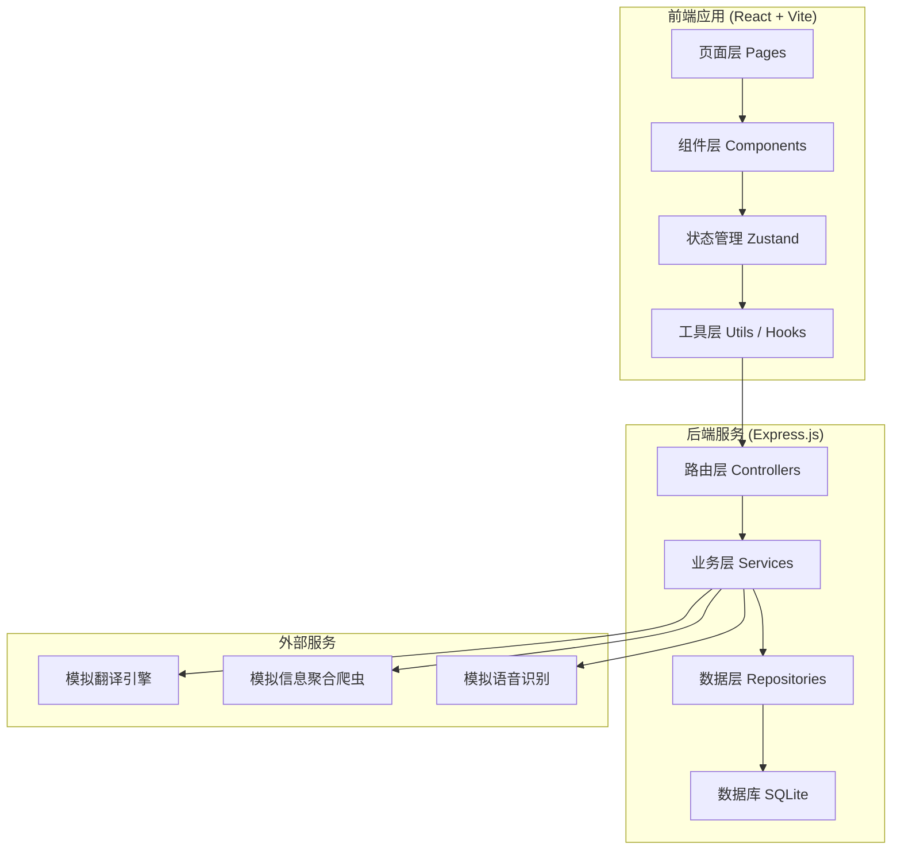
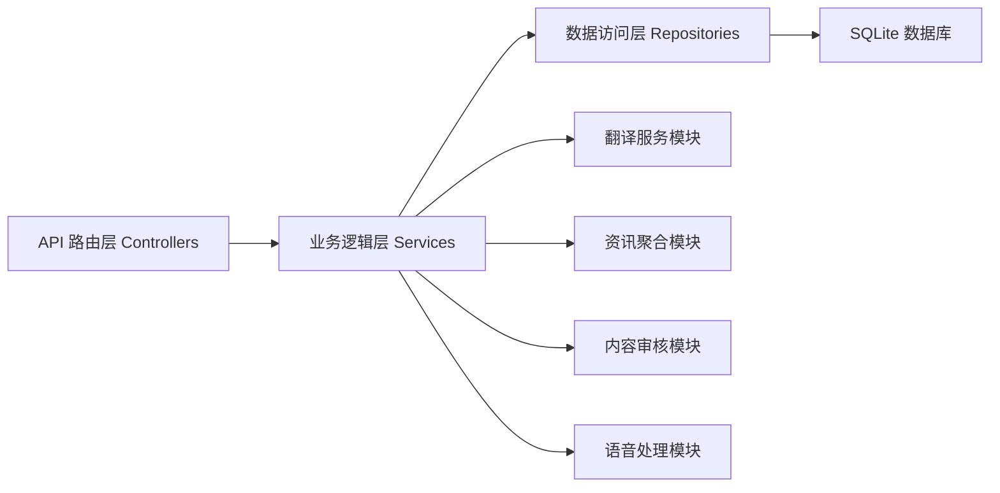
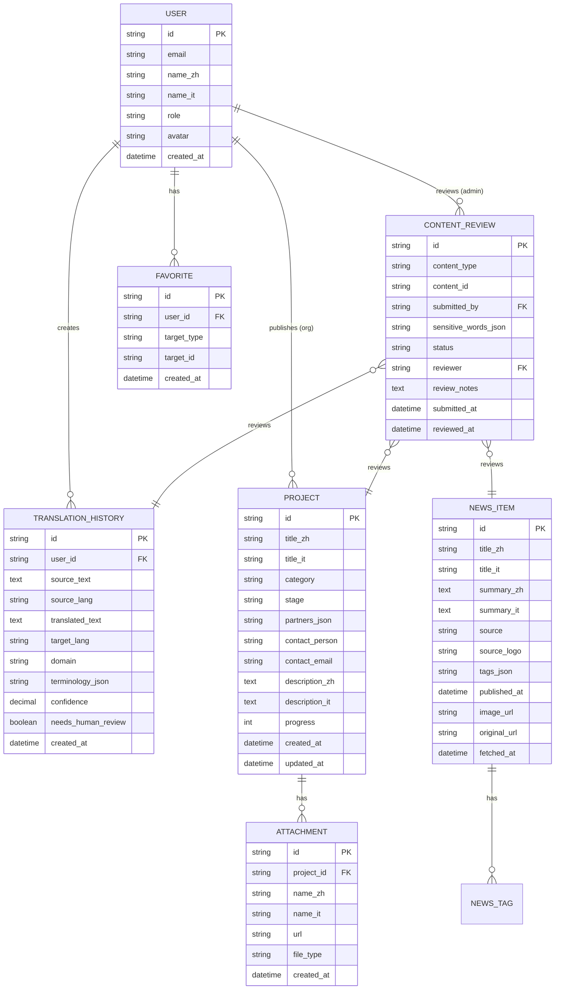

## 1. 架构设计



## 2. 技术描述

- **前端**：React 18 + TypeScript + Vite + Tailwind CSS 3 + Zustand + React Router DOM
- **后端**：Express.js 4 + TypeScript
- **数据库**：SQLite（本地文件存储，便于演示与开发）
- **图标库**：lucide-react
- **初始化工具**：vite-init
- **状态管理**：Zustand（轻量级全局状态，支持语言切换、用户状态等）
- **样式方案**：Tailwind CSS + 自定义 CSS 变量（主题色系统）

## 3. 路由定义

| 路由路径 | 页面用途 |
|----------|----------|
| / | 首页 - 资讯聚合、功能入口、项目亮点 |
| /translate | 智能互译 - 文本/文档翻译、术语校验、人工润色 |
| /projects | 项目库 - 中意合作项目列表、分类筛选 |
| /projects/:id | 项目详情 - 项目信息、合作方、附件文档 |
| /pocket-translator | 随身翻译 - 语音识别、实时字幕、场景模式 |
| /news | 资讯聚合 - 多源资讯、主题标签、双语简报 |
| /admin | 后台管理 - 内容审核、发布溯源、用户管理 |
| /profile | 个人中心 - 收藏、翻译历史、订阅设置 |
| /login | 登录页 |

## 4. API 定义

```typescript
// 翻译相关
interface TranslateRequest {
  sourceText: string;
  sourceLang: 'zh' | 'it';
  targetLang: 'zh' | 'it';
  domain?: 'general' | 'diplomatic' | 'economic' | 'education' | 'medical' | 'legal';
}

interface TranslateResponse {
  translatedText: string;
  terminology: Array<{ term: string; translation: string; confidence: number }>;
  confidence: number;
  needsHumanReview: boolean;
}

// 项目相关
interface Project {
  id: string;
  titleZh: string;
  titleIt: string;
  category: 'economic' | 'education' | 'tourism' | 'technology';
  stage: 'planning' | 'negotiation' | 'implementation' | 'completed';
  partners: Array<{ nameZh: string; nameIt: string; type: string }>;
  contactPerson: string;
  contactEmail: string;
  descriptionZh: string;
  descriptionIt: string;
  progress: number;
  attachments: Array<{ id: string; nameZh: string; nameIt: string; url: string }>;
  updatedAt: string;
}

// 资讯相关
interface NewsItem {
  id: string;
  titleZh: string;
  titleIt: string;
  summaryZh: string;
  summaryIt: string;
  source: string;
  sourceLogo?: string;
  tags: string[];
  publishedAt: string;
  imageUrl?: string;
  originalUrl: string;
}

// 审核相关
interface ContentReview {
  id: string;
  contentType: 'news' | 'project' | 'translation';
  contentId: string;
  submittedBy: string;
  submittedAt: string;
  sensitiveWords: Array<{ word: string; position: number }>;
  status: 'pending' | 'approved' | 'rejected';
  reviewer?: string;
  reviewedAt?: string;
  reviewNotes?: string;
}

// 用户相关
interface User {
  id: string;
  email: string;
  nameZh: string;
  nameIt: string;
  role: 'user' | 'organization' | 'translator' | 'admin';
  avatar?: string;
}
```

## 5. 后端服务架构



## 6. 数据模型

### 6.1 ER 图



### 6.2 DDL 语句

```sql
-- 用户表
CREATE TABLE users (
  id TEXT PRIMARY KEY,
  email TEXT UNIQUE NOT NULL,
  name_zh TEXT NOT NULL,
  name_it TEXT NOT NULL,
  role TEXT NOT NULL DEFAULT 'user',
  avatar TEXT,
  created_at DATETIME DEFAULT CURRENT_TIMESTAMP
);

-- 项目表
CREATE TABLE projects (
  id TEXT PRIMARY KEY,
  title_zh TEXT NOT NULL,
  title_it TEXT NOT NULL,
  category TEXT NOT NULL,
  stage TEXT NOT NULL,
  partners_json TEXT,
  contact_person TEXT,
  contact_email TEXT,
  description_zh TEXT,
  description_it TEXT,
  progress INTEGER DEFAULT 0,
  created_at DATETIME DEFAULT CURRENT_TIMESTAMP,
  updated_at DATETIME DEFAULT CURRENT_TIMESTAMP
);

-- 附件表
CREATE TABLE attachments (
  id TEXT PRIMARY KEY,
  project_id TEXT NOT NULL,
  name_zh TEXT NOT NULL,
  name_it TEXT NOT NULL,
  url TEXT NOT NULL,
  file_type TEXT,
  created_at DATETIME DEFAULT CURRENT_TIMESTAMP,
  FOREIGN KEY (project_id) REFERENCES projects(id)
);

-- 资讯表
CREATE TABLE news_items (
  id TEXT PRIMARY KEY,
  title_zh TEXT NOT NULL,
  title_it TEXT NOT NULL,
  summary_zh TEXT,
  summary_it TEXT,
  source TEXT NOT NULL,
  source_logo TEXT,
  tags_json TEXT,
  published_at DATETIME,
  image_url TEXT,
  original_url TEXT,
  fetched_at DATETIME DEFAULT CURRENT_TIMESTAMP
);

-- 翻译历史表
CREATE TABLE translation_history (
  id TEXT PRIMARY KEY,
  user_id TEXT,
  source_text TEXT NOT NULL,
  source_lang TEXT NOT NULL,
  translated_text TEXT,
  target_lang TEXT NOT NULL,
  domain TEXT DEFAULT 'general',
  terminology_json TEXT,
  confidence REAL,
  needs_human_review INTEGER DEFAULT 0,
  created_at DATETIME DEFAULT CURRENT_TIMESTAMP,
  FOREIGN KEY (user_id) REFERENCES users(id)
);

-- 内容审核表
CREATE TABLE content_reviews (
  id TEXT PRIMARY KEY,
  content_type TEXT NOT NULL,
  content_id TEXT NOT NULL,
  submitted_by TEXT,
  sensitive_words_json TEXT,
  status TEXT NOT NULL DEFAULT 'pending',
  reviewer TEXT,
  review_notes TEXT,
  submitted_at DATETIME DEFAULT CURRENT_TIMESTAMP,
  reviewed_at DATETIME,
  FOREIGN KEY (submitted_by) REFERENCES users(id),
  FOREIGN KEY (reviewer) REFERENCES users(id)
);

-- 收藏表
CREATE TABLE favorites (
  id TEXT PRIMARY KEY,
  user_id TEXT NOT NULL,
  target_type TEXT NOT NULL,
  target_id TEXT NOT NULL,
  created_at DATETIME DEFAULT CURRENT_TIMESTAMP,
  FOREIGN KEY (user_id) REFERENCES users(id),
  UNIQUE(user_id, target_type, target_id)
);

-- 初始数据
INSERT INTO users (id, email, name_zh, name_it, role) VALUES
  ('admin_001', 'admin@cnit-platform.org', '系统管理员', 'Amministratore', 'admin'),
  ('trans_001', 'translator@cnit-platform.org', '张译员', 'Traduttore Zhang', 'translator');

INSERT INTO projects (id, title_zh, title_it, category, stage, partners_json, contact_person, contact_email, description_zh, description_it, progress) VALUES
  ('proj_001', '中意智能制造联合实验室', 'Laboratorio Congiunto di Manifattura Intelligente Cina-Italia', 'technology', 'implementation', '[{"name_zh":"清华大学","name_it":"Università Tsinghua","type":"学术机构"},{"name_zh":"米兰理工大学","name_it":"Politecnico di Milano","type":"学术机构"}]', '王教授', 'wang@tsinghua.edu.cn', '聚焦先进制造领域的联合研发...', 'Focus sulla ricerca congiunta nel settore della manifattura avanzata...', 65),
  ('proj_002', '丝绸之路文化旅游年', 'Anno del Turismo Culturale della Via della Seta', 'tourism', 'negotiation', '[{"name_zh":"中国文化和旅游部","name_it":"Ministero della Cultura e del Turismo Cinese","type":"政府机构"}]', '李主任', 'li@tourism.gov.cn', '推动两国文化旅游深度合作...', 'Promuovere la cooperazione approfondita nel turismo culturale...', 30);

INSERT INTO news_items (id, title_zh, title_it, summary_zh, summary_it, source, tags_json, published_at, original_url) VALUES
  ('news_001', '中意两国签署经贸合作新协议', 'Cina e Italia firmano un nuovo accordo di cooperazione economica', '双方就贸易、投资、中小企业等领域达成多项共识...', 'Le due parti hanno raggiunto molti consensi su commercio, investimenti, PMI...', '新华视点', '["经贸","合作协议"]', '2026-06-20T10:00:00Z', 'https://example.com/news/1'),
  ('news_002', '意大利高校扩大对华招生计划', 'Le università italiane ampliano i programmi di ammissione per studenti cinesi', '多所意大利顶尖高校宣布增加中国留学生名额...', 'Molte università italiane top annunciano l''aumento dei posti per studenti cinesi...', '安莎社', '["教育","留学"]', '2026-06-19T15:30:00Z', 'https://example.com/news/2');
```
