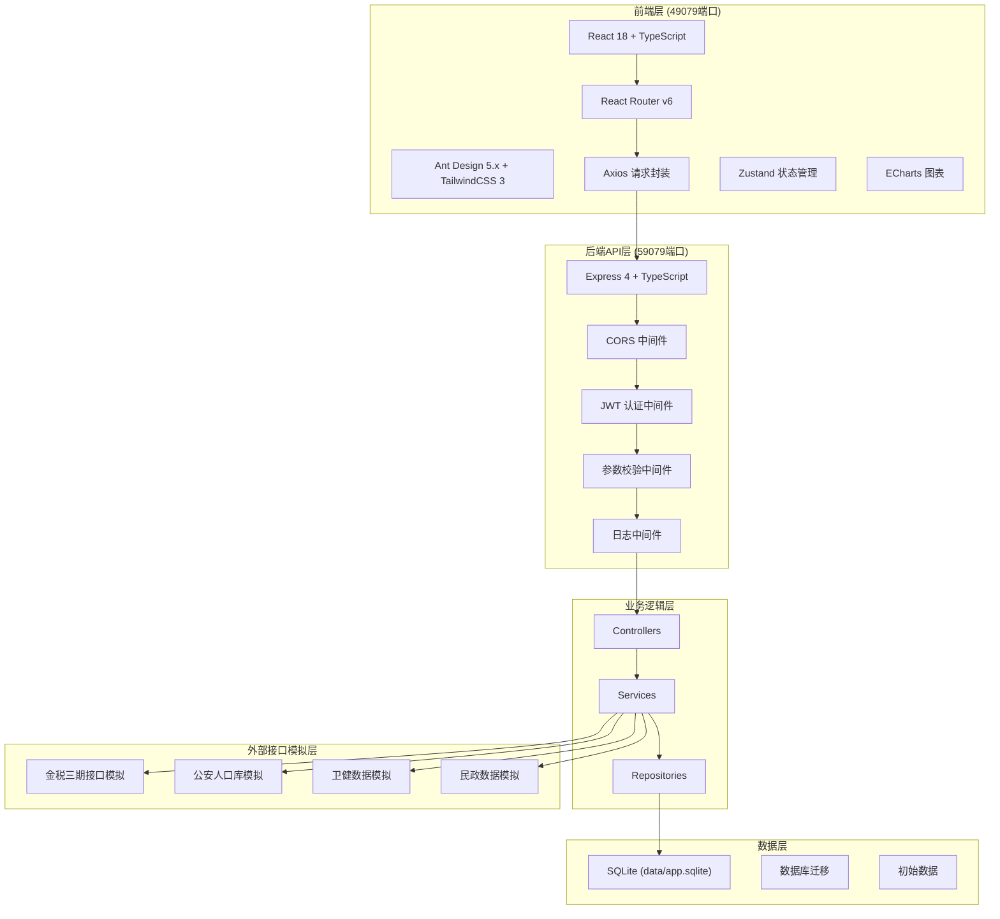
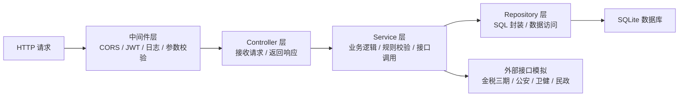
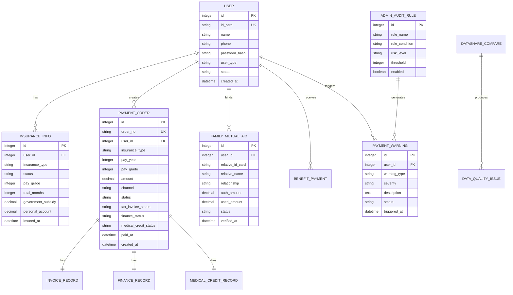

## 1. 架构设计



## 2. 技术选型说明

- **前端**：React 18 + TypeScript + Vite 5 + Ant Design 5.x + TailwindCSS 3 + Zustand + ECharts 5
- **后端**：Node.js + Express 4 + TypeScript + JWT + bcryptjs
- **数据库**：SQLite 3 (data/app.sqlite)，使用 better-sqlite3 驱动
- **ORM**：无原生ORM，使用 Repository 模式封装SQL操作
- **端口配置**：前端 49079，后端 59079，仅监听 127.0.0.1
- **进程管理**：后端使用 nodemon 开发热重载，生产使用 pm2
- **日志**：前后端分别写入 frontend.log、backend.log

## 3. 路由定义

| 路由 | 页面/用途 |
|------|----------|
| / | 首页 - 服务导航 |
| /insurance | 参保登记查询 |
| /payment | 社保缴费中心 |
| /family | 家庭共济账户 |
| /benefit | 待遇发放中心 |
| /calculator | 政策计算器 |
| /admin/audit | 税务稽核管理 |
| /admin/warning | 异常缴费预警 |
| /admin/datashare | 跨部门数据共享 |
| /login | 用户登录 |
| /api/* | 后端API接口前缀 |

## 4. API 定义

### 4.1 TypeScript 类型定义

```typescript
// 用户相关
interface User {
  id: number;
  idCard: string;
  name: string;
  phone: string;
  userType: 'resident' | 'flexible' | 'admin_tax' | 'admin_ops';
  status: 'active' | 'suspended';
  createdAt: string;
}

// 参保信息
interface InsuranceInfo {
  id: number;
  userId: number;
  insuranceType: 'pension' | 'medical' | 'flexible_pension' | 'flexible_medical';
  status: 'insured' | 'suspended' | 'terminated';
  payGrade: number;
  totalMonths: number;
  governmentSubsidy: number;
  personalAccount: number;
}

// 缴费订单
interface PaymentOrder {
  id: number;
  orderNo: string;
  userId: number;
  insuranceType: string;
  payYear: number;
  payGrade: number;
  amount: number;
  channel: 'wechat' | 'alipay' | 'dc_epay' | 'bank';
  status: 'pending' | 'paid' | 'cancelled' | 'refunded';
  taxInvoiceStatus: 'pending' | 'issued' | 'failed';
  financeStatus: 'pending' | 'warehoused' | 'failed';
  medicalCreditStatus: 'pending' | 'credited' | 'failed';
  paidAt: string;
  createdAt: string;
}

// 家庭共济
interface FamilyMutualAid {
  id: number;
  userId: number;
  relativeIdCard: string;
  relativeName: string;
  relationship: 'parent' | 'child' | 'spouse';
  authAmount: number;
  usedAmount: number;
  status: 'pending_verify' | 'active' | 'rejected' | 'terminated';
  verifiedAt: string;
}

// 异常预警
interface PaymentWarning {
  id: number;
  userId: number;
  warningType: 'break_pay' | 'abnormal_amount' | 'suspected_fraud';
  severity: 'low' | 'medium' | 'high';
  description: string;
  status: 'pending' | 'processing' | 'resolved' | 'ignored';
  triggeredAt: string;
}
```

### 4.2 核心API列表

| Method | Path | 功能 |
|--------|------|------|
| POST | /api/auth/login | 用户登录 |
| GET | /api/user/profile | 获取当前用户信息 |
| GET | /api/insurance | 查询参保信息列表 |
| GET | /api/insurance/:id/history | 查询参保历史 |
| GET | /api/payment/orders | 查询缴费订单列表 |
| POST | /api/payment/create-order | 创建缴费订单 |
| POST | /api/payment/:id/pay | 订单支付 |
| GET | /api/payment/:id/status | 查询订单状态（含三端同步） |
| GET | /api/family/members | 查询共济绑定成员 |
| POST | /api/family/bind | 发起共济绑定 |
| POST | /api/family/:id/authorize | 设置授权额度 |
| GET | /api/benefit/pension | 查询养老金发放明细 |
| GET | /api/benefit/medical | 查询医保账户明细 |
| POST | /api/calculator/pension-estimate | 养老金测算 |
| GET | /api/admin/warnings | 查询异常预警列表 |
| POST | /api/admin/warnings/:id/handle | 处理预警 |
| GET | /api/admin/audit-rules | 查询稽核规则 |
| POST | /api/admin/audit-rules | 配置稽核规则 |
| GET | /api/admin/datashare/compare | 跨部门数据比对 |
| GET | /api/health | 健康检查 |

## 5. 服务端架构图



## 6. 数据模型

### 6.1 ER 图



### 6.2 DDL 语句

```sql
-- 用户表
CREATE TABLE users (
  id INTEGER PRIMARY KEY AUTOINCREMENT,
  id_card VARCHAR(18) UNIQUE NOT NULL,
  name VARCHAR(50) NOT NULL,
  phone VARCHAR(11) NOT NULL,
  password_hash VARCHAR(255) NOT NULL,
  user_type VARCHAR(20) NOT NULL CHECK(user_type IN ('resident','flexible','admin_tax','admin_ops')),
  status VARCHAR(20) NOT NULL DEFAULT 'active',
  created_at DATETIME DEFAULT CURRENT_TIMESTAMP
);

-- 参保信息表
CREATE TABLE insurance_info (
  id INTEGER PRIMARY KEY AUTOINCREMENT,
  user_id INTEGER NOT NULL,
  insurance_type VARCHAR(30) NOT NULL,
  status VARCHAR(20) NOT NULL DEFAULT 'insured',
  pay_grade INTEGER NOT NULL,
  total_months INTEGER NOT NULL DEFAULT 0,
  government_subsidy DECIMAL(12,2) NOT NULL DEFAULT 0,
  personal_account DECIMAL(12,2) NOT NULL DEFAULT 0,
  insured_at DATETIME DEFAULT CURRENT_TIMESTAMP,
  FOREIGN KEY(user_id) REFERENCES users(id)
);

-- 缴费订单表
CREATE TABLE payment_orders (
  id INTEGER PRIMARY KEY AUTOINCREMENT,
  order_no VARCHAR(32) UNIQUE NOT NULL,
  user_id INTEGER NOT NULL,
  insurance_type VARCHAR(30) NOT NULL,
  pay_year INTEGER NOT NULL,
  pay_grade INTEGER NOT NULL,
  amount DECIMAL(12,2) NOT NULL,
  channel VARCHAR(20) NOT NULL,
  status VARCHAR(20) NOT NULL DEFAULT 'pending',
  tax_invoice_status VARCHAR(20) NOT NULL DEFAULT 'pending',
  finance_status VARCHAR(20) NOT NULL DEFAULT 'pending',
  medical_credit_status VARCHAR(20) NOT NULL DEFAULT 'pending',
  paid_at DATETIME,
  created_at DATETIME DEFAULT CURRENT_TIMESTAMP,
  FOREIGN KEY(user_id) REFERENCES users(id)
);

-- 家庭共济表
CREATE TABLE family_mutual_aid (
  id INTEGER PRIMARY KEY AUTOINCREMENT,
  user_id INTEGER NOT NULL,
  relative_id_card VARCHAR(18) NOT NULL,
  relative_name VARCHAR(50) NOT NULL,
  relationship VARCHAR(20) NOT NULL,
  auth_amount DECIMAL(12,2) NOT NULL DEFAULT 0,
  used_amount DECIMAL(12,2) NOT NULL DEFAULT 0,
  status VARCHAR(20) NOT NULL DEFAULT 'pending_verify',
  verified_at DATETIME,
  created_at DATETIME DEFAULT CURRENT_TIMESTAMP,
  FOREIGN KEY(user_id) REFERENCES users(id)
);

-- 养老金发放表
CREATE TABLE pension_payments (
  id INTEGER PRIMARY KEY AUTOINCREMENT,
  user_id INTEGER NOT NULL,
  pay_month VARCHAR(7) NOT NULL,
  amount DECIMAL(12,2) NOT NULL,
  bank_name VARCHAR(50),
  bank_account VARCHAR(30),
  status VARCHAR(20) NOT NULL DEFAULT 'paid',
  paid_at DATETIME DEFAULT CURRENT_TIMESTAMP,
  FOREIGN KEY(user_id) REFERENCES users(id)
);

-- 异常预警表
CREATE TABLE payment_warnings (
  id INTEGER PRIMARY KEY AUTOINCREMENT,
  user_id INTEGER NOT NULL,
  warning_type VARCHAR(30) NOT NULL,
  severity VARCHAR(20) NOT NULL,
  description TEXT,
  status VARCHAR(20) NOT NULL DEFAULT 'pending',
  handler_id INTEGER,
  handled_at DATETIME,
  handle_note TEXT,
  triggered_at DATETIME DEFAULT CURRENT_TIMESTAMP,
  FOREIGN KEY(user_id) REFERENCES users(id)
);

-- 稽核规则表
CREATE TABLE audit_rules (
  id INTEGER PRIMARY KEY AUTOINCREMENT,
  rule_name VARCHAR(100) NOT NULL,
  rule_code VARCHAR(50) UNIQUE NOT NULL,
  rule_condition TEXT NOT NULL,
  risk_level VARCHAR(20) NOT NULL,
  threshold INTEGER,
  enabled BOOLEAN NOT NULL DEFAULT 1,
  created_at DATETIME DEFAULT CURRENT_TIMESTAMP
);

-- 创建索引
CREATE INDEX idx_insurance_user ON insurance_info(user_id);
CREATE INDEX idx_order_user ON payment_orders(user_id);
CREATE INDEX idx_order_status ON payment_orders(status);
CREATE INDEX idx_family_user ON family_mutual_aid(user_id);
CREATE INDEX idx_warning_user ON payment_warnings(user_id);
CREATE INDEX idx_warning_status ON payment_warnings(status);
```

### 6.3 初始数据

```sql
-- 插入测试用户（密码均为 123456）
INSERT INTO users (id_card, name, phone, password_hash, user_type) VALUES 
('430101199001011234', '张三', '13800138001', '$2a$10$N9qo8uLOickgx2ZMRZoMyeIjZAgcfl7p92ldGxad68LJZdL17lhWy', 'resident'),
('430101198505055678', '李四', '13800138002', '$2a$10$N9qo8uLOickgx2ZMRZoMyeIjZAgcfl7p92ldGxad68LJZdL17lhWy', 'flexible'),
('430101198001019999', '王税管', '13900139001', '$2a$10$N9qo8uLOickgx2ZMRZoMyeIjZAgcfl7p92ldGxad68LJZdL17lhWy', 'admin_tax'),
('430101197801018888', '刘运营', '13900139002', '$2a$10$N9qo8uLOickgx2ZMRZoMyeIjZAgcfl7p92ldGxad68LJZdL17lhWy', 'admin_ops');

-- 插入参保信息
INSERT INTO insurance_info (user_id, insurance_type, status, pay_grade, total_months, government_subsidy, personal_account) VALUES 
(1, 'pension', 'insured', 200, 120, 3600, 24000),
(1, 'medical', 'insured', 320, 120, 2400, 8000),
(2, 'flexible_pension', 'insured', 600, 60, 0, 36000);

-- 插入稽核规则
INSERT INTO audit_rules (rule_name, rule_code, rule_condition, risk_level, threshold) VALUES 
('断缴超过3个月预警', 'break_pay_3m', '连续未缴费月数 > 3', 'medium', 3),
('缴费金额异常偏高', 'abnormal_high', '单笔缴费 > 上年度平均的3倍', 'high', 300),
('疑似重复参保', 'duplicate_insurance', '同一身份证在多险种参保', 'high', NULL),
('年龄异常缴费', 'age_abnormal', '参保年龄 < 16 或 > 70', 'medium', NULL);
```
