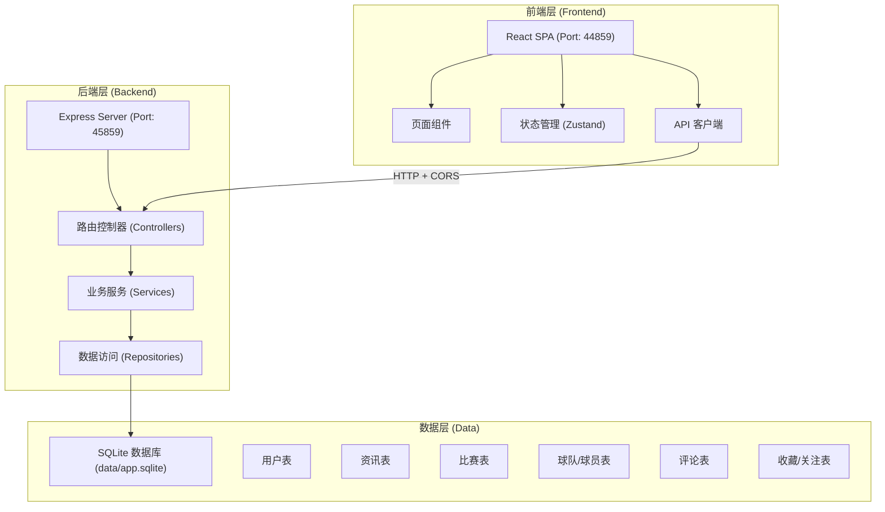
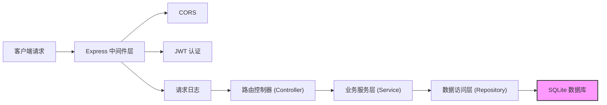
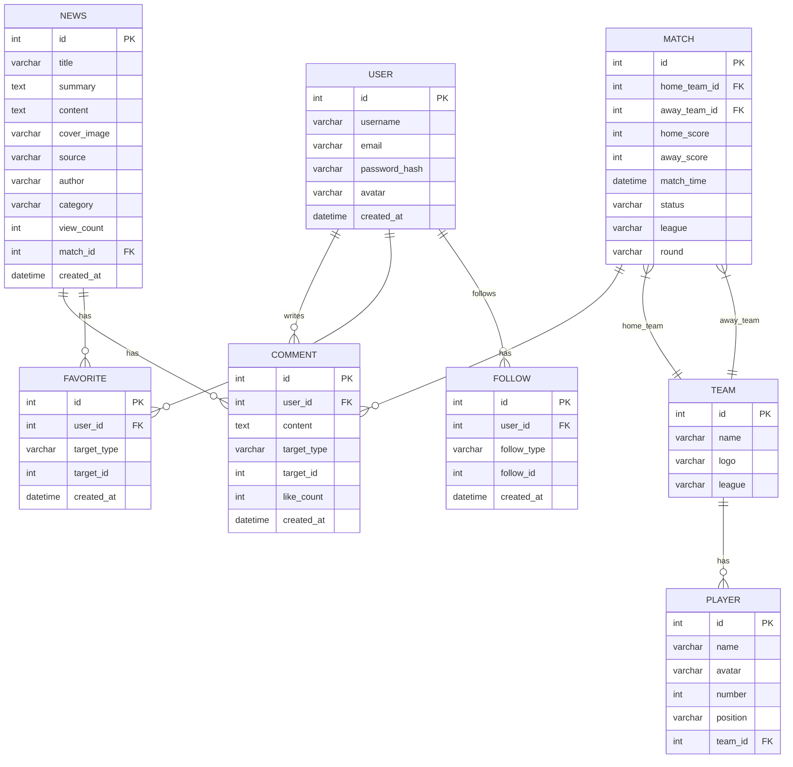

# 足球资讯社区平台 技术架构文档

## 1. 架构设计



## 2. 技术选型说明

### 2.1 前端技术栈
- **框架**: React@18 + TypeScript
- **构建工具**: Vite@5
- **路由**: react-router-dom@6
- **状态管理**: zustand@4
- **样式**: tailwindcss@3
- **图标**: lucide-react
- **HTTP客户端**: fetch API (原生)

### 2.2 后端技术栈
- **框架**: Express@4 + TypeScript
- **数据库驱动**: better-sqlite3
- **认证**: JWT (jsonwebtoken)
- **密码加密**: bcryptjs
- **CORS**: cors 中间件
- **环境变量**: dotenv

### 2.3 数据库
- **主数据库**: SQLite (data/app.sqlite)
  - 原因：无需额外服务，快速启动，本地开发友好
  - 配置：自动创建数据库文件和表结构
  - 降级方案：无，SQLite本身就是文件级数据库

### 2.4 端口规划
- 前端开发服务器: **44859**
- 后端API服务器: **45859**
- 基于项目号 may-4859 生成，避开常见端口

## 3. 路由定义

### 3.1 前端路由
| 路由路径 | 页面组件 | 功能说明 |
|----------|----------|----------|
| / | HomePage | 首页 - 头条轮播、资讯流 |
| /matches | MatchesPage | 比赛页 - 赛程、比分 |
| /matches/:id | MatchDetailPage | 比赛详情 |
| /search | SearchPage | 搜索页 |
| /news/:id | NewsDetailPage | 新闻详情页 |
| /login | LoginPage | 登录页 |
| /register | RegisterPage | 注册页 |
| /user | UserProfilePage | 用户中心 |

### 3.2 后端API路由
| 路由路径 | HTTP方法 | 功能说明 |
|----------|----------|----------|
| /api/health | GET | 健康检查 |
| /api/news | GET | 获取新闻列表 |
| /api/news/:id | GET | 获取新闻详情 |
| /api/matches | GET | 获取比赛列表 |
| /api/matches/:id | GET | 获取比赛详情 |
| /api/search | GET | 搜索接口 |
| /api/search/hot | GET | 获取热门搜索词 |
| /api/teams | GET | 获取球队列表 |
| /api/players | GET | 获取球员列表 |
| /api/auth/register | POST | 用户注册 |
| /api/auth/login | POST | 用户登录 |
| /api/user/profile | GET | 获取用户信息 |
| /api/comments | GET/POST | 评论CRUD |
| /api/favorites | GET/POST/DELETE | 收藏CRUD |
| /api/follows | GET/POST/DELETE | 关注CRUD |

## 4. API 数据结构定义

```typescript
// 通用响应
interface ApiResponse<T> {
  code: number;
  message: string;
  data: T;
}

// 用户相关
interface User {
  id: number;
  username: string;
  email: string;
  avatar: string;
  createdAt: string;
}

interface LoginRequest {
  email: string;
  password: string;
}

interface RegisterRequest {
  username: string;
  email: string;
  password: string;
}

// 新闻相关
interface News {
  id: number;
  title: string;
  summary: string;
  content: string;
  coverImage: string;
  source: string;
  author: string;
  category: string;
  viewCount: number;
  createdAt: string;
  matchId?: number;
}

// 比赛相关
interface Match {
  id: number;
  homeTeamId: number;
  awayTeamId: number;
  homeTeam: Team;
  awayTeam: Team;
  homeScore: number;
  awayScore: number;
  matchTime: string;
  status: 'upcoming' | 'live' | 'finished';
  league: string;
  round: string;
}

interface MatchDetail extends Match {
  homeLineup: Player[];
  awayLineup: Player[];
  statistics: MatchStats;
  relatedNews: News[];
}

interface MatchStats {
  possession: [number, number];
  shots: [number, number];
  shotsOnTarget: [number, number];
  corners: [number, number];
  fouls: [number, number];
  yellowCards: [number, number];
  redCards: [number, number];
}

// 球队球员
interface Team {
  id: number;
  name: string;
  logo: string;
  league: string;
}

interface Player {
  id: number;
  name: string;
  avatar: string;
  number: number;
  position: string;
  teamId: number;
}

// 评论收藏
interface Comment {
  id: number;
  userId: number;
  user: User;
  content: string;
  targetType: 'news' | 'match';
  targetId: number;
  createdAt: string;
  likeCount: number;
}

// 搜索结果
interface SearchResult {
  news: News[];
  matches: Match[];
  teams: Team[];
  players: Player[];
}
```

## 5. 后端服务架构



## 6. 数据模型

### 6.1 ER 图



### 6.2 DDL 语句

```sql
-- 用户表
CREATE TABLE IF NOT EXISTS users (
  id INTEGER PRIMARY KEY AUTOINCREMENT,
  username VARCHAR(50) NOT NULL UNIQUE,
  email VARCHAR(100) NOT NULL UNIQUE,
  password_hash VARCHAR(255) NOT NULL,
  avatar VARCHAR(255),
  created_at DATETIME DEFAULT CURRENT_TIMESTAMP
);

-- 球队表
CREATE TABLE IF NOT EXISTS teams (
  id INTEGER PRIMARY KEY AUTOINCREMENT,
  name VARCHAR(100) NOT NULL,
  logo VARCHAR(255),
  league VARCHAR(50) NOT NULL
);

-- 球员表
CREATE TABLE IF NOT EXISTS players (
  id INTEGER PRIMARY KEY AUTOINCREMENT,
  name VARCHAR(100) NOT NULL,
  avatar VARCHAR(255),
  number INTEGER,
  position VARCHAR(20),
  team_id INTEGER REFERENCES teams(id)
);

-- 比赛表
CREATE TABLE IF NOT EXISTS matches (
  id INTEGER PRIMARY KEY AUTOINCREMENT,
  home_team_id INTEGER NOT NULL REFERENCES teams(id),
  away_team_id INTEGER NOT NULL REFERENCES teams(id),
  home_score INTEGER DEFAULT 0,
  away_score INTEGER DEFAULT 0,
  match_time DATETIME NOT NULL,
  status VARCHAR(20) DEFAULT 'upcoming',
  league VARCHAR(50) NOT NULL,
  round VARCHAR(50)
);

-- 新闻表
CREATE TABLE IF NOT EXISTS news (
  id INTEGER PRIMARY KEY AUTOINCREMENT,
  title VARCHAR(200) NOT NULL,
  summary TEXT,
  content TEXT NOT NULL,
  cover_image VARCHAR(255),
  source VARCHAR(50),
  author VARCHAR(50),
  category VARCHAR(50),
  view_count INTEGER DEFAULT 0,
  match_id INTEGER REFERENCES matches(id),
  created_at DATETIME DEFAULT CURRENT_TIMESTAMP
);

-- 评论表
CREATE TABLE IF NOT EXISTS comments (
  id INTEGER PRIMARY KEY AUTOINCREMENT,
  user_id INTEGER NOT NULL REFERENCES users(id),
  content TEXT NOT NULL,
  target_type VARCHAR(20) NOT NULL,
  target_id INTEGER NOT NULL,
  like_count INTEGER DEFAULT 0,
  created_at DATETIME DEFAULT CURRENT_TIMESTAMP
);

-- 收藏表
CREATE TABLE IF NOT EXISTS favorites (
  id INTEGER PRIMARY KEY AUTOINCREMENT,
  user_id INTEGER NOT NULL REFERENCES users(id),
  target_type VARCHAR(20) NOT NULL,
  target_id INTEGER NOT NULL,
  created_at DATETIME DEFAULT CURRENT_TIMESTAMP,
  UNIQUE(user_id, target_type, target_id)
);

-- 关注表
CREATE TABLE IF NOT EXISTS follows (
  id INTEGER PRIMARY KEY AUTOINCREMENT,
  user_id INTEGER NOT NULL REFERENCES users(id),
  follow_type VARCHAR(20) NOT NULL,
  follow_id INTEGER NOT NULL,
  created_at DATETIME DEFAULT CURRENT_TIMESTAMP,
  UNIQUE(user_id, follow_type, follow_id)
);

-- 搜索热词表
CREATE TABLE IF NOT EXISTS search_hot (
  id INTEGER PRIMARY KEY AUTOINCREMENT,
  keyword VARCHAR(100) NOT NULL UNIQUE,
  search_count INTEGER DEFAULT 1,
  updated_at DATETIME DEFAULT CURRENT_TIMESTAMP
);

-- 索引
CREATE INDEX IF NOT EXISTS idx_news_category ON news(category);
CREATE INDEX IF NOT EXISTS idx_news_created_at ON news(created_at DESC);
CREATE INDEX IF NOT EXISTS idx_matches_match_time ON matches(match_time DESC);
CREATE INDEX IF NOT EXISTS idx_comments_target ON comments(target_type, target_id);
```

## 7. 项目目录结构

```
may-4859/
├── .trae/documents/          # 文档目录
│   ├── prd.md
│   └── tech-arch.md
├── data/                     # SQLite数据库目录
│   └── app.sqlite
├── migrations/               # 数据库迁移脚本
│   └── 001_init.sql
├── api/                      # 后端代码
│   ├── src/
│   │   ├── controllers/      # 控制器
│   │   ├── services/         # 业务服务
│   │   ├── repositories/     # 数据访问
│   │   ├── middleware/       # 中间件
│   │   ├── models/           # 类型定义
│   │   ├── db.ts             # 数据库连接
│   │   └── server.ts         # 服务器入口
│   ├── package.json
│   └── tsconfig.json
├── src/                      # 前端代码
│   ├── components/           # 组件
│   ├── pages/                # 页面
│   ├── hooks/                # 自定义hooks
│   ├── store/                # 状态管理
│   ├── services/             # API服务
│   ├── types/                # 类型定义
│   ├── utils/                # 工具函数
│   ├── App.tsx
│   └── main.tsx
├── public/                   # 静态资源
├── .env                      # 环境变量
├── package.json
├── tsconfig.json
├── vite.config.ts
└── tailwind.config.js
```
