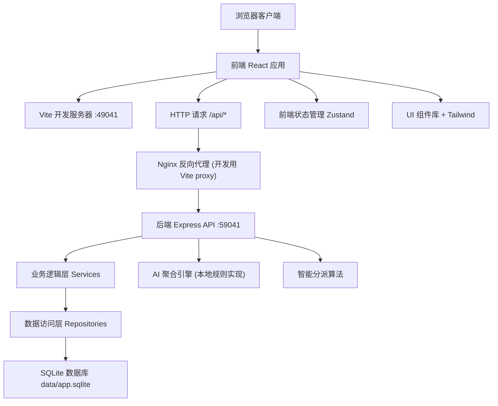
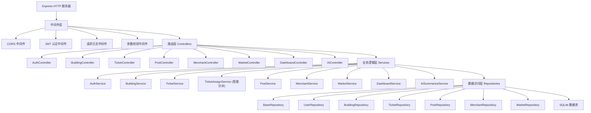
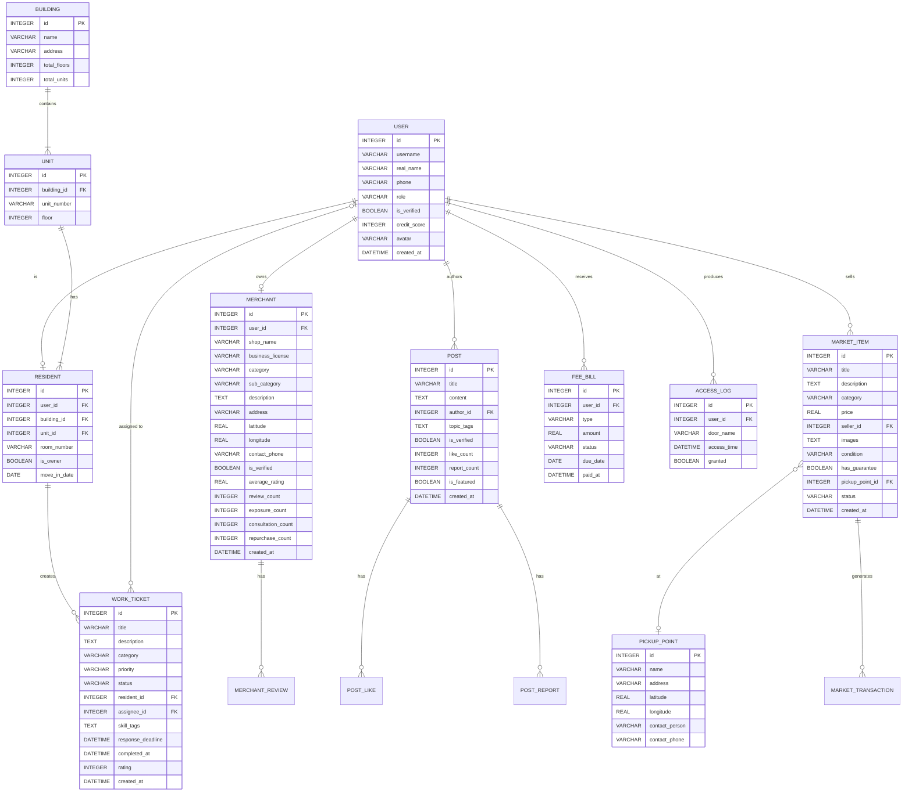

## 1. 架构设计



## 2. 技术描述
- **前端**: React@18 + TypeScript + Vite@5 + TailwindCSS@3 + Zustand + React Router@6 + Recharts
- **初始化工具**: vite-init (npm create vite@latest)
- **后端**: Express@4 + TypeScript + better-sqlite3 + cors + bcryptjs + jsonwebtoken
- **数据库**: SQLite (data/app.sqlite)，使用 better-sqlite3 同步驱动，无需外部服务
- **AI 引擎**: 本地实现基于规则的文本摘要和信息聚合算法，无需调用外部大模型
- **地图**: 使用 Leaflet.js 开源地图库 + OpenStreetMap 瓦片，无需 API Key

**端口配置（项目 may-89041）**:
- tail4 = 9041
- FRONTEND_PORT = 40000 + 9041 = 49041
- BACKEND_PORT = 50000 + 9041 = 59041
- 备用槽位: 41000+9041/51000+9041 → 50041/60041, 51041/61041, 52041/62041, 53041/63041, 54041/64041

## 3. 路由定义

| 路由路径 | 页面组件 | 用途 |
|----------|----------|------|
| / | Dashboard | 首页仪表盘，社区概览 |
| /buildings | BuildingList | 楼栋住户图谱 |
| /buildings/:id | BuildingDetail | 楼栋详情 |
| /services | ServiceCenter | 物业服务中心 |
| /services/tickets | TicketList | 报修工单列表 |
| /services/tickets/new | TicketCreate | 创建报修单 |
| /services/tickets/:id | TicketDetail | 工单详情 |
| /services/access | AccessControl | 门禁权限管理 |
| /services/fees | FeeCenter | 费用中心 |
| /community | CommunityFeed | 邻里内容社区 |
| /community/posts/new | PostCreate | 发布新帖 |
| /community/posts/:id | PostDetail | 帖子详情 |
| /merchants | MerchantSquare | 本地商户广场 |
| /merchants/map | MerchantMap | 商户地图视图 |
| /merchants/:id | MerchantDetail | 商户详情 |
| /marketplace | Marketplace | 闲置流转集市 |
| /marketplace/items/new | ItemCreate | 发布闲置物品 |
| /marketplace/items/:id | ItemDetail | 物品详情 |
| /dashboard/merchant | MerchantDashboard | 商户经营看板 |
| /dashboard/community | CommunityMetrics | 社区指数看板 |
| /dashboard/operations | OperationsDashboard | 运营数据看板 |
| /login | Login | 登录页 |
| /register | Register | 注册页 |
| /profile | Profile | 个人中心 |

## 4. API 定义

### 4.1 类型定义

```typescript
// 用户相关
interface User {
  id: number;
  username: string;
  realName: string;
  phone: string;
  role: 'resident' | 'property' | 'merchant' | 'admin';
  isVerified: boolean;
  buildingId: number | null;
  unitId: number | null;
  roomNumber: string | null;
  creditScore: number;
  avatar: string;
  createdAt: string;
}

// 楼栋相关
interface Building {
  id: number;
  name: string;
  address: string;
  totalFloors: number;
  totalUnits: number;
}

interface Unit {
  id: number;
  buildingId: number;
  unitNumber: string;
  floor: number;
}

interface Resident {
  id: number;
  userId: number;
  buildingId: number;
  unitId: number;
  roomNumber: string;
  isOwner: boolean;
  moveInDate: string;
}

// 工单相关
interface WorkTicket {
  id: number;
  title: string;
  description: string;
  category: 'repair' | 'cleaning' | 'security' | 'other';
  priority: 'low' | 'medium' | 'high' | 'urgent';
  status: 'pending' | 'assigned' | 'processing' | 'completed' | 'cancelled';
  residentId: number;
  assigneeId: number | null;
  skillTags: string[];
  responseDeadline: string;
  completedAt: string | null;
  rating: number | null;
  createdAt: string;
}

// 商户相关
interface Merchant {
  id: number;
  userId: number;
  shopName: string;
  businessLicense: string;
  category: string;
  subCategory: string;
  description: string;
  address: string;
  latitude: number;
  longitude: number;
  contactPhone: string;
  isVerified: boolean;
  averageRating: number;
  reviewCount: number;
  exposureCount: number;
  consultationCount: number;
  repurchaseCount: number;
  createdAt: string;
}

// 帖子相关
interface Post {
  id: number;
  title: string;
  content: string;
  authorId: number;
  topicTags: string[];
  isVerified: boolean;
  likeCount: number;
  reportCount: number;
  isFeatured: boolean;
  createdAt: string;
}

// 闲置物品相关
interface MarketItem {
  id: number;
  title: string;
  description: string;
  category: string;
  price: number;
  sellerId: number;
  images: string[];
  condition: 'new' | 'like_new' | 'good' | 'fair';
  hasGuarantee: boolean;
  pickupPointId: number | null;
  status: 'available' | 'reserved' | 'sold';
  createdAt: string;
}
```

### 4.2 接口列表

| Method | Path | 描述 | 鉴权 |
|--------|------|------|------|
| POST | /api/auth/login | 用户登录 | 否 |
| POST | /api/auth/register | 用户注册 | 否 |
| GET | /api/auth/profile | 获取当前用户信息 | 是 |
| GET | /api/health | 健康检查 | 否 |
| GET | /api/buildings | 获取楼栋列表 | 是 |
| GET | /api/buildings/:id | 获取楼栋详情（含单元和住户） | 是 |
| GET | /api/residents | 获取住户列表 | 是 |
| GET | /api/tickets | 获取工单列表 | 是 |
| POST | /api/tickets | 创建工单 | 是 |
| GET | /api/tickets/:id | 获取工单详情 | 是 |
| PUT | /api/tickets/:id | 更新工单状态 | 是 |
| POST | /api/tickets/:id/assign | 智能分派工单 | 是 |
| GET | /api/access/logs | 获取门禁记录 | 是 (物业) |
| GET | /api/fees | 获取费用账单 | 是 |
| POST | /api/fees/:id/pay | 缴纳费用 | 是 |
| GET | /api/posts | 获取帖子列表 | 是 |
| POST | /api/posts | 创建帖子 | 是 |
| POST | /api/posts/:id/like | 点赞帖子 | 是 |
| POST | /api/posts/:id/report | 举报帖子 | 是 |
| GET | /api/merchants | 获取商户列表 | 是 |
| GET | /api/merchants/:id | 获取商户详情 | 是 |
| GET | /api/merchants/categories | 获取商户分类 | 是 |
| GET | /api/market/items | 获取闲置物品列表 | 是 |
| POST | /api/market/items | 发布闲置物品 | 是 |
| GET | /api/dashboard/community | 社区温度指数 | 是 |
| GET | /api/dashboard/merchant | 商户经营数据 | 是 (商户) |
| GET | /api/dashboard/operations | 运营数据看板 | 是 (管理员) |
| GET | /api/ai/summarize | AI 信息聚合摘要 | 是 |

## 5. 服务端架构图



## 6. 数据模型

### 6.1 ER 图



### 6.2 DDL 语句

```sql
-- 用户表
CREATE TABLE IF NOT EXISTS users (
    id INTEGER PRIMARY KEY AUTOINCREMENT,
    username VARCHAR(50) UNIQUE NOT NULL,
    password_hash VARCHAR(255) NOT NULL,
    real_name VARCHAR(50),
    phone VARCHAR(20) UNIQUE,
    role VARCHAR(20) NOT NULL DEFAULT 'resident',
    is_verified BOOLEAN DEFAULT 0,
    credit_score INTEGER DEFAULT 100,
    avatar VARCHAR(255),
    created_at DATETIME DEFAULT CURRENT_TIMESTAMP
);

-- 楼栋表
CREATE TABLE IF NOT EXISTS buildings (
    id INTEGER PRIMARY KEY AUTOINCREMENT,
    name VARCHAR(100) NOT NULL,
    address VARCHAR(255) NOT NULL,
    total_floors INTEGER DEFAULT 0,
    total_units INTEGER DEFAULT 0,
    created_at DATETIME DEFAULT CURRENT_TIMESTAMP
);

-- 单元表
CREATE TABLE IF NOT EXISTS units (
    id INTEGER PRIMARY KEY AUTOINCREMENT,
    building_id INTEGER NOT NULL,
    unit_number VARCHAR(20) NOT NULL,
    floor INTEGER NOT NULL,
    FOREIGN KEY (building_id) REFERENCES buildings(id)
);

-- 住户表
CREATE TABLE IF NOT EXISTS residents (
    id INTEGER PRIMARY KEY AUTOINCREMENT,
    user_id INTEGER NOT NULL,
    building_id INTEGER NOT NULL,
    unit_id INTEGER NOT NULL,
    room_number VARCHAR(20) NOT NULL,
    is_owner BOOLEAN DEFAULT 0,
    move_in_date DATE,
    FOREIGN KEY (user_id) REFERENCES users(id),
    FOREIGN KEY (building_id) REFERENCES buildings(id),
    FOREIGN KEY (unit_id) REFERENCES units(id)
);

-- 工单表
CREATE TABLE IF NOT EXISTS work_tickets (
    id INTEGER PRIMARY KEY AUTOINCREMENT,
    title VARCHAR(200) NOT NULL,
    description TEXT,
    category VARCHAR(50) NOT NULL,
    priority VARCHAR(20) NOT NULL DEFAULT 'medium',
    status VARCHAR(20) NOT NULL DEFAULT 'pending',
    resident_id INTEGER NOT NULL,
    assignee_id INTEGER,
    skill_tags TEXT,
    response_deadline DATETIME,
    completed_at DATETIME,
    rating INTEGER,
    created_at DATETIME DEFAULT CURRENT_TIMESTAMP,
    FOREIGN KEY (resident_id) REFERENCES residents(id),
    FOREIGN KEY (assignee_id) REFERENCES users(id)
);

-- 帖子表
CREATE TABLE IF NOT EXISTS posts (
    id INTEGER PRIMARY KEY AUTOINCREMENT,
    title VARCHAR(200) NOT NULL,
    content TEXT NOT NULL,
    author_id INTEGER NOT NULL,
    topic_tags TEXT,
    is_verified BOOLEAN DEFAULT 1,
    like_count INTEGER DEFAULT 0,
    report_count INTEGER DEFAULT 0,
    is_featured BOOLEAN DEFAULT 0,
    created_at DATETIME DEFAULT CURRENT_TIMESTAMP,
    FOREIGN KEY (author_id) REFERENCES users(id)
);

-- 商户表
CREATE TABLE IF NOT EXISTS merchants (
    id INTEGER PRIMARY KEY AUTOINCREMENT,
    user_id INTEGER NOT NULL,
    shop_name VARCHAR(100) NOT NULL,
    business_license VARCHAR(50),
    category VARCHAR(50) NOT NULL,
    sub_category VARCHAR(50),
    description TEXT,
    address VARCHAR(255) NOT NULL,
    latitude REAL,
    longitude REAL,
    contact_phone VARCHAR(20),
    is_verified BOOLEAN DEFAULT 0,
    average_rating REAL DEFAULT 0,
    review_count INTEGER DEFAULT 0,
    exposure_count INTEGER DEFAULT 0,
    consultation_count INTEGER DEFAULT 0,
    repurchase_count INTEGER DEFAULT 0,
    created_at DATETIME DEFAULT CURRENT_TIMESTAMP,
    FOREIGN KEY (user_id) REFERENCES users(id)
);

-- 闲置物品表
CREATE TABLE IF NOT EXISTS market_items (
    id INTEGER PRIMARY KEY AUTOINCREMENT,
    title VARCHAR(200) NOT NULL,
    description TEXT,
    category VARCHAR(50) NOT NULL,
    price REAL NOT NULL DEFAULT 0,
    seller_id INTEGER NOT NULL,
    images TEXT,
    condition VARCHAR(20) NOT NULL DEFAULT 'good',
    has_guarantee BOOLEAN DEFAULT 0,
    pickup_point_id INTEGER,
    status VARCHAR(20) NOT NULL DEFAULT 'available',
    created_at DATETIME DEFAULT CURRENT_TIMESTAMP,
    FOREIGN KEY (seller_id) REFERENCES users(id),
    FOREIGN KEY (pickup_point_id) REFERENCES pickup_points(id)
);

-- 自提点表
CREATE TABLE IF NOT EXISTS pickup_points (
    id INTEGER PRIMARY KEY AUTOINCREMENT,
    name VARCHAR(100) NOT NULL,
    address VARCHAR(255) NOT NULL,
    latitude REAL,
    longitude REAL,
    contact_person VARCHAR(50),
    contact_phone VARCHAR(20)
);

-- 费用账单表
CREATE TABLE IF NOT EXISTS fee_bills (
    id INTEGER PRIMARY KEY AUTOINCREMENT,
    user_id INTEGER NOT NULL,
    type VARCHAR(50) NOT NULL,
    amount REAL NOT NULL,
    status VARCHAR(20) NOT NULL DEFAULT 'unpaid',
    due_date DATE,
    paid_at DATETIME,
    created_at DATETIME DEFAULT CURRENT_TIMESTAMP,
    FOREIGN KEY (user_id) REFERENCES users(id)
);

-- 门禁记录表
CREATE TABLE IF NOT EXISTS access_logs (
    id INTEGER PRIMARY KEY AUTOINCREMENT,
    user_id INTEGER NOT NULL,
    door_name VARCHAR(100) NOT NULL,
    access_time DATETIME DEFAULT CURRENT_TIMESTAMP,
    granted BOOLEAN DEFAULT 1,
    FOREIGN KEY (user_id) REFERENCES users(id)
);

-- 索引
CREATE INDEX IF NOT EXISTS idx_tickets_status ON work_tickets(status);
CREATE INDEX IF NOT EXISTS idx_tickets_assignee ON work_tickets(assignee_id);
CREATE INDEX IF NOT EXISTS idx_posts_created ON posts(created_at DESC);
CREATE INDEX IF NOT EXISTS idx_merchants_category ON merchants(category);
CREATE INDEX IF NOT EXISTS idx_fees_user ON fee_bills(user_id);
```

### 6.3 初始数据

```sql
-- 插入测试用户
INSERT INTO users (username, password_hash, real_name, phone, role, is_verified, credit_score) VALUES
('admin', '$2a$10$...', '系统管理员', '13800000000', 'admin', 1, 100),
('property1', '$2a$10$...', '物业张经理', '13800000001', 'property', 1, 100),
('resident1', '$2a$10$...', '李业主', '13800000002', 'resident', 1, 95),
('resident2', '$2a$10$...', '王住户', '13800000003', 'resident', 1, 88),
('merchant1', '$2a$10$...', '刘老板', '13800000004', 'merchant', 1, 92);

-- 插入楼栋数据
INSERT INTO buildings (name, address, total_floors, total_units) VALUES
('1号楼', '阳光花园1号楼', 18, 4),
('2号楼', '阳光花园2号楼', 24, 6),
('3号楼', '阳光花园3号楼', 11, 2);

-- 插入自提点
INSERT INTO pickup_points (name, address, latitude, longitude, contact_person, contact_phone) VALUES
('社区服务中心', '阳光花园南门西侧', 39.9042, 116.4074, '赵阿姨', '13800000100'),
('快递驿站', '阳光花园东门北侧', 39.9045, 116.4078, '孙师傅', '13800000101');
```
