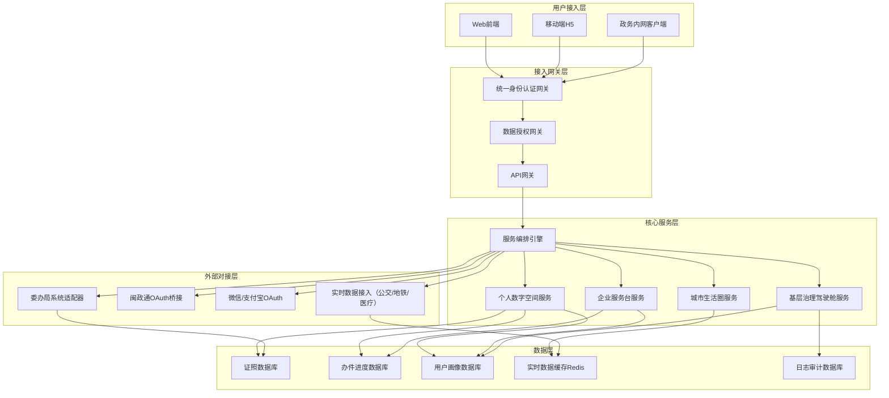
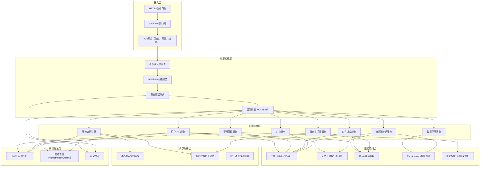
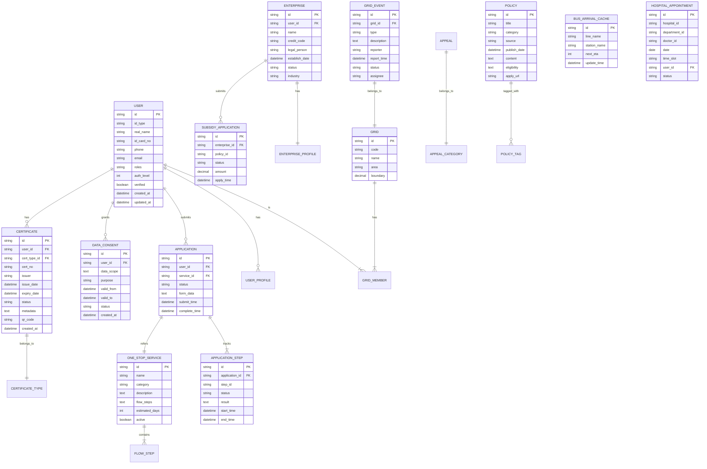

## 1. 架构设计



## 2. 技术栈说明

### 2.1 前端技术栈
- **框架**：React@18 + TypeScript
- **构建工具**：Vite@5
- **路由管理**：react-router-dom@6
- **状态管理**：zustand@4
- **UI框架**：tailwindcss@3 + shadcn/ui
- **图表库**：recharts@2（常规图表） + @ant-design/charts（复杂图谱）
- **地图组件**：@pansy/react-amap（高德地图React封装）
- **图标库**：lucide-react
- **动画库**：framer-motion
- **日期处理**：dayjs
- **HTTP客户端**：axios + @tanstack/react-query（数据请求与缓存）
- **表单处理**：react-hook-form + zod

### 2.2 后端技术栈
- **运行时**：Node.js@18 + TypeScript
- **Web框架**：Express@4
- **进程管理**：PM2
- **认证中间件**：jsonwebtoken + passport-oauth2
- **数据校验**：zod
- **日志系统**：winston + morgan

### 2.3 数据存储（模拟层）
- **主数据存储**：SQLite（本地开发），PostgreSQL（生产）
- **缓存层**：Redis（模拟使用ioredis-mock）
- **数据持久化**：Prisma ORM

### 2.4 安全技术
- **传输加密**：HTTPS + TLS1.3
- **数据加密**：AES-256（敏感数据存储）
- **认证**：JWT（短期） + Refresh Token（长期）
- **授权**：CASBIN（细粒度权限控制）
- **脱敏**：自定义数据脱敏中间件

## 3. 路由定义

### 3.1 前端路由

| 路由路径 | 页面名称 | 权限要求 |
|----------|----------|----------|
| `/` | 首页 | 公开 |
| `/login` | 统一登录页 | 公开 |
| `/auth/callback` | OAuth回调页 | 公开 |
| `/personal` | 个人数字空间首页 | 个人用户 |
| `/personal/certificates` | 电子证照库 | 个人用户 |
| `/personal/progress` | 办事进度 | 个人用户 |
| `/personal/policies` | 政策推送 | 个人用户 |
| `/enterprise` | 企业服务台首页 | 企业用户 |
| `/enterprise/lifecycle` | 企业生命周期图谱 | 企业用户 |
| `/enterprise/subsidy` | 补贴申领 | 企业用户 |
| `/city` | 城市生活圈首页 | 已认证用户 |
| `/city/transport` | 公共交通 | 已认证用户 |
| `/city/health` | 预约挂号 | 已认证用户 |
| `/city/culture` | 文体场馆 | 已认证用户 |
| `/governance` | 治理驾驶舱首页 | 治理人员 |
| `/governance/population` | 人口画像 | 治理人员 |
| `/governance/appeals` | 诉求分析 | 治理人员 |
| `/governance/grid` | 网格管理 | 治理人员 |
| `/one-stop/:serviceId` | 一件事服务办理 | 已认证用户 |
| `/auth/consent` | 数据授权页 | 已认证用户 |
| `/403` | 无权限页 | 公开 |
| `/404` | 页面不存在 | 公开 |

### 3.2 后端API路由

| API路径 | 方法 | 模块 | 功能描述 |
|---------|------|------|----------|
| `/api/auth/login` | POST | 认证 | 统一登录入口 |
| `/api/auth/oauth/:provider` | GET | 认证 | OAuth跳转 |
| `/api/auth/callback/:provider` | GET | 认证 | OAuth回调处理 |
| `/api/auth/refresh` | POST | 认证 | 刷新Token |
| `/api/auth/consent` | POST | 授权 | 数据授权确认 |
| `/api/auth/consent/:id/revoke` | POST | 授权 | 撤销授权 |
| `/api/personal/certificates` | GET | 个人空间 | 获取证照列表 |
| `/api/personal/certificates/:id` | GET | 个人空间 | 获取证照详情 |
| `/api/personal/progress` | GET | 个人空间 | 获取办件进度 |
| `/api/personal/policies` | GET | 个人空间 | 获取匹配政策 |
| `/api/enterprise/lifecycle` | GET | 企业服务 | 企业生命周期数据 |
| `/api/enterprise/subsidies` | GET | 企业服务 | 补贴政策列表 |
| `/api/enterprise/subsidy/apply` | POST | 企业服务 | 提交补贴申请 |
| `/api/city/transport/bus` | GET | 城市生活圈 | 公交实时到站 |
| `/api/city/transport/metro` | GET | 城市生活圈 | 地铁线路信息 |
| `/api/city/health/hospitals` | GET | 城市生活圈 | 医院列表 |
| `/api/city/health/appointments` | GET | 城市生活圈 | 号源池查询 |
| `/api/city/health/appointment` | POST | 城市生活圈 | 预约挂号 |
| `/api/city/culture/venues` | GET | 城市生活圈 | 文体场馆列表 |
| `/api/governance/population` | GET | 治理驾驶舱 | 人口画像数据 |
| `/api/governance/appeals` | GET | 治理驾驶舱 | 诉求聚类数据 |
| `/api/governance/grid/events` | GET | 治理驾驶舱 | 网格事件列表 |
| `/api/governance/grid/event/:id` | PUT | 治理驾驶舱 | 更新事件状态 |
| `/api/orchestration/one-stop/:id` | POST | 服务编排 | 启动一件事服务 |
| `/api/orchestration/one-stop/:id/status` | GET | 服务编排 | 查询一件事进度 |

## 4. API数据定义

### 4.1 TypeScript类型定义

```typescript
// 用户相关类型
interface User {
  id: string;
  idType: 'personal' | 'enterprise' | 'government';
  realName: string;
  idCardNo?: string;
  phone: string;
  avatar?: string;
  email?: string;
  roles: string[];
  authLevel: number;
  verified: boolean;
}

interface AuthToken {
  accessToken: string;
  refreshToken: string;
  expiresIn: number;
  tokenType: string;
}

interface DataConsent {
  id: string;
  userId: string;
  dataScope: string[];
  purpose: string;
  validFrom: Date;
  validTo?: Date;
  status: 'active' | 'expired' | 'revoked';
  createdAt: Date;
}

// 证照相关类型
interface Certificate {
  id: string;
  userId: string;
  certType: string;
  certNo: string;
  issuer: string;
  issueDate: Date;
  expiryDate?: Date;
  status: 'valid' | 'expired' | 'revoked';
  metadata: Record<string, any>;
  qrCode: string;
  verifyUrl: string;
}

// 办事进度类型
interface ProgressItem {
  id: string;
  serviceName: string;
  serviceType: string;
  status: 'pending' | 'processing' | 'completed' | 'rejected';
  currentStep: number;
  totalSteps: number;
  steps: ProgressStep[];
  submitTime: Date;
  estimatedTime?: Date;
  materials: MaterialItem[];
}

interface ProgressStep {
  stepNo: number;
  name: string;
  status: 'pending' | 'current' | 'completed' | 'skipped';
  time?: Date;
  operator?: string;
  remark?: string;
}

// 政策类型
interface Policy {
  id: string;
  title: string;
  category: string;
  source: string;
  publishDate: Date;
  summary: string;
  matchScore: number;
  eligibility: string[];
  applyUrl?: string;
  tags: string[];
}

// 企业服务类型
interface EnterpriseInfo {
  id: string;
  name: string;
  creditCode: string;
  legalPerson: string;
  establishDate: Date;
  status: 'active' | 'deregistered' | 'abnormal';
  industry: string;
  lifecycleStage: string;
}

interface LifecycleNode {
  id: string;
  name: string;
  type: 'milestone' | 'service' | 'event';
  status: 'completed' | 'current' | 'upcoming';
  date?: Date;
  services?: string[];
}

interface SubsidyPolicy {
  id: string;
  name: string;
  amount: string;
  eligibility: string[];
  applicationPeriod: { start: Date; end: Date };
  requiredMaterials: string[];
  processSteps: string[];
}

// 城市生活圈类型
interface BusArrival {
  lineName: string;
  stationName: string;
  direction: string;
  nextBus: { plateNo: string; eta: number; distance: number };
  followingBuses?: { plateNo: string; eta: number }[];
}

interface Hospital {
  id: string;
  name: string;
  level: string;
  address: string;
  departments: Department[];
}

interface Department {
  id: string;
  name: string;
  todayAvailable: number;
  tomorrowAvailable: number;
  doctors: Doctor[];
}

interface Doctor {
  id: string;
  name: string;
  title: string;
  availableSlots: TimeSlot[];
}

interface TimeSlot {
  time: string;
  available: boolean;
  fee: number;
}

interface Venue {
  id: string;
  name: string;
  type: 'stadium' | 'library' | 'museum' | 'theater';
  address: string;
  capacity: number;
  currentOccupancy: number;
  todayActivities: Activity[];
}

// 治理驾驶舱类型
interface PopulationProfile {
  total: number;
  ageDistribution: { range: string; count: number }[];
  genderDistribution: { male: number; female: number };
  householdDistribution: { local: number; nonLocal: number };
  educationDistribution: { level: string; count: number }[];
  employmentRate: number;
}

interface AppealCluster {
  id: string;
  category: string;
  count: number;
  trend: 'up' | 'down' | 'stable';
  hotWords: string[];
  locations: { area: string; count: number }[];
  avgResolutionTime: number;
}

interface GridEvent {
  id: string;
  gridCode: string;
  type: string;
  description: string;
  reporter: string;
  reportTime: Date;
  status: 'reported' | 'assigned' | 'processing' | 'resolved' | 'closed';
  assignee?: string;
  history: EventHistoryItem[];
}

interface EventHistoryItem {
  action: string;
  operator: string;
  time: Date;
  remark?: string;
}

// 服务编排类型
interface OneStopService {
  id: string;
  name: string;
  description: string;
  icon: string;
  category: string;
  requiredMaterials: string[];
  involvedDepartments: string[];
  estimatedDays: number;
  flowSteps: FlowStep[];
}

interface FlowStep {
  id: string;
  name: string;
  department: string;
  apiEndpoint: string;
  dependsOn: string[];
  parallel: boolean;
  requiredData: string[];
}

interface OrchestrationInstance {
  instanceId: string;
  serviceId: string;
  status: 'running' | 'completed' | 'failed';
  steps: FlowStepInstance[];
  startTime: Date;
  endTime?: Date;
}

interface FlowStepInstance {
  stepId: string;
  status: 'pending' | 'running' | 'completed' | 'failed';
  startTime?: Date;
  endTime?: Date;
  result?: any;
  error?: string;
}
```

## 5. 服务端架构图



## 6. 数据模型

### 6.1 ER图



### 6.2 DDL语句（SQLite）

```sql
-- 用户表
CREATE TABLE IF NOT EXISTS users (
    id TEXT PRIMARY KEY,
    id_type TEXT NOT NULL CHECK(id_type IN ('personal', 'enterprise', 'government')),
    real_name TEXT NOT NULL,
    id_card_no TEXT,
    phone TEXT NOT NULL UNIQUE,
    email TEXT,
    avatar TEXT,
    roles TEXT NOT NULL DEFAULT '[]',
    auth_level INTEGER NOT NULL DEFAULT 1,
    verified BOOLEAN NOT NULL DEFAULT 0,
    password_hash TEXT,
    created_at DATETIME NOT NULL DEFAULT CURRENT_TIMESTAMP,
    updated_at DATETIME NOT NULL DEFAULT CURRENT_TIMESTAMP
);

-- 证照类型表
CREATE TABLE IF NOT EXISTS certificate_types (
    id TEXT PRIMARY KEY,
    name TEXT NOT NULL,
    category TEXT NOT NULL,
    issuer TEXT,
    description TEXT,
    template_config TEXT,
    created_at DATETIME NOT NULL DEFAULT CURRENT_TIMESTAMP
);

-- 电子证照表
CREATE TABLE IF NOT EXISTS certificates (
    id TEXT PRIMARY KEY,
    user_id TEXT NOT NULL REFERENCES users(id),
    cert_type_id TEXT NOT NULL REFERENCES certificate_types(id),
    cert_no TEXT NOT NULL,
    issuer TEXT NOT NULL,
    issue_date DATE NOT NULL,
    expiry_date DATE,
    status TEXT NOT NULL CHECK(status IN ('valid', 'expired', 'revoked')),
    metadata TEXT NOT NULL DEFAULT '{}',
    qr_code TEXT,
    verify_url TEXT,
    file_url TEXT,
    created_at DATETIME NOT NULL DEFAULT CURRENT_TIMESTAMP,
    INDEX idx_user_id(user_id),
    INDEX idx_cert_type(cert_type_id)
);

-- 数据授权表
CREATE TABLE IF NOT EXISTS data_consents (
    id TEXT PRIMARY KEY,
    user_id TEXT NOT NULL REFERENCES users(id),
    data_scope TEXT NOT NULL,
    purpose TEXT NOT NULL,
    valid_from DATETIME NOT NULL,
    valid_to DATETIME,
    status TEXT NOT NULL CHECK(status IN ('active', 'expired', 'revoked')),
    revoked_at DATETIME,
    revoked_reason TEXT,
    created_at DATETIME NOT NULL DEFAULT CURRENT_TIMESTAMP,
    INDEX idx_user_id(user_id)
);

-- 一件事服务表
CREATE TABLE IF NOT EXISTS one_stop_services (
    id TEXT PRIMARY KEY,
    name TEXT NOT NULL,
    category TEXT NOT NULL,
    description TEXT,
    icon TEXT,
    required_materials TEXT NOT NULL DEFAULT '[]',
    involved_departments TEXT NOT NULL DEFAULT '[]',
    estimated_days INTEGER,
    flow_steps TEXT NOT NULL,
    active BOOLEAN NOT NULL DEFAULT 1,
    created_at DATETIME NOT NULL DEFAULT CURRENT_TIMESTAMP
);

-- 办件申请表
CREATE TABLE IF NOT EXISTS applications (
    id TEXT PRIMARY KEY,
    user_id TEXT NOT NULL REFERENCES users(id),
    service_id TEXT NOT NULL REFERENCES one_stop_services(id),
    enterprise_id TEXT REFERENCES enterprises(id),
    status TEXT NOT NULL CHECK(status IN ('pending', 'processing', 'completed', 'rejected')),
    form_data TEXT NOT NULL DEFAULT '{}',
    materials TEXT NOT NULL DEFAULT '[]',
    submit_time DATETIME NOT NULL,
    complete_time DATETIME,
    current_step INTEGER NOT NULL DEFAULT 0,
    total_steps INTEGER NOT NULL,
    created_at DATETIME NOT NULL DEFAULT CURRENT_TIMESTAMP,
    INDEX idx_user_id(user_id),
    INDEX idx_status(status)
);

-- 办件步骤表
CREATE TABLE IF NOT EXISTS application_steps (
    id TEXT PRIMARY KEY,
    application_id TEXT NOT NULL REFERENCES applications(id),
    step_id TEXT NOT NULL,
    step_name TEXT NOT NULL,
    department TEXT,
    status TEXT NOT NULL CHECK(status IN ('pending', 'running', 'completed', 'failed', 'skipped')),
    result TEXT,
    error_message TEXT,
    start_time DATETIME,
    end_time DATETIME,
    operator TEXT,
    remark TEXT,
    created_at DATETIME NOT NULL DEFAULT CURRENT_TIMESTAMP,
    INDEX idx_application_id(application_id)
);

-- 企业表
CREATE TABLE IF NOT EXISTS enterprises (
    id TEXT PRIMARY KEY,
    user_id TEXT NOT NULL REFERENCES users(id),
    name TEXT NOT NULL,
    credit_code TEXT NOT NULL UNIQUE,
    legal_person TEXT NOT NULL,
    establish_date DATE NOT NULL,
    status TEXT NOT NULL CHECK(status IN ('active', 'deregistered', 'abnormal')),
    industry TEXT,
    registered_address TEXT,
    business_scope TEXT,
    lifecycle_stage TEXT,
    created_at DATETIME NOT NULL DEFAULT CURRENT_TIMESTAMP
);

-- 补贴政策表
CREATE TABLE IF NOT EXISTS subsidy_policies (
    id TEXT PRIMARY KEY,
    name TEXT NOT NULL,
    category TEXT,
    amount TEXT,
    eligibility TEXT NOT NULL DEFAULT '[]',
    application_start DATE,
    application_end DATE,
    required_materials TEXT NOT NULL DEFAULT '[]',
    process_steps TEXT NOT NULL DEFAULT '[]',
    description TEXT,
    active BOOLEAN NOT NULL DEFAULT 1,
    created_at DATETIME NOT NULL DEFAULT CURRENT_TIMESTAMP
);

-- 补贴申请表
CREATE TABLE IF NOT EXISTS subsidy_applications (
    id TEXT PRIMARY KEY,
    enterprise_id TEXT NOT NULL REFERENCES enterprises(id),
    policy_id TEXT NOT NULL REFERENCES subsidy_policies(id),
    status TEXT NOT NULL CHECK(status IN ('draft', 'submitted', 'reviewing', 'approved', 'rejected', 'paid')),
    amount REAL,
    apply_time DATETIME,
    review_time DATETIME,
    payment_time DATETIME,
    materials TEXT NOT NULL DEFAULT '[]',
    created_at DATETIME NOT NULL DEFAULT CURRENT_TIMESTAMP
);

-- 网格表
CREATE TABLE IF NOT EXISTS grids (
    id TEXT PRIMARY KEY,
    code TEXT NOT NULL UNIQUE,
    name TEXT NOT NULL,
    area TEXT,
    boundary TEXT,
    population INTEGER,
    households INTEGER,
    created_at DATETIME NOT NULL DEFAULT CURRENT_TIMESTAMP
);

-- 网格事件表
CREATE TABLE IF NOT EXISTS grid_events (
    id TEXT PRIMARY KEY,
    grid_id TEXT NOT NULL REFERENCES grids(id),
    type TEXT NOT NULL,
    description TEXT NOT NULL,
    reporter TEXT,
    reporter_phone TEXT,
    report_time DATETIME NOT NULL,
    status TEXT NOT NULL CHECK(status IN ('reported', 'assigned', 'processing', 'resolved', 'closed')),
    assignee TEXT,
    assigned_time DATETIME,
    resolved_time DATETIME,
    closed_time DATETIME,
    latitude REAL,
    longitude REAL,
    images TEXT DEFAULT '[]',
    created_at DATETIME NOT NULL DEFAULT CURRENT_TIMESTAMP,
    INDEX idx_grid_id(grid_id),
    INDEX idx_status(status)
);

-- 事件历史表
CREATE TABLE IF NOT EXISTS event_history (
    id TEXT PRIMARY KEY,
    event_id TEXT NOT NULL REFERENCES grid_events(id),
    action TEXT NOT NULL,
    operator TEXT NOT NULL,
    remark TEXT,
    created_at DATETIME NOT NULL DEFAULT CURRENT_TIMESTAMP,
    INDEX idx_event_id(event_id)
);

-- 政策表
CREATE TABLE IF NOT EXISTS policies (
    id TEXT PRIMARY KEY,
    title TEXT NOT NULL,
    category TEXT NOT NULL,
    source TEXT,
    publish_date DATE NOT NULL,
    summary TEXT,
    content TEXT,
    eligibility TEXT NOT NULL DEFAULT '[]',
    apply_url TEXT,
    tags TEXT NOT NULL DEFAULT '[]',
    view_count INTEGER NOT NULL DEFAULT 0,
    created_at DATETIME NOT NULL DEFAULT CURRENT_TIMESTAMP
);

-- 医院表
CREATE TABLE IF NOT EXISTS hospitals (
    id TEXT PRIMARY KEY,
    name TEXT NOT NULL,
    level TEXT,
    address TEXT,
    phone TEXT,
    longitude REAL,
    latitude REAL,
    created_at DATETIME NOT NULL DEFAULT CURRENT_TIMESTAMP
);

-- 科室表
CREATE TABLE IF NOT EXISTS departments (
    id TEXT PRIMARY KEY,
    hospital_id TEXT NOT NULL REFERENCES hospitals(id),
    name TEXT NOT NULL,
    description TEXT,
    created_at DATETIME NOT NULL DEFAULT CURRENT_TIMESTAMP
);

-- 医生表
CREATE TABLE IF NOT EXISTS doctors (
    id TEXT PRIMARY KEY,
    department_id TEXT NOT NULL REFERENCES departments(id),
    name TEXT NOT NULL,
    title TEXT,
    specialty TEXT,
    created_at DATETIME NOT NULL DEFAULT CURRENT_TIMESTAMP
);

-- 预约挂号表
CREATE TABLE IF NOT EXISTS appointments (
    id TEXT PRIMARY KEY,
    user_id TEXT NOT NULL REFERENCES users(id),
    hospital_id TEXT NOT NULL REFERENCES hospitals(id),
    department_id TEXT NOT NULL REFERENCES departments(id),
    doctor_id TEXT NOT NULL REFERENCES doctors(id),
    appointment_date DATE NOT NULL,
    time_slot TEXT NOT NULL,
    status TEXT NOT NULL CHECK(status IN ('pending', 'confirmed', 'cancelled', 'completed')),
    fee REAL,
    created_at DATETIME NOT NULL DEFAULT CURRENT_TIMESTAMP,
    INDEX idx_user_id(user_id),
    INDEX idx_date(appointment_date)
);

-- 文体场馆表
CREATE TABLE IF NOT EXISTS venues (
    id TEXT PRIMARY KEY,
    name TEXT NOT NULL,
    type TEXT NOT NULL CHECK(type IN ('stadium', 'library', 'museum', 'theater', 'community')),
    address TEXT,
    capacity INTEGER,
    opening_hours TEXT,
    phone TEXT,
    created_at DATETIME NOT NULL DEFAULT CURRENT_TIMESTAMP
);

-- 操作审计日志表
CREATE TABLE IF NOT EXISTS audit_logs (
    id TEXT PRIMARY KEY,
    user_id TEXT REFERENCES users(id),
    action TEXT NOT NULL,
    resource_type TEXT,
    resource_id TEXT,
    ip_address TEXT,
    user_agent TEXT,
    result TEXT NOT NULL,
    request_data TEXT,
    response_data TEXT,
    created_at DATETIME NOT NULL DEFAULT CURRENT_TIMESTAMP,
    INDEX idx_user_id(user_id),
    INDEX idx_action(action),
    INDEX idx_created_at(created_at)
);

-- 初始化数据
INSERT INTO certificate_types (id, name, category, issuer, description) VALUES
('id_card', '居民身份证', '身份凭证', '厦门市公安局', '中华人民共和国居民身份证'),
('ss_card', '社会保障卡', '社保医保', '厦门市人力资源和社会保障局', '厦门市社会保障卡'),
('household', '居民户口簿', '身份凭证', '厦门市公安局', '居民户口簿'),
('driver_license', '机动车驾驶证', '交通出行', '厦门市公安局交通警察支队', '机动车驾驶证'),
('birth_cert', '出生医学证明', '身份凭证', '厦门市卫生健康委员会', '出生医学证明'),
('marriage_cert', '结婚证', '婚姻登记', '厦门市民政局', '中华人民共和国结婚证'),
('property_cert', '不动产权证书', '房产土地', '厦门市自然资源和规划局', '中华人民共和国不动产权证书'),
('business_license', '营业执照', '企业资质', '厦门市市场监督管理局', '营业执照');

INSERT INTO one_stop_services (id, name, category, description, icon, estimated_days, flow_steps) VALUES
('newborn_5in1', '新生儿五证联办', '个人服务', '新生儿出生医学证明、预防接种证、户口登记、医保参保、社保卡申领五证联办', 'baby', 15, '[{"id":"step1","name":"出生医学证明","department":"卫健委","apiEndpoint":"/api/wsj/birth-cert","dependsOn":[],"parallel":true},{"id":"step2","name":"预防接种证","department":"卫健委","apiEndpoint":"/api/wsj/vaccine-cert","dependsOn":["step1"],"parallel":false},{"id":"step3","name":"户口登记","department":"公安局","apiEndpoint":"/api/gaj/household-reg","dependsOn":["step1"],"parallel":true},{"id":"step4","name":"医保参保登记","department":"医保局","apiEndpoint":"/api/ybj/insurance-reg","dependsOn":["step3"],"parallel":false},{"id":"step5","name":"社保卡申领","department":"人社局","apiEndpoint":"/api/rsj/ss-card-apply","dependsOn":["step4"],"parallel":false}]'),
('enterprise_start', '企业开办一窗通', '企业服务', '企业开办全流程一窗通办', 'building-2', 3, '[]');

INSERT INTO grids (id, code, name, area, population, households) VALUES
('grid_001', '350203001001', '思明区中华街道仁安社区第一网格', '0.8平方公里', 3256, 1120),
('grid_002', '350203001002', '思明区中华街道仁安社区第二网格', '0.6平方公里', 2890, 980),
('grid_003', '350203002001', '思明区厦港街道福海社区第一网格', '1.2平方公里', 4120, 1450),
('grid_004', '350205001001', '海沧区海沧街道海发社区第一网格', '1.5平方公里', 5680, 1890),
('grid_005', '350206001001', '湖里区殿前街道兴隆社区第一网格', '0.9平方公里', 6230, 2100);

INSERT INTO subsidy_policies (id, name, category, amount, eligibility, application_start, application_end) VALUES
('tech_sme_2024', '2024年度科技型中小企业研发费用补贴', '科技研发', '最高50万元', '["科技型中小企业认定","年度研发费用100万元以上","注册地在厦门"]', '2024-03-01', '2024-05-31'),
('enterprise_stabilize', '企业稳岗返还补贴', '人社就业', '按失业保险费50%返还', '["裁员率低于5.5%","足额缴纳失业保险12个月以上","30人以下企业裁员率不高于20%"]', '2024-01-01', '2024-12-31'),
('graduate_employment', '高校毕业生就业见习补贴', '人社就业', '每人每月2000元', '["吸纳离校2年内未就业高校毕业生","签订1年以上劳动合同","缴纳社会保险"]', '2024-01-01', '2024-12-31');

INSERT INTO hospitals (id, name, level, address, phone) VALUES
('hospital_001', '厦门大学附属第一医院', '三级甲等', '厦门市思明区镇海路55号', '0592-2137888'),
('hospital_002', '厦门大学附属中山医院', '三级甲等', '厦门市思明区湖滨南路201-209号', '0592-2292201'),
('hospital_003', '厦门市中医院', '三级甲等', '厦门市湖里区仙岳路1739号', '0592-5579666'),
('hospital_004', '厦门市妇幼保健院', '三级甲等', '厦门市思明区镇海路10号', '0592-2662020');

INSERT INTO venues (id, name, type, address, capacity, opening_hours) VALUES
('venue_001', '厦门市体育中心体育场', 'stadium', '厦门市思明区体育路2号', 30000, '06:00-22:00'),
('venue_002', '厦门市图书馆', 'library', '厦门市思明区体育路95号', 5000, '09:00-21:00'),
('venue_003', '厦门市博物馆', 'museum', '厦门市思明区体育路95号文化艺术中心', 2000, '09:00-17:00'),
('venue_004', '闽南大戏院', 'theater', '厦门市思明区会展北片区横三路', 1500, '10:00-20:00');

INSERT INTO policies (id, title, category, source, publish_date, summary, tags) VALUES
('policy_001', '厦门市进一步优化营商环境实施方案', '营商环境', '厦门市人民政府', '2024-01-15', '围绕企业开办、项目审批、融资服务等方面推出28条具体措施', '["营商环境","企业服务","放管服"]'),
('policy_002', '厦门市住房公积金提取新政', '住房公积金', '厦门市住房公积金管理中心', '2024-02-20', '租房提取额度提高至每月1500元，加装电梯可提取公积金', '["公积金","住房保障","民生"]'),
('policy_003', '厦门市高校毕业生就业创业扶持政策', '就业创业', '厦门市人力资源和社会保障局', '2024-03-01', '提供就业补贴、创业担保贷款、住房补贴等多重扶持', '["高校毕业生","就业","创业"]'),
('policy_004', '厦门市老年人意外伤害保险实施方案', '养老服务', '厦门市民政局', '2024-01-10', '为60周岁以上老年人购买意外伤害保险，每人每年保费50元', '["养老","老年人","民生保障"]');
```
