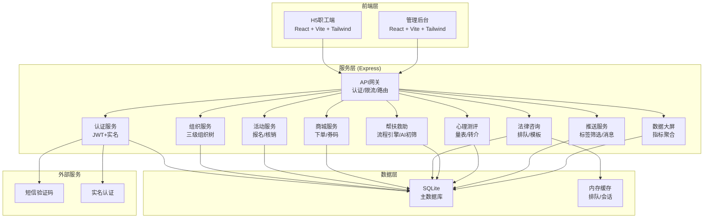
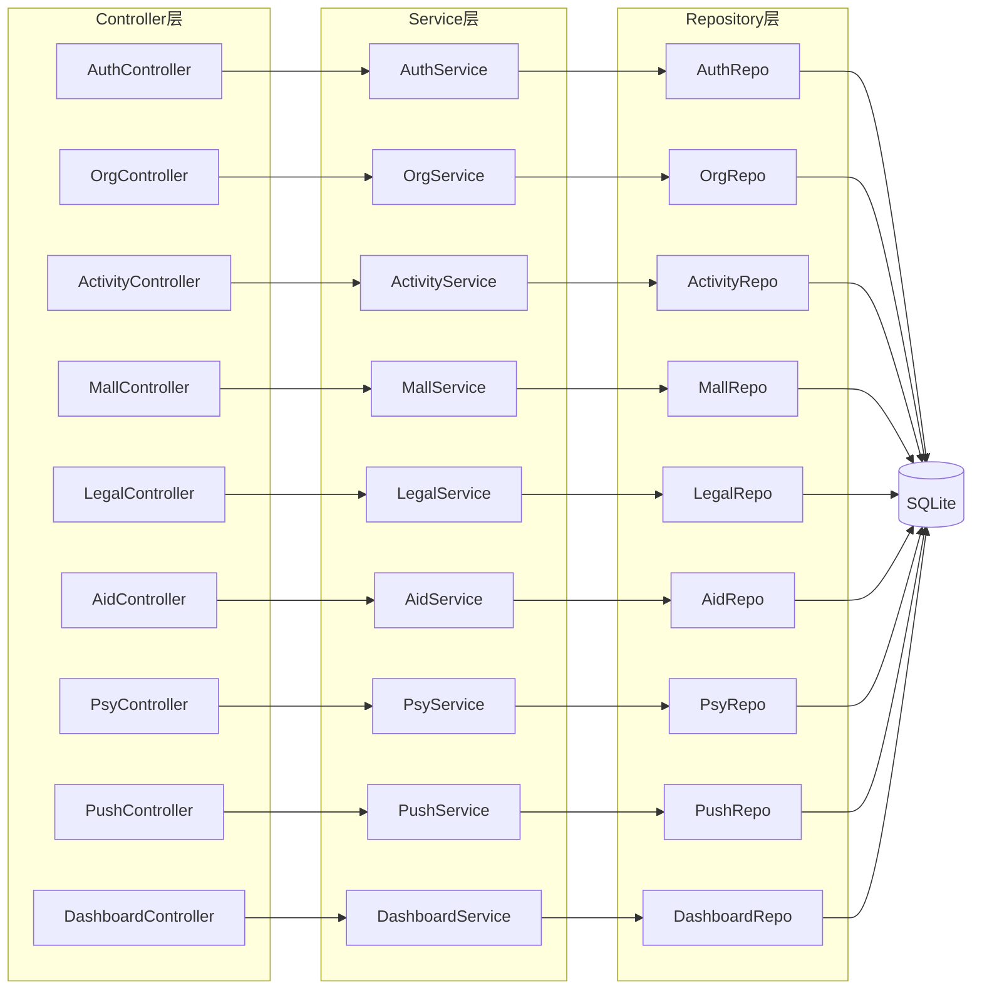
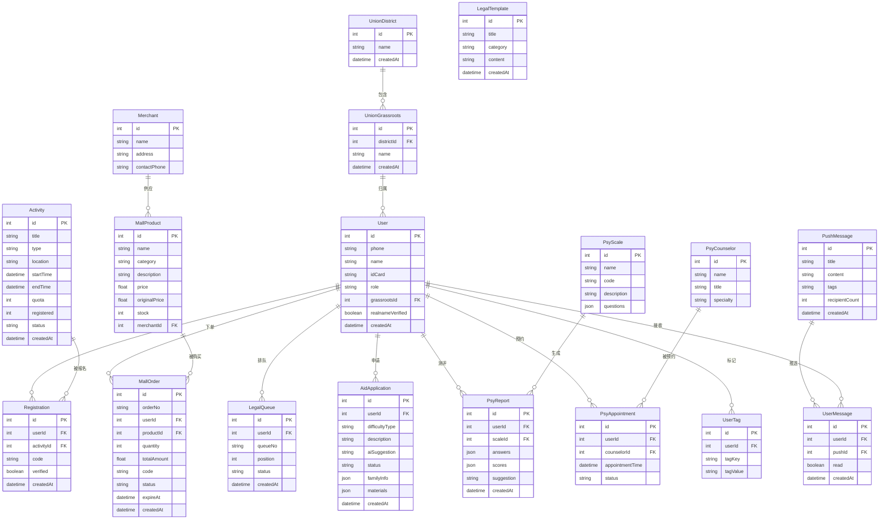

## 1. 架构设计



## 2. 技术说明

- **前端**：React@18 + TailwindCSS@3 + Vite + Zustand + React Router
- **初始化工具**：vite-init (react-express-ts 模板)
- **后端**：Express@4 + TypeScript (ESM)
- **数据库**：SQLite (Prisma ORM)
- **缓存**：内存缓存（Map 实现，用于排队等场景）
- **图表**：ECharts (数据大屏)
- **图标**：lucide-react

## 3. 路由定义

### 3.1 H5职工端路由

| 路由 | 用途 |
|------|------|
| /login | 登录注册页 |
| /auth/realname | 实名认证页 |
| /auth/bind-union | 工会绑定页 |
| /home | 职工首页 |
| /activities | 文体活动列表 |
| /activities/:id | 活动详情与报名 |
| /activities/:id/ticket | 电子票 |
| /mall | 普惠商城 |
| /mall/product/:id | 商品详情 |
| /mall/orders | 我的订单 |
| /legal | 法律咨询首页 |
| /legal/queue | 在线排队 |
| /legal/templates | 文书模板库 |
| /aid | 帮扶救助首页 |
| /aid/apply | 救助申请表单 |
| /aid/track/:id | 申请进度追踪 |
| /psy | 心理测评首页 |
| /psy/assess/:id | 测评量表 |
| /psy/report/:id | 测评报告 |
| /psy/appointment | 预约转介 |
| /profile | 个人中心 |
| /profile/archive | 数字档案 |

### 3.2 管理后台路由

| 路由 | 用途 |
|------|------|
| /admin/login | 管理员登录 |
| /admin/dashboard | 数据大屏 |
| /admin/org | 组织管理 |
| /admin/members | 职工管理 |
| /admin/activities | 活动管理 |
| /admin/mall | 商城管理 |
| /admin/legal | 咨询管理 |
| /admin/aid | 帮扶管理 |
| /admin/psy | 测评管理 |
| /admin/push | 精准推送 |

## 4. API定义

### 4.1 认证模块

```typescript
POST   /api/auth/login          { phone, code } → { token, user, needRealname, needBindUnion }
POST   /api/auth/send-code      { phone } → { success }
POST   /api/auth/realname       { name, idCard } → { verified }
POST   /api/auth/bind-union     { districtId, grassrootsId } → { pending }
GET    /api/auth/me             → User
```

### 4.2 组织模块

```typescript
GET    /api/org/tree             → UnionNode[]
GET    /api/org/districts        → District[]
GET    /api/org/districts/:id/grassroots → Grassroots[]
POST   /api/org/districts        { name } → District
POST   /api/org/grassroots       { districtId, name } → Grassroots
```

### 4.3 活动模块

```typescript
GET    /api/activities           { type?, status?, page, pageSize } → { data: Activity[], total }
GET    /api/activities/:id       → Activity
POST   /api/activities/:id/register → Registration
GET    /api/activities/:id/ticket → Ticket
POST   /api/activities/verify    { code } → { verified }
POST   /api/activities           → Activity (管理员)
PUT    /api/activities/:id       → Activity (管理员)
```

### 4.4 商城模块

```typescript
GET    /api/mall/products        { category?, page, pageSize } → { data: Product[], total }
GET    /api/mall/products/:id    → Product
POST   /api/mall/orders          { productId, quantity } → Order
GET    /api/mall/orders          { page, pageSize } → { data: Order[], total }
POST   /api/mall/redeem          { code } → { verified }
POST   /api/mall/products        → Product (管理员)
PUT    /api/mall/products/:id    → Product (管理员)
```

### 4.5 法律咨询模块

```typescript
POST   /api/legal/queue/take     → { queueNo, position, estimatedWait }
GET    /api/legal/queue/status   → { position, estimatedWait }
GET    /api/legal/templates      → Template[]
GET    /api/legal/templates/:id  → Template
```

### 4.6 帮扶救助模块

```typescript
POST   /api/aid/apply            AidApplicationForm → { applicationId, aiSuggestion }
GET    /api/aid/applications/:id → AidApplication
GET    /api/aid/applications     { status?, page, pageSize } → { data: AidApplication[], total }
PUT    /api/aid/applications/:id/status { status, comment } → AidApplication (管理员)
```

### 4.7 心理测评模块

```typescript
GET    /api/psy/scales           → Scale[]
GET    /api/psy/scales/:id       → Scale (含题目)
POST   /api/psy/scales/:id/submit { answers } → { reportId }
GET    /api/psy/reports/:id      → Report
POST   /api/psy/appointments     { counselorId, time } → Appointment
GET    /api/psy/counselors       → Counselor[]
```

### 4.8 推送模块

```typescript
POST   /api/push/send            { tags, title, content } → { recipientCount }
GET    /api/push/tags            → Tag[]
GET    /api/push/preview         { tags } → { count }
```

### 4.9 数据大屏模块

```typescript
GET    /api/dashboard/overview   → { coverageRate, avgResponseTime, nps, todayCount }
GET    /api/dashboard/trends     { range } → TrendData[]
GET    /api/dashboard/distribution → DistrictData[]
GET    /api/dashboard/realtime   → { events: RealtimeEvent[] }
```

## 5. 服务架构图



## 6. 数据模型

### 6.1 数据模型定义



### 6.2 数据定义语言

```sql
CREATE TABLE UnionDistrict (
    id INTEGER PRIMARY KEY AUTOINCREMENT,
    name TEXT NOT NULL,
    createdAt DATETIME DEFAULT CURRENT_TIMESTAMP
);

CREATE TABLE UnionGrassroots (
    id INTEGER PRIMARY KEY AUTOINCREMENT,
    districtId INTEGER NOT NULL REFERENCES UnionDistrict(id),
    name TEXT NOT NULL,
    createdAt DATETIME DEFAULT CURRENT_TIMESTAMP
);

CREATE TABLE User (
    id INTEGER PRIMARY KEY AUTOINCREMENT,
    phone TEXT NOT NULL UNIQUE,
    name TEXT,
    idCard TEXT UNIQUE,
    role TEXT NOT NULL DEFAULT 'worker',
    grassrootsId INTEGER REFERENCES UnionGrassroots(id),
    realnameVerified BOOLEAN DEFAULT FALSE,
    password TEXT,
    createdAt DATETIME DEFAULT CURRENT_TIMESTAMP
);

CREATE TABLE Activity (
    id INTEGER PRIMARY KEY AUTOINCREMENT,
    title TEXT NOT NULL,
    type TEXT NOT NULL,
    location TEXT,
    description TEXT,
    startTime DATETIME NOT NULL,
    endTime DATETIME NOT NULL,
    quota INTEGER NOT NULL DEFAULT 0,
    registered INTEGER NOT NULL DEFAULT 0,
    status TEXT NOT NULL DEFAULT 'open',
    createdAt DATETIME DEFAULT CURRENT_TIMESTAMP
);

CREATE TABLE Registration (
    id INTEGER PRIMARY KEY AUTOINCREMENT,
    userId INTEGER NOT NULL REFERENCES User(id),
    activityId INTEGER NOT NULL REFERENCES Activity(id),
    code TEXT NOT NULL UNIQUE,
    verified BOOLEAN DEFAULT FALSE,
    createdAt DATETIME DEFAULT CURRENT_TIMESTAMP
);

CREATE TABLE Merchant (
    id INTEGER PRIMARY KEY AUTOINCREMENT,
    name TEXT NOT NULL,
    address TEXT,
    contactPhone TEXT
);

CREATE TABLE MallProduct (
    id INTEGER PRIMARY KEY AUTOINCREMENT,
    name TEXT NOT NULL,
    category TEXT NOT NULL,
    description TEXT,
    price REAL NOT NULL,
    originalPrice REAL,
    stock INTEGER NOT NULL DEFAULT 0,
    merchantId INTEGER REFERENCES Merchant(id)
);

CREATE TABLE MallOrder (
    id INTEGER PRIMARY KEY AUTOINCREMENT,
    orderNo TEXT NOT NULL UNIQUE,
    userId INTEGER NOT NULL REFERENCES User(id),
    productId INTEGER NOT NULL REFERENCES MallProduct(id),
    quantity INTEGER NOT NULL DEFAULT 1,
    totalAmount REAL NOT NULL,
    code TEXT NOT NULL UNIQUE,
    status TEXT NOT NULL DEFAULT 'PAID',
    expireAt DATETIME NOT NULL,
    createdAt DATETIME DEFAULT CURRENT_TIMESTAMP
);

CREATE TABLE LegalQueue (
    id INTEGER PRIMARY KEY AUTOINCREMENT,
    userId INTEGER NOT NULL REFERENCES User(id),
    queueNo TEXT NOT NULL,
    position INTEGER NOT NULL,
    status TEXT NOT NULL DEFAULT 'waiting',
    createdAt DATETIME DEFAULT CURRENT_TIMESTAMP
);

CREATE TABLE LegalTemplate (
    id INTEGER PRIMARY KEY AUTOINCREMENT,
    title TEXT NOT NULL,
    category TEXT NOT NULL,
    content TEXT NOT NULL,
    createdAt DATETIME DEFAULT CURRENT_TIMESTAMP
);

CREATE TABLE AidApplication (
    id INTEGER PRIMARY KEY AUTOINCREMENT,
    userId INTEGER NOT NULL REFERENCES User(id),
    difficultyType TEXT NOT NULL,
    description TEXT,
    familyInfo TEXT,
    materials TEXT,
    aiSuggestion TEXT,
    aiScore REAL,
    status TEXT NOT NULL DEFAULT 'submitted',
    reviewComment TEXT,
    createdAt DATETIME DEFAULT CURRENT_TIMESTAMP,
    updatedAt DATETIME DEFAULT CURRENT_TIMESTAMP
);

CREATE TABLE PsyScale (
    id INTEGER PRIMARY KEY AUTOINCREMENT,
    name TEXT NOT NULL,
    code TEXT NOT NULL UNIQUE,
    description TEXT,
    questions TEXT NOT NULL
);

CREATE TABLE PsyReport (
    id INTEGER PRIMARY KEY AUTOINCREMENT,
    userId INTEGER NOT NULL REFERENCES User(id),
    scaleId INTEGER NOT NULL REFERENCES PsyScale(id),
    answers TEXT NOT NULL,
    scores TEXT NOT NULL,
    suggestion TEXT,
    createdAt DATETIME DEFAULT CURRENT_TIMESTAMP
);

CREATE TABLE PsyCounselor (
    id INTEGER PRIMARY KEY AUTOINCREMENT,
    name TEXT NOT NULL,
    title TEXT,
    specialty TEXT
);

CREATE TABLE PsyAppointment (
    id INTEGER PRIMARY KEY AUTOINCREMENT,
    userId INTEGER NOT NULL REFERENCES User(id),
    counselorId INTEGER NOT NULL REFERENCES PsyCounselor(id),
    appointmentTime DATETIME NOT NULL,
    status TEXT NOT NULL DEFAULT 'pending',
    createdAt DATETIME DEFAULT CURRENT_TIMESTAMP
);

CREATE TABLE UserTag (
    id INTEGER PRIMARY KEY AUTOINCREMENT,
    userId INTEGER NOT NULL REFERENCES User(id),
    tagKey TEXT NOT NULL,
    tagValue TEXT NOT NULL
);

CREATE TABLE PushMessage (
    id INTEGER PRIMARY KEY AUTOINCREMENT,
    title TEXT NOT NULL,
    content TEXT NOT NULL,
    tags TEXT,
    recipientCount INTEGER DEFAULT 0,
    createdAt DATETIME DEFAULT CURRENT_TIMESTAMP
);

CREATE TABLE UserMessage (
    id INTEGER PRIMARY KEY AUTOINCREMENT,
    userId INTEGER NOT NULL REFERENCES User(id),
    pushId INTEGER REFERENCES PushMessage(id),
    title TEXT NOT NULL,
    content TEXT NOT NULL,
    read BOOLEAN DEFAULT FALSE,
    createdAt DATETIME DEFAULT CURRENT_TIMESTAMP
);

-- 初始化数据：杭州市级工会 + 示例区级工会
INSERT INTO UnionDistrict (name) VALUES ('上城区'), ('拱墅区'), ('西湖区'), ('滨江区'), ('萧山区'), ('余杭区'), ('临平区'), ('钱塘区'), ('富阳区'), ('临安区');

INSERT INTO UnionGrassroots (districtId, name) VALUES
    (1, '湖滨街道总工会'), (1, '清波街道总工会'),
    (2, '米市巷街道总工会'), (2, '湖墅街道总工会'),
    (3, '北山街道总工会'), (3, '西溪街道总工会'),
    (4, '长河街道总工会'), (4, '浦沿街道总工会');

-- 初始化管理员
INSERT INTO User (phone, name, role, realnameVerified) VALUES ('13800000000', '系统管理员', 'admin', TRUE);

-- 初始化商家
INSERT INTO Merchant (name, address, contactPhone) VALUES
    ('知味观·湖滨店', '杭州市上城区仁和路13号', '0571-87012345'),
    ('楼外楼·孤山路', '杭州市西湖区孤山路30号', '0571-87156789'),
    ('奎元馆·解放路', '杭州市上城区解放路125号', '0571-87023456');

-- 初始化活动
INSERT INTO Activity (title, type, location, description, startTime, endTime, quota, registered, status) VALUES
    ('迎春职工书法大赛', '文化', '杭州市工人文化宫', '弘扬传统文化，展示职工风采', '2026-07-01 09:00', '2026-07-01 17:00', 100, 32, 'open'),
    ('钱塘江畔健步走', '体育', '钱塘江沿江绿道', '全民健身，快乐同行', '2026-07-15 07:00', '2026-07-15 11:00', 200, 88, 'open'),
    ('职工摄影展', '文化', '杭州市职工活动中心', '用镜头记录劳动之美', '2026-08-01 09:00', '2026-08-10 17:00', 50, 12, 'open');

-- 初始化商品
INSERT INTO MallProduct (name, category, description, price, originalPrice, stock, merchantId) VALUES
    ('知味观小笼礼盒', 'FOOD', '百年老字号，经典杭帮味', 68, 128, 500, 1),
    ('楼外楼西湖醋鱼券', 'FOOD', '正宗杭帮名菜体验', 88, 168, 300, 2),
    ('奎元馆片儿川套餐', 'FOOD', '老杭州味道，工友专享', 28, 56, 1000, 3),
    ('西湖游船半价票', 'SERVICE', '泛舟西湖，职工专享', 30, 60, 200, NULL),
    ('生活超市满减券', 'LIFE', '满100减30，全品类通用', 30, 100, 800, NULL);

-- 初始化法律文书模板
INSERT INTO LegalTemplate (title, category, content) VALUES
    ('劳动合同模板', '劳动用工', '甲方（用人单位）：\n乙方（劳动者）：\n\n根据《中华人民共和国劳动合同法》...'),
    ('工伤认定申请书', '工伤维权', '申请人：\n被申请人：\n\n申请事项：请求认定工伤...'),
    ('劳动仲裁申请书', '争议仲裁', '申请人：\n被申请人：\n\n仲裁请求：...'),
    ('工资支付催告函', '工资报酬', '致：\n\n关于拖欠工资事宜，特此催告...');

-- 初始化心理测评量表
INSERT INTO PsyScale (name, code, description, questions) VALUES
    ('SCL-90症状自评量表', 'SCL90', '包含90个项目，从感觉、情感、思维、意识、行为直至生活习惯、人际关系、饮食睡眠等，均有涉及', '[{"id":1,"text":"头痛","options":["没有","很轻","中等","偏重","严重"]},{"id":2,"text":"神经过敏，心中不踏实","options":["没有","很轻","中等","偏重","严重"]}]'),
    ('PHQ-9抑郁筛查量表', 'PHQ9', '用于抑郁症状筛查和严重程度评估的9项问卷', '[{"id":1,"text":"做事时提不起劲或没有兴趣","options":["完全不会","好几天","超过一半的天数","几乎每天"]},{"id":2,"text":"感到心情低落、沮丧或绝望","options":["完全不会","好几天","超过一半的天数","几乎每天"]}]');

-- 初始化心理咨询师
INSERT INTO PsyCounselor (name, title, specialty) VALUES
    ('王心怡', '国家二级心理咨询师', '职场压力、情绪管理'),
    ('陈安宁', '高级心理咨询师', '家庭关系、焦虑疏导'),
    ('李向阳', '注册心理师', '职业倦怠、人际关系');
