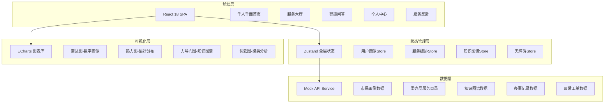
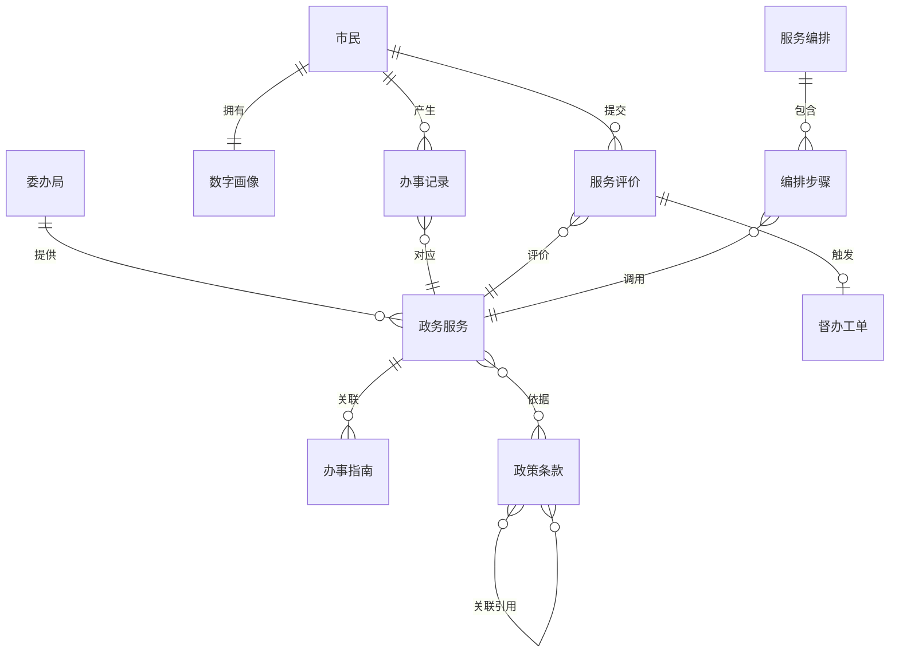

## 1. 架构设计



## 2. 技术说明

- **前端框架**：React@18 + TypeScript + Vite
- **样式方案**：TailwindCSS@3 + CSS Variables（主题切换）
- **状态管理**：Zustand（轻量级，适合中等复杂度应用）
- **路由方案**：React Router v6
- **可视化库**：ECharts（雷达图、热力图、力导向图、词云）
- **动画库**：Framer Motion（页面过渡、卡片动画、骨架屏）
- **图标库**：Lucide React（线性图标风格）
- **初始化工具**：Vite
- **后端**：无（使用Mock数据模拟20+委办局API）
- **数据库**：无（前端Mock数据）

## 3. 路由定义

| 路由 | 用途 |
|------|------|
| `/` | 千人千面首页 - 个性化问候、到期提醒、高频事项、政策推送、偏好热区 |
| `/services` | 服务大厅 - 委办局分类导航、搜索、热门服务、办事指南 |
| `/assistant` | 智能问答 - 对话式问答、政策关联图、历史记录 |
| `/profile` | 个人中心 - 数字画像仪表盘、办事记录、无障碍设置、离线包管理 |
| `/feedback` | 服务反馈 - 评价入口、督办工单、聚类分析 |

## 4. API定义（Mock数据接口）

### 4.1 市民画像API

```typescript
interface CitizenProfile {
  id: string
  name: string
  avatar: string
  tags: string[]
  profileRadar: {
    serviceActivity: number
    paymentFrequency: number
    servicePreference: number
    policyMatch: number
    digitalLevel: number
  }
  highFreqServices: ServiceItem[]
  expiringReminders: ExpiringItem[]
  matchedPolicies: PolicyItem[]
  preferenceHeatmap: HeatmapData[]
}

interface ServiceItem {
  id: string
  name: string
  icon: string
  category: string
  dept: string
  url: string
}

interface ExpiringItem {
  id: string
  title: string
  deadline: string
  daysLeft: number
  urgency: "high" | "medium" | "low"
  actionUrl: string
}

interface PolicyItem {
  id: string
  title: string
  subsidy: string
  deadline: string
  matchScore: number
  tags: string[]
}

interface HeatmapData {
  x: number
  y: number
  value: number
  label: string
}
```

### 4.2 委办局服务API

```typescript
interface DeptService {
  deptId: string
  deptName: string
  deptIcon: string
  deptColor: string
  services: ServiceDetail[]
}

interface ServiceDetail {
  id: string
  name: string
  description: string
  category: string
  materials: string[]
  steps: string[]
  duration: string
  fee: string
  onlineAvailable: boolean
}
```

### 4.3 知识图谱API

```typescript
interface KnowledgeNode {
  id: string
  label: string
  type: "policy" | "clause" | "condition" | "service"
  content: string
}

interface KnowledgeEdge {
  source: string
  target: string
  relation: "references" | "requires" | "excludes" | "triggers"
}

interface ChatMessage {
  id: string
  role: "user" | "assistant"
  content: string
  references?: KnowledgeNode[]
  timestamp: number
}
```

### 4.4 服务编排API

```typescript
interface OrchestrationFlow {
  id: string
  name: string
  description: string
  steps: OrchestrationStep[]
}

interface OrchestrationStep {
  id: string
  name: string
  dept: string
  apiEndpoint: string
  autoTriggered: boolean
  status: "pending" | "processing" | "completed" | "failed"
}
```

### 4.5 反馈工单API

```typescript
interface FeedbackItem {
  id: string
  serviceId: string
  serviceName: string
  rating: number
  comment: string
  keywords: string[]
  category: string
  createdAt: string
}

interface WorkOrder {
  id: string
  feedbackId: string
  dept: string
  status: "pending" | "processing" | "resolved" | "closed"
  deadline: string
  description: string
  createdAt: string
}

interface ClusterAnalysis {
  categories: { name: string; count: number; percentage: number }[]
  wordCloud: { text: string; value: number }[]
  trend: { date: string; count: number }[]
}
```

## 5. 数据模型

### 5.1 数据模型定义



### 5.2 Mock数据结构

项目使用TypeScript类型定义的Mock数据集，存储在 `src/mocks/` 目录下：

- `citizenProfile.ts` - 市民画像数据（含画像雷达、高频服务、到期提醒、政策匹配）
- `deptServices.ts` - 20+委办局服务目录数据
- `knowledgeGraph.ts` - 政务知识图谱节点与边数据
- `chatHistory.ts` - 问答对话历史数据
- `orchestrationFlows.ts` - 服务编排流程数据
- `feedbackData.ts` - 评价与工单聚类分析数据
