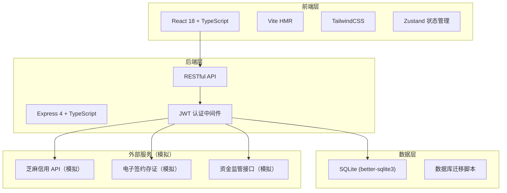
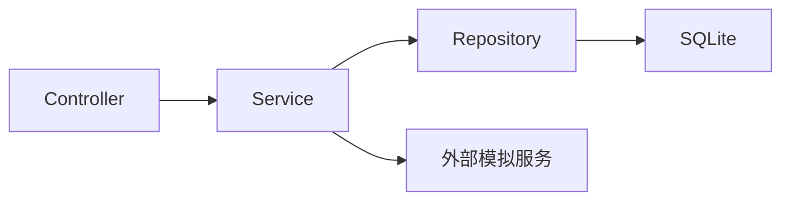
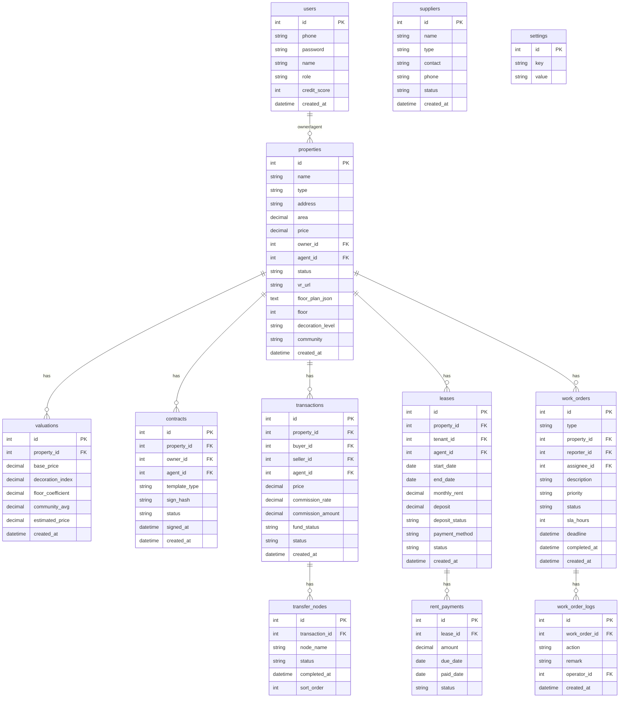

## 1. 架构设计



## 2. 技术说明

- **前端**：React@18 + TypeScript + TailwindCSS@3 + Vite + Zustand + React Router DOM + Recharts（图表）
- **初始化工具**：vite-init (react-express-ts 模板)
- **后端**：Express@4 + TypeScript (ESM)
- **数据库**：SQLite（better-sqlite3），文件路径 data/app.sqlite
- **外部服务**：芝麻信用、电子签约存证、资金监管均为模拟接口，不引入真实外部依赖

## 3. 路由定义

| 路由 | 用途 |
|------|------|
| `/login` | 登录页 |
| `/` | 工作台首页 |
| `/properties` | 房源列表 |
| `/properties/:id` | 房源详情 |
| `/properties/new` | 新增房源 |
| `/valuation/:id` | 估价报告 |
| `/contracts/:id` | 合同签约 |
| `/transactions` | 交易列表 |
| `/transactions/:id` | 交易详情 |
| `/leases` | 租约列表 |
| `/leases/:id` | 租约详情 |
| `/work-orders` | 工单列表 |
| `/work-orders/:id` | 工单详情 |
| `/dashboard/agents` | 经纪人看板 |
| `/dashboard/property-health` | 房源健康度 |
| `/dashboard/supply-chain` | 供应链协同 |
| `/settings` | 系统设置 |

## 4. API 定义

### 4.1 认证

```
POST   /api/auth/login          { phone, password } → { token, user }
POST   /api/auth/register       { phone, password, role, name } → { token, user }
GET    /api/auth/me             → { user }
```

### 4.2 房源管理

```
GET    /api/properties          ?type=&status=&page=&limit= → { list, total }
GET    /api/properties/:id      → { property, valuation, contract }
POST   /api/properties          { name, type, address, area, price, ... } → { id }
PUT    /api/properties/:id      { ...fields } → { updated }
DELETE /api/properties/:id      → { success }
POST   /api/properties/:id/valuation   → { valuation }
POST   /api/properties/:id/contract    { templateId } → { contractId, signUrl }
```

### 4.3 交易管理

```
GET    /api/transactions        ?status=&page=&limit= → { list, total }
GET    /api/transactions/:id    → { transaction, nodes, fundAccount }
POST   /api/transactions        { propertyId, buyerId, agentId, price } → { id }
PUT    /api/transactions/:id/nodes  { nodeId, status } → { updated }
GET    /api/transactions/:id/commission → { commission }
```

### 4.4 租务管理

```
GET    /api/leases              ?status=&page=&limit= → { list, total }
GET    /api/leases/:id          → { lease, payments, deposit, creditScore }
POST   /api/leases              { propertyId, tenantId, startDate, endDate, rent, deposit } → { id }
PUT    /api/leases/:id          { ...fields } → { updated }
POST   /api/leases/:id/terminate → { result }
GET    /api/leases/:id/payments → { payments }
POST   /api/leases/:id/payments/deduct → { paymentId }
```

### 4.5 服务工单

```
GET    /api/work-orders         ?type=&status=&page=&limit= → { list, total }
GET    /api/work-orders/:id     → { workOrder, sla, logs }
POST   /api/work-orders         { type, propertyId, description, priority } → { id }
PUT    /api/work-orders/:id/assign { agentId } → { updated }
PUT    /api/work-orders/:id/complete { result } → { updated }
```

### 4.6 运营看板

```
GET    /api/dashboard/agent-performance   ?period= → { agents, trends }
GET    /api/dashboard/property-health     → { healthData }
GET    /api/dashboard/supply-chain        → { suppliers }
POST   /api/dashboard/supply-chain        { name, type, contact } → { id }
PUT    /api/dashboard/supply-chain/:id    { ...fields } → { updated }
```

### 4.7 系统配置

```
GET    /api/settings            → { settings }
PUT    /api/settings            { ...fields } → { updated }
GET    /api/health              → { status: "ok" }
```

## 5. 服务架构图



## 6. 数据模型

### 6.1 数据模型定义



### 6.2 数据定义语言

```sql
CREATE TABLE users (
  id INTEGER PRIMARY KEY AUTOINCREMENT,
  phone TEXT NOT NULL UNIQUE,
  password TEXT NOT NULL,
  name TEXT NOT NULL,
  role TEXT NOT NULL CHECK(role IN ('tenant','buyer','owner','agent_self','agent_franchise','admin')),
  credit_score INTEGER DEFAULT 650,
  created_at TEXT DEFAULT (datetime('now'))
);

CREATE TABLE properties (
  id INTEGER PRIMARY KEY AUTOINCREMENT,
  name TEXT NOT NULL,
  type TEXT NOT NULL CHECK(type IN ('shared_rent','whole_rent','apartment','second_hand')),
  address TEXT NOT NULL,
  area REAL NOT NULL,
  price REAL NOT NULL,
  owner_id INTEGER REFERENCES users(id),
  agent_id INTEGER REFERENCES users(id),
  status TEXT DEFAULT 'pending' CHECK(status IN ('pending','active','contracted','sold','rented','offline')),
  vr_url TEXT,
  floor_plan_json TEXT,
  floor INTEGER,
  decoration_level TEXT CHECK(decoration_level IN ('rough','simple','medium','luxury')),
  community TEXT,
  rooms INTEGER,
  halls INTEGER,
  description TEXT,
  created_at TEXT DEFAULT (datetime('now')),
  updated_at TEXT DEFAULT (datetime('now'))
);

CREATE TABLE valuations (
  id INTEGER PRIMARY KEY AUTOINCREMENT,
  property_id INTEGER REFERENCES properties(id),
  base_price REAL NOT NULL,
  decoration_index REAL NOT NULL DEFAULT 1.0,
  floor_coefficient REAL NOT NULL DEFAULT 1.0,
  community_avg REAL NOT NULL,
  estimated_price REAL NOT NULL,
  created_at TEXT DEFAULT (datetime('now'))
);

CREATE TABLE contracts (
  id INTEGER PRIMARY KEY AUTOINCREMENT,
  property_id INTEGER REFERENCES properties(id),
  owner_id INTEGER REFERENCES users(id),
  agent_id INTEGER REFERENCES users(id),
  template_type TEXT NOT NULL CHECK(template_type IN ('rent_commission','sale_commission','lease')),
  sign_hash TEXT,
  status TEXT DEFAULT 'pending' CHECK(status IN ('pending','signed','archived')),
  signed_at TEXT,
  created_at TEXT DEFAULT (datetime('now'))
);

CREATE TABLE transactions (
  id INTEGER PRIMARY KEY AUTOINCREMENT,
  property_id INTEGER REFERENCES properties(id),
  buyer_id INTEGER REFERENCES users(id),
  seller_id INTEGER REFERENCES users(id),
  agent_id INTEGER REFERENCES users(id),
  price REAL NOT NULL,
  commission_rate REAL NOT NULL DEFAULT 0.025,
  commission_amount REAL NOT NULL,
  fund_status TEXT DEFAULT 'pending' CHECK(fund_status IN ('pending','deposited','released','refunded')),
  status TEXT DEFAULT 'negotiating' CHECK(status IN ('negotiating','contracted','funded','transferring','completed','cancelled')),
  created_at TEXT DEFAULT (datetime('now')),
  updated_at TEXT DEFAULT (datetime('now'))
);

CREATE TABLE transfer_nodes (
  id INTEGER PRIMARY KEY AUTOINCREMENT,
  transaction_id INTEGER REFERENCES transactions(id),
  node_name TEXT NOT NULL,
  status TEXT DEFAULT 'pending' CHECK(status IN ('pending','processing','completed')),
  completed_at TEXT,
  sort_order INTEGER NOT NULL
);

CREATE TABLE leases (
  id INTEGER PRIMARY KEY AUTOINCREMENT,
  property_id INTEGER REFERENCES properties(id),
  tenant_id INTEGER REFERENCES users(id),
  agent_id INTEGER REFERENCES users(id),
  start_date TEXT NOT NULL,
  end_date TEXT NOT NULL,
  monthly_rent REAL NOT NULL,
  deposit REAL NOT NULL,
  deposit_status TEXT DEFAULT 'held' CHECK(deposit_status IN ('held','partial_refund','refunded','deducted')),
  payment_method TEXT DEFAULT 'auto' CHECK(payment_method IN ('auto','manual')),
  status TEXT DEFAULT 'active' CHECK(status IN ('active','expired','terminated','renewed')),
  created_at TEXT DEFAULT (datetime('now')),
  updated_at TEXT DEFAULT (datetime('now'))
);

CREATE TABLE rent_payments (
  id INTEGER PRIMARY KEY AUTOINCREMENT,
  lease_id INTEGER REFERENCES leases(id),
  amount REAL NOT NULL,
  due_date TEXT NOT NULL,
  paid_date TEXT,
  status TEXT DEFAULT 'pending' CHECK(status IN ('pending','paid','overdue','waived'))
);

CREATE TABLE work_orders (
  id INTEGER PRIMARY KEY AUTOINCREMENT,
  type TEXT NOT NULL CHECK(type IN ('cleaning','repair','moving','renovation')),
  property_id INTEGER REFERENCES properties(id),
  reporter_id INTEGER REFERENCES users(id),
  assignee_id INTEGER REFERENCES users(id),
  description TEXT NOT NULL,
  priority TEXT DEFAULT 'normal' CHECK(priority IN ('low','normal','high','urgent')),
  status TEXT DEFAULT 'pending' CHECK(status IN ('pending','assigned','in_progress','completed','cancelled')),
  sla_hours INTEGER NOT NULL DEFAULT 48,
  deadline TEXT,
  completed_at TEXT,
  created_at TEXT DEFAULT (datetime('now'))
);

CREATE TABLE work_order_logs (
  id INTEGER PRIMARY KEY AUTOINCREMENT,
  work_order_id INTEGER REFERENCES work_orders(id),
  action TEXT NOT NULL,
  remark TEXT,
  operator_id INTEGER REFERENCES users(id),
  created_at TEXT DEFAULT (datetime('now'))
);

CREATE TABLE suppliers (
  id INTEGER PRIMARY KEY AUTOINCREMENT,
  name TEXT NOT NULL,
  type TEXT NOT NULL CHECK(type IN ('material','housekeeping','moving','renovation')),
  contact TEXT,
  phone TEXT,
  status TEXT DEFAULT 'active' CHECK(status IN ('active','suspended','terminated')),
  created_at TEXT DEFAULT (datetime('now'))
);

CREATE TABLE settings (
  id INTEGER PRIMARY KEY AUTOINCREMENT,
  key TEXT NOT NULL UNIQUE,
  value TEXT NOT NULL
);

CREATE INDEX idx_properties_type ON properties(type);
CREATE INDEX idx_properties_status ON properties(status);
CREATE INDEX idx_properties_owner ON properties(owner_id);
CREATE INDEX idx_leases_status ON leases(status);
CREATE INDEX idx_leases_tenant ON leases(tenant_id);
CREATE INDEX idx_work_orders_status ON work_orders(status);
CREATE INDEX idx_work_orders_type ON work_orders(type);
CREATE INDEX idx_transactions_status ON transactions(status);
CREATE INDEX idx_rent_payments_lease ON rent_payments(lease_id);
CREATE INDEX idx_rent_payments_status ON rent_payments(status);
```
