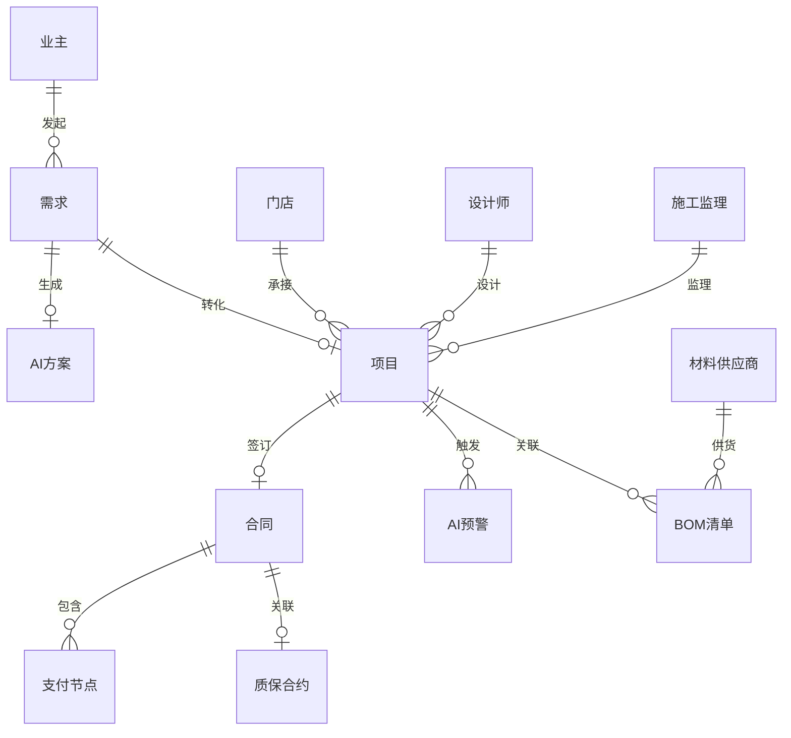

## 1. 架构设计

```mermaid
graph TB
    "前端层 React+Vite+Tailwind" --> "状态管理 Zustand"
    "状态管理 Zustand" --> "路由层 React Router"
    "路由层 React Router" --> "页面组件"
    "页面组件" --> "3D渲染层 Three.js+R3F"
    "页面组件" --> "地图层 Leaflet"
    "页面组件" --> "图表层 Recharts"
    "页面组件" --> "Mock数据层"
    "Mock数据层" --> "本地JSON数据"
```

## 2. 技术说明

- **前端**：React@18 + TailwindCSS@3 + Vite + TypeScript
- **初始化工具**：vite-init（react-ts模板）
- **后端**：无后端，使用Mock数据模拟
- **数据库**：无数据库，使用本地JSON文件模拟
- **3D渲染**：Three.js + @react-three/fiber + @react-three/drei + @react-three/postprocessing
- **地图**：Leaflet + react-leaflet
- **图表**：Recharts
- **状态管理**：Zustand
- **路由**：react-router-dom@6
- **图标**：lucide-react
- **动画**：framer-motion

## 3. 路由定义

| 路由 | 用途 |
|------|------|
| / | 总控仪表盘，核心指标与GIS地图 |
| /demand | 业主需求中心，需求发起与AI方案 |
| /progress | 项目进度追踪，节点确认与分账支付 |
| /eagle-eye | 鹰眼AI监理大屏，视频监控与预警 |
| /showroom | 云样板间3D展示，WebGL渲染与材质交互 |
| /contract | 合同与质保管理，电子合约与存证 |
| /bom | 供应链BOM分析，成本穿透与供应商管理 |

## 4. API定义

本项目为纯前端演示，使用Mock数据。以下为数据接口类型定义：

```typescript
interface Project {
  id: string
  name: string
  owner: string
  designer: string
  supervisor: string
  store: string
  status: 'design' | 'contract' | 'construction' | 'water_electric' | 'masonry' | 'completion' | 'warranty'
  currentPhase: string
  totalAmount: number
  paidAmount: number
  startDate: string
  endDate: string
  location: { lat: number; lng: number; city: string }
}

interface Store {
  id: string
  name: string
  city: string
  address: string
  lat: number
  lng: number
  serviceRadius: number
  manager: string
  activeProjects: number
  designers: number
}

interface Contract {
  id: string
  projectId: string
  status: 'draft' | 'signed' | 'active' | 'completed'
  totalAmount: number
  escrowAmount: number
  paymentSchedule: PaymentNode[]
  warrantyExpiry: string
  blockchainHash: string
}

interface PaymentNode {
  phase: '水电隐蔽验收' | '泥木完工' | '竣工验收'
  percentage: number
  amount: number
  status: 'pending' | 'confirmed' | 'paid'
  ownerConfirmed: boolean
  supervisorConfirmed: boolean
  builderConfirmed: boolean
  confirmedAt?: string
  paidAt?: string
}

interface AIAlert {
  id: string
  projectId: string
  type: 'no_helmet' | 'material_mismatch' | 'unsafe_operation' | 'quality_issue'
  severity: 'low' | 'medium' | 'high' | 'critical'
  description: string
  timestamp: string
  status: 'open' | 'processing' | 'resolved'
  screenshot?: string
}

interface BOMItem {
  id: string
  category: string
  name: string
  specification: string
  quantity: number
  unit: string
  unitCost: number
  totalCost: number
  supplier: string
  supplierRating: number
}

interface Demand {
  id: string
  ownerName: string
  propertyType: string
  area: number
  style: string
  budget: { min: number; max: number }
  rooms: { bedrooms: number; livingrooms: number; bathrooms: number; kitchens: number }
  requirements: string[]
  status: 'submitted' | 'ai_processing' | 'plan_ready' | 'designer_matched' | 'contracted'
  aiPlan?: AIPlan
}

interface AIPlan {
  id: string
  style: string
  estimatedBudget: number
  estimatedDuration: string
  layoutDescription: string
  renderUrl: string
  bomSummary: { category: string; cost: number }[]
}
```

## 5. 数据模型

### 5.1 数据模型定义



### 5.2 数据定义语言

Mock数据使用TypeScript对象定义，存放于 `src/data/` 目录下，按模块拆分：
- `stores.ts`：150+城市门店数据
- `projects.ts`：项目数据
- `contracts.ts`：合同与支付节点数据
- `alerts.ts`：AI预警数据
- `bom.ts`：BOM成本数据
- `demands.ts`：业主需求数据
