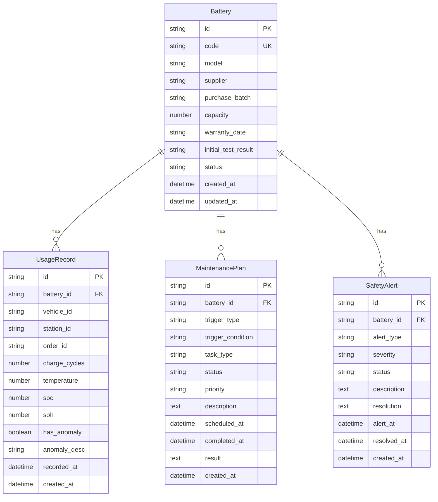

## 1. 架构设计

```mermaid
graph TB
    "浏览器" --> "React前端 Vite"
    "React前端 Vite" --> "Express API"
    "Express API" --> "SQLite 数据库"
    "Express API" --> "better-sqlite3"
```

三层架构：React 前端（Vite + Tailwind）→ Express 后端 API → SQLite 文件数据库

## 2. 技术说明

- 前端：React@18 + TypeScript + Tailwind CSS + Vite + Zustand + React Router
- 初始化工具：vite-init（react-express-ts 模板）
- 后端：Express@4 + TypeScript（ESM）
- 数据库：SQLite（better-sqlite3），文件路径 data/app.sqlite
- 图表：Recharts
- 无需外部服务：不依赖 MySQL、PostgreSQL、Redis、消息队列或对象存储

## 3. 路由定义

| 路由 | 用途 |
|------|------|
| / | 仪表盘 |
| /batteries | 电池档案列表 |
| /batteries/new | 新增电池 |
| /batteries/:id | 电池详情 |
| /batteries/:id/edit | 编辑电池 |
| /usage | 使用记录列表 |
| /usage/new | 新增使用记录 |
| /usage/:id | 使用记录详情 |
| /maintenance | 维护计划列表 |
| /maintenance/new | 新增维护计划 |
| /maintenance/:id | 维护计划详情 |
| /alerts | 安全告警列表 |
| /alerts/:id | 告警详情 |
| /reports | 资产报表 |

## 4. API 定义

### 4.1 电池档案 API

```
GET    /api/batteries          - 列表（支持分页、筛选）
GET    /api/batteries/:id      - 详情
POST   /api/batteries          - 新增
PUT    /api/batteries/:id      - 更新
DELETE /api/batteries/:id      - 删除
```

### 4.2 使用记录 API

```
GET    /api/usage-records          - 列表
GET    /api/usage-records/:id      - 详情
POST   /api/usage-records          - 新增
PUT    /api/usage-records/:id      - 更新
DELETE /api/usage-records/:id      - 删除
```

### 4.3 维护计划 API

```
GET    /api/maintenance-plans          - 列表
GET    /api/maintenance-plans/:id      - 详情
POST   /api/maintenance-plans          - 新增
PUT    /api/maintenance-plans/:id      - 更新（含执行/完成）
DELETE /api/maintenance-plans/:id      - 删除
```

### 4.4 安全告警 API

```
GET    /api/safety-alerts          - 列表
GET    /api/safety-alerts/:id      - 详情
POST   /api/safety-alerts          - 新增
PUT    /api/safety-alerts/:id      - 处理告警
```

### 4.5 资产报表 API

```
GET    /api/reports/inventory-value      - 库存价值
GET    /api/reports/depreciation         - 折旧数据
GET    /api/reports/health-distribution   - 健康分布
GET    /api/reports/retirement-forecast   - 退役预测
GET    /api/reports/supplier-quality      - 供应商质量
```

### 4.6 系统 API

```
GET    /api/health          - 健康检查
GET    /api/dashboard       - 仪表盘数据
```

## 5. 服务架构图

```mermaid
graph LR
    "Controller" --> "Service"
    "Service" --> "Repository"
    "Repository" --> "SQLite"
```

## 6. 数据模型

### 6.1 数据模型定义



### 6.2 数据定义语言

```sql
CREATE TABLE IF NOT EXISTS batteries (
    id TEXT PRIMARY KEY,
    code TEXT UNIQUE NOT NULL,
    model TEXT NOT NULL,
    supplier TEXT NOT NULL,
    purchase_batch TEXT NOT NULL,
    capacity REAL NOT NULL,
    warranty_date TEXT NOT NULL,
    initial_test_result TEXT DEFAULT 'pass',
    status TEXT DEFAULT 'in_stock',
    created_at TEXT DEFAULT (datetime('now')),
    updated_at TEXT DEFAULT (datetime('now'))
);

CREATE INDEX IF NOT EXISTS idx_batteries_code ON batteries(code);
CREATE INDEX IF NOT EXISTS idx_batteries_status ON batteries(status);
CREATE INDEX IF NOT EXISTS idx_batteries_supplier ON batteries(supplier);

CREATE TABLE IF NOT EXISTS usage_records (
    id TEXT PRIMARY KEY,
    battery_id TEXT NOT NULL,
    vehicle_id TEXT,
    station_id TEXT,
    order_id TEXT,
    charge_cycles INTEGER DEFAULT 0,
    temperature REAL,
    soc REAL,
    soh REAL,
    has_anomaly INTEGER DEFAULT 0,
    anomaly_desc TEXT,
    recorded_at TEXT DEFAULT (datetime('now')),
    created_at TEXT DEFAULT (datetime('now')),
    FOREIGN KEY (battery_id) REFERENCES batteries(id)
);

CREATE INDEX IF NOT EXISTS idx_usage_battery ON usage_records(battery_id);
CREATE INDEX IF NOT EXISTS idx_usage_recorded ON usage_records(recorded_at);

CREATE TABLE IF NOT EXISTS maintenance_plans (
    id TEXT PRIMARY KEY,
    battery_id TEXT NOT NULL,
    trigger_type TEXT NOT NULL,
    trigger_condition TEXT NOT NULL,
    task_type TEXT NOT NULL,
    status TEXT DEFAULT 'pending',
    priority TEXT DEFAULT 'medium',
    description TEXT,
    scheduled_at TEXT,
    completed_at TEXT,
    result TEXT,
    created_at TEXT DEFAULT (datetime('now')),
    FOREIGN KEY (battery_id) REFERENCES batteries(id)
);

CREATE INDEX IF NOT EXISTS idx_maintenance_battery ON maintenance_plans(battery_id);
CREATE INDEX IF NOT EXISTS idx_maintenance_status ON maintenance_plans(status);

CREATE TABLE IF NOT EXISTS safety_alerts (
    id TEXT PRIMARY KEY,
    battery_id TEXT NOT NULL,
    alert_type TEXT NOT NULL,
    severity TEXT NOT NULL,
    status TEXT DEFAULT 'open',
    description TEXT,
    resolution TEXT,
    alert_at TEXT DEFAULT (datetime('now')),
    resolved_at TEXT,
    created_at TEXT DEFAULT (datetime('now')),
    FOREIGN KEY (battery_id) REFERENCES batteries(id)
);

CREATE INDEX IF NOT EXISTS idx_alert_battery ON safety_alerts(battery_id);
CREATE INDEX IF NOT EXISTS idx_alert_status ON safety_alerts(status);
CREATE INDEX IF NOT EXISTS idx_alert_severity ON safety_alerts(severity);
```
